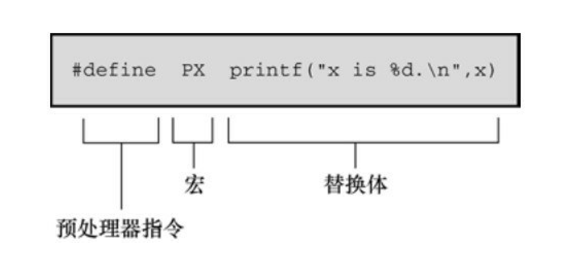
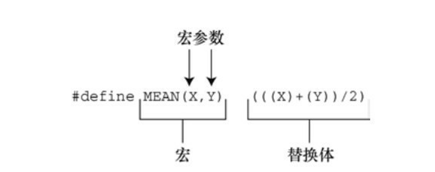
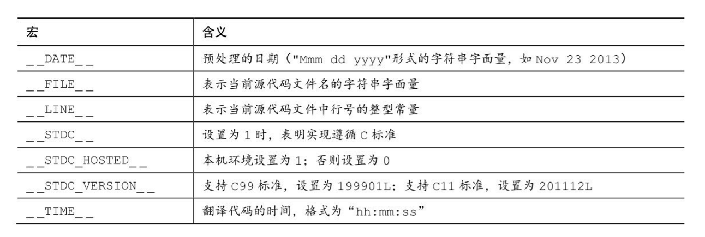
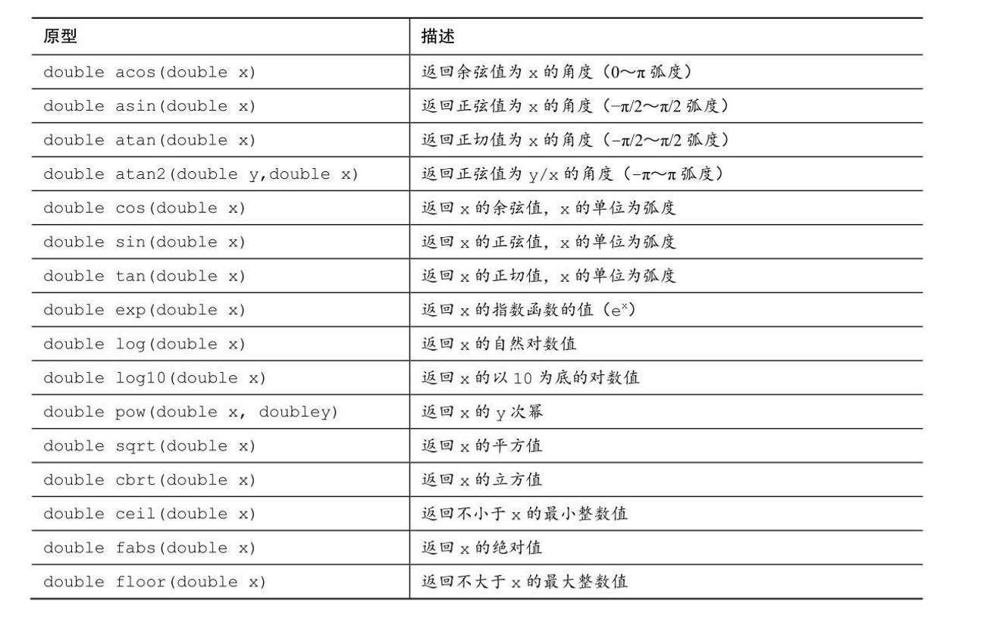

# C预处理器和C库

> 预处理指令：：#define、#include、#ifdef、#else、#endif、#ifndef、#if、 #elif、#line、#error、#pragma
> 
> 关键字：_Generic、_Noreturn、_Static_assert
> 
> 函数/宏：sqrt()、atan()、atan2()、exit()、atexit()、assert()、memcpy()、 memmove()、va_start()、va_arg()、va_copy()、va_end()
> 
> C预处理器的其他功能
> 
> 通用选择表达式
> 
> 内联函数
> 
> C库概述和一些特殊用途的方便函数

C预处理器在程序执行之前查看程序（故称之为预处理器）。根据程序 中的预处理器指令，预处理器把符号缩写替换成其表示的内容。预处理器可 以包含程序所需的其他文件，可以选择让编译器查看哪些代码。预处理器并 不知道 C。基本上它的工作是把一些文本转换成另外一些文本。

--------------

## 翻译程序的第一步

在预处理之前，编译器必须对该程序进行一些翻译处理。<br>首先，编译器 把源代码中出现的字符映射到源字符集。该过程处理多字节字符和三字符序 列——字符扩展让C更加国际化<br>
第二，编译器定位每个反斜杠后面跟着换行符的实例，并删除它们。也 就是说，把下面两个物理行（physical line）：
```C
printf("That's wond\
erful!\n");
```
转换成一个逻辑行（logical line）：
```C
printf("That's wonderful\n!");
```
注意，在这种场合中，“换行符”的意思是通过按下Enter键在源代码文件 中换行所生成的字符，而不是指符号表征\n。

由于预处理表达式的长度必须是一个逻辑行，所以这一步为预处理器做 好了准备工作。一个逻辑行可以是多个物理行。

第三，编译器把文本划分成预处理记号序列、空白序列和注释序列（记号是由空格、制表符或换行符分隔的项）。这里要注意的是， 编译器将用一个空格字符替换每一条注释。因此，下面的代码：
```C
int/* 这看起来并不像一个空格*/fox;
将变成：
int fox;
```
而且，实现可以用一个空格替换所有的空白字符序列（不包括换行符）。<br>最后，程序已经准备好进入预处理阶段，预处理器查找一行中以#号 开始的预处理指令。

------------------------
## 明示常量

#define预处理器指令和其他预处理器指令一样，以#号作为一行的开 始。ANSI和后来的标准都允许#号前面有空格或制表符，而且还允许在#和 指令的其余部分之间有空格。但是旧版本的C要求指令从一行最左边开始， 而且#和指令其余部分之间不能有空格。指令可以出现在源文件的任何地 方，其定义从指令出现的地方到该文件末尾有效。我们大量使用#define指令 来定义明示常量（manifest constant）（也叫做符号常量），但是该指令还有 许多其他用途。

预处理器指令从#开始运行，到后面的第1个换行符为止。也就是说，指 令的长度仅限于一行。然而，前面提到过，在预处理开始前，编译器会把多 行物理行处理为一行逻辑行。

```C
* preproc.c -- 简单的预处理示例 */
#include <stdio.h>
#define TWO 2　　　/* 可以使用注释 */
#define OW "Consistency is the last refuge of the unimagina\
tive.- Oscar Wilde" /* 反斜杠把该定义延续到下一行 */
#define FOUR TWO*TWO
#define PX printf("X is %d.\n", x)
#define FMT　"X is %d.\n"
int main(void)
{
int x = TWO;
PX;
x = FOUR;
printf(FMT, x);
printf("%s\n", OW);
printf("TWO: OW\n");
return 0;
}
```

每行#define（逻辑行）都由3部分组成。第1部分是#define指令本身。第 2部分是选定的缩写，也称为宏。有些宏代表值（如本例），这些宏被称为 类对象宏（object-like macro）。C 语言还有类函数宏（function-like macro），稍后讨论。宏的名称中不允许有空格，而且必须遵循C变量的命 名规则：只能使用字符、数字和下划线（_）字符，而且首字符不能是数 字。第3部分（指令行的其余部分）称为替换列表或替换体（见图）。 一旦预处理器在程序中找到宏的示实例后，就会用替换体代替该宏（也有例 外，稍后解释）。从宏变成最终替换文本的过程称为宏展开（macro expansion）。注意，可以在#define行使用标准C注释。如前所述，每条注释 都会被一个空格代替。


由于编译器在编译期对所有的常量表达式（只包含 常量的表达式）求值，所以预处理器不会进行实际的乘法运算，这一过程在 编译时进行。预处理器不做计算，不对表达式求值，它只进行替换。

一般而言，预处理器发现程序中的宏后，会用宏等价的替换文本进行替 换。如果替换的字符串中还包含宏，则继续替换这些宏。唯一例外的是双引 号中的宏。因此，下面的语句：
```C
printf("TWO: OW");
```
打印的是TWO: OW，而不是打印：
2: Consistency is the last refuge of the unimaginative.- Oscar Wilde

要打印这行，应该这样写：
```C
printf("%d: %s\n", TWO, OW);
```
这行代码中，宏不在双引号内。

对于绝大部分数字常量，应该使用字符常 量。如果在算式中用字符常量代替数字，常量名能更清楚地表达该数字的含 义。如果是表示数组大小的数字，用符号常量后更容易改变数组的大小和循 环次数。如果数字是系统代码（如，EOF），用符号常量表示的代码更容易 移植（只需改变EOF的定义）。助记、易更改、可移植，这些都是符号常量 很有价值的特性。

C语言现在也支持const关键字，提供了更灵活的方法。用const可以创建 在程序运行过程中不能改变的变量，可具有文件作用域或块作用域。另一方 面，宏常量可用于指定标准数组的大小和const变量的初始值。

```C
#define LIMIT 20
const int LIM = 50;
static int data1[LIMIT];　　　 // 有效
static int data2[LIM];　　　　　// 无效
const int LIM2 = 2 * LIMIT;　　// 有效
const int LIM3 = 2 * LIM;　　　// 无效
```

这里解释一下上面代码中的“无效”注释。在C中，非自动数组的大小应 该是整型常量表达式，这意味着表示数组大小的必须是整型常量的组合（如 5）、枚举常量和sizeof表达式，不包括const声明的值（这也是C++和C的区 别之一，在C++中可以把const值作为常量表达式的一部分）。但是，有的实 现可能接受其他形式的常量表达式。例如，GCC 4.7.3不允许data2的声明， 但是Clang 4.6允许。

**记号**

从技术角度来看，可以把宏的替换体看作是记号（token）型字符串， 而不是字符型字符串。C预处理器记号是宏定义的替换体中单独的“词”。空白把这些词分开。
```C
#define FOUR 2*2
```
该宏定义有一个记号：2*2序列。但是，下面的宏定义中：
```C
#define SIX 2 * 3
```
有3个记号：2、*、3。

替换体中有多个空格时，字符型字符串和记号型字符串的处理方式不 同。考虑下面的定义：
```C
#define EIGHT 4 * 8
```
如果预处理器把该替换体解释为字符型字符串，将用4 * 8替换EIGHT。 即，额外的空格是替换体的一部分。如果预处理器把该替换体解释为记号型 字符串，则用3个的记号4 * 8（分别由单个空格分隔）来替换EIGHT。换而 言之，解释为字符型字符串，把空格视为替换体的一部分；解释为记号型字 符串，把空格视为替换体中各记号的分隔符。在实际应用中，一些C编译器 把宏替换体视为字符串而不是记号。在比这个例子更复杂的情况下，两者的区别才有实际意义。

顺带一提，C编译器处理记号的方式比预处理器复杂。由于编译器理解 C语言的规则，所以不要求代码中用空格来分隔记号。例如，C编译器可以 把2*2直接视为3个记号，因为它可以识别2是常量，*是运算符。

**重定义常量**

假设先把LIMIT定义为20，稍后在该文件中又把它定义为25。这个过程 称为重定义常量。不同的实现采用不同的重定义方案。除非新定义与旧定义 相同，否则有些实现会将其视为错误。另外一些实现允许重定义，但会给出 警告。ANSI标准采用第1种方案，只有新定义和旧定义完全相同才允许重定义。

具有相同的定义意味着替换体中的记号必须相同，且顺序也相同。因 此，下面两个定义相同：
```C
#define SIX 2 * 3
#define SIX 2 * 3
```
这两条定义都有 3 个相同的记号，额外的空格不算替换体的一部分。而 下面的定义则与上面两条宏定义不同：
```C
#define SIX 2*3
```

这条宏定义中只有一个记号，因此与前两条定义不同。如果需要重定义 宏，使用#undef 指令

如果确实需要重定义常量，使用const关键字和作用域规则更容易些。

-------------------------
## 在#define中使用参数

在#define中使用参数可以创建外形和作用与函数类似的类函数宏。带有 参数的宏看上去很像函数，因为这样的宏也使用圆括号。类函数宏定义的圆 括号中可以有一个或多个参数，随后这些参数出现在替换体中，如图。


下面是一个类函数宏的示例：
```C
#define SQUARE(X) X*X
```
在程序中可以这样用：
```C
z = SQUARE(2);
```

这看上去像函数调用，但是它的行为和函数调用完全不同。

示例：
```C
/* mac_arg.c -- 带参数的宏 */
#include <stdio.h>
#define SQUARE(X) X*X
#define PR(X)　 printf("The result is %d.\n", X)
int main(void)
{
int x = 5;
int z;
printf("x = %d\n", x);
z = SQUARE(x);
printf("Evaluating SQUARE(x): ");
PR(z);
z = SQUARE(2);
printf("Evaluating SQUARE(2): ");
PR(z);
printf("Evaluating SQUARE(x+2): ");
PR(SQUARE(x + 2));
printf("Evaluating 100/SQUARE(2): ");
PR(100 / SQUARE(2));
printf("x is %d.\n", x);
printf("Evaluating SQUARE(++x): ");
PR(SQUARE(++x));
printf("After incrementing, x is %x.\n", x);
return 0;
}
```
这里，SQUARE 是宏标识符，SQUARE(X)中的 X 是宏参数，X*X 是替 换列表。程序中出现SQUARE(X)的地方都会被X*X替换。这与前 面的示例不同，使用该宏时，既可以用X，也可以用其他符号。宏定义中的 X由宏调用中的符号代替。因此，SQUARE(2)替换为2*2，X实际上起到参数 的作用。

宏参数与函数参数不完全相同.

程序中设置x的值为 5，你可能认为SQUARE(x+2)应该是 7*7，即 49。但是，输出的结果是 17， 这不是一个平方值！导致这样结果的原因是，我们前面提到过，预处理器不 做计算、不求值，只替换字符序列。预处理器把出现x的地方都替换成x+2。 因此，x*x变成了x+2*x+2。如果x为5，那么该表达式的值为：

5+2*5+2 = 5 + 10 + 2 = 17

该例演示了函数调用和宏调用的重要区别。函数调用在程序运行时把参 数的值传递给函数。宏调用在编译之前把参数记号传递给程序。这两个不同 的过程发生在不同时期。是否可以修改宏定义让SQUARE(x+2)得36？当然 可以，要多加几个圆括号：

#define SQUARE(x) (x)*(x)

现在SQUARE(x+2)变成了(x+2)*(x+2)，在替换字符串中使用圆括号就得 到符合预期的乘法运算。

100/SQUARE(2)
将变成：
100/2*2

根据优先级规则，从左往右对表达式求值：(100/2)*2，即50*2，得 100。把SQUARE(x)定义为下面的形式可以解决这种混乱：

#define SQUARE(x) (x*x)

这样修改定义后得100/(2*2)，即100/4，得25。
要处理前面的两种情况，要这样定义：

#define SQUARE(x) ((x)*(x))

尽管如此，这样做还是无法避免程序中最后一种情况的问题。 SQUARE(++x)变成了++x*++x，递增了两次x，一次在乘法运算之前，一次 在乘法运算之后：

++x*++x = 6*7 = 42

由于标准并未对这类运算规定顺序，所以有些编译器得 7*6。而有些编 译器可能在乘法运算之前已经递增了x，所以7*7得49。在C标准中，对该表 达式求值的这种情况称为未定义行为。无论哪种情况，x的开始值都是5，虽 然从代码上看只递增了一次，但是x的最终值是7。

解决这个问题最简单的方法是，避免用++x 作为宏参数。一般而言，不 要在宏中使用递增或递减运算符。但是，++x可作为函数参数，因为编译器 会对++x求值得5后，再把5传递给函数。

**用宏参数创建字符串：#运算符**

C允许在字符串中包含宏参数。在类函数宏的替换体中，#号作为一个 预处理运算符，可以把记号转换成字符串。例如，如果x是一个宏形参，那 么#x就是转换为字符串"x"的形参名。这个过程称为字符串化 （stringizing）。

```C
/* subst.c -- 在字符串中替换 */
#include <stdio.h>
#define PSQR(x) printf("The square of " #x " is %d.\n",((x)*(x)))
int main(void)
{
int y = 5;
PSQR(y);
PSQR(2 + 4);
return 0;
}
```
调用第1个宏时，用"y"替换#x。调用第2个宏时，用"2 + 4"替换#x。 ANSI C字符串的串联特性将这些字符串与printf()语句的其他字符串组合，生 成最终的字符串。例如，第1次调用变成：
```C
printf("The square of " "y" " is %d.\n",((y)*(y)));
```
然后，字符串串联功能将这3个相邻的字符串组合成一个字符串：
```C
"The square of y is %d.\n"
```

**预处理器粘合剂：##运算符**

与#运算符类似，##运算符可用于类函数宏的替换部分。而且，##还可 用于对象宏的替换部分。##运算符把两个记号组合成一个记号。例如，可以 这样做：
```C
#define XNAME(n) x ## n
```
然后，宏XNAME(4)将展开为x4。

```C
// glue.c -- 使用##运算符
#include <stdio.h>
#define XNAME(n) x ## n
#define PRINT_XN(n) printf("x" #n " = %d\n", x ## n);
int main(void)
{
int XNAME(1) = 14;　　 // 变成 int x1 = 14;
int XNAME(2) = 20;　　// 变成 int x2 = 20;
int x3 = 30;
PRINT_XN(1);　　　　　 // 变成 printf("x1 = %d\n", x1);
PRINT_XN(2);　　　　　 // 变成 printf("x2 = %d\n", x2);
PRINT_XN(3);　　　　　 // 变成 printf("x3 = %d\n", x3);
return 0;
}
```
注意，PRINT_XN()宏用#运算符组合字符串，##运算符把记号组合为一 个新的标识符。

**变参宏：...和__VA_ARGS__**

一些函数（如 printf()）接受数量可变的参数。stdvar.h 头文件提供了工具，让用户自定义带可变参数的函数。C99/C11也对宏提 供了这样的工具。虽然标准中未使用“可变”（variadic）这个词，但是它已 成为描述这种工具的通用词（虽然，C标准的索引添加了字符串化 (stringizing)词条，但是，标准并未把固定参数的函数或宏称为固定函数和不变宏）。

通过把宏参数列表中最后的参数写成省略号（即，3个点...）来实现这 一功能。这样，预定义宏_ _VA_ARGS_ _可用在替换部分中，表明省略号代表什么。例如，下面 的定义：
```C
#define PR(...) printf(_ _VA_ARGS_ _)
```

假设稍后调用该宏：
```C
PR("Howdy");
PR("weight = %d, shipping = $%.2f\n", wt, sp);
```
对于第1次调用，_ _VA_ARGS_ _展开为1个参数："Howdy"。
对于第2次调用，_ _VA_ARGS_ _展开为3个参数："weight = %d, shipping = $%.2f\n"、wt、sp。

因此，展开后的代码是：
```C
printf("Howdy");
printf("weight = %d, shipping = $%.2f\n", wt, sp);
```

示例：
```C
// variadic.c -- 变参宏
#include <stdio.h>
#include <math.h>
#define PR(X, ...) printf("Message " #X ": " __VA_ARGS__)
int main(void)
{
double x = 48;
double y;
y = sqrt(x);
PR(1, "x = %g\n", x);
PR(2, "x = %.2f, y = %.4f\n", x, y);
return 0;
}
```
第1个宏调用，X的值是1，所以#X变成"1"。展开后成为：
```C
print("Message " "1" ": " "x = %g\n", x);
```
然后，串联4个字符，把调用简化为：
```C
print("Message 1: x = %g\n", x);
```

记住，省略号只能代替最后的宏参数：
```C
#define WRONG(X, ..., Y) #X #_ _VA_ARGS_ _ #y //不能这样做
```
----------------------------

## 宏和函数的选择

使用宏比使用普通函数复杂一些，稍有不慎会产生奇怪的副作用。一些 编译器规定宏只能定义成一行。不过，即使编译器没有这个限制，也应该这 样做。


宏和函数的选择实际上是时间和空间的权衡。宏生成内联代码，即在程 序中生成语句。如果调用20次宏，即在程序中插入20行代码。如果调用函数 20次，程序中只有一份函数语句的副本，所以节省了空间。然而另一方面， 程序的控制必须跳转至函数内，随后再返回主调程序，这显然比内联代码花 费更多的时间。


宏的一个优点是，不用担心变量类型（这是因为宏处理的是字符串，而 不是实际的值）。因此，只要能用int或float类型都可以使用SQUARE(x)宏。


C99提供了第3种可替换的方法——内联函数。

对于简单的函数，程序员通常使用宏，如下所示：
```C
#define MAX(X,Y) ((X) > (Y) ? (X) : (Y))
#define ABS(X) ((X) < 0 ? -(X) : (X))
#define ISSIGN(X) ((X) == '+' || (X) == '-' ? 1 : 0)
```

要注意以下几点:

+ 记住宏名中不允许有空格，但是在替换字符串中可以有空格。ANSI C 允许在参数列表中使用空格
+ 用圆括号把宏的参数和整个替换体括起来。这样能确保被括起来的部分 在下面这样的表达式中正确地展开：
```C
forks = 2 * MAX(guests + 3, last);
```
+ 用大写字母表示宏函数的名称。该惯例不如用大写字母表示宏常量应用 广泛。但是，大写字母可以提醒程序员注意，宏可能产生的副作用。
+ 如果打算使用宏来加快程序的运行速度，那么首先要确定使用宏和使用 函数是否会导致较大差异。在程序中只使用一次的宏无法明显减少程序的运 行时间。在嵌套循环中使用宏更有助于提高效率。许多系统提供程序分析器 以帮助程序员压缩程序中最耗时的部分。

----------------------
## 文件包含：#include

当预处理器发现#include 指令时，会查看后面的文件名并把文件的内容 包含到当前文件中，即替换源文件中的#include指令。这相当于把被包含文 件的全部内容输入到源文件#include指令所在的位置。

#include指令有两种形 式：
```C
#include <stdio.h>　　　　 ←文件名在尖括号中
#include "mystuff.h"　　　←文件名在双引号中
```
在 UNIX 系统中，尖括号告诉预处理器在标准系统目录中查找该文件。 双引号告诉预处理器首先在当前目录中（或文件名中指定的其他目录）查找 该文件，如果未找到再查找标准系统目录
```C
#include <stdio.h>　　　　 ←查找系统目录
#include "hot.h"　　　　　 ←查找当前工作目录
#include "/usr/biff/p.h" ←查找/usr/biff目录
```

集成开发环境（IDE）也有标准路径或系统头文件的路径。许多集成开 发环境提供菜单选项，指定用尖括号时的查找路径。在 UNIX 中，使用双引 号意味着先查找本地目录，但是具体查找哪个目录取决于编译器的设定。有 些编译器会搜索源代码文件所在的目录，有些编译器则搜索当前的工作目 录，还有些搜索项目文件所在的目录

包含一个大型头文件不一定显著增加程序的大小。在大部分情况下，头 文件的内容是编译器生成最终代码时所需的信息，而不是添加到最终代码中 的材料。


**头文件示例**

假设你开发了一个存放人名的结构，还编写了一些使用该结构的函数。 可以把不同的声明放在头文件中。
```C
// names_st.h -- names_st 结构的头文件
// 常量
#include <string.h>
#define SLEN 32
// 结构声明
struct names_st
{
char first[SLEN];
char last[SLEN];
};
// 类型定义
typedef struct names_st names;
// 函数原型
void get_names(names *);
void show_names(const names *);
char * s_gets(char * st, int n);
```
该头文件包含了一些头文件中常见的内容：#define指令、结构声明、 typedef和函数原型。注意，这些内容是编译器在创建可执行代码时所需的信 息，而不是可执行代码。为简单起见，这个特殊的头文件过于简单。通常， 应该用#ifndef和#define防止多重包含头文件。

可执行代码通常在源代码文件中，而不是在头文件中。例如，下程序中有头文件中函数原型的定义。该程序包含了names_st.h头文件，所以 编译器知道names类型。
```C
// names_st.c -- 定义 names_st.h中的函数
#include <stdio.h>
#include "names_st.h"　　// 包含头文件
// 函数定义
void get_names(names * pn)
{
printf("Please enter your first name: ");
s_gets(pn->first, SLEN);
printf("Please enter your last name: ");
s_gets(pn->last, SLEN);
}
void show_names(const names * pn)
{
printf("%s %s", pn->first, pn->last);
}
char * s_gets(char * st, int n)
{
char * ret_val;
char * find;
ret_val = fgets(st, n, stdin);
if (ret_val)
{
find = strchr(st, '\n');　 // 查找换行符
if (find)　　　　　　　　　 // 如果地址不是NULL，
*find = '\0';　　　　 // 在此处放置一个空字符
else
while (getchar() != '\n')
continue;　　　// 处理输入行中的剩余字符
}
return ret_val;
}
```

```C
// useheader.c -- 使用 names_st 结构
#include <stdio.h>
#include "names_st.h"
// 记住要链接 names_st.c
int main(void)
{
names candidate;
get_names(&candidate);
printf("Let's welcome ");
show_names(&candidate);
printf(" to this program!\n");
return 0;
}
```

**使用头文件**

浏览任何一个标准头文件都可以了解头文件的基本信息。头文件中最常 用的形式如下。

明示常量——例如，stdio.h中定义的EOF、NULL和BUFSIZE（标准I/O 缓冲区大小）。

宏函数——例如，getc(stdin)通常用getchar()定义，而getc()经常用于定 义较复杂的宏，头文件ctype.h通常包含ctype系列函数的宏定义。

结构模版定义——标准I/O函数使用FILE结构，该结构中包含了文件和与文件缓冲区相关的信息。FILE结构在头文件stdio.h中。


类型定义——标准 I/O 函数使用指向 FILE 的指针作为参数。通常， stdio.h 用#define 或typedef把FILE定义为指向结构的指针。类似地，size_t和 time_t类型也定义在头文件中。

许多程序员都在程序中使用自己开发的标准头文件。如果开发一系列相 关的函数或结构，那么这种方法特别有价值。

另外，还可以使用头文件声明外部变量供其他文件共享。例如，如果已 经开发了共享某个变量的一系列函数，该变量报告某种状况（如，错误情 况），这种方法就很有效。这种情况下，可以在包含这些函数声明的源代码 文件定义一个文件作用域的外部链接变量：
```C
int status = 0;　　　　// 该变量具有文件作用域，在源代码文件
```

然后，可以在与源代码文件相关联的头文件中进行引用式声明：
```C
extern int status;　　 // 在头文件中
```
这行代码会出现在包含了该头文件的文件中，这样使用该系列函数的文 件都能使用这个变量。虽然源代码文件中包含该头文件后也包含了该声明， 但是只要声明的类型一致，在一个文件中同时使用定义式声明和引用式声明 没问题。

需要包含头文件的另一种情况是，使用具有文件作用域、内部链接和 const 限定符的变量或数组。const 防止值被意外修改，static 意味着每个包含 该头文件的文件都获得一份副本。因此，不需要在一个文件中进行定义式声 明，在其他文件中进行引用式声明。

------------------
## 其他指令

**#undef指令**

#undef指令用于“取消”已定义的#define指令。
```C
#define LIMIT 400
```
然后，下面的指令:
```C
#undef LIMIT
```
将移除上面的定义。现在就可以把LIMIT重新定义为一个新值。即使原 来没有定义LIMIT，取消LIMIT的定义仍然有效。如果想使用一个名称，又 不确定之前是否已经用过，为安全起见，可以用#undef 指令取消该名字的定 义。

**从C预处理器角度看已定义**

处理器在识别标识符时，遵循与C相同的规则：标识符可以由大写字 母、小写字母、数字和下划线字符组成，且首字符不能是数字。当预处理器 在预处理器指令中发现一个标识符时，它会把该标识符当作已定义的或未定 义的。这里的已定义表示由预处理器定义。如果标识符是同一个文件中由前 面的#define指令创建的宏名，而且没有用#undef 指令关闭，那么该标识符是 已定义的。如果标识符不是宏，假设是一个文件作用域的C变量，那么该标识符对预处理器而言就是未定义的。
```C
#define LIMIT 1000　　　　 // LIMIT是已定义的
#define GOOD　　　　　　　 // GOOD 是已定义的
#define A(X) ((-(X))*(X))　// A 是已定义的
int q;　　　　　　　　　　　// q 不是宏，因此是未定义的
#undef GOOD　　　　　　　　// GOOD 取消定义，是未定义的
```

注意，#define宏的作用域从它在文件中的声明处开始，直到用#undef指 令取消宏为止，或延伸至文件尾（以二者中先满足的条件作为宏作用域的结 束）。另外还要注意，如果宏通过头文件引入，那么#define在文件中的位置 取决于#include指令的位置。


**条件编译**

可以使用其他指令创建条件编译（conditinal compilation）。也就是说， 可以使用这些指令告诉编译器根据编译时的条件执行或忽略信息（或代码） 块。

1. #ifdef、#else和#endif指令

我们用一个简短的示例来演示条件编译的情况。考虑下面的代码：
```C
#ifdef MAVIS
#include "horse.h"// 如果已经用#define定义了 MAVIS，则执行下面的指令
#define STABLES 5
#else
#include "cow.h"　　　 //如果没有用#define定义 MAVIS，则执行下面的指令
#define STABLES 15
#endif
```
#ifdef指令说明，如果预处理器已定义了后面的标识符（MAVIS），则 执行#else或#endif指令之前的所有指令并编译所有C代码（先出现哪个指令 就执行到哪里）。如果预处理器未定义MAVIS，且有 #else指令，则执行 #else和#endif指令之间的所有代码。

#ifdef #else很像C的if else。两者的主要区别是，预处理器不识别用于标记块的花括号（{}），因此它使用#else（如果需要）和#endif（必须存在） 来标记指令块。这些指令结构可以嵌套。也可以用这些指令标记C语句块.
```C
/* ifdef.c -- 使用条件编译 */
#include <stdio.h>
#define JUST_CHECKING
#define LIMIT 4
int main(void)
{
int i;
int total = 0;
for (i = 1; i <= LIMIT; i++)
{
total += 2 * i*i + 1;
#ifdef JUST_CHECKING
printf("i=%d, running total = %d\n", i, total);
#endif
}
printf("Grand total = %d\n", total);
return 0;
}
```

可以用这种方法 在调试程序。定义JUST_CHECKING并合理使用#ifdef，编译器将执行用于 调试的程序代码，打印中间值。调试结束后，可移除JUST_CHECKING定义 并重新编译。如果以后还需要使用这些信息，重新插入定义即可。这样做省 去了再次输入额外打印语句的麻烦。#ifdef还可用于根据不同的C实现选择合 适的代码块。

2. #ifndef指令

#ifndef指令与#ifdef指令的用法类似，也可以和#else、#endif一起使用， 但是它们的逻辑相反。#ifndef指令判断后面的标识符是否是未定义的，常用 于定义之前未定义的常量。

通常，包含多个头文件时，其中的文件可能包含了相同宏定义。#ifndef 指令可以防止相同的宏被重复定义。在首次定义一个宏的头文件中用#ifndef 指令激活定义，随后在其他头文件中的定义都被忽略。

#ifndef指令通常用于防止多次包含一个文件。也就是说，应该像下面这 样设置头文件：
```C
/* things.h */
#ifndef THINGS_H_
#define THINGS_H_
/* 省略了头文件中的其他内容*/
#endif
```

假设该文件被包含了多次。当预处理器首次发现该文件被包含时， THINGS_H_是未定义的，所以定义了THINGS_H_，并接着处理该文件的其 他部分。当预处理器第2次发现该文件被包含时，THINGS_H_是已定义的， 所以预处理器跳过了该文件的其他部分。

为何要多次包含一个文件？最常见的原因是，许多被包含的文件中都包 含着其他文件，所以显式包含的文件中可能包含着已经包含的其他文件。这 有什么问题？在被包含的文件中有某些项（如，一些结构类型的声明）只能 在一个文件中出现一次。C标准头文件使用#ifndef技巧避免重复包含。但 是，这存在一个问题：如何确保待测试的标识符没有在别处定义。通常，实 现的供应商使用这些方法解决这个问题：用文件名作为标识符、使用大写字 母、用下划线字符代替文件名中的点字符、用下划线字符做前缀或后缀（可 能使用两条下划线）。例如，查看stdio.h头文件，可以发现许多类似的代 码：

但是，由于标准保留使用下划线作为前缀，所以在自 己的代码中不要这样写，避免与标准头文件中的宏发生冲突。

3. #if和#elif指令

#if指令很像C语言中的if。#if后面跟整型常量表达式，如果表达式为非 零，则表达式为真。可以在指令中使用C的关系运算符和逻辑运算符：
```C
#if SYS == 1
#include "ibm.h"
#endif
```
可以按照if else的形式使用#elif（早期的实现不支持#elif）。例如，可 以这样写
```C
#if SYS == 1
#include "ibmpc.h"
#elif SYS == 2
#include "vax.h"
#elif SYS == 3
#include "mac.h"
#else
#include "general.h"
#endif
```

较新的编译器提供另一种方法测试名称是否已定义，即用#if defined (VAX)代替#ifdef VAX。

这里，defined是一个预处理运算符，如果它的参数是用#define定义 过，则返回1；否则返回0。这种新方法的优点是，它可以和#elif一起使用。 下面用这种形式重写前面的示例：

```C
#if defined (IBMPC)
#include "ibmpc.h"
#elif defined (VAX)
#include "vax.h"
#elif defined (MAC)
#include "mac.h"
#else
#include "general.h"
#endif
```

条件编译还有一个用途是让程序更容易移植。改变文件开头部分的几个 关键的定义，即可根据不同的系统设置不同的值和包含不同的文件。

**预定义宏**

C标准规定了一些预定义宏，如表：


C99 标准提供一个名为_ _func_ _的预定义标识符，它展开为一个代表 函数名的字符串（该函数包含该标识符）。那么，_ _func_ _必须具有函数 作用域，而从本质上看宏具有文件作用域。因此，_ _func_ _是C语言的预定 义标识符，而不是预定义宏。

```C
// predef.c -- 预定义宏和预定义标识符
#include <stdio.h>
void why_me();
int main()
{
printf("The file is %s.\n", __FILE__);
printf("The date is %s.\n", __DATE__);
printf("The time is %s.\n", __TIME__);
printf("The version is %ld.\n", __STDC_VERSION__);
printf("This is line %d.\n", __LINE__);
printf("This function is %s\n", __func__);
why_me();
return 0;
}
void why_me()
{
printf("This function is %s\n", __func__);
printf("This is line %d.\n", __LINE__);
}
```

**#line和#error**

#line指令重置_ _LINE_ _和_ _FILE_ _宏报告的行号和文件名。可以这 样使用#line：
```C
#line 1000　　　　　　 // 把当前行号重置为1000
#line 10 "cool.c"　　　// 把行号重置为10，把文件名重置为cool.c
```

#error 指令让预处理器发出一条错误消息，该消息包含指令中的文本。 如果可能的话，编译过程应该中断。可以这样使用#error指令：
```C
#if _ _STDC_VERSION_ _ != 201112L
#error Not C11
#endif
```
**#pragma**

在现在的编译器中，可以通过命令行参数或IDE菜单修改编译器的一些 设置。#pragma把编译器指令放入源代码中。例如，在开发C99时，标准被 称为C9X，可以使用下面的编译指示（pragma）让编译器支持C9X：

```C
#pragma c9x on
```
一般而言，编译器都有自己的编译指示集。例如，编译指示可能用于控 制分配给自动变量的内存量，或者设置错误检查的严格程度，或者启用非标 准语言特性等。

C99还提供_Pragma预处理器运算符，该运算符把字符串转换成普通的 编译指示。例如：
```C
_Pragma("nonstandardtreatmenttypeB on")
```
等价于下面的指令：
```C
#pragma nonstandardtreatmenttypeB on
```
由于该运算符不使用#符号，所以可以把它作为宏展开的一部分：
```C
#define PRAGMA(X) _Pragma(#X)
#define LIMRG(X) PRAGMA(STDC CX_LIMITED_RANGE X)
```
然后，可以使用类似下面的代码：
```C
LIMRG ( ON )
```

顺带一提，下面的定义看上去没问题，但实际上无法正常运行：
```C
#define LIMRG(X) _Pragma(STDC CX_LIMITED_RANGE #X)
```
问题在于这行代码依赖字符串的串联功能，而预处理过程完成之后才会 串联字符串。

_Pragma 运算符完成“解字符串”（destringizing）的工作，即把字符串中 的转义序列转换成它所代表的字符。因此，
```c
_Pragma("use_bool \"true \"false")
```
变成了：
```C
#pragma use_bool "true "false
```

**泛型选择C11**

在程序设计中，泛型编程（generic programming）指那些没有特定类 型，但是一旦指定一种类型，就可以转换成指定类型的代码。例如，C++在 模板中可以创建泛型算法，然后编译器根据指定的类型自动使用实例化代 码。C没有这种功能。然而，C11新增了一种表达式，叫作泛型选择表达式 （generic selection expression），可根据表达式的类型（即表达式的类型是 int、double 还是其他类型）选择一个值。泛型选择表达式不是预处理器指 令，但是在一些泛型编程中它常用作#define宏定义的一部分。

下面是一个泛型选择表达式的示例：
```C
_Generic(x, int: 0, float: 1, double: 2, default: 3)
```
_Generic是C11的关键字。_Generic后面的圆括号中包含多个用逗号分隔 的项。第1个项是一个表达式，后面的每个项都由一个类型、一个冒号和一 个值组成，如float: 1。第1个项的类型匹配哪个标签，整个表达式的值是该 标签后面的值。例如，假设上面表达式中x是int类型的变量，x的类型匹配 int:标签，那么整个表达式的值就是0。如果没有与类型匹配的标签，表达式 的值就是default:标签后面的值。泛型选择语句与 switch 语句类似，只是前 者用表达式的类型匹配标签，而后者用表达式的值匹配标签。

下面是一个把泛型选择语句和宏定义组合的例子：
```C
#define MYTYPE(X) _Generic((X),\
int: "int",\
float : "float",\
double: "double",\
default: "other"\
)
```

宏必须定义为一条逻辑行，但是可以用\把一条逻辑行分隔成多条物理 行。在这种情况下，对泛型选择表达式求值得字符串。例如，对 MYTYPE(5)求值得"int"，因为值5的类型与int:标签匹配。

```C
// mytype.c
#include <stdio.h>
#define MYTYPE(X) _Generic((X),\
int: "int",\
float : "float",\
double: "double",\
default: "other"\
)
int main(void)
{
int d = 5;
printf("%s\n", MYTYPE(d));　　　// d 是int类型
printf("%s\n", MYTYPE(2.0*d)); // 2.0 * d 是double类型
printf("%s\n", MYTYPE(3L));　　 // 3L 是long类型
printf("%s\n", MYTYPE(&d));　　// &d 的类型是 int *
return 0;
}
```

对一个泛型选择表达式求值时，程序不会先对第一个项求值，它只确定 类型。只有匹配标签的类型后才会对表达式求值。

可以像使用独立类型（“泛型”）函数那样使用_Generic 定义宏。

---------------------------------

## 内联函数

通常，函数调用都有一定的开销，因为函数的调用过程包括建立调用、 传递参数、跳转到函数代码并返回。使用宏使代码内联，可以避免这样的开 销。C99还提供另一种方法：内联函数（inline function）。读者可能顾名思 义地认为内联函数会用内联代码替换函数调用。其实C99和C11标准中叙述 的是：“把函数变成内联函数建议尽可能快地调用该函数，其具体效果由实 现定义”。因此，把函数变成内联函数，编译器可能会用内联代码替换函数 调用，并（或）执行一些其他的优化，但是也可能不起作用。

创建内联函数的定义有多种方法。标准规定具有内部链接的函数可以成 为内联函数，还规定了内联函数的定义与调用该函数的代码必须在同一个文 件中。因此，最简单的方法是使用函数说明符 inline 和存储类别说明符 static。通常，内联函数应定义在首次使用它的文件中，所以内联函数也相 当于函数原型。
```C
#include <stdio.h>
inline static void eatline()　 // 内联函数定义/原型
{
while (getchar() != '\n')
continue;
}
int main()
{
...
eatline();　　　　　　 // 函数调用
...
}
```
编译器查看内联函数的定义（也是原型），可能会用函数体中的代码替 换 eatline()函数调用。也就是说，效果相当于在函数调用的位置输入函数体 中的代码：
```C
#include <stdio.h>
inline static void eatline() //内联函数定义/原型
{
while (getchar() != '\n')
continue;
}
int main()
{
...
while (getchar() != '\n') //替换函数调用
continue;
...
}
```

由于并未给内联函数预留单独的代码块，所以无法获得内联函数的地址（实际上可以获得地址，不过这样做之后，编译器会生成一个非内联函 数）。另外，内联函数无法在调试器中显示。

内联函数应该比较短小。把较长的函数变成内联并未节约多少时间，因 为执行函数体的时间比调用函数的时间长得多。

编译器优化内联函数必须知道该函数定义的内容。这意味着内联函数定 义与函数调用必须在同一个文件中。鉴于此，一般情况下内联函数都具有内 部链接。因此，如果程序有多个文件都要使用某个内联函数，那么这些文件 中都必须包含该内联函数的定义。最简单的做法是，把内联函数定义放入头 文件，并在使用该内联函数的文件中包含该头文件即可。

```C
// eatline.h
#ifndef EATLINE_H_
#define EATLINE_H_
inline static void eatline()
{
while (getchar() != '\n')
continue;
}
#endif
```
一般都不在头文件中放置可执行代码，内联函数是个特例。因为内联函 数具有内部链接，所以在多个文件中定义同一个内联函数不会产生什么问 题。

与C++不同的是，C还允许混合使用内联函数定义和外部函数定义（具有外部链接的函数定义）。
```C
//file1.c
...
inline static double square(double);
double square(double x) { return x * x; }
int main()
{
double q = square(1.3);
...
//file2.c
...
double square(double x) { return (int) (x*x); }
void spam(double v)
{
double kv = square(v);
...
//file3.c
...
inline double square(double x) { return (int) (x * x + 0.5); }
void masp(double w)
{
double kw = square(w);
...
```

3个文件中都定义了square()函数。file1.c文件中是 inline static定义；file2.c 文件中是普通的函数定义（因此具有外部链接）； file3.c 文件中是 inline 定义，省略了static。

3个文件中的函数都调用了square()函数，这会发生什么情况？。file1.c 文件中的main()使用square()的局部static定义。由于该定义也是inline定义， 所以编译器有可能优化代码，也许会内联该函数。file2.c 文件中，spam()函 数使用该文件中 square()函数的定义，该定义具有外部链接，其他文件也可 见。file3.c文件中，编译器既可以使用该文件中square()函数的内联定义，也 可以使用file2.c文件中的外部链接定义。如果像file3.c那样，省略file1.c文件 inline定义中的static，那么该inline定义被视为可替换的外部定义。

-----------------------------------

## _Noreturn函数(C11)

C99新增inline关键字时，它是唯一的函数说明符（关键字extern和static 是存储类别说明符，可应用于数据对象和函数）。C11新增了第2个函数说 明符_Noreturn，表明调用完成后函数不返回主调函数。exit()函数是 _Noreturn 函数的一个示例，一旦调用exit()，它不会再返回主调函数。注 意，这与void返回类型不同。void类型的函数在执行完毕后返回主调函数， 只是它不提供返回值。

_Noreturn的目的是告诉用户和编译器，这个特殊的函数不会把控制返回 主调程序。告诉用户以免滥用该函数，通知编译器可优化一些代码。

-----------------------
## C库

最初，并没有官方的C库。后来，基于UNIX的C实现成为了标准。ANSI C委员会主要以这个标准为基础，开发了一个官方的标准库。在意识到C语 言的应用范围不断扩大后，该委员会重新定义了这个库，使之可以应用于其 他系统。

**访问C库**

不同的系统搜索这些函 数的方法不同。下面介绍3种可能的方法。
 1. 自动访问
   
在一些系统中，只需编译程序，就可使用一些常用的库函数。

记住，在使用函数之前必须先声明函数的类型，通过包含合适的头文件 即可完成。在描述库函数的用户手册中，会指出使用某函数时应包含哪个头 文件。但是在一些旧系统上，可能必须自己输入函数声明。用户手册中指明了函数类型。

2. 文件包含

如果函数被定义为宏，那么可以通过#include 指令包含定义宏函数的文 件。通常，类似的宏都放在合适名称的头文件中。例如，许多系统（包括所有的ANSI C系统）都有ctype.h文件，该文件中包含了一些确定字符性质（如 大写、数字等）的宏。

3. 库包含

在编译或链接程序的某些阶段，可能需要指定库选项。即使在自动检查 标准库的系统中，也会有不常用的函数库。必须通过编译时选项显式指定这 些库。注意，这个过程与包含头文件不同。头文件提供函数声明或原型，而 库选项告诉系统到哪里查找函数代码。

**使用库描述**

阅读文档的关键是看懂函数头。许多内容随时间变化而变化。下面是旧 的UNIX文档中，关于fread()的描述：
```C
#include <stdio.h>
fread(ptr, sizeof(*ptr), nitems, stream)
FILE *stream;
```
首先，给出了应该包含的文件，但是没有给出fread()、ptr、sizeof(*ptr) 或nitems的类型。过去，默认类型都是int，但是从描述中可以看出ptr是一个 指针（在早期的C中，指针被作为整数处理）。参数stream声明为指向FILE的指针。上面的函数声明中的第2个参数看上去像是sizeof运算符，而实际上 这个参数的值应该是ptr所指向对象的大小。虽然用sizeof作为参数没什么问 题，但是用int类型的值作为参数更符合语法。

后来，上面的描述变成了：

```C
#include <stdio.h>
int fread(ptr, size, nitems, stream;)
char *ptr;
int size, nitems;
FILE *stream;
```

ANSI C90标准提供了下面的描述：
```C
#include <stdio.h>
size_t fread(void *ptr, size_t size, size_t nmemb, FILE *stream);
```

首先，使用了新的函数原型格式。其次，改变了一些类型。size_t 类型 被定义为 sizeof 运算符的返回值类型——无符号整数类型，通常是unsigned int或unsigned long。stddef.h文件中包含了size_t类型的typedef或#define定义。 其他文件（包括stdio.h）通过包含stddef.h来包含这个定义。许多函数（包括 fread()）的实际参数中都要使用sizeof运算符，形式参数的size_t类型中正好 匹配这种常见的情况。

C99/C11标准在以上的描述中加入了新的关键字restric：
```C
#include <stdio.h>
size_t fread(void * restrict ptr, size_t size,size_t nmemb, FILE * restrict stream);
```

----------------------------
## 数学库

数学库中包含许多有用的数学函数。math.h头文件提供这些函数的原型。注意，函数中涉及的角度 都以弧度为单位（1 弧度=180/π=57.296 度）。



**tgmath.h库**

C99标准提供的tgmath.h头文件中定义了泛型类型宏，如果在math.h中为一个函数定义了3种类型（float、double和long double）的版本，那么tgmath.h文件就创建一个泛型类型宏，与原来 double 版本的函数名同名。例如，根据提供的参数类型，定义 sqrt()宏展开为 sqrtf()、sqrt()或 sqrtl()函数。

如果编译器支持复数运算，就会支持complex.h头文件，其中声明了与 复数运算相关的函数。例如，声明有 csqrtf()、csqrt()和 csqrtl()，这些函数 分别返回 float complex、double complex和long double complex类型的复数平 方根。如果提供这些支持，那么tgmath.h中的sqrt()宏也能展开为相应的复数 平方根函数。


如果包含了tgmath.h，要调用sqrt()函数而不是sqrt()宏，可以用圆括号把被调用的函数名括起来：
```C
#include <tgmath.h>
...
float x = 44.0;
double y;
y = sqrt(x);　　　 // 调用宏，所以是 sqrtf(x)
y = (sqrt)(x);　　// 调用函数 sqrt()
```
这样做没问题，因为类函数宏的名称必须用圆括号括起来。圆括号只会 影响操作顺序，不会影响括起来的表达式，所以这样做得到的仍然是函数调 用的结果。实际上，在讨论函数指针时提到过，由于C语言奇怪而矛盾的函 数指针规则，还也可以使用(*sqrt)()的形式来调用sqrt()函数。

不借助C标准以外的机制，C11新增的_Generic表达式是实现tgmath.h最 简单的方式。

---------------------------
## 通用工具


通用工具库包含各种函数，包括随机数生成器、查找和排序函数、转换 函数和内存管理函数。在ANSI C标准中，这些函数的原型都在stdlib.h头文件中。

**exit()和atexit()**

在 main()返回系统时将自动调用exit()函数。ANSI 标准还新增了一些不错的功 能，其中最重要的是可以指定在执行 exit()时调用的特定函数。atexit()函数 通过退出时注册被调用的函数提供这种功能，atexit()函数接受一个函数指针 作为参数。

```C
/* byebye.c -- atexit()示例 */
#include <stdio.h>
#include <stdlib.h>
void sign_off(void);
void too_bad(void);
int main(void)
{
int n;
atexit(sign_off);　　 /* 注册 sign_off()函数 */
puts("Enter an integer:");
if (scanf("%d", &n) != 1)
{
puts("That's no integer!");
atexit(too_bad);　/* 注册 too_bad()函数 */
exit(EXIT_FAILURE);
}
printf("%d is %s.\n", n, (n % 2 == 0) ? "even" : "odd");
return 0;
}
void sign_off(void)
{
puts("Thus terminates another magnificent program from");
puts("SeeSaw Software!");
}
void too_bad(void)
{
puts("SeeSaw Software extends its heartfelt condolences");
puts("to you upon the failure of your program.");
}
```

1. atexit()函数的用法

这个函数使用函数指针。要使用 atexit()函数，只需把退出时要调用的函数地址传递给 atexit()即可。然后，atexit()注册函数列 表中的函数，当调用exit()时就会执行这些函数。ANSI保证，在这个列表中 至少可以放 32 个函数。最后调用 exit()函数时，exit()会执行这些函数（执 行顺序与列表中的函数顺序相反，即最后添加的函数最先执行）。

atexit()注册的函数（如sign_off()和too_bad()）应该不带任何参数且返回 类型为void。通常，这些函数会执行一些清理任务，例如更新监视程序的文 件或重置环境变量。

注意，即使没有显式调用exit()，还是会调用sign_off()，因为main()结束 时会隐式调用exit()。

2. exit()函数的用法

exit()执行完atexit()指定的函数后，会完成一些清理工作：刷新所有输出 流、关闭所有打开的流和关闭由标准I/O函数tmpfile()创建的临时文件。然后 exit()把控制权返回主机环境，如果可能的话，向主机环境报告终止状态。 通常，UNIX程序使用0表示成功终止，用非零值表示终止失败。UNIX返回 的代码并不适用于所有的系统，所以ANSI C为了可移植性的要求，定义了 一个名为EXIT_FAILURE的宏表示终止失败。类似地，ANSI C还定义了 EXIT_SUCCESS表示成功终止。不过，exit()函数也接受0表示成功终止。在 ANSI C中，在非递归的main()中使用exit()函数等价于使用关键字return。尽 管如此，在main()以外的函数中使用exit()也会终止整个程序。


**qsort()函数**

快速排序算法在C实现中的名称是qsort()。qsort()函数排序数组的数据 对象，其原型如下：
```C
void qsort(void *base, size_t nmemb, size_t size,int (*compar)(const void *, const void *));
```
第1个参数是指针，指向待排序数组的首元素。ANSI C允许把指向任何 数据类型的指针强制转换成指向void的指针，因此，qsort()的第1个实际参数 可以引用任何类型的数组。

第2个参数是待排序项的数量。函数原型把该值转换为size_t类型。前面 提到过，size_t定义在标准头文件中，是sizeof运算符返回的整数类型。

由于qsort()把第1个参数转换为void指针，所以qsort()不知道数组中每个 元素的大小。为此，函数原型用第 3 个参数补偿这一信息，显式指明待排序 数组中每个元素的大小。例如，如果排序 double类型的数组，那么第3个参 数应该是sizeof(double)。

最后，qsort()还需要一个指向函数的指针，这个被指针指向的比较函数 用于确定排序的顺序。该函数应接受两个参数：分别指向待比较两项的指 针。如果第1项的值大于第2项，比较函数则返回正数；如果两项相同，则返 回0；如果第1项的值小于第2项，则返回负数。qsort()根据给定的其他信息 计算出两个指针的值，然后把它们传递给比较函数。

```C
/* qsorter.c -- 用 qsort()排序一组数字 */
#include <stdio.h>
#include <stdlib.h>
#define NUM 40
void fillarray(double ar [], int n);
void showarray(const double ar [], int n);
int mycomp(const void * p1, const void * p2);
int main(void)
{
double vals[NUM];
fillarray(vals, NUM);
puts("Random list:");
showarray(vals, NUM);
qsort(vals, NUM, sizeof(double), mycomp);
puts("\nSorted list:");
showarray(vals, NUM);
return 0;
}
void fillarray(double ar [], int n)
{
int index;
for (index = 0; index < n; index++)
ar[index] = (double) rand() / ((double) rand() + 0.1);
}
void showarray(const double ar [], int n)
{
int index;
for (index = 0; index < n; index++)
{
printf("%9.4f ", ar[index]);
if (index % 6 == 5)
putchar('\n');
}
if (index % 6 != 0)
putchar('\n');
}
/* 按从小到大的顺序排序 */
int mycomp(const void * p1, const void * p2)
{
/* 要使用指向double的指针来访问这两个值 */
const double * a1 = (const double *) p1;
const double * a2 = (const double *) p2;
if (*a1 < *a2)
return -1;
else if (*a1 == *a2)
return 0;
else
return 1;
}
```

qsort()函数把两个待比较元素的地址传递给比较函数。在该程序中，把 待比较的两个double类型值的地址赋给p1和p2。注意，qsort()的第1个参数引 用整个数组，比较函数中的两个参数引用数组中的两个元素。这里存在一个 问题。为了比较指针所指向的值，必须解引用指针。因为值是 double 类 型，所以要把指针解引用为 double 类型的值。然而，qsort()要求指针指向void。要解决这个问题，必须在比较函数的内部声明两个类型正确的指针， 并初始化它们分别指向作为参数传入的值：
```C
/* 按从小到大的顺序排序值 */
int mycomp(const void * p1, const void * p2)
{
/* 使用指向double类型的指针访问值 */
const double * a1 = (const double *) p1;
const double * a2 = (const double *) p2;
if (*a1 < *a2)
return -1;
else if (*a1 == *a2)
return 0;
else
return 1;
}
```

简而言之，为了让该方法具有通用性，qsort()和比较函数使用了指向 void 的指针。因此，必须把数组中每个元素的大小明确告诉qsort()，并且在 比较函数的定义中，必须把该函数的指针参数转换为对具体应用而言类型正 确的指针。

*注意C和C++中的void\**

C和C++对待指向void的指针有所不同。在这两种语言中，都可以把任 何类型的指针赋给void类型的指针。例如，程序清单16.17中，qsort()的函数 调用中把double*指针赋给void*指针。但是，C++要求在把void*指针赋给任 何类型的指针时必须进行强制类型转换。而C没有这样的要求

-------------------------

## 断言库

assert.h 头文件支持的断言库是一个用于辅助调试程序的小型库。它由 assert()宏组成，接受一个整型表达式作为参数。如果表达式求值为假（非 零），assert()宏就在标准错误流（stderr）中写入一条错误信息，并调用 abort()函数终止程序（abort()函数的原型在stdlib.h头文件中）。assert()宏是 为了标识出程序中某些条件为真的关键位置，如果其中的一个具体条件为 假，就用 assert()语句终止程序。通常，assert()的参数是一个条件表达式或 逻辑表达式。如果 assert()中止了程序，它首先会显示失败的测试、包含测 试的文件名和行号。

**assert的用法**

在求平方根之前，该程 序断言z是否大于或等于0。程序还错误地减去一个值而不是加上一个值，故 意让z得到不合适的值。
```C
/* assert.c -- 使用 assert() */
#include <stdio.h>
#include <math.h>
#include <assert.h>
int main()
{
double x, y, z;
puts("Enter a pair of numbers (0 0 to quit): ");
while (scanf("%lf%lf", &x, &y) == 2
&& (x != 0 || y != 0))
{
z = x * x - y * y; /* 应该用 + */
assert(z >= 0);
printf("answer is %f\n", sqrt(z));
puts("Next pair of numbers: ");
}
puts("Done");
return 0;
}
```
使用 assert()有几个好处：它不仅能自动标识文件和出问题的行 号，还有一种无需更改代码就能开启或关闭 assert()的机制。如果认为已经 排除了程序的 bug，就可以把下面的宏定义写在包含assert.h的位置前面：
```C
#define NDEBUG
```
并重新编译程序，这样编译器就会禁用文件中的所有 assert()语句。如 果程序又出现问题，可以移除这条#define指令（或者把它注释掉），然后重 新编译程序，这样就重新启用了assert()语句。

**_Static_assert(C11)**

_Static_assert声明，可以在编译时检查assert()表达式。因此，assert()可以导 致正在运行的程序中止，而_Static_assert()可以导致程序无法通过编译。 _Static_assert()接受两个参数。第1个参数是整型常量表达式，第2个参数是一个字符串。如果第 1 个表达式求值为 0（或_False），编译器会显示字符 串，而且不编译该程序。
```C
//　statasrt.c
#include <stdio.h>
#include <limits.h>
_Static_assert(CHAR_BIT == 16, "16-bit char falsely assumed");
int main(void)
{
puts("char is 16 bits.");
return 0;
}
```
根据语法，_Static_assert()被视为声明。因此，它可以出现在函数中， 或者在这种情况下出现在函数的外部

_Static_assert要求它的第1个参数是整型常量表达式，这保证了能在编 译期求值（sizeof表达式被视为整型常量）。不能用程序清单16.18中的assert 代替_Static_assert，因为assert中作为测试表达式的z > 0不是常量表达式，要 到程序运行时才求值。当然，可以在程序清单16.19的main()函数中使用 assert(CHAR_BIT == 16)，但这会在编译和运行程序后才生成一条错误信 息，很没效率。

----------------------
## string.h库中的memcpy()和memmove()

不能把一个数组赋给另一个数组，所以要通过循环把数组中的每个元素 赋给另一个数组相应的元素。有一个例外的情况是：使用strcpy()和strncpy() 函数来处理字符数组。memcpy()和memmove()函数提供类似的方法处理任意 类型的数组。下面是这两个函数的原型:
```C
void *memcpy(void * restrict s1, const void * restrict s2, size_t n);
void *memmove(void *s1, const void *s2, size_t n);
```
这两个函数都从 s2 指向的位置拷贝 n 字节到 s1 指向的位置，而且都返 回 s1 的值。所不同的是， memcpy()的参数带关键字restrict，即memcpy()假 设两个内存区域之间没有重叠；而memmove()不作这样的假设，所以拷贝过 程类似于先把所有字节拷贝到一个临时缓冲区，然后再拷贝到最终目的地。 如果使用 memcpy()时，两区域出现重叠会怎样？其行为是未定义的，这意 味着该函数可能正常工作，也可能失败。编译器不会在本不该使用 memcpy()时禁止你使用，作为程序员，在使用该函数时有责任确保两个区域 不重叠。

由于这两个函数设计用于处理任何数据类型，所有它们的参数都是两个 指向 void 的指针。C 允许把任何类型的指针赋给void *类型的指针。如此宽 容导致函数无法知道待拷贝数据的类型。因此，这两个函数使用第 3 个参数 指明待拷贝的字节数。注意，对数组而言，字节数一般与元素个数不同。如 果要拷贝数组中10个double类型的元素，要使用10*sizeof(double)，而不是 10。

该程序假设double类型是int 类型的两倍大小。另外，该程序还使用了C11的_Static_assert特性测试断言。
```C
// mems.c -- 使用 memcpy() 和 memmove()
#include <stdio.h>
#include <string.h>
#include <stdlib.h>
#define SIZE 10
void show_array(const int ar [], int n);
// 如果编译器不支持C11的_Static_assert，可以注释掉下面这行
_Static_assert(sizeof(double) == 2 * sizeof(int), "double not twice int size");
int main()
{
int values[SIZE] = { 1, 2, 3, 4, 5, 6, 7, 8, 9, 10 };
int target[SIZE];
double curious[SIZE / 2] = { 2.0, 2.0e5, 2.0e10, 2.0e20, 5.0e30 };
puts("memcpy() used:");
puts("values (original data): ");
show_array(values, SIZE);
memcpy(target, values, SIZE * sizeof(int));
puts("target (copy of values):");
show_array(target, SIZE);
puts("\nUsing memmove() with overlapping ranges:");
memmove(values + 2, values, 5 * sizeof(int));
puts("values -- elements 0-4 copied to 2-6:");
show_array(values, SIZE);
puts("\nUsing memcpy() to copy double to int:");
memcpy(target, curious, (SIZE / 2) * sizeof(double));
puts("target -- 5 doubles into 10 int positions:");
show_array(target, SIZE / 2);
show_array(target + 5, SIZE / 2);
return 0;
}
void show_array(const int ar [], int n)
{
int i;
for (i = 0; i < n; i++)
printf("%d ", ar[i]);
putchar('\n');
}
```

程序中最后一次调用 memcpy()从 double 类型数组中把数据拷贝到 int 类 型数组中，这演示了memcpy()函数不知道也不关心数据的类型，它只负责从 一个位置把一些字节拷贝到另一个位置（例如，从结构中拷贝数据到字符数 组中）。而且，拷贝过程中也不会进行数据转换。如果用循环对数组中的每 个元素赋值，double类型的值会在赋值过程被转换为int类型的值。这种情况 下，按原样拷贝字节，然后程序把这些位组合解释成int类型。

-----------------------------
## 可变参数：stdarg.h

本章前面提到过变参宏，即该宏可以接受可变数量的参数。stdarg.h 头 文件为函数提供了一个类似的功能，但是用法比较复杂。必须按如下步骤进 行：

1. 提供一个使用省略号的函数原型；
2. 在函数定义中创建一个va_list类型的变量；
3. 用宏把该变量初始化为一个参数列表；
4. 用宏访问参数列表；
5. 用宏完成清理工作。

接下来详细分析这些步骤。这种函数的原型应该有一个形参列表，其中 至少有一个形参和一个省略号：
```C
void f1(int n, ...);　　　　　　　　// 有效
int f2(const char * s, int k, ...); // 有效
char f3(char c1, ..., char c2);// 无效，省略号不在最后
double f3(...);　　　　　　　　　　 // 无效，没有形参
```

最右边的形参（即省略号的前一个形参）起着特殊的作用，标准中用 parmN这个术语来描述该形参。在上面的例子中，第1行f1()中parmN为n，第 2行f2()中parmN为k。传递给该形参的实际参数是省略号部分代表的参数数 量。例如，可以这样使用前面声明的f1()函数：
```C
f1(2, 200, 400);　　　　　 // 2个额外的参数
f1(4, 13, 117, 18, 23);　　// 4个额外的参数
```
接下来，声明在stdarg.h中的va_list类型代表一种用于储存形参对应的形 参列表中省略号部分的数据对象。变参函数的定义起始部分类似下面这样：
```C
double sum(int lim,...)
{
va_list ap;　 //声明一个储存参数的对象
```
在该例中，lim是parmN形参，它表明变参列表中参数的数量。

然后，该函数将使用定义在stdarg.h中的va_start()宏，把参数列表拷贝到 va_list类型的变量中。该宏有两个参数：va_list类型的变量和parmN形参。 接着上面的例子讨论，va_list类型的变量是ap，parmN形参是lim。所以，应 这样调用它：

```C
va_start(ap, lim); // 把ap初始化为参数列表
```

下一步是访问参数列表的内容，这涉及使用另一个宏va_arg()。该宏接 受两个参数：一个va_list类型的变量和一个类型名。第1次调用va_arg()时， 它返回参数列表的第1项；第2次调用时返回第2项，以此类推。表示类型的 参数指定了返回值的类型。例如，如果参数列表中的第1个参数是double类 型，第2个参数是int类型，可以这样做：
```C
double tic;
int toc;
...
tic = va_arg(ap, double);　// 检索第1个参数
toc = va_arg(ap, int);　　 //检索第2个参数
```
注意，传入的参数类型必须与宏参数的类型相匹配。如果第1个参数是10.0，上面tic那行代码可以正常工作。但是如果参数是10，这行代码可能会 出错。这里不会像赋值那样把double类型自动转换成int类型。

最后，要使用va_end()宏完成清理工作。例如，释放动态分配用于储存 参数的内存。该宏接受一个va_list类型的变量：
```C
va_end(ap); // 清理工作
```

调用va_end(ap)后，只有用va_start重新初始化ap后，才能使用变量ap。

因为va_arg()不提供退回之前参数的方法，所以有必要保存va_list类型 变量的副本。C99新增了一个宏用于处理这种情况：va_copy()。该宏接受两 个va_list类型的变量作为参数，它把第2个参数拷贝给第1个参数：
```C
va_list ap;
va_list apcopy;

double tic;
int toc;
...
va_start(ap, lim);　　　　 // 把ap初始化为一个参数列表
va_copy(apcopy, ap);　　　 // 把apcopy作为ap的副本
tic = va_arg(ap, double);　// 检索第1个参数
toc = va_arg(ap, int);　　 // 检索第2个参数
```

```C
//varargs.c -- use variable number of arguments
#include <stdio.h>
#include <stdarg.h>
double sum(int, ...);
int main(void)
{
double s, t;
s = sum(3, 1.1, 2.5, 13.3);
t = sum(6, 1.1, 2.1, 13.1, 4.1, 5.1, 6.1);
printf("return value for "
"sum(3, 1.1, 2.5, 13.3):　　　　　　　%g\n", s);
printf("return value for "
"sum(6, 1.1, 2.1, 13.1, 4.1, 5.1, 6.1): %g\n", t);
return 0;
}
double sum(int lim, ...)
{
va_list ap;　　　　　　　　　　 // 声明一个对象储存参数
double tot = 0;
int i;
va_start(ap, lim);　　　　 // 把ap初始化为参数列表
for (i = 0; i < lim; i++)
tot += va_arg(ap, double); // 访问参数列表中的每一项
va_end(ap);　　　　　　　　　　 // 清理工作
return tot;
}
```
总而言之，使用变参函数比使用变参宏更复杂，但是函数的应用范围更广。

