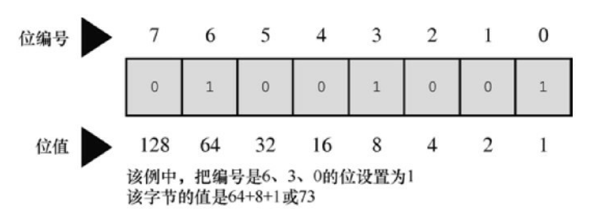
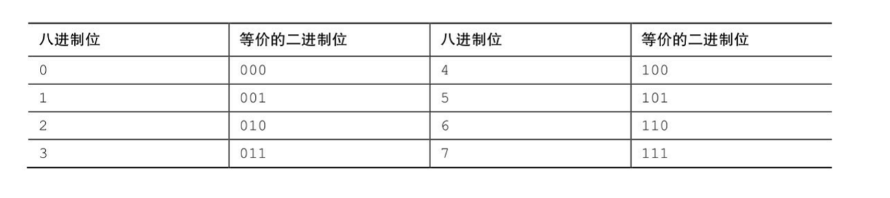
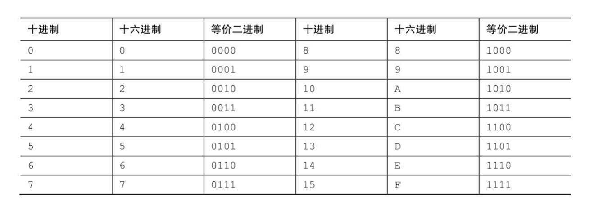
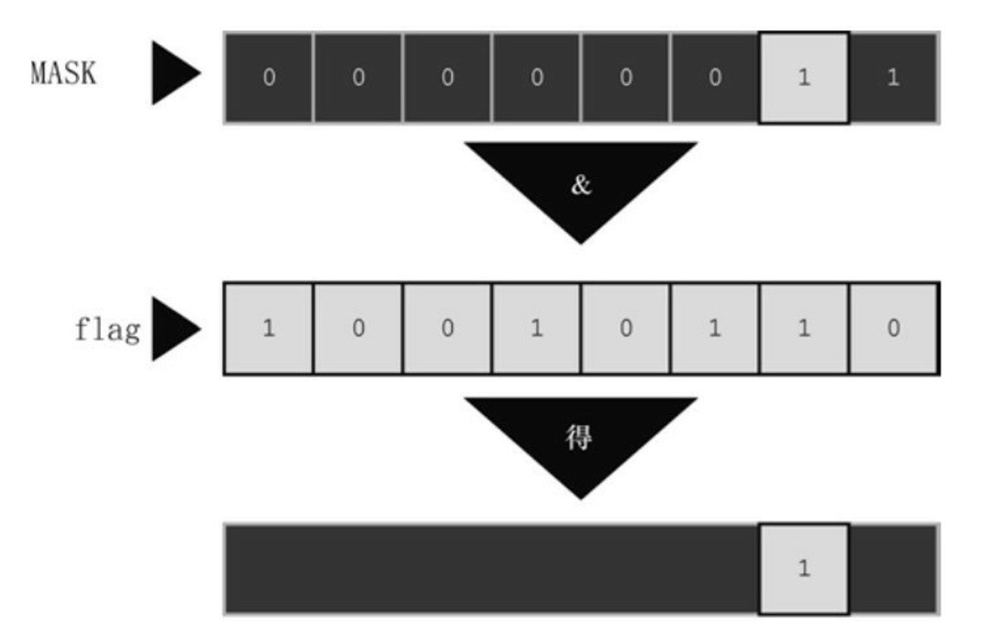

# 位操作

> 运算符：~、&、|、^、>>、<<、&=、|=、^=、>>=、<<=
> 
> 二进制、十进制、十六进制
> 
> 位运算符位字段
> 
> _Alignas _Alignof


## 二进制、位和字节

计算机适用基底为2的数制系统。它用2的幂而不是10的幂。以2为基 底表示的数字被称为二进制数（binary number）。二进制中的2和十进制中 的10作用相同。例如，二进制数1101可表示为：

1×2^3 + 1×2^2+ 0×2^1+ 1×2^0

以十进制数表示为：1×8 + 1×4 + 0×2 + 1×1 = 13

用二进制系统可以把任意整数（如果有足够的位）表示为0和1的组合。 由于数字计算机通过关闭和打开状态的组合来表示信息，这两种状态分别用 0和1来表示，所以使用这套数制系统非常方便。

**二进制整数**

通常，1字节包含8位。C语言用字节（byte）表示储存系统字符集所需 的大小，所以C字节可能是8位、9位、16位或其他值。不过，描述存储器芯片和数据传输率中所用的字节指的是8位字节（计算机界通常用八位组(octet)这个术语特指8位字节）。

可以从左 往右给这8位分别编号为7～0。在1字节中，编号是7的位被称为高阶位 （high-order bit），编号是0的位被称为低阶位（low-order bit）。每 1位的 编号对应2的相应指数。



这里，128是2的7次幂，以此类推。该字节能表示的最大数字是把所有 位都设置为1：11111111。这个二进制数的值是：
128 + 64 + 32 + 16 + 8 + 4 + 2 + 1 = 255

而该字节最小的二进制数是00000000，其值为0。因此，1字节可储存0 ～255范围内的数字，总共256个值。或者，通过不同的方式解释位组合 （bit pattern），程序可以用1字节储存-128～+127范围内的整数，总共还是 256个值。例如，通常unsigned char用1字节表示的范围是0～255，而signed char用1字节表示的范围是-128～+127。

**有符号整数**

如何表示有符号整数取决于硬件，而不是C语言。也许表示有符号数最 简单的方式是用1位（如，高阶位）储存符号，只剩下7位表示数字本身（假设储存在1字节中）。用这种符号量（sign-magnitude）表示法，10000001表 示−1，00000001表示1。因此，其表示范围是−127～+127

这种方法的缺点是有两个0：+0和-0。这很容易混淆，而且用两个位组 合来表示一个值也有些浪费。

*二进制补码（two’s-complement）*方法避免了这个问题，是当今最常用的系统。

二进制补码用1字节中的后7 位表示0～127，高阶位设置为0。目前，这种方法和符号量的方法相同。另 外，如果高阶位是1，表示的值为负。这两种方法的区别在于如何确定负 值。从一个9位组合100000000（256的二进制形式）减去一个负数的位组 合，结果是该负值的量。例如，假设一个负值的位组合是 10000000，作为 一个无符号字节，该组合为表示 128；作为一个有符号值，该组合表示负值 （编码是 7的位为1），而且值为100000000-10000000，即 1000000（128）。因此，该数是-128（在符号量表示法中，该位组合表示 −0）。类似地，10000001 是−127，11111111 是−1。该方法可以表示−128～ +127范围内的数。

要得到一个二进制补码数的相反数，最简单的方法是反转每一位（即0 变为1，1变为0），然后加1。因为1是00000001，那么−1则是11111110+1， 或11111111。

**二进制浮点数**

浮点数分两部分储存：二进制小数和二进制指数。

1. 二进制小数

一个普通的浮点数0.527，表示如下：<br>
5/10 + 2/100 + 7/1000<br>
从左往右，各分母都是10的递增次幂。在二进制小数中，使用2的幂作 为分母，所以二进制小数.101表示为：<br>
1/2 + 0/4 + 1/8<br>
用十进制表示法为：<br>
0.50 + 0.00 + 0.125<br>
即是0.625。

许多分数（如，1/3）不能用十进制表示法精确地表示。与此类似，许 多分数也不能用二进制表示法准确地表示。实际上，二进制表示法只能精确 地表示多个1/2的幂的和。因此，3/4和7/8可以精确地表示为二进制小数，但 是1/3和2/5却不能。

2. 浮点数表示法

为了在计算机中表示一个浮点数，要留出若干位（因系统而异）储存二 进制分数，其他位储存指数。一般而言，数字的实际值是由二进制小数乘以 2的指定次幂组成。例如，一个浮点数乘以4，那么二进制小数不变，其指数 乘以2，二进制分数不变。如果一份浮点数乘以一个不是2的幂的数，会改变 二进制小数部分，如有必要，也会改变指数部分。

<hr>

## 其他进制数

**八进制**

八进制（octal）是指八进制记数系统。该系统基于8的幂，用0～7表示 数字（正如十进制用0～9表示数字一样）。例如，八进制数451（在C中写 作0451）表示为：

4×8^2+ 5×8^1+ 1×8^0= 297（十进制）

了解八进制的一个简单的方法是，每个八进制位对应3个二进制位。


这种关系使得八进制与二进制之间的转换很容 易。例如，八进制数0377的二进制形式是11111111。即，用111代替0377中 的最后一个7，再用111代替倒数第2个7，最后用011代替3，并舍去第1位的 0。这表明比0377大的八进制要用多个字节表示。这是八进制唯一不方便的 地方：一个3位的八进制数可能要用9位二进制数来表示。注意，将八进制数 转换为二进制形式时，不能去掉中间的0。

**十六进制**

十六进制（hexadecimal或hex）是指十六进制记数系统。该系统基于16 的幂，用0～15表示数字。但是，由于没有单独的数（digit，即0～9这样单独一位的数）表示10～15，所以用字母A～F来表示。例如，十六进制数 A3F（在C中写作0xA3F）表示为：

10×16^2+3×16^1+ 15×16^0= 2623（十进制）

每个十六进制位都对应一个4位的二进制数（即4个二进制位），那么两 个十六进制位恰好对应一个8位字节。第1个十六进制表示前4位，第2个十六 进制位表示后4位。因此，十六进制很适合表示字节值。

例如，十六进制值0xC2可转换为 11000010。相反，二进制值11010101可以看作是1101 0101，可转换为 0xD5。


-------------------------

## C按位运算符

C 提供按位逻辑运算符和移位运算符。在下面的例子中，为了方便读者 了解位的操作，我们用二进制记数法写出值。但是在实际的程序中不必这 样，用一般形式的整型变量或常量即可。例如，在程序中用25或031或 0x19，而不是00011001。另外，下面的例子均使用8位二进制数，从左往右 每位的编号为7～0。

**按位逻辑运算符**

4个按位逻辑运算符都用于整型数据，包括char。之所以叫作按位 （bitwise）运算，是因为这些操作都是针对每一个位进行，不影响它左右两 边的位。不要把这些运算符与常规的逻辑运算符（&&、||和！）混淆，常规 的逻辑运算符操作的是整个值。

1. 二进制反码或按位取反：～

一元运算符～把1变为0，把0变为1。如下例子所示：
```
～(10011010)　// 表达式
(01100101)　　// 结果值
```
假设val的类型是unsigned char，已被赋值为2。在二进制中，00000010 表示2。那么，～val的值是11111101，即253。注意，该运算符不会改变val 的值，就像3 * val不会改变val的值一样， val仍然是2。但是，该运算符确实 创建了一个可以使用或赋值的新值：
```
newval = ～val;
printf("%d", ～val);
```
如果要把val的值改为～val，使用下面这条语句：
```
val=~fsval
```

2. 按位与：&

二元运算符&通过逐位比较两个运算对象，生成一个新值。对于每个 位，只有两个运算对象中相应的位都为1时，结果才为1（从真/假方面看， 只有当两个位都为真时，结果才为真）。因此，对下面的表达式求值：

(10010011) & (00111101)　　// 表达式

由于两个运算对象中编号为4和0的位都为1，得：

(00010001)　　// 结果值

C有一个按位与和赋值结合的运算符：&=。下面两条语句产生的最终结 果相同：
```C
val &= 0377;
val = val & 0377;
```

3. 按位或：|

二元运算符|，通过逐位比较两个运算对象，生成一个新值。对于每个 位，如果两个运算对象中相应的位为1，结果就为1（从真/假方面看，如果 两个运算对象中相应的一个位为真或两个位都为真，那么结果为真）。因 此，对下面的表达式求值：

(10010011) | (00111101) // 表达式

除了编号为6的位，这两个运算对象的其他位至少有一个位为1，得：

(10111111) // 结果值

C有一个按位或和赋值结合的运算符：|=。下面两条语句产生的最终作 用相同：
```C
val |= 0377;
val = val | 0377;
```

4. 按位异或：^

二元运算符^逐位比较两个运算对象。对于每个位，如果两个运算对象 中相应的位一个为1（但不是两个为1），结果为1（从真/假方面看，如果两 个运算对象中相应的一个位为真且不是两个为同为1，那么结果为真）。因 此，对下面表达式求值：

(10010011) ^ (00111101) // 表达式

编号为0的位都是1，所以结果为0，得：

(10101110)　　// 结果值

C有一个按位异或和赋值结合的运算符：^=。下面两条语句产生的最终 作用相同：
```C
val ^= 0377;
val = val ^ 0377;
```

**用法：掩码**

所谓掩码指的是一些设置为开 （1）或关（0）的位组合。要明白称其为掩码的原因，先来看通过&把一个 量与掩码结合后发生什么情况。例如，假设定义符号常量MASK为2 （即， 二进制形式为00000010），只有1号位是1，其他位都是0。下面的语句：

```C
flags = flags & MASK;
```

把flags中除1号位以外的所有位都设置为0，因为使用按位与运算符 （&）任何位与0组合都得0。1号位的值不变（如果1号位是1，那么 1&1得1；如果 1号位是0，那么 0&1也得0）。这个过程叫作“使用掩码”，因为掩 码中的0隐藏了flags中相应的位。

可以这样类比：把掩码中的0看作不透明，1看作透明。表达式flags & MASK相当于用掩码覆盖在flags的位组合上，只有MASK为1的位才可见


下面这条语句是按位与的一种常见用法：
```C
ch &= 0xff; /* 或者 ch &= 0377; */
```
前面介绍过oxff的二进制形式是11111111，八进制形式是0377。这个掩 码保持ch中最后8位不变，其他位都设置为0。无论ch原来是8位、16位或是 其他更多位，最终的值都被修改为1个8位字节。在该例中，掩码的宽度为8位。

**用法：打开位（设置为）**

有时，需要打开一个值中的特定位，同时保持其他位不变。例如，一台 IBM PC 通过向端口发送值来控制硬件。例如，为了打开内置扬声器，必须 打开 1 号位，同时保持其他位不变。这种情况可以使用按位或运算符 （|）。

以上一节的flags和MASK（只有1号位为1）为例。下面的语句：
```C
flags = flags | MASK;
```

把flags的1号位设置为1，且其他位不变。因为使用|运算符，任何位与0 组合，结果都为本身；任何位与1组合，结果都为1。

这种方法根据MASK中为1的位，把flags中对应的位设置为1，其他位不变.

**用法：关闭位（清空位）**

和打开特定的位类似，有时也需要在不影响其他位的情况下关闭指定的 位。假设要关闭变量flags中的1号位。同样，MASK只有1号位为1（即，打 开）。可以这样做：
```C
flags = flags & ～MASK;
```

由于MASK除1号位为1以外，其他位全为0，所以～MASK除1号位为0 以外，其他位全为1。使用&，任何位与1组合都得本身，所以这条语句保持 1号位不变，改变其他各位。另外，使用&，任何位与0组合都的0。所以无 论1号位的初始值是什么，都将其设置为0。


MASK中为1的位在结果中都被设置（清空）为0。flags中与MASK为0的 位相应的位在结果中都未改变。

简化：
```C
flags &= ～MASK;
```


**用法：切换位**

切换位指的是打开已关闭的位，或关闭已打开的位。可以使用按位异或 运算符（^）切换位。也就是说，假设b是一个位（1或0），如果b为1，则 1^b为0；如果b为0，则1^b为1。另外，无论b为1还是0，0^b均为b。因此， 如果使用^组合一个值和一个掩码，将切换该值与MASK为1的位相对应的 位，该值与MASK为0的位相对应的位不变。要切换flags中的1号位，可以使用 下面两种方法：
```C
flags = flags ^ MASK;
flags ^= MASK;
```

flags中与MASK为1的位相对应的位都被切换了，MASK为0的位相对应 的位不变。


**用法：检查位的值**

有时，需要检查某位的值。

例如，flags中 1号位是否被设置为1？不能这样直接比较flags和MASK：
```C
if (flags == MASK)
puts("Wow!"); /* 不能正常工作 */
```

这样做即使flags的1号位为1，其他位的值会导致比较结果为假。因此，必须覆盖flags中的其他位，只用1号位和MASK比较：

```C
if ((flags & MASK) == MASK)
puts("Wow!");
```
由于按位运算符的优先级比==低，所以必须在flags & MASK周围加上 圆括号。

为了避免信息漏过边界，掩码至少要与其覆盖的值宽度相同。

**移位运算符**

移位运算符向左或向右移动位。

1. 左移：<<

左移运算符（<<）将其左侧运算对象每一位的值向左移动其右侧运算 对象指定的位数。左侧运算对象移出左末端位的值丢失，用0填充空出的位 置。下面的例子中，每一位都向左移动两个位置：
```C
(10001010) << 2　 // 表达式
(00101000)　　　　// 结果值
```


该操作产生了一个新的位值，但是不改变其运算对象。例如，假设 stonk为1，那么 stonk<<2为4，但是stonk本身不变，仍为1。可以使用左移赋 值运算符（<<=）来更改变量的值。该运算符将变量中的位向左移动其右侧 运算对象给定值的位数。如下例：

```C
int stonk = 1;
int onkoo;
onkoo = stonk << 2;　 /* 把4赋给onkoo */
stonk <<= 2;　　　　 /* 把stonk的值改为4 */
```

2. 右移：>>

右移运算符（>>）将其左侧运算对象每一位的值向右移动其右侧运算 对象指定的位数。左侧运算对象移出右末端位的值丢。对于无符号类型，用 0 填充空出的位置；对于有符号类型，其结果取决于机器。空出的位置可用 0填充，或者用符号位（即，最左端的位）的副本填充：
```C
(10001010) >> 2　　　　// 表达式，有符号值
(00100010)　　　　　　 // 在某些系统中的结果值
(10001010) >> 2　　　　// 表达式，有符号值
(11100010)　　　　　　 // 在另一些系统上的结果值
//下面是无符号值的例子：
(10001010) >> 2　　　　// 表达式，无符号值
(00100010)　　　　　　 // 所有系统都得到该结果值
//每个位向右移动两个位置，空出的位用0填充。
```

右移赋值运算符（>>=）将其左侧的变量向右移动指定数量的位数。如 下所示：
```C
int sweet = 16;
int ooosw;
ooosw = sweet >> 3;　　// ooosw = 2，sweet的值仍然为16
sweet >>=3;　　　　　　// sweet的值为2
```

3. 用法：移位运算符

移位运算符针对2的幂提供快速有效的乘法和除法：
```C
number << n　　　 number乘以2的n次幂
number >> n　　　 如果number为非负，则用number除以2的n次幂
```

这些移位运算符类似于在十进制中移动小数点来乘以或除以10。

移位运算符还可用于从较大单元中提取一些位。例如，假设用一个 unsigned long类型的值表示颜色值，低阶位字节储存红色的强度，下一个字 节储存绿色的强度，第 3 个字节储存蓝色的强度。随后你希望把每种颜色的 强度分别储存在3个不同的unsigned char类型的变量中。那么，可以使用下面 的语句：
```C
#define BYTE_MASK 0xff
unsigned long color = 0x002a162f;
unsigned char blue, green, red;
red = color & BYTE_MASK;
green = (color >> 8) & BYTE_MASK;
blue = (color >> 16) & BYTE_MASK;
```
以上代码中，使用右移运算符将 8 位颜色值移动至低阶字节，然后使用 掩码技术把低阶字节赋给指定的变量。

**编程示例**

用移位运算符来解决把数字转换为二进制
形式。读取用户从键盘输入的整数，将该整数和一个字符串地址 传递给itobs()函数（itobs表示interger to binary string，即整数转换成二进制字 符串）。然后，该函数使用移位运算符计算出正确的1和0的组合，并将其放 入字符串中。
```C
/* binbit.c -- 使用位操作显示二进制 */
#include <stdio.h>
#include <limits.h> // 提供 CHAR_BIT 的定义，CHAR_BIT 表示每字节 的位数
char * itobs(int, char *);
void show_bstr(const char *);
int main(void)
{
char bin_str[CHAR_BIT * sizeof(int) + 1];
int number;
puts("Enter integers and see them in binary.");
puts("Non-numeric input terminates program.");
while (scanf("%d", &number) == 1)
{
itobs(number, bin_str);
printf("%d is ", number);
show_bstr(bin_str);
putchar('\n');
}
puts("Bye!");
return 0;
}
char * itobs(int n, char * ps)
{
int i;
const static int size = CHAR_BIT * sizeof(int);
for (i = size - 1; i >= 0; i--, n >>= 1)
ps[i] = (01 & n) + '0';
ps[size] = '\0';
return ps;
}
/*4位一组显示二进制字符串 */
void show_bstr(const char * str)
{
int i = 0;
while (str[i]) /* 不是一个空字符 */
{
putchar(str[i]);
if (++i % 4 == 0 && str[i])
putchar(' ');
}
}
```
程序使用limits.h中的CHAR_BIT宏，该宏表示char中的位数。 sizeof运算符返回char的大小，所以表达式CHAE_BIT * sizeof(int)表示int类型 的位数。bin_str数组的元素个数是CHAE_BIT * sizeof(int) + 1，留出一个位置 给末尾的空字符。

itobs()函数返回的地址与传入的地址相同，可以把该函数作为printf()的 参数。在该函数中，首次执行for循环时，对01 & n求值。01是一个八进制形 式的掩码，该掩码除0号位是1之外，其他所有位都为0。因此，01 & n就是n 最后一位的值。该值为0或1。但是对数组而言，需要的是字符'0'或字符'1'。 该值加上'0'即可完成这种转换（假设按顺序编码的数字，如 ASCII）。其结 果存放在数组中倒数第2个元素中（最后一个元素用来存放空字符）。

顺带一提，用1 & n或01 & n都可以。我们用八进制1而不是十进制1，只 是为了更接近计算机的表达方式。

然后，循环执行i--和n >>= 1。i--移动到数组的前一个元素，n >>= 1使n 中的所有位向右移动一个位置。进入下一轮迭代时，循环中处理的是n中新 的最右端的值。然后，把该值储存在倒数第3个元素中，以此类推。itobs() 函数用这种方式从右往左填充数组。

**示例2**

编写一个函数用于切换一个值中的后 n 位， 待处理值和 n 都是函数的参数。

～运算符切换一个字节的所有位，而不是选定的少数位。但是，^运算 符（按位异或）可用于切换单个位。假设创建了一个掩码，把后n位设置为1，其余位设置为0。然后使用^组合掩码和待切换的值便可切换该值的最后n 位，而且其他位不变。方法如下：
```C
int invert_end(int num, int bits)
{
int mask = 0;
int bitval = 1;
while (bits–– > 0)
{
mask |= bitval;
bitval <<= 1;
}
return num ^ mask;
}
```

while循环用于创建所需的掩码。最初，mask的所有位都为0。第1轮循 环将mask的0号位设置为1。然后第2轮循环将mask的1号位设置为1，以此类 推。循环bits次，mask的后bits位就都被设置为1。最后，num ^ mask运算即得 所需的结果。

------------------------

## 位字段

操控位的第2种方法是位字段（bit field）。位字段是一个signed int或 unsigned int类型变量中的一组相邻的位（C99和C11新增了_Bool类型的位字 段）。位字段通过一个结构声明来建立，该结构声明为每个字段提供标签， 并确定该字段的宽度。例如，下面的声明建立了一个4个1位的字段：
```C
struct {
unsigned int autfd : 1;
unsigned int bldfc : 1;
unsigned int undln : 1;
unsigned int itals : 1;
} prnt;
```

根据该声明，prnt包含4个1位的字段。现在，可以通过普通的结构成员 运算符（.）单独给这些字段赋值：

```C
prnt.itals = 0;
prnt.undln = 1;
```

由于每个字段恰好为1位，所以只能为其赋值1或0。变量prnt被储存在 int大小的内存单元中，但是在本例中只使用了其中的4位。

带有位字段的结构提供一种记录设置的方便途径。许多设置（如，字体 的粗体或斜体）就是简单的二选一。例如，开或关、真或假。如果只需要使 用 1 位，就不需要使用整个变量。内含位字段的结构允许在一个存储单元中 储存多个设置。

有时，某些设置也有多个选择，因此需要多位来表示。这没问题，字段不限制 1 位大小。可以使用如下的代码：
```c
struct {
unsigned int code1 : 2;
unsigned int code2 : 2;
unsigned int code3 : 8;
} prcode;
```
以上代码创建了两个2位的字段和一个8位的字段。可以这样赋值：
```C
prcode.code1 = 0;
prcode.code2 = 3;
prcode.code3 = 102;
```

如果声明的总位数超过了一个unsigned int类型的大小会怎样？会用到下 一个unsigned int类型的存储位置。一个字段不允许跨越两个unsigned int之间 的边界。编译器会自动移动跨界的字段，保持unsigned int的边界对齐。一旦 发生这种情况，第1个unsigned int中会留下一个未命名的“洞”。

可以用未命名的字段宽度“填充”未命名的“洞”。使用一个宽度为0的未 命名字段迫使下一个字段与下一个整数对齐：

```C
struct {
unsigned int field1　　: 1 ;
unsigned int　　　　　 : 2 ;
unsigned int field2　　: 1 ;
unsigned int　　　　　 : 0 ;
unsigned int field3　　: 1 ;
} stuff;
```

这里，在stuff.field1和stuff.field2之间，有一个2位的空隙；stuff.field3将 储存在下一个unsigned int中。

字段储存在一个int中的顺序取决于机器。在有些机器上，存储的顺序是 从左往右，而在另一些机器上，是从右往左。另外，不同的机器中两个字段 边界的位置也有区别。由于这些原因，位字段通常都不容易移植。尽管如 此，有些情况却要用到这种不可移植的特性。例如，以特定硬件设备所用的 形式储存数据

------------------------

## 对齐特性

C11 的对齐特性比用位填充字节更自然，它们还代表了C在处理硬件相 关问题上的能力。在这种上下文中，对齐指的是如何安排对象在内存中的位 置。例如，为了效率最大化，系统可能要把一个 double 类型的值储存在4 字 节内存地址上，但却允许把char储存在任意地址。大部分程序员都对对齐不 以为然。但是，有些情况又受益于对齐控制。例如，把数据从一个硬件位置 转移到另一个位置，或者调用指令同时操作多个数据项。

_Alignof运算符给出一个类型的对齐要求，在关键字_Alignof后面的圆括 号中写上类型名即可：
```C
size_t d_align = _Alignof(float);
```

假设d_align的值是4，意思是float类型对象的对齐要求是4。也就是说， 4是储存该类型值相邻地址的字节数。一般而言，对齐值都应该是2的非负整 数次幂。较大的对齐值被称为stricter或stronger，较小的对齐值被称为 weaker。

可以使用_Alignas 说明符指定一个变量或类型的对齐值。但是，不应该 要求该值小于基本对齐值。例如，如果float类型的对齐要求是4，不要请求 其对齐值是1或2。该说明符用作声明的一部分，说明符后面的圆括号内包含 对齐值或类型：

```C
_Alignas(double) char c1;
_Alignas(8) char c2;
unsigned char _Alignas(long double) c_arr[sizeof(long double)];
```


