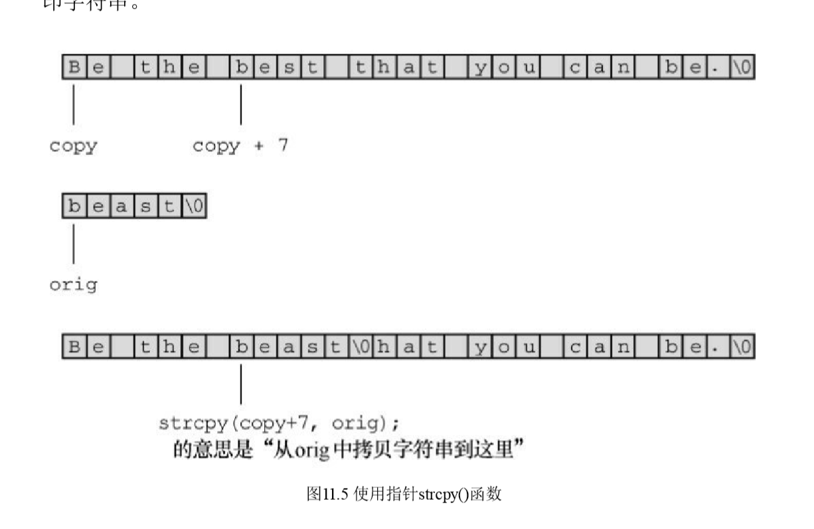
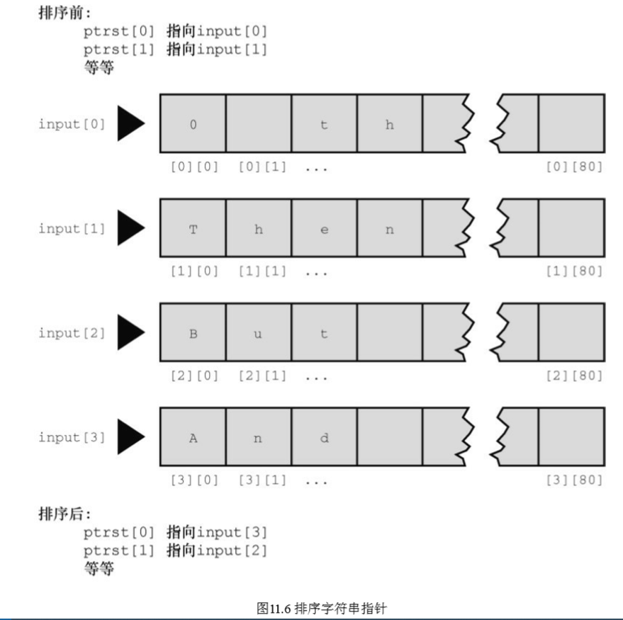
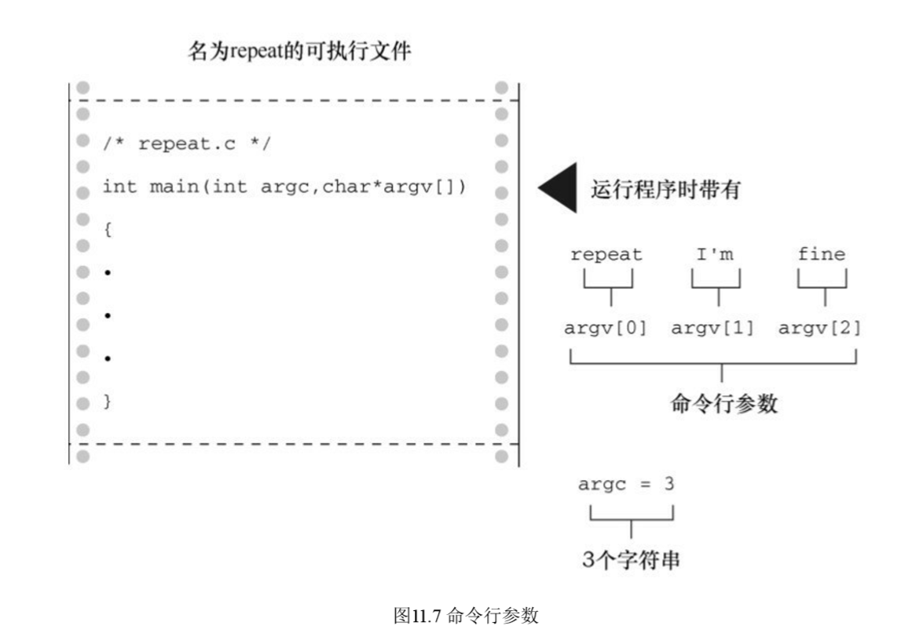

# 字符串和字符串函数

> 函数：gets()、gets_s()、fgets()、puts()、fputs()、strcat()、strncat()、 strcmp()、strncmp()、strcpy()、strncpy()、sprintf()、strchr()
> 创建并使用字符串
> 使用C库中的字符和字符串函数，并创建自定义的字符串函数
> 使用命令行参数


## 表示字符串和字符串IO
> 字符串是以空字符（\0）结尾的char类型数组

和printf()函数一样，puts()函数也属于stdio.h系列的输入/输出函数。但 是，与printf()不同的是，puts()函数只显示字符串，而且自动在显示的字符串末尾加上换行符.

**在程序中定义字符串**

1. 字符串字面量（字符串常量）
   
从ANSI C标准起，如果字符串字面量之间没有间隔，或者用空白字符 分隔，C会将其视为串联起来的字符串字面量。例如：
```C
char　greeting[50]　=　"Hello,　and""　how　are"　"　you"
"　today!";

//与下面的代码等价：
char greeting[50] = "Hello, and how are you today!";
```

*字符串常量属于静态存储类别（static storage class），这说明如果在函 数中使用字符串常量，该字符串只会被储存一次，在整个程序的生命期内存 在，即使函数被调用多次。用双引号括起来的内容被视为指向该字符串储存 位置的指针。这类似于把数组名作为指向该数组位置的指针。*

2. 字符串数组和初始化
> 定义字符串数组时，必须让编译器知道需要多少空间。一种方法是用足 够空间的数组储存字符串。

```C
const char m1[40] = "Limit yourself to one line's worth.";
```

*在指定数组大小时，要确保数组的元素个数至少比字符串长度多1（为 了容纳空字符）。所有未被使用的元素都被自动初始化为0（这里的0指的是 char形式的空字符，不是数字字符0）*


还可以使用指针表示法创建字符串。例如，程序清单11.1中使用了下面 的声明：
```C
const char * pt1 = "Something is pointing at me.";
//该声明和下面的声明几乎相同：
const char ar1[] = "Something is pointing at me.";
```

3. 数组和指针
  > 初始化数组把静态存储区的字符串拷贝到数组中，而初始化指针 只把字符串的地址拷贝给指针
  >在数组形式中，ar1是地址常量。不能更改ar1，如果 改变了ar1，则意味着改变了数组的存储位置（即地址）。可以进行类似 ar1+1这样的操作，标识数组的下一个元素。但是不允许进行++ar1这样的操 作。
  > 指针形式（*pt1）也使得编译器为字符串在静态存储区预留29个元素的 空间。另外，一旦开始执行程序，它会为指针变量pt1留出一个储存位置， 并把字符串的地址储存在指针变量中。该变量最初指向该字符串的首字符， 但是它的值可以改变。因此，可以使用递增运算符。例如，++pt1将指向第 2 个字符


4. 数组和指针的区别

假设有下面两个声明：
```C
char heart[] = "I love Tillie!"
const char *head = "I love Tillie!"
```
两者主要的区别是：数组名heart是常量，而指针名head是变量。

两者都可以使用数组表示法

两者都能进行指针加法操作

只有指针表示法可以进行递增操作

建议在把指针初始化为字符串字面 量时使用const限定符

----------------------------------
5. 字符串数组

```C
const char *mytalents[LIM] = {
"Adding　numbers　swiftly",
"Multiplying　accurately",　"Stashing　data",
"Following　instructions　to　the　letter",
"Understanding　the　C　language"
};

char　yourtalents[LIM][SLEN]　=　{
"Walking　in　a　straight　line",
"Sleeping",　"Watching　television",
"Mailing　letters",　"Reading　email"
};
```

从某些方面来看，mytalents和yourtalents非常相似。两者都代表5个字符 串。使用一个下标时都分别表示一个字符串，如mytalents[0]和 yourtalents[0]；使用两个下标时都分别表示一个字符，例如 mytalents[1][2]表 示 mytalents 数组中第 2 个指针所指向的字符串的第 3 个字符'l'， yourtalents[1][2]表示youttalentes数组的第2个字符串的第3个字符'e'。而且， 两者的初始化方式也相同。

mytalents数组是一个内含5个指针的数组，在我们的系统中共占用40字节.而yourtalents是一个内含5个数组的数组，每个数 组内含40个char类型的值，共占用200字节。所以，虽然mytalents[0]和 yourtalents[0]都分别表示一个字符串，但mytalents和yourtalents的类型并不相 同。mytalents中的指针指向初始化时所用的字符串字面量的位置，这些字符 串字面量被储存在静态内存中；而 yourtalents 中的数组则储存着字符串字面 量的副本，所以每个字符串都被储存了两次。此外，为字符串数组分配内存 的使用率较低。yourtalents 中的每个元素的大小必须相同，而且必须是能储 存最长字符串的大小。

*综上所述，如果要用数组表示一系列待显示的字符串，请使用指针数 组，因为它比二维字符数组的效率高。但是，指针数组也有自身的缺点。
mytalents 中的指针指向的字符串字面量不能更改；而yourtalentsde 中的内容 可以更改。所以，如果要改变字符串或为字符串输入预留空间，不要使用指 向字符串字面量的指针*

------------------------

## 字符串输入

**分配空间**
> 如果想把一个字符串读入程序，首先必须预留储存该字符串的空间，然 后用输入函数获取该字符串
> 要做的第 1 件事是分配空间，以储存稍后读入的字符串。

**gets函数**

在读取字符串时，scanf()和转换说明%s只能读取一个单词。可是在程序 中经常要读取一整行输入，而不仅仅是一个单词。许多年前，gets()函数就 用于处理这种情况。gets()函数简单易用，它读取整行输入，直至遇到换行 符，然后丢弃换行符，储存其余字符，并在这些字符的末尾添加一个空字符 使其成为一个 C 字符串。它经常和 puts()函数配对使用，该函数用于显示字 符串，并在末尾添加换行符。

*gets()函数只知道数组的开始处，并不知道数组中有多少个元 素。如果输入的字符串过长，会导致缓冲区溢出（buffer overflow），即多 余的字符超出了指定的目标空间。如果这些多余的字符只是占用了尚未使用 的内存，就不会立即出现问题；如果它们擦写掉程序中的其他数据，会导致 程序异常中止；或者还有其他情况。*

*C11标准委员会采取了更强硬的态度，直接从标准中废除了 gets()函数*

**gets的替代品**

> 通常用fgets()来代替gets()，C11标准新增的gets_s()函数也可代替gets()。该函数与 gets()函数更接近，而且可以替换现有代码中的gets()。

1. fgets和fputs

   fgets()函数通过第2个参数限制读入的字符数来解决溢出的问题。该函 数专门设计用于处理文件输入，所以一般情况下可能不太好用。fgets()和 gets()的区别如下。
    + fgets()函数的第2个参数指明了读入字符的最大数量。如果该参数的值 是n，那么fgets()将读入n-1个字符，或者读到遇到的第一个换行符为止。
    + 如果fgets()读到一个换行符，会把它储存在字符串中。这点与gets()不 同，gets()会丢弃换行符
    + fgets()函数的第3 个参数指明要读入的文件。如果读入从键盘输入的数据，则以stdin（标准输入）作为参数，该标识符定义在stdio.h中。
    + 因为 fgets()函数把换行符放在字符串的末尾（假设输入行不溢出），通 常要与 fputs()函数（和puts()类似）配对使用，除非该函数不在字符串末尾添加换行符。fputs()函数的第2个参数指明它要写入的文件。如果要显示在 计算机显示器上，应使用stdout（标准输出）作为该参数。
    + puts()函数会在待输出字符串末尾添加一个换行符，而fputs()不会这样做。

实例：
```C
#include　<stdio.h>
#define　STLEN　14
int　main(void)
{
  char　words[STLEN];
  puts("Enter　a　string,　please.");
  fgets(words,　STLEN,　stdin);
  printf("Your　string　twice　(puts(),　then　fputs()):\n");
  puts(words);
  fputs(words,　stdout);
  puts("Enter　another　string,　please.");
  fgets(words,　STLEN,　stdin);
  printf("Your　string　twice　(puts(),　then　fputs()):\n");
  puts(words);
  fputs(words,　stdout);
  puts("Done.");
  return　0;
}
```

fputs()函数返回指向 char的指针。如果一切进行顺利，该函数返回的地址与传入的第 1 个参数相同。但是，如果函数读到文件结尾，它将返回一个 特殊的指针：空指针（null pointer）。该指针保证不会指向有效的数据，所 以可用于标识这种特殊情况。在代码中，可以用数字0来代替，不过在C语 言中用宏NULL来代替更常见（如果在读入数据时出现某些错误，该函数也 返回NULL）。

fgets()储存换行符有好处也有坏处。坏处是你可能并不想把换行符储存 在字符串中，这样的换行符会带来一些麻烦。好处是对于储存的字符串而 言，检查末尾是否有换行符可以判断是否读取了一整行。如果不是一整行，要妥善处理一行中剩下的字符。

空指针（或NULL）有一个值，该值不会与任何数据的有效地址对应。 通常，函数使用它返回一个有效地址表示某些特殊情况发生，例如遇到文件 结尾或未能按预期执行

空字符（或'\0'）是用于标记C字符串末尾的字符，其对应字符编码是0。由于其他字符的编码不可能是 0，所以不可能是字符串的一部分。


*该程序 读取输入行，删除储存在字符串中的换行符，如果没有换行符，则丢弃数组 装不下的字符。*
```C
#include<stdio.h>
#define STLEN 10

int main(void)
{
  char words[STLEN];
  int i;
  puts("Enter　strings　(empty　line　to　quit):");

  while　(fgets(words,　STLEN,　stdin)　!=　NULL　&&　 words[0]　!=　'\n')
{
i　=　0;
while　(words[i]　!=　'\n'　&&　words[i]　!=　'\0')
i++;
if　(words[i]　==　'\n')
words[i]　=　'\0';
else　// 如果word[i] == '\0'则执行这部分代码
while　(getchar()　!=　'\n')
continue;
puts(words);
}
puts("done");
return　0;
}


  return 0;
}


2. gets_s函数

> C11新增的gets_s()函数（可选）和fgets()类似，用一个参数限制读入的 字符数。

```C
gets_s(words, STLEN);
```

*gets_s()与fgets()的区别如下。*

+ gets_s()只从标准输入中读取数据，所以不需要第3个参数。
+ 如果gets_s()读到换行符，会丢弃它而不是储存它。
+ 如果gets_s()读到最大字符数都没有读到换行符，会执行以下几步。首 先把目标数组中的首字符设置为空字符，读取并丢弃随后的输入直至读到换 行符或文件结尾，然后返回空指针。接着，调用依赖实现的“处理函数”（或 你选择的其他函数），可能会中止或退出程序。

*当输入与预期不符时，gets_s()完全没有fgets()函数方便、灵活。 也许这也是gets_s()只作为C库的可选扩展的原因之一。鉴于此，fgets()通常 是处理类似情况的最佳选择。
*

3. s_gets函数
> fgets()函数的一种用法：读取整行输入并用空字符 代替换行符，或者读取一部分输入，并丢弃其余部分。既然没有处理这种情 况的标准函数，我们就创建一个，在后面的程序中会用得上

```C
char * s_gets(char * st, int n)
{
char * ret_val;
int　i　=　0;
ret_val　=　fgets(st,　n,　stdin);
if (ret_val)　// 即，ret_val != NULL
{
while　(st[i]　!=　'\n'　&&　st[i]　!=　'\0')
i++;
if　(st[i]　==　'\n')
st[i]　=　'\0';
else
while　(getchar()　!=　'\n')
continue;
}
return　ret_val;
}
```

如果 fgets()返回 NULL，说明读到文件结尾或出现读取错误，s_gets()函 数跳过了这个过程。
如果字符串中出现换 行符，就用空字符替换它；
如果字符串中出现空字符，就丢弃该输入行的其 余字符，然后返回与fgets()相同的值


**scanf函数**
> scanf()和gets()或fgets()的区别在于它们如何确定字符串的末尾： scanf()更像是“获取单词”函数，而不是“获取字符串”函数；如果预留的存储 区装得下输入行，gets()和fgets()会读取第1个换行符之前所有的字符。 scanf()函数有两种方法确定输入结束。无论哪种方法，都从第1个非空白字 符作为字符串的开始。如果使用%s转换说明，以下一个空白字符（空行、 空格、制表符或换行符）作为字符串的结束（字符串不包括空白字符）。如 果指定了字段宽度，如%10s，那么scanf()将读取10 个字符或读到第1个空白 字符停止（先满足的条件即是结束输入的条件）

scanf()函数返回一个整数值，该值等于scanf()成功读取的 项数或EOF（读到文件结尾时返回EOF）。

根据输入数据的性质，用fgets()读取从键盘输入的数据更合适。例如， scanf()无法完整读取书名或歌曲名，除非这些名称是一个单词。scanf()的典 型用法是读取并转换混合数据类型为某种标准形式。例如，如果输入行包含 一种工具名、库存量和单价，就可以使用scanf()。否则可能要自己拼凑一个 函数处理一些输入检查。如果一次只输入一个单词，用scanf()也没问题。


scanf()和gets()类似，也存在一些潜在的缺点。如果输入行的内容过长， scanf()也会导致数据溢出。不过，在%s转换说明中使用字段宽度可防止溢 出。

------------------------------

## 字符串输出
> put()、fputs()和printf()。

**puts**
> puts()函数很容易使用，只需把字符串的地址作为参数传递给它即可。 
puts()在显示字符串时会自动在 其末尾添加一个换行符。

puts在遇到空字符时就停止输出，所以 必须确保有空字符。

**fputs**
> fputs()函数是puts()针对文件定制的版本

与puts区别：

+ fputs()函数的第 2 个参数指明要写入数据的文件。如果要打印在显示器上，可以用定义在stdio.h中的stdout（标准输出）作为该参数。

+ 与puts()不同，fputs()不会在输出的末尾添加换行符。
+ gets()丢弃输入中的换行符，但是puts()在输出中添加换行符。另 一方面，fgets()保留输入中的换行符，fputs()不在输出中添加换行符。
+ 

**printf**
> printf() 也把字符串的地址作为参数。printf()函数用起来没有puts()函数那么方便， 但是它更加多才多艺，因为它可以格式化不同的数据类型。
printf()不会自动在每个字符串末尾加上一个换行 符。因此，必须在参数中指明应该在哪里使用换行符

-----------------------------------
## 自定义输入输出函数

不一定非要使用C库中的标准函数，如果无法使用这些函数或者不想用 它们，完全可以在getchar()和putchar()的基础上自定义所需的函数

------------------------------------

## 字符串函数

> C库提供了多个处理字符串的函数，ANSI C把这些函数的原型放在 string.h头文件中。其中最常用的函数有 strlen()、strcat()、strcmp()、 strncmp()、strcpy()和strncpy()。另外，还有sprintf()函数，其原型在stdio.h头 文件中。


**strlen**
> strlen()函数用于统计字符串的长度

**strcat**
> strcat()（用于拼接字符串）函数接受两个字符串作为参数。该函数把第 2个字符串的备份附加在第1个字符串末尾，并把拼接后形成的新字符串作为 第1个字符串，第2个字符串不变。strcat()函数的类型是char *（即，指向char 的指针）。strcat()函数返回第1个参数，即拼接第2个字符串后的第1个字符 串的地址。

**strncat**
> strcat()函数无法检查第1个数组是否能容纳第2个字符串。如果分配给第1个数组的空间不够大，多出来的字符溢出到相邻存储单元时就会出问题。 
该函数的第3 个参数指定了最大添加字符数。例如，strncat(bugs, addon, 13)将把 addon字符串的内容附加给bugs，在加到第13个字符或遇到空 字符时停止。因此，算上空字符（无论哪种情况都要添加空字符），bugs数 组应该足够大，以容纳原始字符串（不包含空字符）、添加原始字符串在后 面的13个字符和末尾的空字符。

**strcmp**
> C标准库中的strcmp()函数（用于字符串比较）。该 函数通过比较运算符来比较字符串，就像比较数字一样。如果两个字符串参 数相同，该函数就返回0，否则返回非零值。
ASCII标准规定，在字母表中，如果第1个字符串在第2个字符串前面， strcmp()返回一个负数；如果两个字符串相同，strcmp()返回0；如果第1个字 符串在第2个字符串后面，strcmp()返回正数。

**strncmp**
> strcmp()函数比较字符串中的字符，直到发现不同的字符为止，这一过 程可能会持续到字符串的末尾。而strncmp()函数在比较两个字符串时，可以 比较到字符不同的地方，也可以只比较第3个参数指定的字符数。


**strcpy和strncpy**

> 如果希望拷贝整个字符串，要使用strcpy()函数。

strcpy()接受两个字符串指针作为参数，可以把指向源字符串的 第2个指针声明为指针、数组名或字符串常量；而指向源字符串副本的第1个 指针应指向一个数据对象（如，数组），且该对象有足够的空间储存源字符 串的副本。记住，声明数组将分配储存数据的空间，而声明指针只分配储存 一个地址的空间。

strcpy()函数还有两个有用的属性。第一，strcpy()的返回类型是 char *， 该函数返回的是第 1个参数的值，即一个字符的地址。第二，第 1 个参数不 必指向数组的开始。这个属性可用于拷贝数组的一部分

例：
```C
#include　<stdio.h>
#include <string.h>　　// 提供strcpy()的函数原型
#define　WORDS　 "beast"
#define　SIZE　40
int　main(void)
{
const char * orig = WORDS;
char　copy[SIZE]　=　"Be　the　best　that　you　can　be.";
char * ps;
puts(orig);
puts(copy);
ps　=　strcpy(copy　+　7,　orig);
puts(copy);
puts(ps);
return　0;
}
```



*更谨慎的选择：strncpy()*
> strcpy()和 strcat()都有同样的问题，它们都不能检查目标空间是否能容 纳源字符串的副本。拷贝字符串用 strncpy()更安全，该函数的第 3 个参数指 明可拷贝的最大字符数。

strncpy(target, source, n)把source中的n个字符或空字符之前的字符（先满 足哪个条件就拷贝到何处）拷贝至target中。因此，如果source中的字符数小 于n，则拷贝整个字符串，包括空字符。但是，strncpy()拷贝字符串的长度不 会超过n，如果拷贝到第n个字符时还未拷贝完整个源字符串，就不会拷贝空 字符。所以，拷贝的副本中不一定有空字符。鉴于此，该程序把 n 设置为比 目标数组大小少1（TARGSIZE-1），然后把数组最后一个元素设置为空字符：
```C
strncpy(qwords[i],　temp,　TARGSIZE　-　1);
qwords[i][TARGSIZE　-　1]　=　'\0';
```

**sprintf函数**
> 该函数和printf()类似，但是它是把数据写入字符串，而不是打印在显示器上。因此，该函数可 以把多个元素组合成一个字符串。sprintf()的第1个参数是目标字符串的地 址。其余参数和printf()相同，即格式字符串和待写入项的列表

```C
#include　<stdio.h>
#define　MAX　20
char * s_gets(char * st, int n);
int　main(void)
{
char　first[MAX];
char　last[MAX];
char formal[2 * MAX + 10];
double　prize;
puts("Enter　your　first　name:");
s_gets(first,　MAX);
puts("Enter　your　last　name:");
s_gets(last,　MAX);
puts("Enter　your　prize　money:");
scanf("%lf",　&prize);
sprintf(formal,　"%s,　%-19s:　$%6.2f\n",　last,　first,　prize);
puts(formal);
return　0;
}
char * s_gets(char * st, int n)
{
char * ret_val;
int　i　=　0;
ret_val　=　fgets(st,　n,　stdin);
if　(ret_val)
{
while　(st[i]　!=　'\n'　&&　st[i]　!=　'\0')
i++;
if　(st[i]　==　'\n')
st[i]　=　'\0';
else
while　(getchar()　!=　'\n')
continue;
}
return　ret_val;
}
```
sprintf()函数获取输入，并将其格式化为标准形式，然后把格式化后的 字符串储存在formal中。

**其他字符串函数**

char *strchr(const char * s, int c);

如果s字符串中包含c字符，该函数返回指向s字符串首位置的指针（末尾的空字符也是字符串的一部分，所以在查找范围内）；如果在字符串s中未找到c字符，该函数则返回空指针。


char *strpbrk(const char * s1, const char * s2);

如果 s1 字符中包含 s2 字符 串中的任意字符，该函数返回指向 s1 字符串首位置的指针；如果在s1字符 串中未找到任何s2字符串中的字符，则返回空字符。

char *strrchr(const char * s, int c);

该函数返回s字符串中c字符的最后一次 出现的位置（末尾的空字符也是字符串的一部分，所以在查找范围内）。如 果未找到c字符，则返回空指针。

char *strstr(const char * s1, const char * s2);

该函数返回指向s1字符串中s2字符串出现的首位置。如果在s1中没有找 到s2，则返回空指针。


## 字符串示例：字符串排序

```C
#include　<stdio.h>
#include　<string.h>
#define SIZE 81　　　 /* 限制字符串长度，包括 \0 */
#define LIM 20　　　 /* 可读入的最多行数 */
#define HALT ""　　　 /* 空字符串停止输入 */
void stsrt(char *strings [], int num);　/* 字符串排序函数 */
char * s_gets(char * st, int n);
int　main(void)
{
char input[LIM][SIZE];　　 /* 储存输入的数组　　　 */
char *ptstr[LIM];　　　　　/* 内含指针变量的数组　　*/
int ct = 0;　　　　　　　　/* 输入计数　　　　　　*/
int k;　　　　　　　　　　 /* 输出计数　　　　　　*/
printf("Input　up　to　%d　lines,　and　I　will　sort　them.\n",　LIM);
printf("To　stop,　press　the　Enter　key　at　a　line's　start.\n");
while　(ct　<　LIM　&&　s_gets(input[ct],　SIZE)　!=　NULL
&&　input[ct][0]　!=　'\0')
{
ptstr[ct] = input[ct];　/* 设置指针指向字符串　 */
ct++;
}
stsrt(ptstr, ct);　　　　　/* 字符串排序函数　　　 */
puts("\nHere's　the　sorted　list:\n");
for　(k　=　0;　k　<　ct;　k++)
puts(ptstr[k]);　　　　/* 排序后的指针　　　　 */
return　0;
}
/* 字符串-指针-排序函数 */
void stsrt(char *strings [], int num)
{
char *temp;
int　top,　seek;
for　(top　=　0;　top　<　num　-　1;　top++)
for　(seek　=　top　+　1;　seek　<　num;　seek++)
if　(strcmp(strings[top],　strings[seek])　>　0)
{
temp　=　strings[top];
strings[top]　=　strings[seek];
strings[seek]　=　temp;
}
}
char * s_gets(char * st, int n)
{
char * ret_val;
int　i　=　0;
ret_val　=　fgets(st,　n,　stdin);
if　(ret_val)
{
while　(st[i]　!=　'\n'　&&　st[i]　!=　'\0')
i++;
if　(st[i]　==　'\n')
st[i]　=　'\0';
else
while　(getchar()　!=　'\n')
continue;
}
return　ret_val;
}
```

该程序的巧妙之处在于排序的是指向字符串的指针，而不是字符串本 身。我们来分析一下具体怎么做。最初，ptrst[0]被设置为input[0]，ptrst[1] 被设置为input[1]，以此类推。这意味着指针ptrst[i]指向数组input[i]的首字 符。每个input[i]都是一个内含81个元素的数组，每个ptrst[i]都是一个单独的 变量。排序过程把ptrst重新排列，并未改变input。例如，如果按字母顺序 input[1]在intput[0]前面，程序便交换指向它们的指针（即ptrst[0]指向input[1] 的开始，而ptrst[1]指向input[0]的开始）。这样做比用strcpy()交换两个input 字符串的内容简单得多，而且还保留了input数组中的原始顺序



----------------------------
## ctype.h字符函数和字符串
> 虽然这些函数不能处理 整个字符串，但是可以处理字符串中的字符

例如,定义ToUpper()函数，利用toupper()函数处理字符串中的每个字符，把整个字符 串转换成大写；定义PunctCount()函数，利用ispunct()统计字符串中的标点符号个数。

顺带一提，ctype.h中的函数通常作为宏（macro）来实现。这些C预处理 器宏的作用很像函数，但是两者有一些重要的区别。

-------------------------------------

## 命令行参数

在图形界面普及之前都使用命令行界面。DOS和UNIX就是例子。Linux 终端提供类UNIX命令行环境。命令行（command line）是在命令行环境中， 用户为运行程序输入命令的行。假设一个文件中有一个名为fuss的程序。在 UNIX环境中运行该程序的命令行是：

```shell
$ fuss
```

或者在Windows命令提示模式下是：
```shell
C> fuss
```

命令行参数（command-line argument）是同一行的附加项。如下例：
```shell
$ fuss -r Ginger
```

关于命令行参数


示例：
```C
#include　<stdio.h>
int main(int argc, char *argv [])
{
int　count;
printf("The　command　line　has　%d　arguments:\n",　argc　-　1);
for　(count　=　1;　count　<　argc;　count++)
printf("%d:　%s\n",　count,　argv[count]);
printf("\n");
return　0;
}
```

把该程序编译为可执行文件repeat。下面是通过命令行运行该程序后的 输出：
```
C>repeat Resistance is futile
The　command　line　has　3　arguments:
1:　Resistance
2:　is
3:　futile
```

C编译器允许main()没有参数或者有两个参数（一些实现允许main()有更 多参数，属于对标准的扩展）。main()有两个参数时，第1个参数是命令行 中的字符串数量。过去，这个int类型的参数被称为argc （表示参数计数 (argument count)）。系统用空格表示一个字符串的结束和下一个字符串的开 始。因此，上面的repeat示例中包括命令名共有4个字符串，其中后3个供 repeat使用。该程序把命令行字符串储存在内存中，并把每个字符串的地址 储存在指针数组中。而该数组的地址则被储存在 main()的第 2 个参数中。按 照惯例，这个指向指针的指针称为argv（表示参数值[argument value]）。如 果系统允许（一些操作系统不允许这样），就把程序本身的名称赋给 argv[0]，然后把随后的第1个字符串赋给argv[1]，以此类推。

char **argv与char *argv[]等价。也就是说，argv是一个指向指针的指 针，它所指向的指针指向 char。因此，即使在原始定义中，argv 也是指向指 针（该指针指向 char）的指针。两种形式都可以使用，但我们认为第1种形 式更清楚地表明argv表示一系列字符串。

许多环境（包括UNIX和DOS）都允许用双引号把多个单词 括起来形成一个参数。例如：
repeat "I am hungry" now
这行命令把字符串"I am hungry"赋给argv[1]，把"now"赋给argv[2]。

-----------------------------
## 把字符串转换为数字

atoi()函数（用于把字母数字转换成整数），该函数接受一个字符串作为参数，返回相应的整数值。

如果字符串仅以整数开头，atio()函数也能处理，它只把开头的整数转 换为字符。例如， atoi("42regular")将返回整数42。如果在命令行输入hello what会怎样？在我们所用的C实现中，如果命令行参数不是数字，atoi()函数 返回0。然而C标准规定，这种情况下的行为是未定义的。因此，使用有错 误检测功能的strtol()函数（马上介绍）会更安全。

该程序中包含了stdlib.h头文件，因为从ANSI C开始，该头文件中包含 了atoi()函数的原型。除此之外，还包含了 atof()和 atol()函数的原型。atof() 函数把字符串转换成 double 类型的值， atol()函数把字符串转换成long类型 的值。atof()和atol()的工作原理和atoi()类似，因此它们分别返回double类型 和long类型。

ANSI C还提供一套更智能的函数：strtol()把字符串转换成long类型的 值，strtoul()把字符串转换成unsigned long类型的值，strtod()把字符串转换成 double类型的值。这些函数的智能之处在于识别和报告字符串中的首字符是 否是数字。而且，strtol()和strtoul()还可以指定数字的进制。

```C
long strtol(const char * restrict nptr, char ** restrict endptr, int base);
```

这里，nptr是指向待转换字符串的指针，endptr是一个指针的地址，该 指针被设置为标识输入数字结束字符的地址，base表示以什么进制写入数字。


许多实现使用 itoa()和 ftoa()函数分别把整数和浮点数转换成字符串。但 是这两个函数并不是 C标准库的成员，可以用sprintf()函数代替它们，因为 sprintf()的兼容性更好