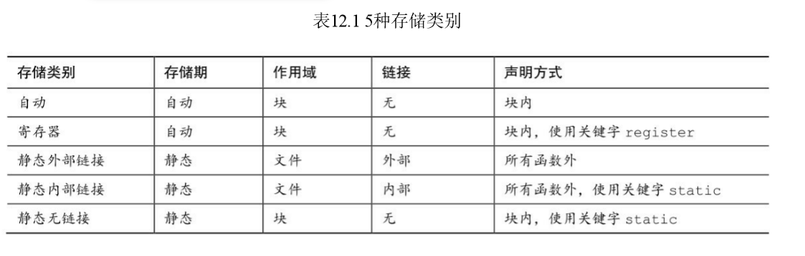

# 存储类别，链接和内存管理

> 关键字：auto、extern、static、register、const、volatile、restricted、 _Thread_local、_Atomic
> 
> 函数：rand()、srand()、time()、malloc()、calloc()、free()
> 
> 如何确定变量的作用域（可见的范围）和生命期（它存在多长时间）
> 
> 设计更复杂的程序

--------------------------------
## 存储类别

从硬件方面来 看，被储存的每个值都占用一定的物理内存，C 语言把这样的一块内存称为 对象（object）。对象可以储存一个或多个值。一个对象可能并未储存实际 的值，但是它在储存适当的值时一定具有相应的大小（面向对象编程中的对 象指的是类对象，其定义包括数据和允许对数据进行的操作，C不是面向对 象编程语言）。

从软件方面来看，程序需要一种方法访问对象。这可以通过声明变量来完成
```C
int entity = 3;
```
该声明创建了一个名为entity的标识符（identifier）。标识符是一个名 称，在这种情况下，标识符可以用来指定（designate）特定对象的内容在该例中，标识符entity即是软 件（即C程序）指定硬件内存中的对象的方式。该声明还提供了储存在对象 中的值。

*一般而言，那些指定 对象的表达式被称为左值*

如果可以使用左值改变对象中的值，该左值就是一个 **可修改的左值**（modifiable lvalue）

```C
const char * pc = "Behold a string literal!";
```

程序根据该声明把相应的字符串字面量储存在内存中，内含这些字符值 的数组就是一个对象。由于数组中的每个字符都能被单独访问，所以每个字 符也是一个对象。该声明还创建了一个标识符为pc的对象，储存着字符串的 地址。由于可以设置pc重新指向其他字符串，所以标识符pc是一个可修改的 左值。const只能保证被pc指向的字符串内容不被修改，但是无法保证pc不指 向别的字符串。由于*pc指定了储存'B'字符的数据对象，所以*pc 是一个左 值，但不是一个可修改的左值。与此类似，因为字符串字面量本身指定了储 存字符串的对象，所以它也是一个左值，但不是可修改的左值。

存储期
> 所谓存储期是指对象在内 存中保留了多长时间

标识符用于访问对象，可以用作用域（scope）和链 接（linkage）描述标识符，标识符的作用域和链接表明了程序的哪些部分可 以使用它。不同的存储类别具有不同的存储期、作用域和链接。标识符可以 在源代码的多文件中共享、可用于特定文件的任意函数中、可仅限于特定函 数中使用，甚至只在函数中的某部分使用。对象可存在于程序的执行期，也 可以仅存在于它所在函数的执行期。对于并发编程，对象可以在特定线程的 执行期存在。可以通过函数调用的方式显式分配和释放内存。


**作用域**
> 作用域描述程序中可访问标识符的区域。一个C变量的作用域可以是块作用域、函数作用域、函数原型作用域或文件作用域。

+ 块是用一对花括号括起来的代码区域
+ 块作用域变量的可见范围是 从定义处到包含该定义的块的末尾。另外，虽然函数的形式参数声明在函数 的左花括号之前，但是它们也具有块作用域，属于函数体这个块

*函数作用域（function scope）*

仅用于goto语句的标签

*函数原型作用域（function prototype scope）*

用于函数原型中的形参名（变量名）函数原型作用域的范围是从形参定义处到原型声明结束。这意味着，编 译器在处理函数原型中的形参时只关心它的类型，而形参名（如果有的话） 通常无关紧要。

只有在变长数组中，形参名才有用

```C
void use_a_VLA(int n, int m, ar[n][m]);
```


*文件作用域（file scope）*

变量的定义在函数的外面，具有文件作用域（file scope）。具有文件作用域的变量(也叫全局变量)，从它的定义处到该定义所在文件的末尾均可见。

**链接**

> C 变量有 3 种链接属性：外部链接、内部链接 或无链接。

+ 具有块作用域、函数作用域或函数原型作用域的变量都是无链接变量，这些变量属于定义它们的块、函数或原型私有。
+ 具有文件作用域的变量可以是外部链接或内部链接，外部链接变量可以在多文件程序中 使用，内部链接变量只能在一个翻译单元中使用

C 标准用“内部链接的文件作用域”描述仅限于一个翻译单元（即一个源 代码文件和它所包含的头文件）的作用域，用“外部链接的文件作用域”描述可延伸至其他翻译单元的作用域。

把“内部链接的文件作用域”简称为“文件作用域”，把“外部链接的 文件作用域”简称为“全局作用域”或“程序作用域”。


*如何知道文件作用域变量是内部链接还是外部链接？可以查看外部定义 中是否使用了存储类别说明符static：*

```C
int giants = 5;　　　　　　　// 文件作用域，外部链接
static int dodgers = 3;　　 // 文件作用域，内部链接
int　main()
{
...
}
...
```
该文件和同一程序的其他文件都可以使用变量giants。而变量dodgers属文件私有，该文件中的任意函数都可使用它


**存储期**

> 作用域和链接描述了标识符的可见性。存储期描述了通过这些标识符访 问的对象的生存期。C对象有4种存储期：静态存储期、线程存储期、自动存储期、动态分配存储期。


*如果对象具有静态存储期，那么它在程序的执行期间一直存在。*

*文件作用域变量具有静态存储期*

注意，对于文件作用域变量，关键字 static表明了其链接属性，而非存储期。以 static声明的文件作用域变量具有内部链接。但是无论是内部链接还是外部链接，所有的文件作用域变量都具有静态存储期。


*线程存储期用于并发程序设计，程序执行可被分为多个线程。*

具有线程存储期的对象，从被声明时到线程结束一直存在。以关键字_Thread_local声明一个对象时，每个线程都获得该变量的私有备份。

*块作用域的变量通常都具有自动存储期。*

当程序进入定义这些变量的块时，为这些变量分配内存；当退出这个块时，释放刚才为变量分配的内存。这种做法相当于把自动变量占用的内存视为一个可重复使用的工作区或暂存区。例如，一个函数调用结束后，其变量占用的内存可用于储存下一个被调用函数的变量.

*变长数组稍有不同，它们的存储期从声明处到块的末尾，而不是从块的 开始处到块的末尾。*

*块作用域变量也能具有静态存储期。*

为了创建这样的变量，要把变量声明在块中，且在声明前面加上关键字static：
```C
void　more(int　number)
{
int　index;
static　int　ct　=　0;
...
return　0;
}
```

变量ct储存在静态内存中，它从程序被载入到程序结束期间都存 在。但是，它的作用域定义在more()函数块中。只有在执行该函数时，程序 才能使用ct访问它所指定的对象（但是，该函数可以给其他函数提供该存储 区的地址以便间接访问该对象，例如通过指针形参或返回值）

*5种存储类别：自动、寄存器、静态块作用域、静态外部链接、静态内部链接，*


**自动变量**

> 属于自动存储类别的变量具有自动存储期、块作用域且无链接。默认情况下，声明在块或函数头中的任何变量都属于自动存储类别。为了更清楚地 表达你的意图（例如，为了表明有意覆盖一个外部变量定义，或者强调不要 把该变量改为其他存储类别），可以显式使用关键字auto

```C
auto int plox
```

关键字auto是存储类别说明符（storage-class specifier）。auto关键字在 C++中的用法完全不同，如果编写C/C++兼容的程序，最好不要使用auto作 为存储类别说明符。

块作用域和无链接意味着只有在变量定义所在的块中才能通过变量名访问该变量（当然，参数用于传递变量的值和地址给另一个函数，但是这是间接的方法）。另一个函数可以使用同名变量，但是该变量是储存在不同内存位置上的另一个变量。

变量具有自动存储期意味着，程序在进入该变量声明所在的块时变量存在，程序在退出该块时变量消失。原来该变量占用的内存位置现在可做他用。

*如果内层块中声明的变量与外层块中的变量同名,内层块会隐藏外层块的定义。但是离开内层块后，外层块变量的作用域又回到了原来的作用域。*


**寄存器变量**

变量通常储存在计算机内存中。如果幸运的话，寄存器变量储存在CPU的寄存器中，或者概括地说，储存在最快的可用内存中。与普通变量相比，访问和处理这些变量的速度更快。由于寄存器变量储存在寄存器而非内存中，所以无法获取寄存器变量的地址。绝大多数方面，寄存器变量和自动变
量都一样。也就是说，它们都是块作用域、无链接和自动存储期。使用存储类别说明符register便可声明寄存器变量
```C
register　int　quick;
```

声明变量为register类别与直接命令相比更像是一种请求。编译器必须根据寄存器或最快可用内存的数量衡量你的请求，或者直接忽略你的请求，所以可能不会如你所愿。在这种情况下，寄存器变量就变成普通的自动变量。即使是这样，*仍然不能对该变量使用地址运算符。*

在函数头中使用关键字register，便可请求形参是寄存器变量：
```C
void macho(register int n)
```
可声明为register的数据类型有限。例如，处理器中的寄存器可能没有足够大的空间来储存double类型的值。


**块作用域的静态变量**

静态的意思是该变量在内存中原地不动，并不是说它的值不变。具有文件作用域的变量自动具有（也必须是）静态存储期。前面提到过，可以创建具有静态存储期、块作用域的局部变量。这些变量和自动变量一样，具有相同的作用域，但是程序离开它们所在的函数后，这些变量不会消失。也就是说，这种变量具有块作用域、无链接，但是具有静态存储期。计算机在多次函数调用之间会记录它们的值。在块中（提供块作用域和无链接）以存储类别说明符static（提供静态存储期）声明这种变量。

```C
#include　<stdio.h>
void　trystat(void);
int　main(void)
{
int　count;
for　(count　=　1;　count　<=　3;　count++)
{
printf("Here　comes　iteration　%d:\n",　count);
trystat();
}
return　0;
}
void　trystat(void)
{
int　fade　=　1;
static　int　stay　=　1;
printf("fade　=　%d　and　stay　=　%d\n",　fade++,　stay++);
}
```

静态变量stay保存了它被递增1后的值，但是fade变量每次都是1。这表明了初始化的不同：*每次调用trystat()都会初始化fade，但是stay只在编译 strstat()时被初始化一次。如果未显式初始化静态变量，它们会被初始化为 0。*

*静态变量 和外部变量在程序被载入内存时已执行完毕。*

*不能在函数的形参中使用static：*
```C
int wontwork(static int flu);//不允许
```

**外部链接的静态变量**

外部链接的静态变量具有文件作用域、外部链接和静态存储期。该类别 有时称为外部存储类别（external storage class），属于该类别的变量称为外 部变量（external variable）。把变量的定义性声明（defining declaration）放 在在所有函数的外面便创建了外部变量。当然，为了指出该函数使用了外部 变量，可以在函数中用关键字extern再次声明。如果一个源代码文件使用的 外部变量定义在另一个源代码文件中，则必须用extern在该文件中声明该变量。

```C
int Errupt;　　　　　　　　/* 外部定义的变量 */
double Up[100];　　　　　　/* 外部定义的数组 */
extern char Coal;　　　　　/* 如果Coal被定义在另一个文件， */
/*则必须这样声明*/
void　next(void);
int　main(void)
{
extern int Errupt;　　 /* 可选的声明*/
extern double Up[];　　/* 可选的声明*/
...
}
void　next(void)
{
...
}
```

在main()中声明Up数组时（这是可选的声明）不用指明数组大 小，因为第1次声明已经提供了数组大小信息。main()中的两条 extern 声明完 全可以省略，因为外部变量具有文件作用域，所以Errupt和Up从声明处到文 件结尾都可见。它们出现在那里，仅为了说明main()函数要使用这两个变 量。


如果省略掉函数中的extern关键字，相当于创建了一个自动变量。去掉 下面声明中的extern：
```C
extern int Errupt;
```
便成为
```C
int Errupt;
```

这使得编译器在 main()中创建了一个名为 Errupt 的自动变量。它是一个 独立的局部变量，与原来的外部变量Errupt不同。该局部变量仅main()中可 见，但是外部变量Errupt对于该文件的其他函数（如 next()）也可见。简而 言之，在执行块中的语句时，块作用域中的变量将“隐藏”文件作用域中的同 名变量。如果不得已要使用与外部变量同名的局部变量，可以在局部变量的 声明中使用 auto 存储类别说明符明确表达这种意图

*初始化外部变量*

外部变量和自动变量类似，也可以被显式初始化。与自动变量不同的 是，如果未初始化外部变量，它们会被自动初始化为 0。这一原则也适用于 外部定义的数组元素。与自动变量的情况不同，只能使用常量表达式初始化 文件作用域变量：

*外部名称*

C99和C11标准都要求编译器识别局部标识符的前63个字符和外部标识 符的前31个字符。这修订了以前的标准，即编译器识别局部标识符前31个字 符和外部标识符前6个字符。你所用的编译器可能还执行以前的规则。外部 变量名比局部变量名的规则严格，是因为外部变量名还要遵循局部环境规 则，所受的限制更多。


*定义和声明*

```C
int tern = 1; /* tern被定义 */
main()
{
extern int tern; /* 使用在别处定义的tern */
}
```
tern被声明了两次。第1次声明为变量预留了存储空间，该声明构 成了变量的定义。第2次声明只告诉编译器使用之前已创建的tern变量，所以 这不是定义。第1次声明被称为定义式声明（defining declaration），第2次声 明被称为引用式声明（referencing declaration）。关键字extern表明该声明不 是定义，因为它指示编译器去别处查询其定义

```C
extern　int　tern;
int　main(void)
{
...
}
```
编译器会假设 tern 实际的定义在该程序的别处，也许在别的文件中。该 声明并不会引起分配存储空间。因此，不要用关键字extern创建外部定义， 只用它来引用现有的外部定义。


外部变量只能初始化一次，且必须在定义该变量时进行。

**内部链接的静态变量**

该存储类别的变量具有静态存储期、文件作用域和内部链接。在所有函 数外部（这点与外部变量相同），用存储类别说明符static定义的变量具有 这种存储类别：

```C
static int svil = 1;　 // 静态变量，内部链接
int　main(void)
{
    ...
}
```

普通 的外部变量可用于同一程序中任意文件中的函数，但是内部链接的静态变量 只能用于同一个文件中的函数。可以使用存储类别说明符 extern，在函数中 重复声明任何具有文件作用域的变量。这样的声明并不会改变其链接属性。 
```C
int traveler = 1;　　　　　　// 外部链接
static int stayhome = 1;　 // 内部链接
int　main()
{
extern int traveler;　 // 使用定义在别处的 traveler
extern int stayhome;　 // 使用定义在别处的 stayhome
...
```

对于该程序所在的翻译单元，trveler和stayhome都具有文件作用域，但 是只有traveler可用于其他翻译单元（因为它具有外部链接）。这两个声明 都使用了extern关键字，指明了main()中使用的这两个变量的定义都在别处， 但是这并未改变stayhome的内部链接属性

**多文件**

复杂的C程序通常由多个单独的源代码文件组成。有时，这些文件可能要共享一个外部变量。C通过在一个文件中进行定义式声明，然后在其他文 件中进行引用式声明来实现共享。也就是说，除了一个定义式声明外，其他 声明都要使用extern关键字。而且，只有定义式声明才能初始化变量。


注意，如果外部变量定义在一个文件中，那么其他文件在使用该变量之 前必须先声明它（用 extern关键字）。也就是说，在某文件中对外部变量进 行定义式声明只是单方面允许其他文件使用该变量，其他文件在用extern声 明之前不能直接使用它


**存储类别说明符**

关键字static和extern的含义取决于上下文。C 语言有6个关键字作为存储类别说明符：auto、register、static、extern、 _Thread_local和typedef。typedef关键字与任何内存存储无关，把它归于此类 有一些语法上的原因。尤其是，在绝大多数情况下，不能在声明中使用多个 存储类别说明符，所以这意味着不能使用多个存储类别说明符作为typedef的 一部分。唯一例外的是_Thread_local，它可以和static或extern一起使用。

+ auto说明符表明变量是自动存储期，只能用于块作用域的变量声明中。 由于在块中声明的变量本身就具有自动存储期，所以使用auto主要是为了明 确表达要使用与外部变量同名的局部变量的意图。
+ register 说明符也只用于块作用域的变量，它把变量归为寄存器存储类 别，请求最快速度访问该变量。同时，还保护了该变量的地址不被获取。
+ 用 static 说明符创建的对象具有静态存储期，载入程序时创建对象，当 程序结束时对象消失。如果static 用于文件作用域声明，作用域受限于该文 件。如果 static 用于块作用域声明，作用域则受限于该块。因此，只要程序 在运行对象就存在并保留其值，但是只有在执行块内的代码时，才能通过标识符访问。块作用域的静态变量无链接。文件作用域的静态变量具有内部链接。
+ extern 说明符表明声明的变量定义在别处。如果包含 extern 的声明具有文件作用域，则引用的变量必须具有外部链接。如果包含 extern 的声明具有块作用域，则引用的变量可能具有外部链接或内部链接，这接取决于该变量的定义式声明。


**存储类别和函数**
函数也有存储类别，可以是外部函数（默认）或静态函数。C99 新增了 第 3 种类别——内联函数。外部函数可以被其他文件的 函数访问，但是静态函数只能用于其定义所在的文件。

```C
double gamma(double);　　　/* 该函数默认为外部函数 */
static　double　beta(int,　int);
extern　double　delta(double,　int);
```

在同一个程序中，其他文件中的函数可以调用gamma()和delta()，但是不能调用beta()，因为以static存储类别说明符创建的函数属于特定模块私 有。这样做避免了名称冲突的问题，由于beta()受限于它所在的文件，所以 在其他文件中可以使用与之同名的函数。

通常的做法是：用 extern 关键字声明定义在其他文件中的函数。这样做 是为了表明当前文件中使用的函数被定义在别处。除非使用static关键字， 否则一般函数声明都默认为extern。

**存储类别的选择**

多年来，无数程序员的经验表明，随意 使用外部存储类别的变量导致的后果远远超过了它所带来的便利

唯一例外的是const数据。因为它们在初始化后就不会被修改，所以不 用担心它们被意外篡改

保护性程序设计的黄金法则是：“按需知道”原则。尽量在函数内部解决 该函数的任务，只共享那些需要共享的变量。除自动存储类别外，其他存储 类别也很有用。不过，在使用某类别之前先要考虑一下是否有必要这样做。

-----------------------------------
## 随机数函数和静态变量

一个使用内部链接的静态变量的函数：随机数函数。ANSI C库提供了rand() 函数生成随机数。生成随机数有多种算法，ANSI C允许C实现针对特定机器 使用最佳算法。然而，ANSI C标准还提供了一个可移植的标准算法，在不 同系统中生成相同的随机数。实际上，rand()是“伪随机数生成器”，意思是 可预测生成数字的实际序列。但是，数字在其取值范围内均匀分布。

该函数 使用该种子生成新的数，这个新数又成为新的种子。然后，新种子可用于生 成更新的种子，以此类推。该方案要行之有效，随机数函数必须记录它上一 次被调用时所使用的种子。这里需要一个静态变量。

```C
static unsigned long int next = 1;　/* 种子　*/
unsigned　int　rand0(void)
{
/* 生成伪随机数的魔术公式 */
next = next * 1103515245 + 12345;
return　(unsigned　int)　(next　/　65536)　%　32768;
}

每次主 程序运行，都开始于相同的种子1。可以引入另一个函数srand1()重置种子来 解决这个问题。关键是要让next成为只供rand1()和srand1()访问的内部链接静 态变量（srand1()相当于C库中的srand()函数）。
```C
static unsigned long int next = 1;　/* 种子 */
int　rand1(void)
{
/*生成伪随机数的魔术公式*/
next = next * 1103515245 + 12345;
return　(unsigned　int)　(next　/　65536)　%　32768;
}
void　srand1(unsigned　int　seed)
{
next　=　seed;
}
```
next是具有内部链接的文件作用域静态变量。这意味着rand1()和 srand1()都可以使用它，但是其他文件中的函数无法访问它
```C
#include　<stdio.h>
#include　<stdlib.h>
extern　void　srand1(unsigned　int　x);
extern　int　rand1(void);
int　main(void)
{
int　count;
unsigned　seed;
printf("Please　enter　your　choice　for　seed.\n");
while　(scanf("%u",　&seed)　==　1)
{
srand1(seed);　 /* 重置种子 */
for　(count　=　0;　count　<　5;　count++)
printf("%d\n",　rand1());
printf("Please　enter　next　seed　(q　to　quit):\n");
}
printf("Done\n");
return　0;
}
```

## 分配内存：malloc和free

*malloc()函数*

该函数接受一个参数：所需的内存字节数。malloc()函数会找 到合适的空闲内存块，这样的内存是匿名的。也就是说， malloc()分配内 存，但是不会为其赋名。然而，它确实返回动态分配内存块的首字节地址。 因此，可以把该地址赋给一个指针变量，并使用指针访问这块内存。

因为 char表示1字节，malloc()的返回类型通常被定义为指向char的指针。然而， 从ANSI C标准开始，C使用一个新的类型：指向void的指针。该类型相当于一个“通用指针”。malloc()函数可用于返回指向数组的指针、指向结构的指针等，所以通常该函数的返回值会被强制转换为匹配的类型。在ANSI C 中，应该坚持使用强制类型转换，提高代码的可读性。然而，把指向 void的指针赋给任意类型的指针完全不用考虑类型匹配的问题。如果 malloc()分 配内存失败，将返回空指针。

除了用 malloc()在程序运行时请求 一块内存，还需要一个指针记录这块内存的位置
```C
double * ptd;
ptd = (double *) malloc(30 * sizeof(double));
```

3种创建数组的方法。

+ 声明数组时，用常量表达式表示数组的维度，用数组名访问数组的元 素。可以用静态内存或自动内存创建这种数组。
+ 声明变长数组（C99新增的特性）时，用变量表达式表示数组的维度， 用数组名访问数组的元素。具有这种特性的数组只能在自动内存中创建。
+ 声明一个指针，调用malloc()，将其返回值赋给指针，使用指针访问数 组的元素。该指针可以是静态的或自动的。

使用第2种和第3种方法可以创建动态数组（dynamic array）。这种数组 和普通数组不同，可以在程序运行时选择数组的大小和分配内存。
```C
double item[n]; /* C99之前：n不允许是变量 */

ptd = (double *) malloc(n * sizeof(double)); /* 可以 */
```

*malloc()要与free()配套使用*

free()函数的参数是之前malloc()返 回的地址，该函数释放之前malloc()分配的内存。因此，动态分配内存的存 储期从调用malloc()分配内存到调用free()释放内存为止。设想malloc()和 free()管理着一个内存池。每次调用malloc()分配内存给程序使用，每次调用 free()把内存归还内存池中，这样便可重复使用这些内存。free()的参数应该 是一个指针，指向由 malloc()分配的一块内存。不能用 free()释放通过其他 方式（如，声明一个数组）分配的内存。malloc()和free()的原型都在stdlib.h 头文件中。

另外，如果内存分配失败，可以调用 exit()函数结束程序，其原型在 stdlib.h中。EXIT_FAILURE的值也被定义在stdlib.h中。标准提供了两个返回 值以保证在所有操作系统中都能正常工作：EXIT_SUCCESS（或者，相当于 0）表示普通的程序结束， EXIT_FAILURE 表示程序异常中止。一些操作系 统（包括 UNIX、Linux 和 Windows）还接受一些表示其他运行错误的整数值。

```C
#include　<stdio.h>
#include <stdlib.h> /* 为 malloc()、free()提供原型 */
int　main(void)
{
double * ptd;
int　max;
int　number;
int　i　=　0;
puts("What　is　the　maximum　number　of　type　double　entries?");
if　(scanf("%d",　&max)　!=　1)
{
puts("Number　not　correctly　entered　--　bye.");
exit(EXIT_FAILURE);
}
ptd = (double *) malloc(max * sizeof(double));
if　(ptd　==　NULL)
{
puts("Memory　allocation　failed.　Goodbye.");
exit(EXIT_FAILURE);
}
/* ptd 现在指向有max个元素的数组 */
puts("Enter　the　values　(q　to　quit):");
while　(i　<　max　&&　scanf("%lf",　&ptd[i])　==　1)
++i;
printf("Here　are　your　%d　entries:\n",　number　=　i);
for　(i　=　0;　i　<　number;　i++)
{
printf("%7.2f　",　ptd[i]);
if　(i　%　7　==　6)
putchar('\n');
}
if　(i　%　7　!=　0)
putchar('\n');
puts("Done.");
free(ptd);
return　0;
}
```

在C中，不一定要使用强制类型转换(double *)，但是在C++中必须使 用。所以，使用强制类型转换更容易把C程序转换为C++程序。

一些操作系统在程序结束时会自动 释放动态分配的内存，但是有些系统不会。为保险起见，请使用free()，不 要依赖操作系统来清理。


**free的重要性**

静态内存的数量在编译时是固定的，在程序运行期间也不会改变。自动 变量使用的内存数量在程序执行期间自动增加或减少。但是动态分配的内存 数量只会增加，除非用 free()进行释放

```C
int　main()
{
double　glad[2000];
int　i;
...
for　(i　=　0;　i　<　1000;　i++)
gobble(glad,　2000);
...
}
void　gobble(double　ar[],　int　n)
{
double * temp = (double *) malloc( n * sizeof(double));
.../* free(temp); // 假设忘记使用free() */
}
```

第1次调用gobble()时，它创建了指针temp，并调用malloc()分配了16000 字节的内存（假设double为8 字节）。假设如代码注释所示，遗漏了free()。 当函数结束时，作为自动变量的指针temp也会消失。但是它所指向的16000 字节的内存却仍然存在。由于temp指针已被销毁，所以无法访问这块内存， 它也不能被重复使用，因为代码中没有调用free()释放这块内存。
第2次调用gobble()时，它又创建了指针temp，并调用malloc()分配了 16000字节的内存。第1次分配的16000字节内存已不可用，所以malloc()分配 了另外一块16000字节的内存。当函数结束时，该内存块也无法被再访问和 再使用。
循环要执行1000次，所以在循环结束时，内存池中有1600万字节被占 用。实际上，也许在循环结束之前就已耗尽所有的内存。这类问题被称为*内存泄漏（memory leak）*。在函数末尾处调用free()函数可避免这类问题发生。

**calloc**
分配内存还可以使用calloc()，典型的用法如下：
```C
long * newmem;
newmem = (long *)calloc(100, sizeof (long));
```
calloc()函数接受两个无符号整数作为参数（ANSI规定是size_t类 型）。第1个参数是所需的存储单元数量，第2个参数是存储单元的大小（以 字节为单位）。在该例中，long为4字节，所以，前面的代码创建了100个4 字节的存储单元，总共400字节。

calloc()函数还有一个特性：它把块中的所有位都设置为0（注意，在某 些硬件系统中，不是把所有位都设置为0来表示浮点值0）。

free()函数也可用于释放calloc()分配的内存。


**动态分配内存和变长数组**
变长数组（VLA）和调用 malloc()在功能上有些重合。例如，两者都可 用于创建在运行时确定大小的数组：
```C
int　vlamal()
{
int　n;
int * pi;
scanf("%d",　&n);
pi = (int *) malloc (n * sizeof(int));
int ar[n];// 变长数组
pi[2]　=　ar[2]　=　-5;
...
}
```
不同的是，变长数组是自动存储类型。因此，程序在离开变长数组定义 所在的块时（该例中，即vlamal()函数结束时），变长数组占用的内存空间 会被自动释放，不必使用 free()。另一方面，用malloc()创建的数组不必局限 在一个函数内访问。例如，可以这样做：被调函数创建一个数组并返回指 针，供主调函数访问，然后主调函数在末尾调用free()释放之前被调函数分 配的内存。另外，free()所用的指针变量可以与 malloc()的指针变量不同，但 是两个指针必须储存相同的地址。但是，不能释放同一块内存两次。


对多维数组而言，使用变长数组更方便。当然，也可以用 malloc()创建 二维数组，但是语法比较繁琐。如果编译器不支持变长数组特性，就只能固 定二维数组的维度
```C
int　n　=　5;
int　m　=　6;
int ar2[n][m]; // n×m的变长数组（VLA）
int (* p2)[6]; // C99之前的写法
int (* p3)[m]; // 要求支持变长数组
p2 = (int (*)[6]) malloc(n * 6 * sizeof(int)); // n×6 数组
p3 = (int (*)[m]) malloc(n * m * sizeof(int)); // n×m 数组（要求支持变长数组）
ar2[1][2] = p2[1][2] = 12;
```

由于malloc()函数返回一个指针，所以p2必须是 一个指向合适类型的指针。第1个指针声明：
```C
int (* p2)[6]; // C99之前的写法
```
表明p2指向一个内含6个int类型值的数组。因此，p2[i]代表一个由6个整 数构成的元素，p2[i][j]代表一个整数。

第2个指针声明用一个变量指定p3所指向数组的大小。因此，p3代表一 个指向变长数组的指针，这行代码不能在C90标准中运行

**存储类别和动态内存分配**

可以认 为程序把它可用的内存分为 3部分：一部分供具有外部链接、内部链接和无 链接的静态变量使用；一部分供自动变量使用；一部分供动态内存分配。

静态存储类别所用的内存数量在编译时确定，只要程序还在运行，就可 访问储存在该部分的数据。该类别的变量在程序开始执行时被创建，在程序 结束时被销毁。

自动存储类别的变量在程序进入变量定义所在块时存在，在程序 离开块时消失。因此，随着程序调用函数和函数结束，自动变量所用的内存 数量也相应地增加和减少。这部分的内存通常作为栈来处理，这意味着新创 建的变量按顺序加入内存，然后以相反的顺序销毁。

动态分配的内存(通常被称为内存堆或自由内存)在调用 malloc()或相关函数时存在，在调用 free()后释 放。这部分的内存由程序员管理，而不是一套规则。所以内存块可以在一个函数中创建，在另一个函数中销毁。正是因为这样，这部分的内存用于动态 内存分配会支离破碎。也就是说，未使用的内存块分散在已使用的内存块之 间。另外，使用动态内存通常比使用栈内存慢。

-----------------------------

## ANSI C类型限定符

通常用类型和存储类别来描述一个变量。C90 还新增了两个属性： 恒常性（constancy）和易变性（volatility）。这两个属性可以分别用关键字 const 和 volatile 来声明，以这两个关键字创建的类型是限定类型（qualified type）。C99标准新增了第3个限定符：restrict，用于提高编译器优化。C11 标准新增了第4个限定符：_Atomic。C11提供一个可选库，由stdatomic.h管 理，以支持并发程序设计，而且_Atomic是可选支持项。

C99 为类型限定符增加了一个新属性:幂等（idempotent）意思是可以在一条声明中多 次使用同一个限定符，多余的限定符将被忽略：
```C
const const const int n = 6; // 与 const int n = 6;相同
```

有了这个新属性，就可以编写类似下面的代码：
```C
typedef　const　int　zip;
const　zip　q　=　8;
```

**const类型限定符**
> 以const关键字声明的对象，其值不能通 过赋值或递增、递减来修改

+ const放在*左侧任意位置，限定了指针指向的 数据不能改变；const放在*的右侧，限定了指针本身不能改变。
```C
float const * pfc; // 与const float * pfc;相同
```
+ 如果一个指针仅用于给函数访问值，应将其 声明为一个指向const限定类型的指针。如果要用指针更改主调函数中的数 据，就不使用const关键字。

+ 用 const 限定符声明全局数据可避免程序的任何部分都能更改数据.可以创建const变量、const 数组和const结构

在文件间共享const数据要小心。可以采用两个策略。第一，遵 循外部变量的常用规则，即在一个文件中使用定义式声明，在其他文件中使 用引用式声明（用extern关键字）

另一种方案是，把const变量放在一个头文件中，然后在其他文件中包含该头文件。

这种方案必须在头文件中用关键字static声明全局const变量。

**volatile类型限定符**

volatile 限定符告知计算机，代理（而不是变量所在的程序）可以改变 该变量的值。通常，它被用于硬件地址以及在其他程序或同时运行的线程中 共享数据。例如，一个地址上可能储存着当前的时钟时间，无论程序做什 么，地址上的值都随时间的变化而改变。或者一个地址用于接受另一台计算 机传入的信息。
```C
volatile int loc1;/* loc1 是一个易变的位置 */
volatile int * ploc;　 /* ploc 是一个指向易变的位置的指针 */
```
以上代码把loc1声明为volatile变量，把ploc声明为指向volatile变量的指针。

```C
vall =x;
/* 一些不使用 x 的代码*/
val2　=　x
```
智能的（进行优化的）编译器会注意到以上代码使用了两次 x，但并未 改变它的值。于是编译器把 x的值临时储存在寄存器中，然后在val2需要使 用x时，才从寄存器中（而不是从原始内存位置上）读取x的值，以节约时 间。这个过程被称为高速缓存（caching）。通常，高速缓存是个不错的优化 方案，但是如果一些其他代理在以上两条语句之间改变了x的值，就不能这 样优化了。如果没有volatile关键字，编译器就不知道这种事情是否会发 生。因此，为安全起见，编译器不会进行高速缓存。这是在 ANSI 之前的情 况。现在，如果声明中没有volatile关键字，编译器会假定变量的值在使用 过程中不变，然后再尝试优化代码。


可以同时用const和volatile限定一个值。例如，通常用const把硬件时钟 设置为程序不能更改的变量，但是可以通过代理改变，这时用 volatile。只 能在声明中同时使用这两个限定符，它们的顺序不重要，如下所示：
```C
volatile const int loc;
const volatile int * ploc;
```

**restrict类型限定符**

> restrict 关键字允许编译器优化某部分代码以更好地支持计算。它只能 用于指针，*表明该指针是访问数据对象的唯一且初始的方式。*

```C
int ar[10];
int * restrict restar = (int *) malloc(10 * sizeof(int));
int * par = ar;
```

这里，指针restar是访问由malloc()所分配内存的唯一且初始的方式。因 此，可以用restrict关键字限定它。而指针par既不是访问ar数组中数据的初始 方式，也不是唯一方式。所以不用把它设置为restrict。

```C
for　(n　=　0;　n　<　10;　n++)
{
par[n]　+=　5;
restar[n]　+=　5;
ar[n] *= 2;
par[n]　+=　3;
restar[n]　+=　3;
}
```
由于之前声明了 restar 是访问它所指向的数据块的唯一且初始的方式， 编译器可以把涉及 restar的两条语句替换成下面这条语句，效果相同：
```C
restar[n] += 8; /* 可以进行替换 */
```
但是，如果把与par相关的两条语句替换成下面的语句，将导致计算错
误：
```C
par[n] += 8; / * 给出错误的结果 */
```
这是因为for循环在par两次访问相同的数据之间，用ar改变了该数据的
值。


如果未使用restrict关键字，编译器就必须假设最坏的情况 （即，在两次使用指针之间，其他的标识符可能已经改变了数据）。如果用 了restrict关键字，编译器就可以选择捷径优化计算。


*restrict 限定符还可用于函数形参中的指针。*
这意味着编译器可以假定在函数体内其他标识符不会修改该指针指向的数据，而且编译器可以尝试对 其优化，使其不做别的用途。例如，C 库有两个函数用于把一个位置上的字 节拷贝到另一个位置。在C99中，这两个函数的原型是：
```C
void * memcpy(void * restrict s1, const void * restrict s2, size_t n);
void * memmove(void * s1, const void * s2, size_t n);
```
这两个函数都从位置s2把n字节拷贝到位置s1。memcpy()函数要求两个 位置不重叠，但是memove()没有这样的要求。声明s1和s2为restrict说明这两 个指针都是访问相应数据的唯一方式，所以它们不能访问相同块的数据。这 满足了memcpy()无重叠的要求。memmove()函数允许重叠，它在拷贝数据时 不得不更小心，以防在使用数据之前就先覆盖了数据。

restrict 关键字有两个读者。一个是编译器，该关键字告知编译器可以 自由假定一些优化方案。另一个读者是用户，该关键字告知用户要使用满足 restrict要求的参数。总而言之，编译器不会检查用户是否遵循这一限制，但 是无视它后果自负。

**_Atomic类型限定符（C11）**

并发程序设计把程序执行分成可以同时执行的多个线程。这给程序设计 带来了新的挑战，包括如何管理访问相同数据的不同线程。C11通过包含可 选的头文件stdatomic.h和threads.h，提供了一些可选的（不是必须实现的） 管理方法。值得注意的是，要通过各种宏函数来访问原子类型。当一个线程 对一个原子类型的对象执行原子操作时，其他线程不能访问该对象。
```C
int hogs;// 普通声明
hogs = 12;　　// 普通赋值
```
可以替换成：
```C
_Atomic int hogs;　　　　　　// hogs 是一个原子类型的变量
atomic_store(&hogs, 12);　 // stdatomic.h中的宏
```
这里，在hogs中储存12是一个原子过程，其他线程不能访问hogs。

**就关键字的新位置**

C99允许把类型限定符和存储类别说明符static放在函数原型和函数头的 形式参数的初始方括号中。对于类型限定符而言，这样做为现有功能提供了 一个替代的语法。

```C
void ofmouth(int * const a1, int * restrict a2, int n); // 以前的风格
```
该声明表明a1是一个指向int的const指针，这意味着不能更改指针本身， 可以更改指针指向的数据。除此之外，还表明a2是一个restrict指针，如上一 节所述。新的等价语法如下：

```C
void ofmouth(int a1[const], int a2[restrict], int n); // C99允许
```

static的情况不同，因为新标准为static引入了一种与以前用法不相关的 新用法。现在，static除了表明静态存储类别变量的作用域或链接外，新的 用法告知编译器如何使用形式参数。
```C
double stick(double ar[static 20]);
```
static 的这种用法表明，函数调用中的实际参数应该是一个指向数组首 元素的指针，且该数组至少有20个元素。这种用法的目的是让编译器使用这 些信息优化函数的编码。


