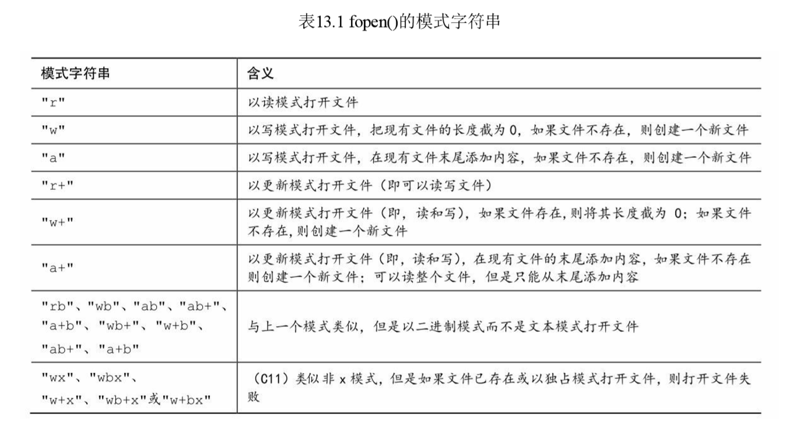
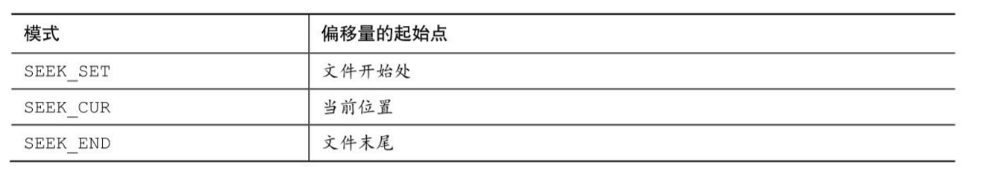
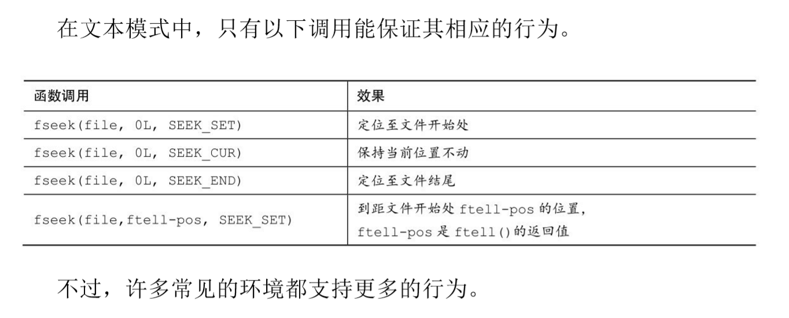
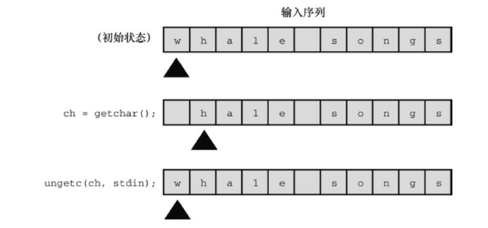
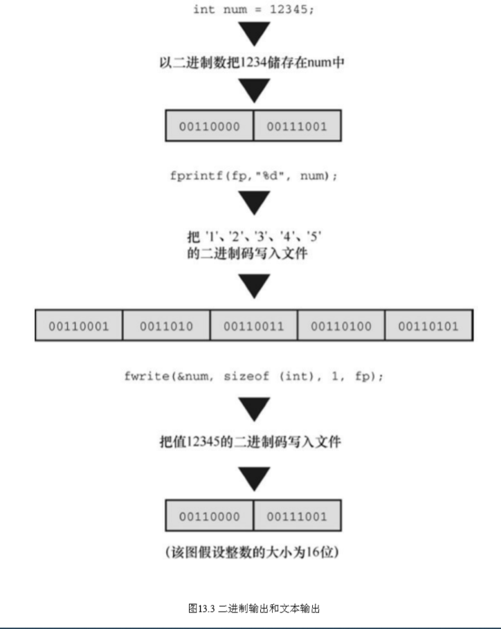

# 文件输入、输出
> 函数：fopen()、getc()、putc()、exit()、fclose()
fprintf()、fscanf()、fgets()、fputs()
rewind()、fseek()、ftell()、fflush()
fgetpos()、fsetpos()、feof()、ferror()
ungetc()、setvbuf()、fread()、fwrite()
如何使用C标准I/O系列的函数处理文件
文件模式和二进制模式、文本和二进制格式、缓冲和无缓冲I/O
使用既可以顺序访问文件也可以随机访问文件的函数


## 与文件进行通信

> C提供了更强大的文件通信方法，可以在程序中打开文件，然后使用特 殊的I/O函数读取文件中的信息或把信息写入文件

**文件是什么**

> 文件（file）通常是在磁盘或固态硬盘上的一段已命名的存储区。


**文本模式和二进制模式**

为了规范文本文件的处理，C 提供两种访问文件的途径：二进制模式和 文本模式。在二进制模式中，程序可以访问文件的每个字节。而在文本模式 中，程序所见的内容和文件的实际内容不同。程序以文本模式读取文件时， 把本地环境表示的行末尾或文件结尾映射为C模式。例如，C程序在旧式 Macintosh中以文本模式读取文件时，把文件中的\r转换成\n；以文本模式写 入文件时，把\n转换成\r。或者，C文本模式程序在MS-DOS平台读取文件 时，把\r\n转换成\n；写入文件时，把\n转换成\r\n。在其他环境中编写的文本 模式程序也会做类似的转换。

除了以文本模式读写文本文件，还能以二进制模式读写文本文件。如果 读写一个旧式MS-DOS文本文件，程序会看到文件中的\r 和\n 字符，不会发 生映射

**I/O的级别**

底层I/O（low-level I/O）使用操作系统提供的 基本I/O服务。标准高级I/O（standard high-level I/O）使用C库的标准包和 stdio.h头文件定义。因为无法保证所有的操作系统都使用相同的底层I/O模型，C标准只支持标准I/O包。有些实现会提供底层库，但是C标准建立了可 移植的I/O模型，我们主要讨论这些I/O。

**标准文件**

C程序会自动打开3个文件，它们被称为标准输入（standard input）、标 准输出（standard output）和标准错误输出（standard error output）。在默认 情况下，标准输入是系统的普通输入设备，通常为键盘；标准输出和标准错 误输出是系统的普通输出设备，通常为显示屏

通常，标准输入为程序提供输入，它是 getchar()和 scanf()使用的文件。 程序通常输出到标准输出，它是putchar()、puts()和printf()使用的文件。

标准错误输出提供了 一个逻辑上不同的地方来发送错误消息。例如，如果使用重定向把输出发送 给文件而不是屏幕，那么发送至标准错误输出的内容仍然会被发送到屏幕上。

----------------------------
## 标准I/O

与底层io相比：

第一，标准 I/O有许多专门的函数简化了处理不同I/O的问题。例如，printf()把不同形式 的数据转换成与终端相适应的字符串输出。第二，输入和输出都是缓冲的。 也就是说，一次转移一大块信息而不是一字节信息（通常至少512字节）。 例如，当程序读取文件时，一块数据被拷贝到缓冲区（一块中介存储区 域）。这种缓冲极大地提高了数据传输速率。程序可以检查缓冲区中的字 节。缓冲在后台处理，所以让人有逐字符访问的错觉（如果使用底层I/O， 要自己完成大部分工作）

实例程序：
```C
#include <stdio.h>
#include <stdlib.h>　　// 提供 exit()的原型
int main(int argc, char *argv [])
{
int ch;　　　　　　// 读取文件时，储存每个字符的地方
FILE *fp;　　 // “文件指针”
unsigned long count = 0;
if (argc != 2)
{
printf("Usage: %s filename\n", argv[0]);
exit(EXIT_FAILURE);
}
if ((fp = fopen(argv[1], "r")) == NULL)
{
printf("Can't open %s\n", argv[1]);
exit(EXIT_FAILURE);
}
while ((ch = getc(fp)) != EOF)
{
putc(ch, stdout);　// 与 putchar(ch); 相同
count++;
}
fclose(fp);
printf("File %s has %lu characters\n", argv[1], count);
return 0;
}

```
**检查命令行参数**

首先，程序查看是否有命令行参数。 如果没有，程序将打印一条消息并退出程序。字符串 argv[0]是该程序的名 称。显式使用 argv[0]而不是程序名，错误消息的描述会随可执行文件名的 改变而自动改变

xit()函数关闭所有打开的文件并结束程序。exit()的参数被传递给一些 操作系统，包括 UNIX、Linux、Windows和MS-DOS，以供其他程序使用。 通常的惯例是：正常结束的程序传递0，异常结束的程序传递非零值。不同 的退出值可用于区分程序失败的不同原因，这也是UNIX和DOS编程的通常 做法。但是，并不是所有的操作系统都能识别相同范围内的返回值。因此， C 标准规定了一个最小的限制范围。尤其是，标准要求0或宏 EXIT_SUCCESS用于表明成功结束程序，宏EXIT_FAILURE用于表明结束程 序失败。这些宏和exit()原型都位于stdlib.h头文件中。
根据ANSI C的规定，在最初调用的main()中使用return与调用exit()的效 果相同。因此，在main()，下面的语句：
return 0;
和下面这条语句的作用相同：
exit(0);
但是要注意，我们说的是“最初的调用”。如果main()在一个递归程序 中，exit()仍然会终止程序，但是return只会把控制权交给上一级递归，直至 最初的一级。然后return结束程序。return和exit()的另一个区别是，即使在其 他函数中（除main()以外）调用exit()也能结束整个程序。


**fopen**

该函数声明 在stdio.h中。它的第1个参数是待打开文件的名称，更确切地说是一个包含该文件名的字符串地址。第 2 个参数是一个字符串，指定待打开文件的模式。



像UNIX和Linux这样只有一种文件类型的系统，带b字母的模式和不带b 字母的模式相同。


新的C11新增了带x字母的写模式，与以前的写模式相比具有更多特 性。第一，如果以传统的一种写模式打开一个现有文件，fopen()会把该文件 的长度截为 0，这样就丢失了该文件的内容。但是使用带 x字母的写模式， 即使fopen()操作失败，原文件的内容也不会被删除。第二，如果环境允许， x模式的独占特性使得其他程序或线程无法访问正在被打开的文件。

警告

如果使用任何一种"w"模式（不带x字母）打开一个现有文件，该文件的 内容会被删除，以便程序在一个空白文件中开始操作。然而，如果使用带x 字母的任何一种模式，将无法打开一个现有文件。

程序成功打开文件后，fopen()将返回文件指针（file pointer），其他I/O函数可以使用这个指针指定该文件。文件指针（该例中是fp）的类型是指向 FILE的指针，FILE是一个定义在stdio.h中的派生类型。文件指针fp并不指向 实际的文件，它指向一个包含文件信息的数据对象，其中包含操作文件的 I/O函数所用的缓冲区信息。因为标准库中的I/O函数使用缓冲区，所以它们 不仅要知道缓冲区的位置，还要知道缓冲区被填充的程度以及操作哪一个文 件。标准I/O函数根据这些信息在必要时决定再次填充或清空缓冲区。fp指 向的数据对象包含了这些信息

**getc和putc**

getc()和putc()函数与getchar()和putchar()函数类似。所不同的是，要告诉 getc()和putc()函数使用哪一个文件。
下面这条语句的意思是“从标准输入中 获取一个字符”：
ch = getchar();

然而，下面这条语句的意思是“从fp指定的文件中获取一个字符”：
ch = getc(fp);

与此类似，下面语句的意思是“把字符ch放入FILE指针fpout指定的文件 中”：

putc(ch, fpout);

在putc()函数的参数列表中，第1个参数是待写入的字符，第2个参数是 文件指针。


**文件结尾**

如果 getc()函数在读取一个字符时发现是文件结尾，它将返 回一个特殊值EOF。所以C程序只有在读到超过文件末尾时才会发现文件的 结尾（一些其他语言用一个特殊的函数在读取之前测试文件结尾，C语言不 同）。

```C
int ch;
FILE * fp;
fp = fopen("wacky.txt", "r");
while (( ch = getc(fp)) != EOF)
{
putchar(ch);　//处理输入
}
```

**fclose**

fclose(fp)函数关闭fp指定的文件，必要时刷新缓冲区。对于较正式的程序，应该检查是否成功关闭文件。如果成功关闭，fclose()函数返回0，否则返回EOF：
```C
if (fclose(fp) != 0)
printf("Error in closing file %s\n", argv[1]);
```
如果磁盘已满、移动硬盘被移除或出现I/O错误，都会导致调用fclose() 函数失败。


**一个简单的文件压缩程序**

下面的程序示例把一个文件中选定的数据拷贝到另一个文件中。该程序 同时打开了两个文件，以"r"模式打开一个，以"w"模式打开另一个。该程序以保留每3个字符中的第1个字符的方式压缩第1个文件的 内容。最后，把压缩后的文本存入第2个文件。第2个文件的名称是第1个文 件名加上.red后缀（此处的red代表reduced）。使用命令行参数，同时打开多 个文件，以及在原文件名后面加上后缀，都是相当有用的技巧。这种压缩方 式有限，但是也有它的用途（很容易把该程序改成用标准 I/O 而不是命令行参数提供文件名）。

```C
#include <stdio.h>
#include <stdlib.h>　　// 提供 exit()的原型
#include <string.h>　　// 提供 strcpy()、strcat()的原型
#define LEN 40
int main(int argc, char *argv [])
{
FILE *in, *out;　 // 声明两个指向 FILE 的指针
int ch;
char name[LEN];　 // 储存输出文件名
int count = 0;
// 检查命令行参数
if (argc < 2)
{
fprintf(stderr, "Usage: %s filename\n", argv[0]);
exit(EXIT_FAILURE);
}
// 设置输入
if ((in = fopen(argv[1], "r")) == NULL)
{
fprintf(stderr, "I couldn't open the file \"%s\"\n",
argv[1]);
exit(EXIT_FAILURE);
}
// 设置输出
strncpy(name, argv[1], LEN - 5);　　// 拷贝文件名
name[LEN - 5] = '\0';
strcat(name, ".red");　　　　　　　 // 在文件名后添加.red
if ((out = fopen(name, "w")) == NULL)
{　　　　　　　　　　// 以写模式打开文件
fprintf(stderr, "Can't create output file.\n");
exit(3);
}
// 拷贝数据
while ((ch = getc(in)) != EOF)
if (count++ % 3 == 0)
putc(ch, out);// 打印3个字符中的第1个字符
// 收尾工作
if (fclose(in) != 0 || fclose(out) != 0)
fprintf(stderr, "Error in closing files\n");
return 0;
}
```

---------------------------

## 文件I/O：fprint、fscanf、fgets、fputs
文 件I/O函数要用FILE指针指定待处理的文件。与 getc()、putc()类似，这些函 数都要求用指向 FILE 的指针（如，stdout）指定一个文件，或者使用fopen() 的返回值。


**fprint和fscanf**

文件I/O函数fprintf()和fscanf()函数的工作方式与printf()和scanf()类似， 区别在于前者需要用第1个参数指定待处理的文件。

```C
#include <stdio.h>
#include <stdlib.h>
#include <string.h>
#define MAX 41
int main(void)
{
FILE *fp;
char words[MAX];
if ((fp = fopen("wordy", "a+")) == NULL)
{
fprintf(stdout, "Can't open \"wordy\" file.\n");
exit(EXIT_FAILURE);
}
puts("Enter words to add to the file; press the #");
puts("key at the beginning of a line to terminate.");
while ((fscanf(stdin, "%40s", words) == 1) && (words[0] != '#'))
fprintf(fp, "%s\n", words);
puts("File contents:");
rewind(fp);　　　 /* 返回到文件开始处 */
while (fscanf(fp, "%s", words) == 1)
puts(words);
puts("Done!");
if (fclose(fp) != 0)
fprintf(stderr, "Error closing file\n");
return 0;
}
```
该程序可以在文件中添加单词。使用"a+"模式，程序可以对文件进行读 写操作。首次使用该程序，它将创建wordy文件，以便把单词存入其中。随 后再使用该程序，可以在wordy文件后面添加单词。虽然"a+"模式只允许在
文件末尾添加内容，但是该模式下可以读整个文件。*rewind()函数让程序回 到文件开始处*，方便while循环打印整个文件的内容。注意，rewind()接受一 个文件指针作为参数。

fprintf()和 fscanf()的工作方式与 printf()和 scanf()类似。但 是，与 putc()不同的是，fprintf()和fscanf()函数都把FILE指针作为第1个参 数，而不是最后一个参数。


**fgets与fputs**

fgets()的第1个参数和gets()函数一样，也是表 示储存输入位置的地址（char * 类型）；第2个参数是一个整数，表示待输入字符串的大小；最后一个参数是文件指针，指定待读取的文件。

fgets(buf, STLEN, fp);

这里，buf是char类型数组的名称，STLEN是字符串的大小，fp是指向 FILE的指针。

fgets()函数读取输入直到第 1 个换行符的后面，或读到文件结尾，或者 读取STLEN-1 个字符（以上面的 fgets()为例）。然后，fgets()在末尾添加一个空字符使之成为一个字符串。字符串的大小是其字符数加上一个空字符。 如果fgets()在读到字符上限之前已读完一整行，它会把表示行结尾的换行符 放在空字符前面。fgets()函数在遇到EOF时将返回NULL值，可以利用这一机 制检查是否到达文件结尾；如果未遇到EOF则之前返回传给它的地址。

fputs()函数接受两个参数：第1个是字符串的地址；第2个是文件指针。 该函数根据传入地址找到的字符串写入指定的文件中。和 puts()函数不同， fputs()在打印字符串时不会在其末尾添加换行符。

----------------
## 随机访问：fseek和ftell

有了 fseek()函数，便可把文件看作是数组，在 fopen()打开的文件中直 接移动到任意字节处。

fseek()有3个参数，返回int类型的值；ftell()函数返回一 个long类型的值，表示文件中的当前位置。

```C
/* reverse.c -- 倒序显示文件的内容 */
#include <stdio.h>
#include <stdlib.h>
#define CNTL_Z '\032'　　 /* DOS文本文件中的文件结尾标记 */
#define SLEN 81
int main(void)
{
char file[SLEN];
char ch;
FILE *fp;
long count, last;
puts("Enter the name of the file to be processed:");
scanf("%80s", file);
if ((fp = fopen(file, "rb")) == NULL)
{　　　　　　　　　　　　　　　　　 /* 只读模式　 */
printf("reverse can't open %s\n", file);
exit(EXIT_FAILURE);
}
fseek(fp, 0L, SEEK_END);　　　　　　　/* 定位到文件末尾 */
last = ftell(fp);
for (count = 1L; count <= last; count++)
{
fseek(fp, -count, SEEK_END);　　　 /* 回退　　　*/
ch = getc(fp);
if (ch != CNTL_Z && ch != '\r') /* MS-DOS 文件 */
putchar(ch);
}
putchar('\n');
fclose(fp);
return 0;
}
```

**fseek和ftell的工作原理**

fseek()的第1个参数是FILE指针，指向待查找的文件，fopen()应该已打 开该文件。

fseek()的第2个参数是偏移量（offset）。该参数表示从起始点开始要移 动的距离（参见表13.3列出的起始点模式）。该参数必须是一个long类型的 值，可以为正（前移）、负（后移）或0（保持不动）。

fseek()的第3个参数是模式，该参数确定起始点。根据ANSI标准，在 stdio.h头文件中规定了几个表示模式的明示常量（manifest constant）



旧的实现可能缺少这些定义，可以使用数值0L、1L、2L分别表示这3种 模式。L后缀表明其值是long类型。

下面是调用fseek()函数的一些示例，fp是一个文件指针：
```C
fseek(fp, 0L, SEEK_SET); // 定位至文件开始处
fseek(fp, 10L, SEEK_SET); // 定位至文件中的第10个字节
fseek(fp, 2L, SEEK_CUR); // 从文件当前位置前移2个字节
fseek(fp, 0L, SEEK_END); // 定位至文件结尾
fseek(fp, -10L, SEEK_END); // 从文件结尾处回退10个字节
```

如果一切正常，fseek()的返回值为0；如果出现错误（如试图移动的距 离超出文件的范围），其返回值为-1。


ftell()函数的返回类型是long，它返回的是当前的位置。ANSI C把它定 义在stdio.h中。在最初实现的UNIX中，ftell()通过返回距文件开始处的字节 数来确定文件的位置。文件的第1个字节到文件开始处的距离是0，以此类 推。ANSI C规定，该定义适用于以二进制模式打开的文件，以文件模式打 开文件的情况不同

**二进制模式和文本模式**

UNIX 只有一种文件格式，所以不需要进行特殊的转换。然而MS-DOS要格外注 意。许多MS-DOS编辑器都用Ctrl+Z标记文本文件的结尾。以文本模式打开 这样的文件时，C 能识别这个作为文件结尾标记的字符。但是，以二进制模 式打开相同的文件时，Ctrl+Z字符被看作是文件中的一个字符，而实际的文 件结尾符在该字符的后面。文件结尾符可能紧跟在Ctrl+Z字符后面，或者文 件中可能用空字符填充，使该文件的大小是256的倍数。

二进制模式和文本模式的另一个不同之处是：MS-DOS用\r\n组合表示文本文件换行。以文本模式打开相同的文件时，C程序把\r\n“看成”\n。但是， 以二进制模式打开该文件时，程序能看见这两个字符。通常，UNIX文本文件既没有Ctrl+Z，也没有 \r，所以这部分代码不会影响大部分UNIX文本文件。

ftell()函数在文本模式和二进制模式中的工作方式不同。许多系统的文 本文件格式与UNIX的模型有很大不同，导致从文件开始处统计的字节数成 为一个毫无意义的值。ANSI C规定，对于文本模式，ftell()返回的值可以作 为fseek()的第2个参数。对于MS-DOS，ftell()返回的值把\r\n当作一个字节计数。


**可移植性**

理论上，fseek()和ftell()应该符合UNIX模型。但是，不同系统存在着差 异，有时确实无法做到与UNIX模型一致。因此，ANSI对这些函数降低了要 求。

在二进制模式中，实现不必支持SEEK_END模式。移植性更高的方法是逐字节读取整个文件直到文件末 尾。C 预处理器的条件编译指令提供了一种系统方法来处理这种情况。



**fgetpos和fsetpos**

fseek()和 ftell()潜在的问题是，它们都把文件大小限制在 long 类型能表 示的范围内。也许 20亿字节看起来相当大，但是随着存储设备的容量迅猛 增长，文件也越来越大。鉴于此，ANSI C新增了两个处理较大文件的新定 位函数：fgetpos()和 fsetpos()。这两个函数不使用 long 类型的值表示位置， 它们使用一种新类型：fpos_t（代表file position type，文件定位类型）。 fpos_t类型不是基本类型，它根据其他类型来定义。fpos_t 类型的变量或数 据对象可以在文件中指定一个位置，它不能是数组类型，除此之外，没有其 他限制。

```C
int fgetpos(FILE * restrict stream, fpos_t * restrict pos);
```
调用该函数时，它把fpos_t类型的值放在pos指向的位置上，该值描述了 文件中的一个位置。如果成功，fgetpos()函数返回0；如果失败，返回非0。


```C
int fsetpos(FILE *stream, const fpos_t *pos);
```

调用该函数时，使用pos指向位置上的fpos_t类型值来设置文件指针指向 该值指定的位置。如果成功，fsetpos()函数返回0；如果失败，则返回非0。 fpos_t类型的值应通过之前调用fgetpos()获得。

-----------------------------------

## 标准I/O机理

使用标准I/O的第1步是调用fopen()打开文件（前面介绍过，C程 序会自动打开3种标准文件）。fopen()函数不仅打开一个文件，还创建了一 个缓冲区（在读写模式下会创建两个缓冲区）以及一个包含文件和缓冲区数 据的结构。另外，fopen()返回一个指向该结构的指针，以便其他函数知道如 何找到该结构。假设把该指针赋给一个指针变量fp，我们说fopen()函数“打 开一个流”。如果以文本模式打开该文件，就获得一个文本流；如果以二进 制模式打开该文件，就获得一个二进制流。

这个结构通常包含一个指定流中当前位置的文件位置指示器。除此之 外，它还包含错误和文件结尾的指示器、一个指向缓冲区开始处的指针、一 个文件标识符和一个计数（统计实际拷贝进缓冲区的字节数）。

通常，使用标准I/O的第2步是调用一个定义在 stdio.h中的输入函数，如fscanf()、getc()或 fgets()。一调用这些函数，文件中 的数据块就被拷贝到缓冲区中。缓冲区的大小因实现而异，一般是512字节 或是它的倍数，如4096或16384（随着计算机硬盘容量越来越大，缓冲区的 大小也越来越大）。最初调用函数，除了填充缓冲区外，还要设置fp所指向 的结构中的值。尤其要设置流中的当前位置和拷贝进缓冲区的字节数。通 常，当前位置从字节0开始。

在初始化结构和缓冲区后，输入函数按要求从缓冲区中读取数据。在它 读取数据时，文件位置指示器被设置为指向刚读取字符的下一个字符。由于 stdio.h系列的所有输入函数都使用相同的缓冲区，所以调用任何一个函数都 将从上一次函数停止调用的位置开始。

当输入函数发现已读完缓冲区中的所有字符时，会请求把下一个缓冲大 小的数据块从文件拷贝到该缓冲区中。以这种方式，输入函数可以读取文件中的所有内容，直到文件结尾。函数在读取缓冲区中的最后一个字符后，把 结尾指示器设置为真。于是，下一次被调用的输入函数将返回EOF

输出函数以类似的方式把数据写入缓冲区。当缓冲区被填满时，数据将 被拷贝至文件中。

------------------------------------

## 其他标准I/O函数

**int ungetc(int c, FILE \*fp)函数**

int ungetc()函数把c指定的字符放回输入流中。如果把一个字符放回输入 流，下次调用标准输入函数时将读取该字符


例如，假设要读 取下一个冒号之前的所有字符，但是不包括冒号本身，可以使用 getchar()或 getc()函数读取字符到冒号，然后使用 ungetc()函数把冒号放回输入流中。 ANSI C标准保证每次只会放回一个字符。如果实现允许把一行中的多个字 符放回输入流，那么下一次输入函数读入的字符顺序与放回时的顺序相反。


**int fflush()函数**

fflush()函数的原型如下：
```C
int fflush(FILE *fp);
```
调用fflush()函数引起输出缓冲区中所有的未写入数据被发送到fp指定的 输出文件。这个过程称为刷新缓冲区。如果 fp是空指针，所有输出缓冲区 都被刷新。在输入流中使用fflush()函数的效果是未定义的。只要最近一次操 作不是输入操作，就可以用该函数来更新流（任何读写模式）。

**int setvbuf()函数**

setvbuf()函数的原型是：
```C
int setvbuf(FILE * restrict fp, char * restrict buf, int mode, size_t size);
```
setvbuf()函数创建了一个供标准I/O函数替换使用的缓冲区。在打开文件 后且未对流进行其他操作之前，调用该函数。指针fp识别待处理的流，buf 指向待使用的存储区。如果buf的值不是NULL，则必须创建一个缓冲区。例 如，声明一个内含1024个字符的数组，并传递该数组的地址。然而，如果把 NULL作为buf的值，该函数会为自己分配一个缓冲区。变量size告诉setvbuf() 数组的大小。mode的选择如 下：_IOFBF表示完全缓冲（在缓冲区满时刷新）；_IOLBF表示行缓冲（在 缓冲区满时或写入一个换行符时）；_IONBF表示无缓冲。如果操作成功， 函数返回0，否则返回一个非零值。

假设一个程序要储存一种数据对象，每个数据对象的大小是3000字节。 可以使用setvbuf()函数创建一个缓冲区，其大小是该数据对象大小的倍数。

**二进制I/O：fread和fwrite**

之前用到的标 准I/O函数都是面向文本的，用于处理字符和字符串。如何要在文件中保存 数值数据？用 fprintf()函数和%f转换说明只是把数值保存为字符串。例如， 下面的代码：

```C
double num = 1./3.;
fprintf(fp,"%f", num);
```

把num储存为8个字符：0.333333。使用%.2f转换说明将其储存为4个字 符：0.33，用%.12f转换说明则将其储存为 14 个字符：0.333333333333。改 变转换说明将改变储存该值所需的空间数量，也会导致储存不同的值。把 num 储存为 0.33 后，读取文件时就无法将其恢复为更高的精度。一般而 言， fprintf()把数值转换为字符数据，这种转换可能会改变值。

为保证数值在储存前后一致，最精确的做法是使用与计算机相同的位组 合来储存。因此，double 类型的值应该储存在一个 double 大小的单元中。 如果以程序所用的表示法把数据储存在文件中，则称以二进制形式储存数 据。不存在从数值形式到字符串的转换过程。对于标准 I/O，fread()和 fwrite 函数用于以二进制形式处理数据

实际上，所有的数据都是以二进制形式储存的，甚至连字符都以字符码 的二进制表示来储存。如果文件中的所有数据都被解释成字符码，则称该文 件包含文本数据。如果部分或所有的数据都被解释成二进制形式的数值数 据，则称该文件包含二进制数据（另外，用数据表示机器语言指令的文件都 是二进制文件）。



二进制和文本的用法很容易混淆。ANSI C和许多操作系统都识别两种 文件格式：二进制和文本。能以二进制数据或文本数据形式存储或读取信息。可以用二进制模式打开文本格式的文件，可以把文本储存在二进制形式 的文件中。可以调用 getc()拷贝包含二进制数据的文件。然而，一般而言， 用二进制模式在二进制格式文件中储存二进制数据。类似地，最常用的还是 以文本格式打开文本文件中的文本数据（通常文字处理器生成的文件都是二 进制文件，因为这些文件中包含了大量非文本信息，如字体和格式等）。

**size_t fwrite()函数**

```C
size_t fwrite(const void * restrict ptr, size_t size, size_t nmemb,FILE * restrict
fp);
```

fwrite()函数把二进制数据写入文件。size_t是根据标准C类型定义的类 型，它是sizeof运算符返回的类型，通常是unsigned int，但是实现可以选择 使用其他类型。指针ptr是待写入数据块的地址。size表示待写入数据块的大 小（以字节为单位），nmemb表示待写入数据块的数量。和其他函数一样， fp指定待写入的文件。例如，要保存一个大小为256字节的数据对象（如数 组），可以这样做：
```C
char buffer[256];
fwrite(buffer, 256, 1, fp);
```
以上调用把一块256字节的数据从buffer写入文件。另举一例，要保存一 个内含10个double类型值的数组，可以这样做：
```C
double earnings[10];
fwrite(earnings, sizeof(double), 10, fp);
```
以上调用把earnings数组中的数据写入文件，数据被分成10块，每块都 是double的大小。

注意fwrite()原型中的const void * restrict ptr声明。fwrite()的一个问题 是，它的第1个参数不是固定的类型。例如，第1个例子中使用buffer，其类 型是指向char的指针；而第2个例子中使用earnings，其类型是指向double的 指针。在ANSI C函数原型中，这些实际参数都被转换成指向void的指针类 型，这种指针可作为一种通用类型指针

fwrite()函数返回成功写入项的数量。正常情况下，该返回值就是 nmemb，但如果出现写入错误，返回值会比nmemb小。


**size_t fread()函数**

```C
size_t fread(void * restrict ptr, size_t size, size_t nmemb,FILE * restrict fp);
```
fread()函数接受的参数和fwrite()函数相同。在fread()函数中，ptr是待读 取文件数据在内存中的地址，fp指定待读取的文件。该函数用于读取被 fwrite()写入文件的数据。例如，要恢复上例中保存的内含10个double类型值 的数组，可以这样做：

```C
double earnings[10];
fread(earnings, sizeof (double), 10, fp);
```
该调用把10个double大小的值拷贝进earnings数组中。

fread()函数返回成功读取项的数量。正常情况下，该返回值就是 nmemb，但如果出现读取错误或读到文件结尾，该返回值就会比nmemb小。

**int feof(FILE \*fp)和int ferror(FILE \*fp函数**


如果标准输入函数返回 EOF，则通常表明函数已到达文件结尾。然 而，出现读取错误时，函数也会返回EOF。feof()和ferror()函数用于区分这两种情况。当上一次输入调用检测到文件结尾时，feof()函数返回一个非零 值，否则返回0。当读或写出现错误，ferror()函数返回一个非零值，否则返 回0。

示例：
```C
/* append.c -- 把文件附加到另一个文件末尾 */
#include <stdio.h>
#include <stdlib.h>
#include <string.h>
#define BUFSIZE 4096
#define SLEN 81
void append(FILE *source, FILE *dest);
char * s_gets(char * st, int n);
int main(void)
{
FILE *fa, *fs;　　// fa 指向目标文件，fs 指向源文件
int files = 0;　　　　 // 附加的文件数量
char file_app[SLEN];　 // 目标文件名
char file_src[SLEN];　 // 源文件名
int ch;
puts("Enter name of destination file:");
s_gets(file_app, SLEN);
if ((fa = fopen(file_app, "a+")) == NULL)
{
fprintf(stderr, "Can't open %s\n", file_app);
exit(EXIT_FAILURE);
}
if (setvbuf(fa, NULL, _IOFBF, BUFSIZE) != 0)
{
fputs("Can't create output buffer\n", stderr);
exit(EXIT_FAILURE);
}
puts("Enter name of first source file (empty line to quit):");
while (s_gets(file_src, SLEN) && file_src[0] != '\0')
{
if (strcmp(file_src, file_app) == 0)
fputs("Can't append file to itself\n", stderr);
else if ((fs = fopen(file_src, "r")) == NULL)
fprintf(stderr, "Can't open %s\n", file_src);
else
{
if (setvbuf(fs, NULL, _IOFBF, BUFSIZE) != 0)
{
fputs("Can't create input buffer\n", stderr);
continue;
}
append(fs, fa);
if (ferror(fs) != 0)
fprintf(stderr, "Error in reading file %s.\n",
file_src);
if (ferror(fa) != 0)
fprintf(stderr, "Error in writing file %s.\n",
file_app);
fclose(fs);
files++;
printf("File %s appended.\n", file_src);
puts("Next file (empty line to quit):");
}
}
printf("Done appending.%d files appended.\n", files);
rewind(fa);
printf("%s contents:\n", file_app);
while ((ch = getc(fa)) != EOF)
putchar(ch);
puts("Done displaying.");
fclose(fa);
return 0;
}
void append(FILE *source, FILE *dest)
{
size_t bytes;
static char temp[BUFSIZE]; // 只分配一次
while ((bytes = fread(temp, sizeof(char), BUFSIZE, source)) > 0)
fwrite(temp, sizeof(char), bytes, dest);
}
char * s_gets(char * st, int n)
{
char * ret_val;
char * find;
ret_val = fgets(st, n, stdin);
if (ret_val)
{
find = strchr(st, '\n');　 // 查找换行符
if (find)　　　　　　　　　 // 如果地址不是NULL，
*find = '\0';　　　　 // 在此处放置一个空字符
else
while (getchar() != '\n')
continue;
}
return ret_val;
}
```

**使用二进制I/O进行随机访问**

```C
/* randbin.c -- 用二进制I/O进行随机访问 */
#include <stdio.h>
#include <stdlib.h>
#define ARSIZE 1000
int main()
{
double numbers[ARSIZE];
double value;
const char * file = "numbers.dat";
int i;
long pos;
FILE *iofile;
// 创建一组 double类型的值
for (i = 0; i < ARSIZE; i++)
numbers[i] = 100.0 * i + 1.0 / (i + 1);
// 尝试打开文件
if ((iofile = fopen(file, "wb")) == NULL)
{
fprintf(stderr, "Could not open %s for output.\n", file);
exit(EXIT_FAILURE);
}
// 以二进制格式把数组写入文件
fwrite(numbers, sizeof(double), ARSIZE, iofile);
fclose(iofile);
if ((iofile = fopen(file, "rb")) == NULL)
{
fprintf(stderr,
"Could not open %s for random access.\n", file);
exit(EXIT_FAILURE);
}
// 从文件中读取选定的内容
printf("Enter an index in the range 0-%d.\n", ARSIZE - 1);
while (scanf("%d", &i) == 1 && i >= 0 && i < ARSIZE)
{
pos = (long) i * sizeof(double);　　// 计算偏移量
fseek(iofile, pos, SEEK_SET);　　　 // 定位到此处
fread(&value, sizeof(double), 1, iofile);
printf("The value there is %f.\n", value);
printf("Next index (out of range to quit):\n");
}
// 完成
fclose(iofile);
puts("Bye!");
return 0;
}
```

首先，该程序创建了一个数组，并在该数组中存放了一些值。然后，程 序以二进制模式创建了一个名为numbers.dat的文件，并使用fwrite()把数组中 的内容拷贝到文件中。内存中数组的所有double类型值的位组合（每个位组 合都是64位）都被拷贝至文件中。不能用文本编辑器读取最后的二进制文 件，因为无法把文件中的值转换成字符串。然而，储存在文件中的每个值都 与储存在内存中的值完全相同，没有损失任何精确度。此外，每个值在文件 中也同样占用64位存储空间，所以可以很容易地计算出每个值的位置。
程序的第 2 部分用于打开待读取的文件，提示用户输入一个值的索引。 程序通过把索引值和 double类型值占用的字节相乘，即可得出文件中的一个 位置。然后，程序调用fseek()定位到该位置，用fread()读取该位置上的数据 值。注意，这里并未使用转换说明。fread()从已定位的位置开始，拷贝8字 节到内存中地址为&value的位置。然后，使用printf()显示value。


