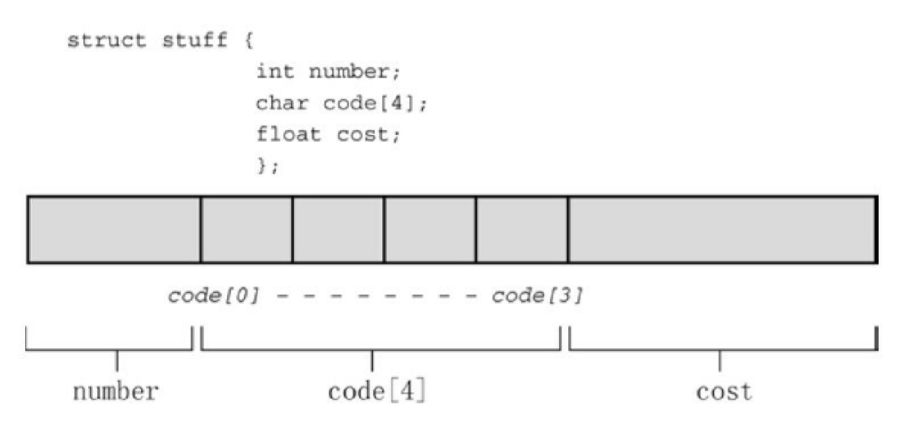
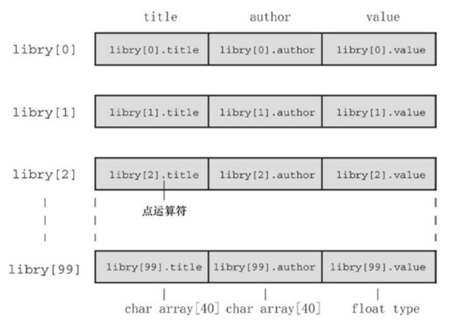
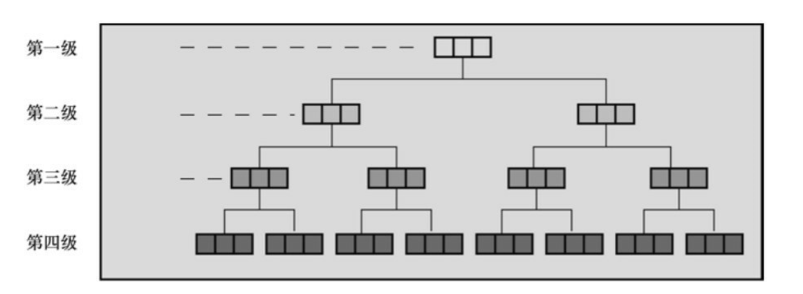
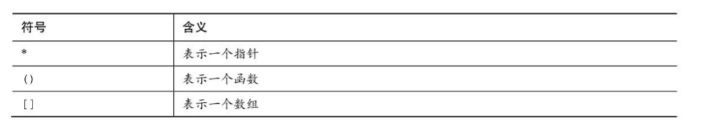
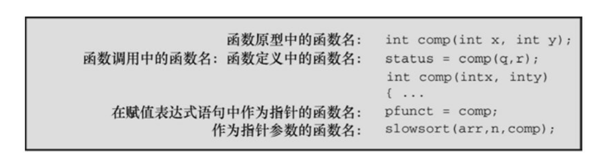

# 结构和其他数据形式
> sturct union typedef
> . ->
> C结构
> 联合和指向函数的指针

## 结构体实例：创建图书目录

```C
//* book.c -- 一本书的图书目录 */
#include <stdio.h>
#include <string.h>
char *s_gets(char *st, int n);
#define MAXTITL 41 /* 书名的最大长度 + 1   */
#define MAXAUTL 31 /* 作者姓名的最大长度 + 1*/
struct book
{ /* 结构模版：标记是 book */
    char title[MAXTITL];
    char author[MAXAUTL];
    float value;
}; /* 结构模版结束        */
int main(void)
{
    struct book library; /* 把 library 声明为一个 book 类型的变量 */
    printf("Please enter the book title.\n");
    s_gets(library.title, MAXTITL); /* 访问title部分*/
    printf("Now enter the author.\n");
    s_gets(library.author, MAXAUTL);
    printf("Now enter the value.\n");
    scanf("%f", &library.value);
    printf("%s by %s: $%.2f\n", library.title,
           library.author, library.value);
    printf("%s: \"%s\" ($%.2f)\n", library.author,
           library.title, library.value);
    printf("Done.\n");
    return 0;
}
char *s_gets(char *st, int n)
{
    char *ret_val;
    char *find;
    ret_val = fgets(st, n, stdin);
    if (ret_val)
    {
        find = strchr(st, '\n'); // 查找换行符
        if (find)                // 如果地址不是 NULL,
            *find = '\0';        // 在此处放置一个空字符
        else
            while (getchar() != '\n')
                continue; //处理输入行中剩余的字符
    }
    return ret_val;
}

```

*结构体的使用：*<br>
为结构建立一个格式或样式；<br>
声明一个适合该样式的变量；<br>
访问结构变量的各个部分。<br>

-------------------------------
## 建立结构声明

结构声明（structure declaration）描述了一个结构的组织布局。声明类 似下面这样：<br>
```C
struct book {
char title[MAXTITL];
char author[MAXAUTL];
float value;
};
```
该 声明并未创建实际的数据对象，只描述了该对象由什么组成。〔有时，我们 把结构声明称为模板，因为它勾勒出结构是如何储存数据的。如果读者知道 C++的模板，此模板非彼模板，C++中的模板更为强大。〕

首先是关键字 struct，它表明跟在其后的是一个结构，后面是一个可 选的标记（该例中是 book），稍后程序中可以使用该标记引用该结构。

```C
struct book library;
```
这把library声明为一个使用book结构布局的结构变量。

在结构声明中，用一对花括号括起来的是结构成员列表。每个成员都用 自己的声明来描述

成员可以是任意一种C的数据类型，甚至可以是其他结构！右花括号 后面的分号是声明所必需的，表示结构布局定义结束。可以把这个声明放在 所有函数的外部，也可以放在一个函数定义的内部。如果把 结构声明置于一个函数的内部，它的标记就只限于该函数内部使用。如果把 结构声明置于函数的外部，那么该声明之后的所有函数都能使用它的标记.

<hr>

## 定义结构变量

程序中创建结构变量的一行是:
```C
struct book library;
```
编译器执行这行代码便创建了一个结构变量library。编译器使用book模 板为该变量分配空间：一个内含MAXTITL个元素的char数组、一个内含 MAXAUTL个元素的char数组和一个float类型的变量。这些存储空间都与一 个名称library结合在一起



在结构变量的声明中，struct book所起的作用相当于一般声明中的int或 float。
如：
```C
struct book doyle, panshin, * ptbook;
```

就计算机而言，下面的声明：<br>
```C
struct book library;
```
是以下声明的简化：
```C
struct book {
char title[MAXTITL];
char author[AXAUTL];
float value;
} library;　 /* 声明的右花括号后跟变量名*/
```

换言之，声明结构的过程和定义结构变量的过程可以组合成一个步骤。 如下所示，组合后的结构声明和结构变量定义不需要使用结构标记：

```C
struct { /* 无结构标记 */
char title[MAXTITL];
char author[MAXAUTL];
float value;
} library;
```

然而，如果打算多次使用结构模板，就要使用带标记的形式；或者，使用typedef。

**初始化结构**

初始化一个结构变量 （ANSI之前，不能用自动变量初始化结构；ANSI之后可以用任意存储类 别）与初始化数组的语法类似：
```C
struct book library = {
"The Pious Pirate and the Devious Damsel",
"Renee Vivotte",
1.95
};
```

简而言之，我们使用在一对花括号中括起来的初始化列表进行初始化， 各初始化项用逗号分隔。因此， title成员可以被初始化为一个字符串，value 成员可以被初始化为一个数字。为了让初始化项与结构中各成员的关联更加 明显，我们让每个成员的初始化项独占一行。这样做只是为了提高代码的可 读性，对编译器而言，只需要用逗号分隔各成员的初始化项即可。


如果初始化静态存储期的变量（如，静态外部链接、 静态内部链接或静态无链接），必须使用常量值。这同样适用于结构。如果 初始化一个静态存储期的结构，初始化列表中的值必须是常量表达式。如果 是自动存储期，初始化列表中的值可以不是常量。


**访问结构成员**

可以使用结构成员运算 符——点（.）访问结构中的成员<br>
例如，library.value即访问library的value 部分。可以像使用任何float类型变量那样使用library.value。与此类似，可以 像使用字符数组那样使用 library.title。

本质上，.title、.author和.value的作用相当于book结构的下标。(.比&的优先级高)

**结构的初始化器**

C99和C11为结构提供了指定初始化（designated initializer）
其语 法与数组的指定初始化器类似。但是，结构的指定初始化器使用点运算符和 成员名（而不是方括号和下标）标识特定的元素。

例如，只初始化book结构的value成员，可以这样做：
```C
struct book surprise = { .value = 10.99};
```

可以按照任意顺序使用指定初始化器：

```C
struct book gift = { .value = 25.99,
.author = "James Broadfool",
.title = "Rue for the Toad"};
```

与数组类似，在指定初始化器后面的普通初始化器，为指定成员后面的 成员提供初始值。另外，对特定成员的最后一次赋值才是它实际获得的值。 

```C
struct book gift= {.value = 18.90,
.author = "Philionna Pestle",
0.25};
```
赋给value的值是0.25，因为它在结构声明中紧跟在author成员之后。新 值0.25取代了之前的18.9。

<hr>

## 结构数组

```C
/* manybook.c -- 包含多本书的图书目录 */
#include <stdio.h>
#include <string.h>
char *s_gets(char *st, int n);
#define MAXTITL 40
#define MAXAUTL 40
#define MAXBKS 100 /* 书籍的最大数量 */
struct book
{ /* 简历 book 模板    */
    char title[MAXTITL];
    char author[MAXAUTL];
    float value;
};
int main(void)
{
    struct book library[MAXBKS]; /* book 类型结构的数组 */
    int count = 0;
    int index;
    printf("Please enter the book title.\n");
    printf("Press [enter] at the start of a line to stop.\n");
    while (count < MAXBKS && s_gets(library[count].title, MAXTITL) != NULL && library[count].title[0] != '\0')
    {
        printf("Now enter the author.\n");
        s_gets(library[count].author, MAXAUTL);
        printf("Now enter the value.\n");
        scanf("%f", &library[count++].value);
        while (getchar() != '\n')
            continue; /* 清理输入行*/
        if (count < MAXBKS)
            printf("Enter the next title.\n");
    }
    if (count > 0)
    {
        printf("Here is the list of your books:\n");
        for (index = 0; index < count; index++)
            printf("%s by %s: $%.2f\n", library[index].title,
                   library[index].author, library[index].value);
    }
    else
        printf("No books? Too bad.\n");
    return 0;
}
char *s_gets(char *st, int n)
{
    char *ret_val;
    char *find;
    ret_val = fgets(st, n, stdin);
    if (ret_val)
    {
        find = strchr(st, '\n'); // 查找换行符
        if (find)                // 如果地址不是 NULL，
            *find = '\0';        // 在此处放置一个空字符
        else
            while (getchar() != '\n')
                continue; // 处理输入行中剩余的字符
    }
    return ret_val;
}
```

manybook.c程序创建了一个内含100个结构变量的数组。由于该数组是 自动存储类别的对象，其中的信息被储存在栈（stack）中。如此大的数组需 要很大一块内存，这可能会导致一些问题。如果在运行时出现错误，可能抱 怨栈大小或栈溢出，你的编译器可能使用了一个默认大小的栈，这个栈对于 该例而言太小。要修正这个问题，可以使用编译器选项设置栈大小为 10000，以容纳这个结构数组；或者可以创建静态或外部数组（这样，编译 器就不会把数组放在栈中）；或者可以减小数组大小为16。

**声明结构数组**

声明结构数组和声明其他类型的数组类似。
```C
struct book library[MAXBKS];
```


**标识结构数组的成员**

```C
library　　　　　　　　// 一个book 结构的数组
library[2]　　　　　　 // 一个数组元素，该元素是book结构
library[2].title　　　 // 一个char数组（library[2]的title成员）
library[2].title[4]　　// 数组中library[2]元素的title 成员的一个字符
```

<hr>

## 嵌套结构

在一个结构中包含另一个结构（即嵌套结构）很方便

```C
// friend.c -- 嵌套结构示例
#include <stdio.h>
#define LEN 20
const char * msgs[5] =
{
"　 Thank you for the wonderful evening, ",
"You certainly prove that a ",
"is a special kind of guy.We must get together",
"over a delicious ",
" and have a few laughs"
};
struct names {　　　　　　　　　// 第1个结构
char first[LEN];
char last[LEN];
};
struct guy {　　　　　　　　　　// 第2个结构
struct names handle;　　　 // 嵌套结构
char favfood[LEN];
char job[LEN];
float income;
};
int main(void)
{
struct guy fellow = {　　　// 初始化一个结构变量
{ "Ewen", "Villard" },
"grilled salmon",
"personality coach",
68112.00
};
printf("Dear %s, \n\n", fellow.handle.first);
printf("%s%s.\n", msgs[0], fellow.handle.first);
printf("%s%s\n", msgs[1], fellow.job);
printf("%s\n", msgs[2]);
printf("%s%s%s", msgs[3], fellow.favfood, msgs[4]);
if (fellow.income > 150000.0)
puts("!!");
else if (fellow.income > 75000.0)
puts("!");
else
puts(".");
printf("\n%40s%s\n", " ", "See you soon,");
printf("%40s%s\n", " ", "Shalala");
return 0;
}
```

<hr>

## 指向结构的指针

至少有 4 个理由 可以解释为何要使用指向结构的指针。<br>

 + 第一，就像指向数组的指针比数组本 身更容易操控（如，排序问题）一样，指向结构的指针通常比结构本身更容 易操控。
 + 第二，在一些早期的C实现中，结构不能作为参数传递给函数，但 是可以传递指向结构的指针。
 + 第三，即使能传递一个结构，传递指针通常更 有效率。
 + 第四，一些用于表示数据的结构中包含指向其他结构的指

```C
/* friends.c -- 使用指向结构的指针 */
#include <stdio.h>
#define LEN 20
struct names {
char first[LEN];
char last[LEN];
};
struct guy {
struct names handle;
char favfood[LEN];
char job[LEN];
float income;
};
int main(void)
{
struct guy fellow[2] = {
{ { "Ewen", "Villard" },
"grilled salmon",
"personality coach",
68112.00
},
{ { "Rodney", "Swillbelly" },
"tripe",
"tabloid editor",
432400.00
}
};
struct guy * him;　　 /* 这是一个指向结构的指针 */
printf("address #1: %p #2: %p\n", &fellow[0], &fellow[1]);
him = &fellow[0];　　 /* 告诉编译器该指针指向何处 */
printf("pointer #1: %p #2: %p\n", him, him + 1);
printf("him->income is $%.2f: (*him).income is $%.2f\n",
him->income, (*him).income);
him++;　　　　　　　 /* 指向下一个结构　　*/
printf("him->favfood is %s:　him->handle.last is %s\n",
him->favfood, him->handle.last);
return 0;
}
```

**声明和初始化结构指针**

声明结构指针：
```C
struct guy *him;
```
首先是关键字 struct，其次是结构标记 guy，然后是一个星号（*），其 后跟着指针名。这个语法和其他指针声明一样。

该声明并未创建一个新的结构，但是指针him现在可以指向任意现有的 guy类型的结构。例如，如果barney是一个guy类型的结构，可以这样写：
```C
him = &bareny;
```

*和数组不同的是，结构名并不是结构的地址，因此要在结构名前面加上 &运算符*

fellow 是一个结构数组，这意味着 fellow[0]是一个结构。所 以，要让 him 指向fellow[0]，可以这样写：
```C
him = &fellow[0];
```

在有些系统中，一个结构的大小可能大于它各成员大小之和。这 是因为系统对数据进行校准的过程中产生了一些“缝隙”。例如，有些系统必 须把每个成员都放在偶数地址上，或4的倍数的地址上。在这种系统中，结 构的内部就存在未使用的“缝隙”。

**使用指针访问成员**

第1种方法也是最常用的方法：<br>使用->运算符。该运算符由一个连接号 （-）后跟一个大于号（>）组成。

```
如果him == &barney，那么him->income 即是 barney.income
如果him == &fellow[0]，那么him->income 即是 fellow[0].income
```

换句话说，->运算符后面的结构指针和.运算符后面的结构名工作方式 相同（不能写成him.incone，因为him不是结构名）。

这里要着重理解him是一个指针，但是hime->income是该指针所指向结 构的一个成员。所以在该例中，him->income是一个float类型的变量。


第2种方法是<br>以这样的顺序指定结构成员的值：如果him == &fellow[0]，那么*him == fellow[0]，因为&和*是一对互逆运算符。因此， 可以做以下替代：
```
fellow[0].income == (*him).income
```
必须要使用圆括号，因为.运算符比*运算符的优先级高。

总之，如果him是指向guy类型结构barney的指针，下面的关系恒成立
```
barney.income == (*him).income == him->income // 假设 him == &barney
```

<hr>

## 向函数传递结构的信息

程序员可以选择是传递结构本身，还是传递指向结构的指针。如果你只关心 结构中的某一部分，也可以把结构的成员作为参数。

**传递结构成员**

只要结构成员是一个具有单个值的数据类型（即，int及其相关类型、 char、float、double或指针），便可把它作为参数传递给接受该特定类型的 函数。

函数既不知道也不关心实际 的参数是否是结构的成员，它只要求传入的数据是要求的类型

**传递结构的地址**

```C
/* funds2.c -- 传递指向结构的指针 */
#include <stdio.h>
#define FUNDLEN 50
struct funds {
char　　　bank[FUNDLEN];
double　　bankfund;
char　　　save[FUNDLEN];
double　　savefund;
};
double sum(const struct funds *); /* 参数是一个指针 */
int main(void)
{
struct funds stan = {
"Garlic-Melon Bank",
4032.27,
"Lucky's Savings and Loan",
8543.94
};
printf("Stan has a total of $%.2f.\n", sum(&stan));
return 0;
}
double sum(const struct funds * money)
{
return(money->bankfund + money->savefund);
}
```

sum()函数使用指向funds结构的指针（money）作为它的参数。把地址 &stan传递给该函数，使得指针money指向结构stan。然后通过->运算符获取 stan.bankfund和stan.savefund的值。由于该函数不能改变指针所指向值的内 容，所以把money声明为一个指向const的指针。


**传递结构**

```C
#include <stdio.h>
#define FUNDLEN 50
struct funds {
char　 bank[FUNDLEN];
double bankfund;
char　 save[FUNDLEN];
double savefund;
};
double sum(struct funds moolah); /* 参数是一个结构 */
int main(void)
{
struct funds stan = {
"Garlic-Melon Bank",
4032.27,
"Lucky's Savings and Loan",
8543.94
};
printf("Stan has a total of $%.2f.\n", sum(stan));
return 0;
}
double sum(struct funds moolah)
{
return(moolah.bankfund + moolah.savefund);
}
```

调用sum()时，编译器根据funds模板创建 了一个名为moolah的自动结构变量。然后，该结构的各成员被初始化为 stan 结构变量相应成员的值的副本。因此，程序使用原来结构的副本进行计算

**其他结构的特性**

现在的C允许把一个结构赋值给另一个结构，但是数组不能这样做。也 就是说，如果n_data和o_data都是相同类型的结构，可以这样做：

o_data = n_data; // 把一个结构赋值给另一个结构

这条语句把n_data的每个成员的值都赋给o_data的相应成员。即使成员 是数组，也能完成赋值。另外，还可以把一个结构初始化为相同类型的另一 个结构：

struct names right_field = {"Ruthie", "George"};<br>
struct names captain = right_field; // 把一个结构初始化为另一个结构

现在的C（包括ANSI C），*函数不仅能把结构本身作为参数传递，还能 把结构作为返回值返回*。把结构作为函数参数可以把结构的信息传送给函 数；把结构作为返回值的函数能把结构的信息从被调函数传回主调函数。结 构指针也允许这种双向通信，因此可以选择任一种方法来解决编程问题。

```C
#include <stdio.h>
#include <string.h>
#define NLEN 30
struct namect {
char fname[NLEN];
char lname[NLEN];
int letters;
};
struct namect getinfo(void);
struct namect makeinfo(struct namect);
void showinfo(struct namect);
char * s_gets(char * st, int n);
int main(void)
{
struct namect person;
person = getinfo();
person = makeinfo(person);
showinfo(person);
return 0;
}
struct namect getinfo(void)
{
struct namect temp;
printf("Please enter your first name.\n");
s_gets(temp.fname, NLEN);
printf("Please enter your last name.\n");
s_gets(temp.lname, NLEN);
return temp;
}
struct namect makeinfo(struct namect info)
{
info.letters = strlen(info.fname) + strlen(info.lname);
return info;
}
void showinfo(struct namect info)
{
printf("%s %s, your name contains %d letters.\n",
info.fname, info.lname, info.letters);
}
char * s_gets(char * st, int n)
{
char * ret_val;
char * find;
ret_val = fgets(st, n, stdin);
if (ret_val)
{
find = strchr(st, '\n');　 // 查找换行符
if (find)　　　　　　　　　 // 如果地址不是 NULL，
*find = '\0';　　　　 // 在此处放置一个空字符
else
while (getchar() != '\n')
continue;　　　　　// 处理输入行的剩余部分
}
return ret_val;
}
```
第一， 为了传递结构本身，函数的参数必须是person，而不是&person。那么，相 应的形式参数应声明为struct namect，而不是指向该类型的指针。第二，可 以通过返回一个结构，把结构的信息返回给main()

**结构和结构指针的选择**

把指针作为参数有两个优点：<br>无论是以前还是现在的C实现都能使用这种方法，而且执行起来很快，只需要传递一个地址。缺点是无法保护数据。 被调函数中的某些操作可能会意外影响原来结构中的数据。不过，ANSI C 新增的const限定符解决了这个问题。

把结构作为参数传递的优点是，函数处理的是原始数据的副本，这保护 了原始数据。另外，代码风格也更清楚。

传递结构的两个缺点是：<br>较老版本的实现可能无法处理这样的代码，而 且传递结构浪费时间和存储空间。尤其是把大型结构传递给函数，而它只使 用结构中的一两个成员时特别浪费。这种情况下传递指针或只传递函数所需 的成员更合理。

**结构中的字符数组和字符指针**

```C
#define LEN 20
struct names {
char first[LEN];
char last[LEN];
};
//其中的结构声明是否可以这样写：
struct pnames {
char * first;
char * last;
};
```

考虑下面的 代码：
```C
struct names veep = {"Talia", "Summers"};
struct pnames treas = {"Brad", "Fallingjaw"};
printf("%s and %s\n", veep.first, treas.first);
```
对于struct names类型的结构变量veep，以上字符串都储存在结构内部， 结构总共要分配40字节储存姓名。<br>然而，对于struct pnames类型的结构变量 treas，以上字符串储存在编译器储存常量的地方。结构本身只储存了两个地 址，在我们的系统中共占16字节。尤其是，struct pnames结构不用为字符串 分配任何存储空间。它使用的是储存在别处的字符串（如，字符串常量或数 组中的字符串）。<br>简而言之，在pnames结构变量中的指针应该只用来在程序中管理那些已分配和在别处分配的字符串。

考虑下面的代码：
```C
struct names accountant;
struct pnames attorney;
puts("Enter the last name of your accountant:");
scanf("%s", accountant.last);
puts("Enter the last name of your attorney:");
scanf("%s", attorney.last);　　/* 这里有一个潜在的危险 */
```
就语法而言，这段代码没问题。但是，用户的输入储存到哪里去了？对 于会计师（accountant），他的名储存在accountant结构变量的last成员中，该 结构中有一个储存字符串的数组。对于律师（attorney），scanf()把字符串放 到attorney.last表示的地址上。由于这是未经初始化的变量，地址可以是任何 值，因此程序可以把名放在任何地方。如果走运的话，程序不会出问题，至 少暂时不会出问题，否则这一操作会导致程序崩溃。实际上，如果程序能正 常运行并不是好事，因为这意味着一个未被觉察的危险潜伏在程序中。

因此，如果要用结构储存字符串，用字符数组作为成员比较简单。用指 向 char 的指针也行，但是误用会导致严重的问题。


**结构、指针和malloc**

如果使用malloc()分配内存并使用指针储存该地址，那么在结构中使用 指针处理字符串就比较合理。这种方法的优点是，可以请求malloc()为字符串分配合适的存储空间。

**复合字面量和结构**

C99 的复合字面量特性可用于结构和数组。如果只需要一个临时结构 值，复合字面量很好用。例如，可以使用复合字面量创建一个数组作为函数 的参数或赋给另一个结构。语法是把类型名放在圆括号中，后面紧跟一个用 花括号括起来的初始化列表。例如，下面是struct book类型的复合字面量：
```C
(struct book) {"The Idiot", "Fyodor Dostoyevsky", 6.99}
```

复合字面量作为实际参数：
```C
truct rect {double x; double y;};
double rect_area(struct rect r){return r.x * r.y;}
...
double area;
area = rect_area( (struct rect) {10.5, 20.0});
```

如果函数接受一个地址，可以传递复合字面量的地址：
```C
struct rect {double x; double y;};
double rect_areap(struct rect * rp){return rp->x * rp->y;}
...
double area;
area = rect_areap( &(struct rect) {10.5, 20.0});
```

复合字面量在所有函数的外部，具有静态存储期；如果复合字面量在块中，则具有自动存储期。复合字面量和普通初始化列表的语法规则相同。这 意味着，可以在复合字面量中使用指定初始化器。

**伸缩型数组成员**

C99新增了一个特性：伸缩型数组成员（flexible array member），利用 这项特性声明的结构，其最后一个数组成员具有一些特性。

第1个特性是， 该数组不会立即存在。<br>
第2个特性是，使用这个伸缩型数组成员可以编写合 适的代码，就好像它确实存在并具有所需数目的元素一样

首先，声明一个伸缩型数组成员有如下规则：<br>
+ 伸缩型数组成员必须是结构的最后一个成员；
+ 结构中必须至少有一个成员；
+ 伸缩数组的声明类似于普通数组，只是它的方括号中是空的。

```C
struct flex
{
int count;
double average;
double scores[];　// 伸缩型数组成员
};
```

声明一个struct flex类型的结构变量时，不能用scores做任何事，因为没 有给这个数组预留存储空间。实际上，C99的意图并不是让你声明struct flex 类型的变量，而是希望你声明一个指向struct flex类型的指针，然后用 malloc()来分配足够的空间，以储存struct flex类型结构的常规内容和伸缩型 数组成员所需的额外空间。
```C
struct flex * pf; // 声明一个指针
// 请求为一个结构和一个数组分配存储空间
pf = malloc(sizeof(struct flex) + 5 * sizeof(double));
```
现在有足够的存储空间储存count、average和一个内含5个double类型值 的数组。可以用指针pf访问这些成员：
```C
pf->count = 5;　　　　 // 设置 count 成员
pf->scores[2] = 18.5;　// 访问数组成员的一个元素
```

程序清单14.13进一步扩展了这个例子，让伸缩型数组成员在第1种情况 下表示5个值，在第2种情况下代表9个值。该程序也演示了如何编写一个函 数处理带伸缩型数组元素的结构。

```C
程序清单14.12 flexmemb.c程序
// flexmemb.c -- 伸缩型数组成员（C99新增特性）
#include <stdio.h>
#include <stdlib.h>
struct flex
{
size_t count;
double average;
double scores []; // 伸缩型数组成员
};
void showFlex(const struct flex * p);
int main(void)
{
struct flex * pf1, *pf2;
int n = 5;
int i;
int tot = 0;
// 为结构和数组分配存储空间
pf1 = malloc(sizeof(struct flex) + n * sizeof(double));
pf1->count = n;
for (i = 0; i < n; i++)
{
pf1->scores[i] = 20.0 - i;
tot += pf1->scores[i];
}
pf1->average = tot / n;
showFlex(pf1);
n = 9;
tot = 0;
pf2 = malloc(sizeof(struct flex) + n * sizeof(double));
pf2->count = n;
for (i = 0; i < n; i++)
{
pf2->scores[i] = 20.0 - i / 2.0;
tot += pf2->scores[i];
}
pf2->average = tot / n;
showFlex(pf2);
free(pf1);
free(pf2);
return 0;
}
void showFlex(const struct flex * p)
{
int i;
printf("Scores : ");
for (i = 0; i < p->count; i++)
printf("%g ", p->scores[i]);
printf("\nAverage: %g\n", p->average);
}
```
带伸缩型数组成员的结构确实有一些特殊的处理要求。

第一，不能用结 构进行赋值或拷贝：
```C
struct flex * pf1, *pf2;　 // *pf1 和*pf2 都是结构
...
*pf2 = *pf1;　　　　　　　// 不要这样做
```
这样做只能拷贝除伸缩型数组成员以外的其他成员。确实要进行拷贝， 应使用memcpy()函数

第二，不要以按值方式把这种结构传递给结构。原因相同，按值传递一个参数与赋值类似。要把结构的地址传递给函数。

第三，不要使用带伸缩型数组成员的结构作为数组成员或另一个结构的 成员。

这种类似于在结构中最后一个成员是伸缩型数组的情况，称为struct hack。除了伸缩型数组成员在声明时用空的方括号外，struct hack特指大小为 0的数组。然而，struct hack是针对特殊编译器（GCC）的，不属于C标准。 这种伸缩型数组成员方法是标准认可的编程技巧。


**匿名结构（C11）**

匿名结构是一个没有名称的结构成员。

在C11中，可以用嵌套的匿名成员结构定义person：
```C
struct person
{
int id;
struct {char first[20]; char last[20];}; // 匿名结构
};
//初始化ted的方式：
struct person ted = {8483, {"Ted", "Grass"}};
```
在访问ted时简化了步骤，只需把first看作是person的成员那样使 用它：
```C
puts(ted.first);
```

**使用结构数组的函数**

假设一个函数要处理一个结构数组。由于数组名就是该数组的地址，所 以可以把它传递给函数。另外，该函数还需访问结构模板。
```C
/* funds4.c -- 把结构数组传递给函数 */
#include <stdio.h>
#define FUNDLEN 50
#define N 2
struct funds {
char　　　bank[FUNDLEN];
double　　bankfund;
char save[FUNDLEN];
double　　savefund;
};
double sum(const struct funds money [], int n);
int main(void)
{
struct funds jones[N] = {
{
"Garlic-Melon Bank",
4032.27,
"Lucky's Savings and Loan",
8543.94
},
{
"Honest Jack's Bank",
3620.88,
"Party Time Savings",
3802.91
}
};
printf("The Joneses have a total of $%.2f.\n",sum(jones, N));
return 0;
}
double sum(const struct funds money [], int n)
{
double total;
int i;
for (i = 0, total = 0; i < n; i++)
total += money[i].bankfund + money[i].savefund;
return(total);
}
```

可以把数组名作为数组中第1个结构的地址传递给函数。

然后可以用数组表示法访问数组中的其他结构。注意下面的函数调用与 使用数组名效果相同：

sum(&jones[0], N)

<hr>

## 把结构内容保存到文件中

由于结构可以储存不同类型的信息，所以它是构建数据库的重要工具。 

储存在一个结构中的整套信息被称为记录（record），单独的 项被称为字段（field）。

好的方案是使用fread()和fwrite()函数读写结构大小的单元 
```C
fwrite(&primer, sizeof(struct book), 1, pbooks);
```
定位到 primer 结构变量开始的位置，并把结构中所有的字节都拷贝到 与 pbooks 相关的文件中。sizeof(struct book)告诉函数待拷贝的一块数据的大 小，1 表明一次拷贝一块数据。带相同参数的fread()函数从文件中拷贝一块 结构大小的数据到&primer指向的位置。简而言之，这两个函数一次读写整 个记录，而不是一个字段。


以二进制表示法储存数据的缺点是，不同的系统可能使用不同的二进制 表示法，所以数据文件可能不具可移植性。甚至同一个系统，不同编译器设 置也可能导致不同的二进制布局。

**保存结构的程序实例**

把书名保存在book.dat文件中。如果该文件 已存在，程序将显示它当前的内容，然后允许在文件中添加内容
```C
/* booksave.c -- 在文件中保存结构中的内容 */
#include <stdio.h>
#include <stdlib.h>
#include <string.h>
#define MAXTITL　40
#define MAXAUTL　40
#define MAXBKS　10　　　　　/* 最大书籍数量 */
char * s_gets(char * st, int n);
struct book {　　　　　　　/* 建立 book 模板 */
char title[MAXTITL];
char author[MAXAUTL];
float value;
};
int main(void)
{
struct book library[MAXBKS]; /* 结构数组 */
int count = 0;
int index, filecount;
FILE * pbooks;
int size = sizeof(struct book);
if ((pbooks = fopen("book.dat", "a+b")) == NULL)
{
fputs("Can't open book.dat file\n", stderr);
exit(1);
}
rewind(pbooks);　　　　　 /* 定位到文件开始 */
while (count < MAXBKS &&　fread(&library[count], size,
1, pbooks) == 1)
{
if (count == 0)
puts("Current contents of book.dat:");
printf("%s by %s: $%.2f\n", library[count].title,
library[count].author, library[count].value);
count++;
}
filecount = count;
if (count == MAXBKS)
{
fputs("The book.dat file is full.", stderr);
exit(2);
}
puts("Please add new book titles.");
puts("Press [enter] at the start of a line to stop.");
while (count < MAXBKS && s_gets(library[count].title, MAXTITL) != NULL
&& library[count].title[0] != '\0')
{
puts("Now enter the author.");
s_gets(library[count].author, MAXAUTL);
puts("Now enter the value.");
scanf("%f", &library[count++].value);
while (getchar() != '\n')
continue;　　　　 /* 清理输入行 */
if (count < MAXBKS)
puts("Enter the next title.");
}
if (count > 0)
{
puts("Here is the list of your books:");
for (index = 0; index < count; index++)
printf("%s by %s: $%.2f\n", library[index].title,
library[index].author, library[index].value);
fwrite(&library[filecount], size, count - filecount,
pbooks);
}
else
puts("No books? Too bad.\n");
puts("Bye.\n");
fclose(pbooks);
return 0;
}
char * s_gets(char * st, int n)
{
char * ret_val;
char * find;
ret_val = fgets(st, n, stdin);
if (ret_val)
{
find = strchr(st, '\n');　 // 查找换行符
if (find)　　　　　　　// 如果地址不是 NULL，
*find = '\0';　　　　 // 在此处放置一个空字符
else
while (getchar() != '\n')
continue;　　　// 清理输入行
}
return ret_val;
}
```

首先，以"a+b"模式打开文件。a+部分允许程序读取整个文件并在文件 的末尾添加内容。b 是 ANSI的一种标识方法，表明程序将使用二进制文件 格式。对于不接受b模式的UNIX系统，可以省略b，因为UNIX只有一种文件 形式。对于早期的ANSI实现，要找出和b等价的表示法。

我们选择二进制模式是因为fread()和fwrite()函数要使用二进制文件。虽 然结构中有些内容是文本，但是value成员不是文本。如果使用文本编辑器 查看book.dat，该结构本文部分的内容显示正常，但是数值部分的内容不可 读，甚至会导致文本编辑器出现乱码。

rewrite()函数确保文件指针位于文件开始处，为读文件做好准备。

第1个while循环每次把一个结构读到结构数组中，当数组已满或读完文 件时停止。变量filecount统计已读结构的数量。

第2个while按下循环提示用户进行输入，并接受用户的输入。当数组已满或用户在一行的开始处按下Enter键时，循环结束.

注意，该循环开始时count变量的值是第1个循环结束后的值。该循环把新输 入项添加到数组的末尾。


然后for循环打印文件和用户输入的数据。因为该文件是以附加模式打 开，所以新写入的内容添加到文件现有内容的末尾。

我们本可以用一个循环在文件末尾一次添加一个结构，但还是决定用 fwrite()一次写入一块数据。对表达式count - filecount求值得新添加的书籍数 量，然后调用fwrite()把结构大小的块写入文件。由于表达式 &library[filecount]是数组中第1个新结构的地址，所以拷贝就从这里开始。

<hr>

## 链式结构

通常，每个结构都包含一两个数据项和一两个指向其他同类型结构的指针。这 些指针把一个结构和另一个结构链接起来，并提供一种路径能遍历整个彼此 链接的结构。

一个二叉树结构，每个单独的结构（或节 点）都和它下面的两个结构（或节点）相连：



<hr>

## 联合简介

联合（union）是一种数据类型，它能在同一个内存空间中储存不同的 数据类型（不是同时储存）。其典型的用法是，设计一种表以储存既无规 律、事先也不知道顺序的混合类型。使用联合类型的数组，其中的联合都大 小相等，每个联合可以储存各种数据类型。


创建联合和创建结构的方式相同，需要一个联合模板和联合变量。可以 用一个步骤定义联合，也可以用联合标记分两步定义。下面是一个带标记的 联合模板：

```C
union hold {
int digit;
double bigfl;
char letter;
};
```
下面定义了3个与hold类型相关的变量:
```C
union hold fit;　　　　// hold类型的联合变量
union hold save[10];　 // 内含10个联合变量的数组
union hold * pu;　　　// 指向hold类型联合变量的指针
```
第1个声明创建了一个单独的联合变量fit。编译器分配足够的空间以便 它能储存联合声明中占用最大字节的类型。在本例中，占用空间最大的是double类型的数据。在我们的系统中，double类型占64位，即8字节。第2个 声明创建了一个数组save，内含10个元素，每个元素都是8字节。第3个声明 创建了一个指针，该指针变量储存hold类型联合变量的地址。

可以初始化联合。需要注意的是，联合只能储存一个值，这与结构不 同。有 3 种初始化的方法：把一个联合初始化为另一个同类型的联合；初始 化联合的第1个元素；或者根据C99标准，使用指定初始化器：

```C
union hold valA;
valA.letter = 'R';
union hold valB = valA;　　　　　　 // 用另一个联合来初始化
union hold valC = {88};　　　　　　 // 初始化联合的digit 成员
union hold valD = {.bigfl = 118.2}; // 指定初始化器
```

**使用联合**

```C
fit.digit = 23; //把 23 储存在 fit，占2字节
fit.bigfl = 2.0; // 清除23，储存 2.0，占8字节
fit.letter = 'h'; // 清除2.0，储存h，占1字节
```
点运算符表示正在使用哪种数据类型。在联合中，一次只储存一个值。 即使有足够的空间，也不能同时储存一个char类型值和一个int类型值。编写 代码时要注意当前储存在联合中的数据类型。

和用指针访问结构使用->运算符一样，用指针访问联合时也要使用->运 算符：
```C
pu = &fit;
x = pu->digit; // 相当于 x = fit.digit
```
```C
//不要像下面的语句序列这样：
fit.letter = 'A';
flnum = 3.02*fit.bigfl; // 错误
```
以上语句序列是错误的，因为储存在 fit 中的是 char 类型，但是下一行 却假定 fit 中的内容是double类型。

不过，用一个成员把值储存在一个联合中，然后用另一个成员查看内 容，这种做法有时很有用。

联合的另一种用法是，在结构中储存与其成员有从属关系的信息。

例如，假设用一个结构表示一辆汽车。如果汽车属于驾驶者，就要用一个结构 成员来描述这个所有者。如果汽车被租赁，那么需要一个成员来描述其租赁 公司。可以用下面的代码来完成：
```C
struct owner {
char socsecurity[12];
...
};
struct leasecompany {
char name[40];
char headquarters[40];
...
};
union data {
struct owner owncar;
struct leasecompany leasecar;
};
struct car_data {
char make[15];
int status; /* 私有为0，租赁为1 */
union data ownerinfo;
...
};
```
假设flits是car_data类型的结构变量，如果flits.status为0，程序将使用 flits.ownerinfo.owncar.socsecurity，如果flits.status为1，程序则使用 flits.ownerinfo.leasecar.name。

**匿名联合（C11）**

匿名联合和匿名结构的工作原理相同，即匿名联合是一个结构或联合的 无名联合成员。例如，我们重新定义car_data结构如下：
```C
struct owner {
char socsecurity[12];
...
};
struct leasecompany {
char name[40];
char headquarters[40];
...
};
struct car_data {
char make[15];
int status; /* 私有为0，租赁为1 */
union {
struct owner owncar;
struct leasecompany leasecar;
};

};
```

<hr>

## 枚举类型

可以用枚举类型（enumerated type）声明符号名称来表示整型常量。使 用enum关键字，可以创建一个新“类型”并指定它可具有的值（实际上，enum 常量是int类型，因此，只要能使用int类型的地方就可以使用枚举类型）。枚 举类型的目的是提高程序的可读性。它的语法与结构的语法相同。

```C
enum spectrum {red, orange, yellow, green, blue, violet};
enum spectrum color;
```

第1个声明创建了spetrum作为标记名，允许把enum spetrum作为一个类型 名使用。第2个声明使color作为该类型的变量。第1个声明中花括号内的标 识符枚举了spectrum变量可能有的值。因此， color 可能的值是 red、 orange、yellow 等。这些符号常量被称为枚举符（enumerator）。然后，便可这样用：

```C
int c;
color = blue;
if (color == yellow)
...;
for (color = red; color <= violet; color++)
...;
```

虽然枚举符（如red和blue）是int类型，但是枚举变量可以是任意整数类 型，前提是该整数类型可以储存枚举常量。例如，spectrum的枚举符范围是 0～5，所以编译器可以用unsigned char来表示color变量。

顺带一提，C枚举的一些特性并不适用于C++。例如，C允许枚举变量 使用++运算符，但是C++标准不允许。所以，如果编写的代码将来会并入 C++程序，那么必须把上面例子中的color声明为int类型，才能C和C++都兼 容。


**enum常量**

blue和red到底是什么？从技术层面看，它们是int类型的常量。例如，假 定有前面的枚举声明，可以这样写：
```C
printf("red = %d, orange = %d\n", red, orange);
```
其输出如下：<br>
red = 0, orange = 1

red成为一个有名称的常量，代表整数0。类似地，其他标识符都是有名 称的常量，分别代表1～5。只要是能使用整型常量的地方就可以使用枚举常 量。例如，在声明数组时，可以用枚举常量表示数组的大小；在switch语句 中，可以把枚举常量作为标签。

**默认值**

默认情况下，枚举列表中的常量都被赋予0、1、2等。因此，下面的声 明中nina的值是3：

enum kids {nippy, slats, skippy, nina, liz};

**赋值**

在枚举声明中，可以为枚举常量指定整数值：
```C
enum levels {low = 100, medium = 500, high = 2000};
```
如果只给一个枚举常量赋值，没有对后面的枚举常量赋值，那么后面的常量会被赋予后续的值。例如，假设有如下的声明：
```C
enum feline {cat, lynx = 10, puma, tiger};
```
那么，cat的值是0（默认），lynx、puma和tiger的值分别是10、11、12。

**enum的用法**

枚举类型的目的是为了提高程序的可读性和可维护性。

因为枚举类型是整数类型，所以可以在表达式中以使用整数变量的方式 使用enum变量。它们用在case语句中很方便。

注意，枚举类型只能在内部使用。如 果要输入color中orange的值，只能输入1，而不是单词orange。或者，让程序 先读入字符串"orange"，再将其转换为orange代表的值。

```C
/* enum.c -- 使用枚举类型的值 */
#include <stdio.h>
#include <string.h>　　// 提供 strcmp()、strchr()函数的原型
#include <stdbool.h>　 // C99 特性
char * s_gets(char * st, int n);
enum spectrum { red, orange, yellow, green, blue, violet };
const char * colors [] = { "red", "orange", "yellow",
"green", "blue", "violet" };
#define LEN 30
int main(void)
{
char choice[LEN];
enum spectrum color;
bool color_is_found = false;
puts("Enter a color (empty line to quit):");
while (s_gets(choice, LEN) != NULL && choice[0] != '\0')
{
for (color = red; color <= violet; color++)
{
if (strcmp(choice, colors[color]) == 0)
{
color_is_found = true;
break;
}
}
if (color_is_found)
switch (color)
{
case red: puts("Roses are red.");
break;
case orange: puts("Poppies are orange.");
break;
case yellow: puts("Sunflowers are yellow.");
break;
case green: puts("Grass is green.");
break;
case blue: puts("Bluebells are blue.");
break;
case violet: puts("Violets are violet.");
break;
}
else
printf("I don't know about the color %s.\n", choice);
color_is_found = false;
puts("Next color, please (empty line to quit):");
}
puts("Goodbye!");
return 0;
}
char * s_gets(char * st, int n)
{
char * ret_val;
char * find;
ret_val = fgets(st, n, stdin);
if (ret_val)
{
find = strchr(st, '\n');　 // 查找换行符
if (find)　　　　　　　　　 // 如果地址不是 NULL，
*find = '\0';　　　　 // 在此处放置一个空字符
else
while (getchar() != '\n')
continue;　　　　 // 清理输入行
}
return ret_val;
}
```

当输入的字符串与color数组的成员指向的字符串相匹配时，for循环结 束。如果循环找到匹配的颜色，程序就用枚举变量的值与作为case标签的枚 举常量匹配

**共享名称空间**

C语言使用名称空间（namespace）标识程序中的各部分，即通过名称来 识别。作用域是名称空间概念的一部分：两个不同作用域的同名变量不冲 突；两个相同作用域的同名变量冲突。<br>
名称空间是分类别的。在特定作用域 中的结构标记、联合标记和枚举标记都共享相同的名称空间，该名称空间与 普通变量使用的空间不同。这意味着在相同作用域中变量和标记的名称可以 相同，不会引起冲突，但是不能在相同作用域中声明两个同名标签或同名变量。
<br>例如，在C中，下面的代码不会产生冲突：

```C
struct rect { double x; double y; };
int rect; // 在C中不会产生冲突
```

尽管如此，以两种不同的方式使用相同的标识符会造成混乱。另外， C++不允许这样做，因为它把标记名和变量名放在相同的名称空间中。

<hr>

## typedef简介

typedef工具是一个高级数据特性，利用typedef可以为某一类型自定义名 称。这方面与#define类似，但是两者有3处不同：

+ 与#define不同，typedef创建的符号名只受限于类型，不能用于值。
+ typedef由编译器解释，不是预处理器。
+ 在其受限范围内，typedef比#define更灵活。

**工作原理**

假设要用BYTE表示1字节的数组。只需像 定义个char类型变量一样定义BYTE，然后在定义前面加上关键字typedef即可：
```C
typedef unsigned char BYTE;
```
随后，便可使用BYTE来定义变量：
```C
BYTE x, y[10], * z;
```
该定义的作用域取决于typedef定义所在的位置。如果定义在函数中，就 具有局部作用域，受限于定义所在的函数。如果定义在函数外面，就具有文 件作用域。

通常，typedef定义中用大写字母表示被定义的名称，以提醒用户这个类 型名实际上是一个符号缩写。当然，也可以用小写。

为现有类型创建一个名称，看上去真是多此一举，但是它有时的确很有 用。在前面的示例中，用BYTE代替unsigned char表明你打算用BYTE类型的 变量表示数字，而不是字符码。

使用typedef还能提高程序的可移植性。例如，我们之前提到的sizeof运算符的返回类型：size_t类型，以及time()函数 的返回类型：time_t类型。C标准规定sizeof和time()返回整数类型，但是让实 现来决定具体是什么整数类型。其原因是，C 标准委员会认为没有哪个类型 对于所有的计算机平台都是最优选择。所以，标准委员会决定建立一个新的 类型名（如，time_t），并让实现使用typedef来设置它的具体类型。以这样 的方式，C标准提供以下通用原型：
```C
time_t time(time_t *);
```
ime_t 在一个系统中是 unsigned long，在另一个系统中可以是 unsigned long long。只要包含time.h头文件，程序就能访问合适的定义，你也可以在 代码中声明time_t类型的变量。

typedef的一些特性与#define的功能重合。例如：
```C
#define BYTE unsigned char
```
这使预处理器用BYTE替换unsigned char。但是也有#define没有的功能：
```C
typedef char * STRING;
```
没有typedef关键字，编译器将把STRING识别为一个指向char的指针变 量。有了typedef关键字，编译器则把STRING解释成一个类型的标识符，该 类型是指向char的指针。因此：
```C
STRING name, sign;
//相当于：
char * name, * sign;
//但是，如果这样假设：
#define STRING char * 
//然后，下面的声明：
STRING name, sign;
//将被翻译成：
char * name, sign;
//这导致只有name才是指针。
```
还可以把typedef用于结构：

```C
typedef struct complex {
float real;
float imag;
} COMPLEX;
```

然后便可使用COMPLEX类型代替complex结构来表示复数。使用typedef 的第1个原因是：为经常出现的类型创建一个方便、易识别的类型名。例 如，前面的例子中，许多人更倾向于使用 STRING 或与其等价的标记。

*用typedef来命名一个结构类型时，可以省略该结构的标签：*
```C
typedef struct {double x; double y;} rect;
```

使用typedef的第2个原因是：typedef常用于给复杂的类型命名。例如， 下面的声明：
```C
typedef char (* FRPTC ()) [5];
```
把FRPTC声明为一个函数类型，该函数返回一个指针，该指针指向内含 5个char类型元素的数组

，typedef并没有创建任何新类型，它只是为某个已 存在的类型增加了一个方便使用的标签。以前面的STRING为例，这意味着 我们创建的STRING类型变量可以作为实参传递给以指向char指针作为形参 的函数。

通过结构、联合和typedef，C提供了有效处理数据的工具和处理可移植 数据的工具。

**其他复杂的声明**

C 允许用户自定义数据形式。虽然我们常用的是一些简单的形式，但是 根据需要有时还会用到一些复杂的形式。在一些复杂的声明中，常包含下面 的符号：


例：
```C
int board[8][8];　　　 // 声明一个内含int数组的数组
int ** ptr;　　　　　 // 声明一个指向指针的指针，被指向的指针指向int
int * risks[10];　　　// 声明一个内含10个元素的数组，每个元素都是一 个指向int的指针
int (* rusks)[10];　　// 声明一个指向数组的指针，该数组内含10个int类 型的值
int * oof[3][4];　　　// 声明一个3×4 的二维数组，每个元素都是指向int 的指针
int (* uuf)[3][4];　　// 声明一个指向3×4二维数组的指针，该数组中内含 int类型值
int (* uof[3])[4];　　// 声明一个内含3个指针元素的数组，其中每个指针 都指向一个内含4个int类型元素的数组
```

要看懂以上声明，关键要理解*、()和[]的优先级。记住下面几条规则:

1. 数组名后面的[]和函数名后面的()具有相同的优先级。它们比*（解引 用运算符）的优先级高。因此下面声明的risk是一个指针数组，不是指向数 组的指针：
```C
int *risks[10];
```
2. []和()的优先级相同，由于都是从左往右结合，所以下面的声明中， 在应用方括号之前，*先与rusks结合。因此rusks是一个指向数组的指针，该数组内含10个int类型的元素：
```C
int (* rusks)[10];
```

3. []和()都是从左往右结合。因此下面声明的goods是一个由12个内含50 个int类型值的数组组成的二维数组，不是一个有50个内含12个int类型值的数 组组成的二维数组：
```C
int goods[12][50];
```
把以上规则应用于下面的声明：
```C
int * oof[3][4];
```
[3]比*的优先级高，由于从左往右结合，所以[3]先与oof结合。因此， oof首先是一个内含3个元素的数组。然后再与[4]结合，所以oof的每个元素 都是内含4个元素的数组。*说明这些元素都是指针。最后，int表明了这4个 元素都是指向int的指针。因此，这条声明要表达的是：foo是一个内含3个元 素的数组，其中每个元素是由4个指向int的指针组成的数组。简而言之，oof 是一个3×4的二维数组，每个元素都是指向int的指针。编译器要为12个指针 预留存储空间。

现在来看下面的声明：
```C
int (* uuf)[3][4];
```
圆括号使得*先与uuf结合，说明uuf是一个指针，所以uuf是一个指向3×4的int类型二维数组的指针。编译器要为一个指针预留存储空间。

根据这些规则，还可以声明：
```C
char * fump(int);　　　　 // 返回字符指针的函数
char (* frump)(int);　　　// 指向函数的指针，该函数的返回类型为char
char (* flump[3])(int);　　// 内含3个指针的数组，每个指针都指向返回 类型为char的函数
```
这3个函数都接受int类型的参数。

可以使用typedef建立一系列相关类型：
```C
typedef int arr5[5];
typedef arr5 * p_arr5;
typedef p_arr5 arrp10[10];
arr5 togs;　　// togs 是一个内含5个int类型值的数组
p_arr5 p2;　　// p2 是一个指向数组的指针，该数组内含5个int类型的值
arrp10 ap;　　// ap 是一个内含10个指针的数组，每个指针都指向一个 内含5个int类型值的数组
```

**函数和指针**

通常，函数指针常用作另一个函数的参数，告诉该函数 要使用哪一个函数。

例如，排序数组涉及比较两个元素，以确定先后。如果 元素是数字，可以使用>运算符；如果元素是字符串或结构，就要调用函数 进行比较。

C库中的 qsort()函数可以处理任意类型的数组，但是要告诉 qsort()使用哪个函数来比较元素。为此， qsort()函数的参数列表中，有一个 参数接受指向函数的指针。然后，qsort()函数使用该函数提供的方案进行排 序，无论这个数组中的元素是整数、字符串还是结构。

假设有一个指向 int类型变量的指针，该指针储存着这个int类型变量储存在内存位置的地址。 同样，函数也有地址，因为函数的机器语言实现由载入内存的代码组成。指 向函数的指针中储存着函数代码的起始处的地址。

声明一个函数指针时，必须声明指针指向的函数类型。为了指明函数类型，要指明函数签名，即函数的返回类型和形参类型。

```C
void ToUpper(char *); // 把字符串中的字符转换成大写字符
```

ToUpper()函数的类型是“带char * 类型参数、返回类型是void的函数”。 下面声明了一个指针pf指向该函数类型：
```C
void (*pf)(char *);　 // pf 是一个指向函数的指针
```
第1对圆括号把*和pf括起来，表明pf是一个指向函数的指针。因此，(*pf)是一个参数列表为(char *)、返回类型为void的函数。 

注意，把函数名ToUpper替换为表达式(\*pf)是创建指向函数指针最简单的方 式。所以，如果想声明一个指向某类型函数的指针，可以写出该函数的原型 后把函数名替换成(\*pf)形式的表达式，创建函数指针声明。前面提到过，由 于运算符优先级的规则，在声明函数指针时必须把*和指针名括起来。

*提示*<br>
要声明一个指向特定类型函数的指针，可以先声明一个该类型的函数， 然后把函数名替换成(*pf)形式的表达式。然后，pf就成为指向该类型函数的 指针。

声明了函数指针后，可以把类型匹配的函数地址赋给它。在这种上下文 中，函数名可以用于表示函数的地址：
```C
void ToUpper(char *);
void ToLower(char *);
int round(double);
void (*pf)(char *);
pf = ToUpper;　　 // 有效，ToUpper是该类型函数的地址
pf = ToLower;　　 //有效，ToUpper是该类型函数的地址
pf = round;　　　 // 无效，round与指针类型不匹配
pf = ToLower();　 // 无效，ToLower()不是地址
```

既然可以用数据指针访问数据，也可以用函数指针访问函数。有两种逻辑上不一致的语法可以这样做：
```C
void ToUpper(char *);
void ToLower(char *);
void (*pf)(char *);
char mis[] = "Nina Metier";
pf = ToUpper;
(*pf)(mis);　 // 把ToUpper 作用于（语法1）
pf = ToLower;
pf(mis);　　　// 把ToLower 作用于（语法2）
```

第1种方法：<br>由于pf指向ToUpper 函数，那么*pf就相当于ToUpper函数，所以表达式(*pf)(mis)和ToUpper(mis) 相同。从ToUpper函数和pf的声明就能看出，ToUpper和(*pf)是等价的。<br>
第2种方法：<br>由于函数名是指针，那么指针和函数名可以互换使用，所以pf(mis) 和ToUpper(mis)相同。从pf的赋值表达式语句就能看出ToUpper和pf是等价的。

ANSI C认为这两种形式（本例中是(*pf)(mis)和 pf(mis)）等价。后续的标准也延续了这种矛盾的和谐。

作为函数的参数是数据指针最常见的用法之一，函数指针亦如此。

```C
void show(void (* fp)(char *), char * str);
```
这看上去让人头晕。它声明了两个形参：fp和str。fp形参是一个函数指 针，str是一个数据指针。更具体地说，fp指向的函数接受char * 类型的参 数，其返回类型为void；str指向一个char类型的值。因此，假设有上面的声 明，可以这样调用函数：
```C
show(ToLower, mis);　 /* show()使用ToLower()函数：fp = ToLower */
show(pf, mis);　　　　/* show()使用pf指向的函数： fp = pf */
show()如何使用传入的函数指针？是用fp()语法还是(*fp)()语法调用函 数：
void show(void (* fp)(char *), char * str)
{
(*fp)(str);　/* 把所选函数作用于str */
puts(str);　　　 /* 显示结果 */
}
```
show()如何使用传入的函数指针？是用fp()语法还是(*fp)()语法调用函数：
```C
void show(void (* fp)(char *), char * str)
{
(*fp)(str);　/* 把所选函数作用于str */
puts(str);　　　 /* 显示结果 */
}
```
这里的show()首先用fp指向的函数转换str，然后显示转换后的字符串。

函数名的用法：



