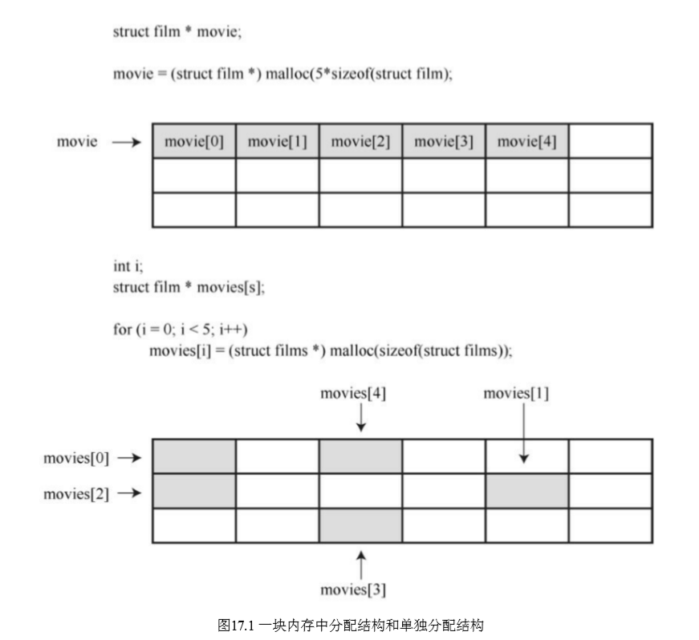
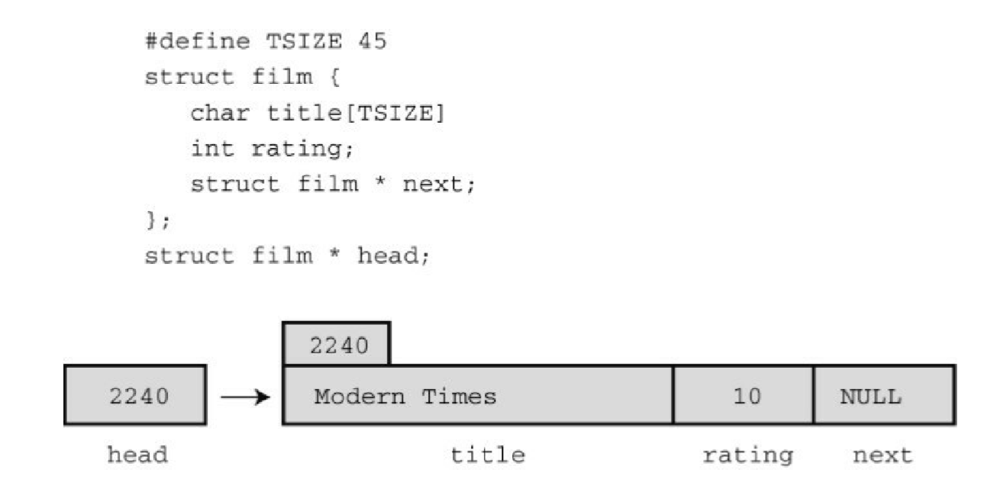
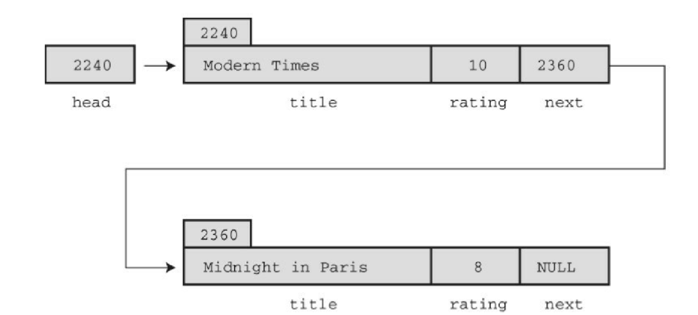
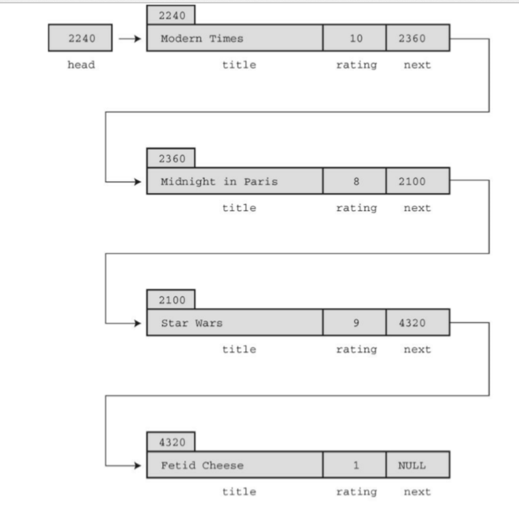
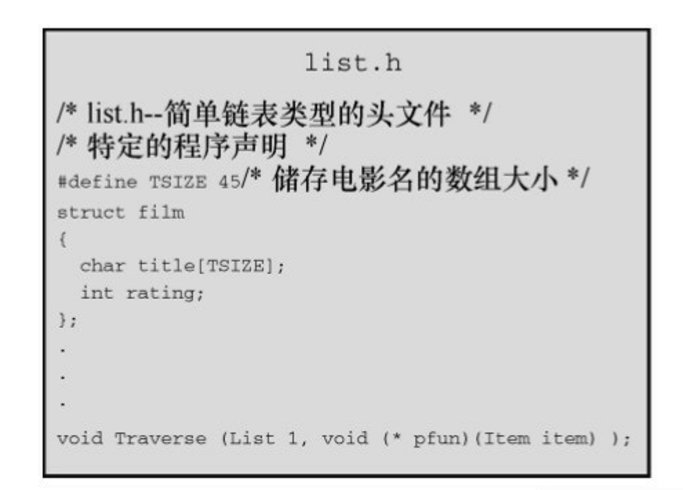
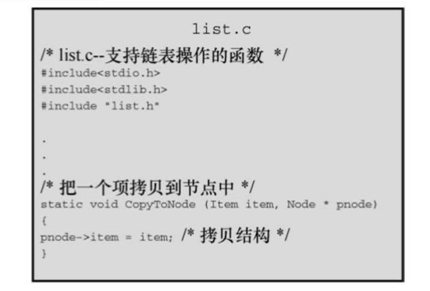
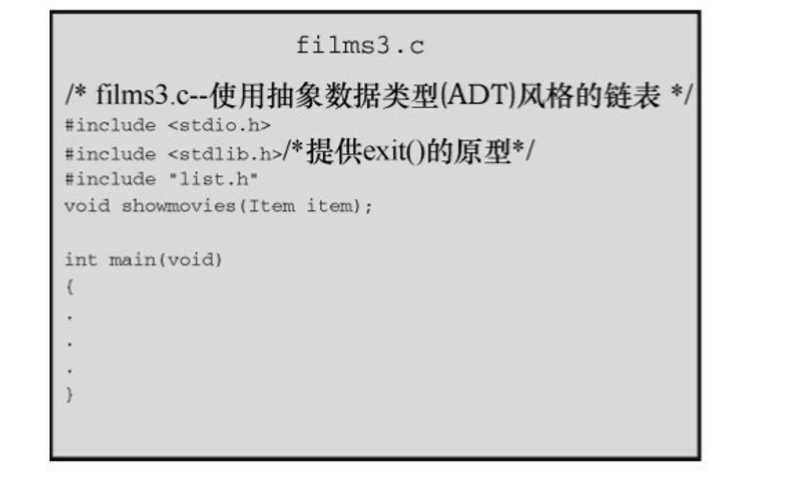
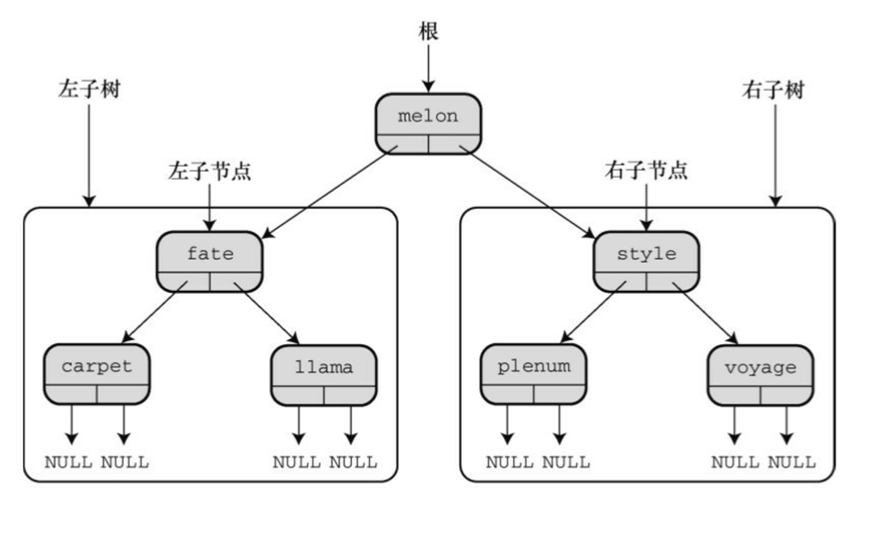

# 高级数据表示

> 函数：进一步学习malloc()
> 
> 使用C表示不同类型的数据
> 
> 新的算法
> 
> 抽象数据类型(ADT)

## 研究数据表示

要储存每部影片的各种信 息，如片名、发行年份、导演、主演、片长、影片的种类（喜剧、科幻、爱 情等）、评级等。建议使用一个结构储存每部电影，一个数组储存一年内看 过的电影。为简单起见，我们规定结构中只有两个成员：片名和评级（0～ 10）。
```C
/* films1.c -- 使用一个结构数组 */
#include　<stdio.h>
#include　<string.h>
#define TSIZE　　 45　/* 储存片名的数组大小 */
#define FMAX　　　5　 /* 影片的最大数量 */
struct　film　{
char　title[TSIZE];
int　rating;
};
char * s_gets(char str[], int lim);
int　main(void)
{
struct　film　movies[FMAX];
int　i　=　0;
int　j;
puts("Enter　first　movie　title:");
while　(i　<　FMAX　&&　s_gets(movies[i].title,　TSIZE)　!=　 NULL　&&
movies[i].title[0]　!=　'\0')
{
puts("Enter　your　rating　<0-10>:");
scanf("%d",　&movies[i++].rating);
while　(getchar()　!=　'\n')
continue;
puts("Enter　next　movie　title　(empty　line　to　stop):");
}
if　(i　==　0)
printf("No　data　entered.　");
else
printf("Here　is　the　movie　list:\n");
for　(j　=　0;　j　<　i;　j++)
printf("Movie:　%s　 Rating:　%d\n",　movies[j].title,movies[j].rating);
printf("Bye!\n");
return　0;
}
char * s_gets(char * st, int n)
{
char * ret_val;
char * find;
ret_val　=　fgets(st,　n,　stdin);
if　(ret_val)
{
find = strchr(st, '\n');　　// 查找换行符
if (find)　　　　　　　　　　　// 如果地址不是 NULL,
*find = '\0';　　　　　// 在此处放置一个空字符
else
while　(getchar()　!=　'\n')
continue;　　　　　　// 处理剩余输入行
}
return　ret_val;
}
```
该程序创建了一个结构数组，然后把用户输入的数据储存在数组中。直 到数组已满（用 FMAX 进行判断）或者到达文件结尾（用NULL进行判 断），或者用户在首行按下Enter键（用'\0'进行判断），输入才会终止。

这样设计程序有点问题。首先，该程序很可能会浪费许多空间，因为大 部分的片名都不会超过40个字符。但是，有些片名的确很长，如The Discreet Charm of the Bourgeoisie和Won Ton Ton, The Dog Who Saved Hollywood。其次，许多人会觉得每年5部电影的限制太严格了。当然，也可 以放宽这个限制，但是，要多大才合适？有些人每年可以看500部电影，因 此可以把FMAX改为500。但是，对有些人而言，这可能仍然不够，而对有 些人而言一年根本看不了这么多部电影，这样就浪费了大量的内存。另外， 一些编译器对自动存储类别变量（如 movies）可用的内存数量设置了一个 默认的限制，如此大型的数组可能会超过默认设置的值。可以把数组声明为静态或外部数组，或者设置编译器使用更大的栈来解决这个问题。但是，这 样做并不能根本解决问题。

该程序真正的问题是，数据表示太不灵活。程序在编译时确定所需内存 量，其实在运行时确定会更好。要解决这个问题，应该使用动态内存分配来 表示数据。可以这样做：
```C
#define TSIZE 45　/*储存片名的数组大小*/
struct　film　{
char　title[TSIZE];
int　rating;
};
...
int　n,　i;
struct film * movies;　/* 指向结构的指针 */
...
printf("Enter　the　maximum　number　of　movies　you'll　enter:\n");
scanf("%d",　&n);
movies = (struct film *) malloc(n * sizeof(struct film));
...
while (i < FMAX && s_gets(movies[i].title, TSIZE) != NULL &&movies[i].title[0] != '\0')
...
```
使用malloc()，可以推迟到程序运行时才确定数组中的元素数量。所 以，如果只需要20个元素，程序就不必分配存放500个元素的空间。但是， 这样做的前提是，用户要为元素个数提供正确的值。

## 从数组到链表



每个结构中包含指向 next 结构的指针。然后， 当创建新结构时，可以把该结构的地址储存在上一个结构中。简而言之，可 以这样定义film结构：
```C
#define TSIZE 45　/* 储存片名的数组大小*/
struct　film　{
char　title[TSIZE];
int　rating;
struct film * next;
};
```
虽然结构不能含有与本身类型相同的结构，但是可以含有指向同类型结 构的指针。这种定义是定义链表（linked list）的基础，链表中的每一项都包 含着在何处能找到下一项的信息。

。当 然，还需要一个单独的指针储存第1个结构的地址，该指针被称为头指针 （head pointer）。头指针指向链表中的第1项。图演示了这种结构（为 节约图片空间，压缩了title成员中的空白）。



新结构的地址将储存在上 一个结构中，新信息储存在新结构中，而且新结构中的next成员设置为 NULL。


假设要显示这个链表，每显示一项，就可以根据该项中已储存的地址来 定位下一个待显示的项。然而，这种方案能正常运行，还需要一个指针储存 链表中第1项的地址，因为链表中没有其他项储存该项的地址。此时，头指 针就派上了用场。


**使用链表**

```C
/* films2.c -- 使用结构链表 */
#include　<stdio.h>
#include <stdlib.h>　　　　/* 提供malloc()原型 */
#include <string.h>　　　　/* 提供strcpy()原型 */
#define TSIZE　 45　　　　/* 储存片名的数组大小 */
struct　film　{
char　title[TSIZE];
int　rating;
struct film * next;　　/* 指向链表中的下一个结构 */
};
char * s_gets(char * st, int n);
int　main(void)
{
struct film * head = NULL;
struct film * prev, *current;
char　input[TSIZE];
/* 收集并储存信息 */
puts("Enter　first　movie　title:");
while　(s_gets(input,　TSIZE)　!=　NULL　&&　input[0]　!=　'\0')
{
current = (struct film *) malloc(sizeof(struct film));
if (head == NULL)　　　/* 第1个结构 */
head　=　current;
else　　　　　　　　　 /* 后续的结构 */
prev->next　=　current;
current->next　=　NULL;
strcpy(current->title,　input);
puts("Enter　your　rating　<0-10>:");
scanf("%d",　&current->rating);
while　(getchar()　!=　'\n')
continue;
puts("Enter　next　movie　title　(empty　line　to　stop):");
prev　=　current;
}
/* 显示电影列表 */
if　(head　==　NULL)
printf("No　data　entered.　");
else
printf("Here　is　the　movie　list:\n");
current　=　head;
while　(current　!=　NULL)
{
printf("Movie:　%s　 Rating:　%d\n",
current->title,　current->rating);
current　=　current->next;
}
/* 完成任务，释放已分配的内存 */
current　=　head;
while　(current　!=　NULL)
{
current　=　head;
head　=　current->next;
free(current);
}
printf("Bye!\n");
return　0;
}
char * s_gets(char * st, int n)
{
char * ret_val;
char * find;
ret_val　=　fgets(st,　n,　stdin);
if　(ret_val)
{
find = strchr(st, '\n');　　// 查找换行符
if (find)　　　　　　　　// 如果地址不是 NULL，
*find = '\0';　　　　　// 在此处放置一个空字符
else
while　(getchar()　!=　'\n')
continue;　　　 // 处理剩余输入行
}
return　ret_val;
}
```

-----------------------------------
## 抽象数据类型(ADT)

计算机科学领域已开发了一种定义新类型的好方法，用3个步骤完成从 抽象到具体的过程。

1. 提供类型属性和相关操作的抽象描述。这些描述既不能依赖特定的实 现，也不能依赖特定的编程语言。这种正式的抽象描述被称为抽象数据类型 （ADT）。
2. 开发一个实现 ADT 的编程接口。也就是说，指明如何储存数据和执 行所需操作的函数。例如在 C中，可以提供结构定义和操控该结构的函数原 型。这些作用于用户定义类型的函数相当于作用于 C基本类型的内置运算 符。需要使用该新类型的程序员可以使用这个接口进行编程。
3. 编写代码实现接口。这一步至关重要，但是使用该新类型的程序员无 需了解具体的实现细节。

**建立抽象**

从根本上看，电影项目所需的是一个项链表。每一项包含电影名和评 级。你所需的操作是把新项添加到链表的末尾和显示链表中的内容。我们把 需要处理这些需求的抽象类型叫作链表。链表具有哪些属性？首先，链表应 该能储存一系列的项。也就是说，链表能储存多个项，而且这些项以某种方 式排列，这样才能描述链表的第1项、第2项或最后一项。其次，链表类型应 该提供一些操作，如在链表中添加新项。下面是链表的一些有用的操作：

初始化一个空链表；
在链表末尾添加一个新项；
确定链表是否为空；
确定链表是否已满；
确定链表中的项数；
访问链表中的每一项执行某些操作，如显示该项。

对该电影项目而言，暂时不需要其他操作。但是一般的链表还应包含以 下操作：

在链表的任意位置插入一个项；
移除链表中的一个项；
在链表中检索一个项（不改变链表）；
用另一个项替换链表中的一个项；
在链表中搜索一个项。

**建立接口**
```C
#define TSIZE 45　/* 储存电影名的数组大小 */
struct　film
{
char　title[TSIZE];
int　rating;
};
typedef　struct　film　Item;
```
定义了 Item 之后，现在必须确定如何储存这种类型的项。实际上这一 步属于实现步骤，但是现在决定好可以让示例更简单些。在films2.c程序中 用链接的结构处理得很好，所以，我们在这里也采用相同的方法：
```C
typedef　struct　node
{
Item　item;
struct node * next;
}　Node;
typedef Node * List;
```

**使用接口**

```C
/* films3.c -- 使用抽象数据类型（ADT）风格的链表 */
/* 与list.c一起编译　　　　　　　　　　　*/
#include　<stdio.h>
#include <stdlib.h>　 /* 提供exit()的原型 */
#include "list.h"　　 /* 定义List、Item　*/
void　showmovies(Item　item);
char * s_gets(char * st, int n);
int　main(void)
{
List　movies;
Item　temp;
/* 初始化　　　*/
InitializeList(&movies);
if　(ListIsFull(&movies))
{
fprintf(stderr,　"No　memory　available!　Bye!\n");
exit(1);
}
/* 获取用户输入并储存 */
puts("Enter　first　movie　title:");
while　(s_gets(temp.title,　TSIZE)　!=　NULL　&&　 temp.title[0]　!=　'\0')
{
puts("Enter　your　rating　<0-10>:");
scanf("%d",　&temp.rating);
while　(getchar()　!=　'\n')
continue;
if　(AddItem(temp,　&movies)　==　false)
{
fprintf(stderr,　"Problem　allocating　memory\n");
break;
}
if　(ListIsFull(&movies))
{
puts("The　list　is　now　full.");
break;
}
puts("Enter　next　movie　title　(empty　line　to　stop):");
}
/* 显示　　　　*/
if　(ListIsEmpty(&movies))
printf("No　data　entered.　");
else
{
printf("Here　is　the　movie　list:\n");
Traverse(&movies,　showmovies);
}
printf("You　entered　%d　movies.\n",　ListItemCount(&movies));
/* 清理　　　 */
EmptyTheList(&movies);
printf("Bye!\n");
return　0;
}
void　showmovies(Item　item)
{
printf("Movie:　%s　 Rating:　%d\n",　item.title,
item.rating);
}
char * s_gets(char * st, int n)
{
char * ret_val;
char * find;
ret_val　=　fgets(st,　n,　stdin);
if　(ret_val)
{
find = strchr(st, '\n');　　// 查找换行符
if (find)　　　　　　　　　　　// 如果地址不是NULL，
*find = '\0';　　　　　// 在此处放置一个空字符
else
while　(getchar()　!=　'\n')
continue;　　　　　　// 处理输入行的剩余内容
}
return　ret_val;
}
```

**实现接口**

```C
/* list.c -- 支持链表操作的函数 */
#include　<stdio.h>
#include　<stdlib.h>
#include　"list.h"
/* 局部函数原型 */
static void CopyToNode(Item item, Node * pnode);
/* 接口函数　*/
/* 把链表设置为空 */
void InitializeList(List * plist)
{
*plist = NULL;
}
/* 如果链表为空，返回true */
bool ListIsEmpty(const List * plist)
{
if (*plist == NULL)
return　true;
else
return　false;
}
/* 如果链表已满，返回true */
bool ListIsFull(const List * plist)
{
Node * pt;
bool　full;
pt = (Node *)malloc(sizeof(Node));
if　(pt　==　NULL)
full　=　true;
else
full　=　false;
free(pt);
return　full;
}
/* 返回节点的数量 */
unsigned int ListItemCount(const List * plist)
{
unsigned　int　count　=　0;
Node * pnode = *plist;　 /* 设置链表的开始 */
while　(pnode　!=　NULL)
{
++count;
pnode = pnode->next;　/* 设置下一个节点 */
}
return　count;
}
/* 创建储存项的节点，并将其添加至由plist指向的链表末尾（较慢的实 现） */
bool AddItem(Item item, List * plist)
{
Node * pnew;
Node * scan = *plist;
pnew = (Node *) malloc(sizeof(Node));
if　(pnew　==　NULL)
return false;　　/* 失败时退出函数 */
CopyToNode(item,　pnew);
pnew->next　=　NULL;
if (scan == NULL)　　　　/* 空链表，所以把 */
*plist = pnew;　　　 /* pnew放在链表的开头 */
else
{
while　(scan->next　!=　NULL)
scan = scan->next;　/* 找到链表的末尾 */
scan->next = pnew;　　 /* 把pnew添加到链表的末尾 */
}
return　true;
}
/* 访问每个节点并执行pfun指向的函数 */
void Traverse(const List * plist, void(*pfun)(Item item))
{
Node * pnode = *plist;　 /* 设置链表的开始 */
while　(pnode　!=　NULL)
{
(*pfun)(pnode->item); /* 把函数应用于链表中的项 */
pnode = pnode->next;　/* 前进到下一项　*/
}
}
/* 释放由malloc()分配的内存 */
/* 设置链表指针为NULL　　　*/
void EmptyTheList(List * plist)
{
Node * psave;
while (*plist != NULL)
{
psave = (*plist)->next;　　/* 保存下一个节点的地址　 */
free(*plist);　　　　　　　/* 释放当前节点　　　　 */
*plist = psave;　　　　　　/* 前进至下一个节点　　　*/
}
}
/* 局部函数定义 */
/* 把一个项拷贝到节点中 */
static void CopyToNode(Item item, Node * pnode)
{
pnode->item = item;　/* 拷贝结构 */
}
```






----------------------------------
## 二叉查找树

二叉查找树是一种结合了二分查找策略的链接结构。二叉树的每个节点 都包含一个项和两个指向其他节点（称为子节点）的指针。

二叉树中的每个节点都包含两个子节点 ——左节点和右节点，其顺序按照如下规定确定：左节点的项在父节点的项 前面，右节点的项在父节点的项后面。这种关系存在于每个有子节点的节点 中。进一步而言，所有可以追溯其祖先回到一个父节点的左节点的项，都在 该父节点项的前面；所有以一个父节点的右节点为祖先的项，都在该父节点 项的后面。有趣的是，与植物学的树 相反，该树的顶部被称为根（root）。树具有分层组织，所以以这种方式储 存的数据也以等级或层次组织。一般而言，每级都有上一级和下一级。如果 二叉树是满的，那么每一级的节点数都是上一级节点数的两倍。

假设要在二叉树中查找一个项（即目标项）。如果目标项在根节点项的 前面，则只需查找左子树；如果目标项在根节点项的后面，则只需查找右子 树。因此，每次比较就排除半个树。假设查找左子树，这意味着目标项与左 子节点项比较。如果目标项在左子节点项的前面，则只需查找其后代节点的 左半部分，以此类推。与二分查找类似，每次比较都能排除一半的可能匹配 项。

二叉查找树在链式结构中结合了二分查找的效率。但是，这样编程的代 价是构建一个二叉树比创建一个链表更复杂。

**二叉树ADT**

确定树是否为空
确定树是否已满
确定树中的项数
在树中添加一个项
在树中删除一个项
在树中查找一个项
在树中访问一个项
清空树

**二叉查找树接口**

实现二叉查找树最直接的方法是通过指针动态分配链 式节点。
```C
typedef　SOMETHING　Item;
typedef　struct　trnode
{
Item　item;
struct trnode * left;
struct trnode * right;
}　Trn;
typedef　struct　tree
{
Trnode * root;
int　size;
}　Tree;
```


每个节点包含一个项、一个指向左子节点的指针和一个指向右子节点的 指针。可以把 Tree 定义为指向 Trnode 的指针类型，因为只需要知道根节点 的位置就可访问整个树。然而，使用有成员大小的结构能很方便地记录树的 大小。


