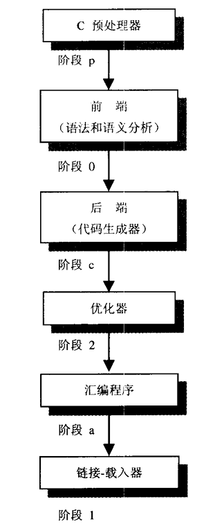
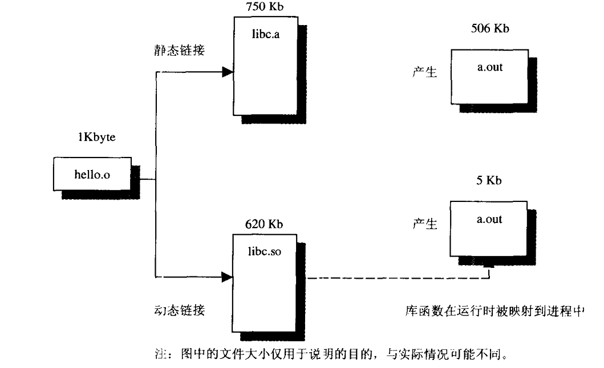

# 对链接的思考

## 函数库、链接和载入

**连接器（linker）基础知识**

编译器创建一个输出文件，这个文 件包含了可重定位的对象。这些对象就是与源程序对应的数据和机器指令。

绝大多数编译器并不是一个单一的庞大程序。它们通常由多达六七个稍小的程序所绢成,
这些程序由一个叫做“编译器驱动器(compiler driver)的控制程序来调用。这些可以方便地从 编译器中分离出来的单独程序包括：预处理器(preprocessor)语法和语义检查器(syntactic and semantic checker)> 代码生成器(code generator) > 汇编程序(assembler) 优化器(optimizer) > 链接器(linker),当然还包括一个调用所有这些程序并向各个程序传递正确选项的驱动器程序 (driverprogram)。优化器几乎可以加在上述所有阶段的后面。当前的SPARC编译 器在编译器的前端和后端之间的中间表示层执行绝大部分的优化措施。

目标文件并不能直接执行，它首先需要载入到链接器中。链接器确认main函数为初始进 入点(程序开始执行的地方)，把符号引用(symbolic reference)绑定到内存地址，把所有的目标文件集中在一起，再加上库文件，从而产生可执行文件。

如果函数库的一份拷贝是可执行文件的物理组成部分，那么我们称之为静态链接；如果
可执行文件只是包含了文件名，让载入器在运行时能够寻找程序所需要的函数库，那么我们
称之为动态链接。

收集模块准备执行的三个阶段的规范名称是链接-编辑(link-editing).载入 (loading)和运行时链接(runtime linking)。 静态链接的模块被链接编辑并载入以便运行。动态 链接的模块被链接编辑后载入，并在运行时进行链接以便运行。程序执行时，在 main()函数 被调用前，运行时载入器把共享的数据对象载入到进程的地址空间。外部函数被真正调用之
前，运行时载入器并不解析它们。所以即使链接了函数库，如果并没有实际调用，也不会带
来额外开销。

即使是在静态链接中，整个libc.a文件也并没有被全部装入到可执行文件中，所装入的 只是所需要的函数。

----------------
## 动态链接的优点

动态链接是一种更为现代的方法，它的优点是可执行文件的体积可以非常小。虽然运行
速度稍慢一些，但动态链接能够更加有效地利用磁盘空间，而且链接-编辑阶段的时间也会缩
短(因为链接器的有些工作被推迟到载入时)。

动态链接是一种“just-in-time（JIT）” 链接，这意味着程序在运行时必须能够找到它们所 需要的函数库。链接器通过把库文件名或路径名植入可执行文件中来做到这一点。这意味着，
函数库的路径不能随意移动。如果把程序链接到/user/lib/libthread.so 那么就不能把该函数 库移动到其他的目录，除非在链接器中进行特别说明。否则，当程序调用该函数库的函数时，就会在运行时导致失败