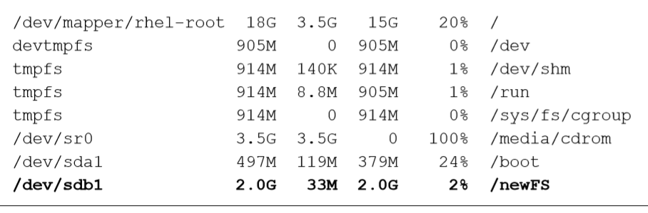

# 存储结构与磁盘划分


## 一切从“/”开始

在Linux系统中，目录、字符设备、块设备、套接字、打印机等都被抽象成了文件

在 Windows操作系统中，想要找到一个文件，我们要依次进入该文件所在的磁 盘分区（假设这里是D盘），然后在进入该分区下的具体目录，最终找到这个文件。但是在Linux 系统中并不存在 C/D/E/F等盘符，Linux系统中的一切文件都是从“根（/）”目录开始的，并按照 文件系统层次化标准（FHS）采用树形结构来存放文件，以及定义了常见目录的用途。另外，Linux 系统中的文件和目录名称是严格区分大小写的。

Linux系统中的文件存储结构：


前文提到的 FHS 是根据以往无数 Linux 系统用户和开发者的经验而总结出来的，是用户 在 Linux 系统中存储文件时需要遵守的规则，用于指导我们应该把文件保存到什么位置，以 及告诉用户应该在何处找到所需的文件。

在 Linux 系统中，最常见的目录以及所对应的 存放内容如表所示：


在 Linux 系统中另外还有一个重要的概念—路径。路径指的是如何定位到某个文件， 分为绝对路径与相对路径。绝对路径指的是从根目录（/）开始写起的文件或目录名称，而相 对路径则指的是相对于当前路径的写法。

----------------------
## 物理设备的命名规则

在 Linux 系统中一切都是文件，硬件设备也不例外。既然是文件，就必须有文件名称。 系统内核中的 udev 设备管理器会自动把硬件名称规范起来，目的是让用户通过设备文件的名 字可以猜出设备大致的属性以及分区信息等；这对于陌生的设备来说特别方便。另外，udev 设备管理器的服务会一直以守护进程的形式运行并侦听内核发出的信号来管理/dev 目录下的 设备文件。Linux 系统中常见的硬件设备的文件名称如表 所示。 


一台主机上可以有多块硬盘，因此系统采用 a～p 来代表 16 块不同的硬盘（默认从 a 开始 分配），而且硬盘的分区编号也很有讲究：

主分区或扩展分区的编号从 1 开始，到 4 结束； 

逻辑分区从编号 5 开始

**硬盘**

硬盘设备是由大量的扇区组成的，每个扇区的容量为 512 字节。其中 第一个扇区最重要，它里面保存着主引导记录与分区表信息。就第一个扇区来讲，主引导记 录需要占用 446 字节，分区表为 64 字节，结束符占用 2 字节；其中分区表中每记录一个分区 信息就需要 16 字节，这样一来最多只有 4 个分区信息可以写到第一个扇区中，这 4 个分区就 是 4 个主分区。

第一个扇区中的数据信息如图 6-3 所示


为了解决分区个数不够 的问题，可以将第一个扇区的分区表中 16 字节（原本要写入主分区信息）的空间（称之为扩 展分区）拿出来指向另外一个分区。也就是说，扩展分区其实并不是一个真正的分区，而更像 是一个占用 16 字节分区表空间的指针—一个指向另外一个分区的指针。这样一来，用户一 般会选择使用 3 个主分区加 1 个扩展分区的方法，然后在扩展分区中创建出数个逻辑分区， 从而来满足多分区（大于 4 个）的需求。

主分区、扩展分区、逻辑分区可以像图 6-4 那样来规划。 


-------------------

## 文件系统与数据资料

用户在硬件存储设备中执行的文件建立、写入、读取、修改、转存与控制等操作都是依 靠文件系统来完成的。文件系统的作用是合理规划硬盘，以保证用户正常的使用需求。Linux 系统支持数十种的文件系统，而最常见的文件系统如下所示。 
+ Ext3：是一款日志文件系统，能够在系统异常宕机时避免文件系统资料丢失，并能
自动修复数据的不一致与错误。然而，当硬盘容量较大时，所需的修复时间也会很长，而且也不能百分之百地保证资料不会丢失。它会把整个磁盘的每个写入动作 的细节都预先记录下来，以便在发生异常宕机后能回溯追踪到被中断的部分，然 后尝试进行修复。
+ Ext4 ：Ext3 的改进版本，作为 RHEL 6 系统中的默认文件管理系统，它支持的存储容
量高达 1EB（1EB=1,073,741,824GB），且能够有无限多的子目录。另外，Ext4 文件系 统能够批量分配 block 块，从而极大地提高了读写效率。 
+  XFS：是一种高性能的日志文件系统，而且是 RHEL 7 中默认的文件管理系统，它的
优势在发生意外宕机后尤其明显，即可以快速地恢复可能被破坏的文件，而且强大的 日志功能只用花费极低的计算和存储性能。并且它最大可支持的存储容量为 18EB， 这几乎满足了所有需求。

日常在硬盘需要保存的数据实在太多了，因此 Linux 系统中有一个名为 super block 的“硬 盘地图”。Linux 并不是把文件内容直接写入到这个“硬盘地图”里面，而是在里面记录着整 个文件系统的信息。因为如果把所有的文件内容都写入到这里面，它的体积将变得非常大， 而且文件内容的查询与写入速度也会变得很慢。Linux 只是把每个文件的权限与属性记录在 inode 中，而且每个文件占用一个独立的 inode 表格，该表格的大小默认为 128 字节，里面记 录着如下信息： 
+ 该文件的访问权限（read、write、execute）； 
+ 该文件的所有者与所属组（owner、group）；
+ 该文件的大小（size）； 
+ 该文件的创建或内容修改时间（ctime）； 
+ 该文件的最后一次访问时间（atime）； 
+ 该文件的修改时间（mtime）； 
+ 文件的特殊权限（SUID、SGID、SBIT）； 
+ 该文件的真实数据地址（point）。 

而文件的实际内容则保存在 block 块中（大小可以是 1KB、2KB 或 4KB），一个 inode 的 默认大小仅为 128B（Ext3），记录一个 block 则消耗 4B。当文件的 inode 被写满后，Linux 系 统会自动分配出一个 block 块，专门用于像 inode 那样记录其他 block 块的信息，这样把各个 block 块的内容串到一起，就能够让用户读到完整的文件内容了。对于存储文件内容的 block 块，有下面两种常见情况（以 4KB 的 block 大小为例进行说明）。 
+ 情况 1：文件很小（1KB），但依然会占用一个 block，因此会潜在地浪费 3KB。 
+ 情况 2：文件很大（5KB），那么会占用两个 block（5KB-4KB 后剩下的 1KB 也要占 用一个 block）。

计算机系统在发展过程中产生了众多的文件系统，为了使用户在读取或写入文件时不用 关心底层的硬盘结构，Linux内核中的软件层为用户程序提供了一个VFS （Virtual File System， 虚拟文件系统）接口，这样用户实际上在操作文件时就是统一对这个虚拟文件系统进行操作 了。图 6-5 所示为 VFS 的架构示意图。从中可见，实际文件系统在 VFS 下隐藏了自己的特性 和细节，这样用户在日常使用时会觉得“文件系统都是一样的”，也就可以随意使用各种命令 在任何文件系统中进行各种操作了（比如使用 cp 命令来复制文件）。 


---------------------
## 挂载文件设备

在拿到一块全新的硬盘存储设备后要先分区， 然后格式化，最后才能挂载并正常使用。

当用户需要使用硬盘 设备或分区中的数据时，需要先将其与一个已存在的目录文件进行关联，而这个关联动作就 是“挂载”。

**mount命令**

mount 命令用于挂载文件系统，格式为“mount 文件系统 挂载目录”。mount 命令中可用 的参数及作用如表 6-3 所示。挂载是在使用硬件设备前所执行的最后一步操作。只需使用 mount 命令把硬盘设备或分区与一个目录文件进行关联，然后就能在这个目录中看到硬件设 备中的数据了。对于比较新的 Linux 系统来讲，一般不需要使用-t 参数来指定文件系统的类 型，Linux 系统会自动进行判断。而 mount 中的-a 参数则厉害了，它会在执行后自动检查 /etc/fstab 文件中有无疏漏被挂载的设备文件，如果有，则进行自动挂载操作。 


例如，要把设备/dev/sdb2 挂载到/backup 目录，只需要在 mount 命令中填写设备与挂载目录 参数就行，系统会自动去判断要挂载文件的类型，因此只需要执行下述命令即可：
```
# mount /dev/sdb2 /backup 
```
虽然按照上面的方法执行 mount 命令后就能立即使用文件系统了，但系统在重启后挂 载就会失效，也就是说我们需要每次开机后都手动挂载一下。这肯定不是我们想要的效果， 如果想让硬件设备和目录永久地进行自动关联，就必须把挂载信息按照指定的填写格式 “设备文件 挂载目录 格式类型 权限选项 是否备份 是否自检”（各字段的意义见表 6-4） 写入到/etc/fstab 文件中。这个文件中包含着挂载所需的诸多信息项目，一旦配置好之后就 能一劳永逸了。


如果想将文件系统为 ext4 的硬件设备/dev/sdb2 在开机后自动挂载到/backup 目录上，并 保持默认权限且无需开机自检，就需要在/etc/fstab 文件中写入下面的信息，这样在系统重启 后也会成功挂载。 


**umount**
umount 命令用于撤销已经挂载的设备文件，格式为“umount [挂载点/设备文件]”。我们 挂载文件系统的目的是为了使用硬件资源，而卸载文件系统就意味不再使用硬件的设备资源； 相对应地，挂载操作就是把硬件设备与目录进行关联的动作，因此卸载操作只需要说明想要 取消关联的设备文件或挂载目录的其中一项即可，一般不需要加其他额外的参数。我们来尝 试手动卸载掉/dev/sdb2 设备文件： 
 ```
 # umount /dev/sdb2 
 ```

 ------------------------
 ## 添加硬盘设备

 添加硬盘设备的 操作思路：首先需要在虚拟机中模拟添加入一块新的硬盘存储设备，然后再进行分区、格 式化、挂载等操作，最后通过检查系统的挂载状态并真实地使用硬盘来验证硬盘设备是否 成功添加。 

 添加硬盘设备的 操作思路：首先需要在虚拟机中模拟添加入一块新的硬盘存储设备，然后再进行分区、格 式化、挂载等操作，最后通过检查系统的挂载状态并真实地使用硬盘来验证硬盘设备是否 成功添加。 

 首先把虚拟机系统关机，稍等几分钟会自动返回到虚拟机管理主界面，然后单击“编 辑虚拟机设置”选项，在弹出的界面中单击“添加”按钮，新增一块硬件设备，如图 66 所示。 
 

 选择想要添加的硬件类型为“硬盘”，然后单击“下一步”按钮就可以了，这确实没有什 么需要进一步解释的，如图 6-7 所示。 
 选择虚拟硬盘的类型为 SCSI（默认推荐），并单击“下一步”按钮，这样虚拟机中的设备 名称过一会儿后应该为/dev/sdb，如图 6-8 所示
 
 

 选中“创建新虚拟磁盘”单选按钮，而不是其他选项，再次单击“下一步”按钮，如图 6-9 所示
 

 将“最大磁盘大小”设置为默认的 20GB。这个数值是限制这台虚拟机所使用的最大硬盘 空间，而不是立即将其填满，因此默认 20GB 就很合适了。单击“下一步”按钮，如图 6-10 所示。 
 
 

 设置磁盘文件的文件名和保存位置（这里采用默认设置即可，无需修改），直接单击“完 成”按钮，如图 6-11 所示。 
 

 将新硬盘添加好后就可以看到设备信息了。这里不需要做任何修改，直接单击“确认” 按钮后就可以开启虚拟机了，如图 6-12 所示。 
 

 在虚拟机中模拟添加了硬盘设备后就应该能看到抽象成的硬盘设备文件了。按照前文讲 解的 udev 服务命名规则，第二个被识别的 SCSI 设备应该会被保存为/dev/sdb，这个就是硬盘 设备文件了。但在开始使用该硬盘之前还需要进行分区操作，例如从中取出一个 2GB 的分区 设备以供后面的操作使用

 **fdisk**
 在 Linux系统中，管理硬盘设备最常用的方法就当属fdisk命令了。fdisk命令用于管理磁盘 分区，格式为“fdisk  [磁盘名称]”，它提供了集添加、删除、转换分区等功能于一身的“一站式 分区服务”。不过与前面讲解的直接写到命令后面的参数不同，这条命令的参数（见表6-5）是交 互式的，因此在管理硬盘设备时特别方便，可以根据需求动态调整。 
 
 

 我们首先使用 fdisk 命令来尝试管理/dev/sdb 硬盘设备。在看到提示信息后输入参数 p 来 查看硬盘设备内已有的分区信息，其中包括了硬盘的容量大小、扇区个数等信息： 

 
 输入参数 n 尝试添加新的分区。系统会要求您是选择继续输入参数 p 来创建主分区，还 是输入参数 e 来创建扩展分区。这里输入参数 p 来创建一个主分区： 
 
 在确认创建一个主分区后，系统要求您先输入主分区的编号。我们在前文得知，主分区的编 号范围是 1～4，因此这里输入默认的1就可以了。接下来系统会提示定义起始的扇区位置，这不 需要改动，我们敲击回车键保留默认设置即可，系统会自动计算出最靠前的空闲扇区的位置。最 后，系统会要求定义分区的结束扇区位置，这其实就是要去定义整个分区的大小是多少。我们不 用去计算扇区的个数，只需要输入+2G即可创建出一个容量为2GB 的硬盘分区。 
 
 再次使用参数 p 来查看硬盘设备中的分区信息。果然就能看到一个名称为/dev/sdb1、起 始扇区位置为 2048、结束扇区位置为 4196351 的主分区了。这时候千万不要直接关闭窗口， 而应该敲击参数 w 后回车，这样分区信息才是真正的写入成功啦
 
 

 在上述步骤执行完毕之后，Linux 系统会自动把这个硬盘主分区抽象成/dev/sdb1 设备文 件。我们可以使用 file 命令查看该文件的属性，但是刘遄老师在讲课和工作中发现，有些时候 系统并没有自动把分区信息同步给 Linux 内核，而且这种情况似乎还比较常见（但不能算作 是严重的 bug）。我们可以输入 partprobe 命令手动将分区信息同步到内核，而且一般推荐连续 两次执行该命令，效果会更好。如果使用这个命令都无法解决问题，那么就重启计算机吧
 
 如果硬件存储设备没有进行格式化，则 Linux 系统无法得知怎么在其上写入数据。因此， 在对存储设备进行分区后还需要进行格式化操作。在 Linux 系统中用于格式化操作的命令是 mkfs。这条命令很有意思，因为在 Shell 终端中输入 mkfs 名后再敲击两下用于补齐命令的 Tab 键，会有如下所示的效果：
 
 这个 mkfs 命令很贴心地把常用的文件系统名称用后缀的方式保存成了多个命令文 件，用起来也非常简单—mkfs.文件类型名称。例如要格式分区为 XFS 的文件系统，则命令 应为 mkfs.xfs /dev/sdb1
 
 终于完成了存储设备的分区和格式化操作，接下来就是要来挂载并使用存储设备了。与 之相关的步骤也非常简单：首先是创建一个用于挂载设备的挂载点目录；然后使用 mount 命 令将存储设备与挂载点进行关联；最后使用 df -h 命令来查看挂载状态和硬盘使用量信息。 
 
 


 **du**

 