# 使用 RAID 与 LVM 磁盘阵列技术 

## RAID（独立冗余磁盘阵列）

RAID 技术 通过把多个硬盘设备组合成一个容量更大、安全性更好的磁盘阵列，并把数据切割成多个区 段后分别存放在各个不同的物理硬盘设备上，然后利用分散读写技术来提升磁盘阵列整体的 性能，同时把多个重要数据的副本同步到不同的物理硬盘设备上，从而起到了非常好的数据 冗余备份效果。 

RAID 技术确实具有非常好的数据冗余备份功能，但是它也相 应地提高了成本支出。就像原本我们只有一个电话本，但是为了避免遗失，我们将联系人号 码信息写成了两份，自然要为此多买一个电话本，这也就相应地提升了成本支出。RAID 技术 的设计初衷是减少因为采购硬盘设备带来的费用支出，但是与数据本身的价值相比较，现代 企业更看重的则是 RAID 技术所具备的冗余备份机制以及带来的硬盘吞吐量的提升。也就是 说，RAID 不仅降低了硬盘设备损坏后丢失数据的几率，还提升了硬盘设备的读写速度，所以 它在绝大多数运营商或大中型企业中得以广泛部署和应用。 

### RAID 0

RAID 0 技术把多块物理硬盘设备（至少两块）通过硬件或软件的方式串联在一起，组成 一个大的卷组，并将数据依次写入到各个物理硬盘中。这样一来，在最理想的状态下，硬盘设 备的读写性能会提升数倍，但是若任意一块硬盘发生故障将导致整个系统的数据都受到破坏。 通俗来说，RAID 0 技术能够有效地提升硬盘数据的吞吐速度，但是不具备数据备份和错误修 复能力。如图所示，数据被分别写入到不同的硬盘设备中，即 disk1 和 disk2 硬盘设备会 分别保存数据资料，最终实现提升读取、写入速度的效果。 
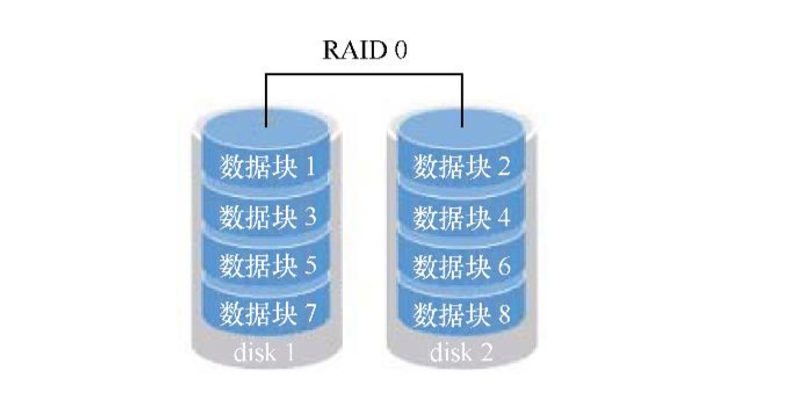

### RAID 1

RAID 1 技术是把两块以上的硬盘设备进行绑 定，在写入数据时，是将数据同时写入到多块硬盘设备上（可以将其视为数据的镜像或备 份）。当其中某一块硬盘发生故障后，一般会立即自动以热交换的方式来恢复数据的正常 使用。 
 
 RAID 1 技术虽然十分注重数据的安全性，但是因为是在多块硬盘设备中写入了相同的数据，因此硬盘设备的利用率得以下降，从理论上来说，图所示的硬盘空间的真实可用率只 有 50%，由三块硬盘设备组成的 RAID 1 磁盘阵列的可用率只有 33%左右，以此类推。而且， 由于需要把数据同时写入到两块以上的硬盘设备，这无疑也在一定程度上增大了系统计算功 能的负载。 
 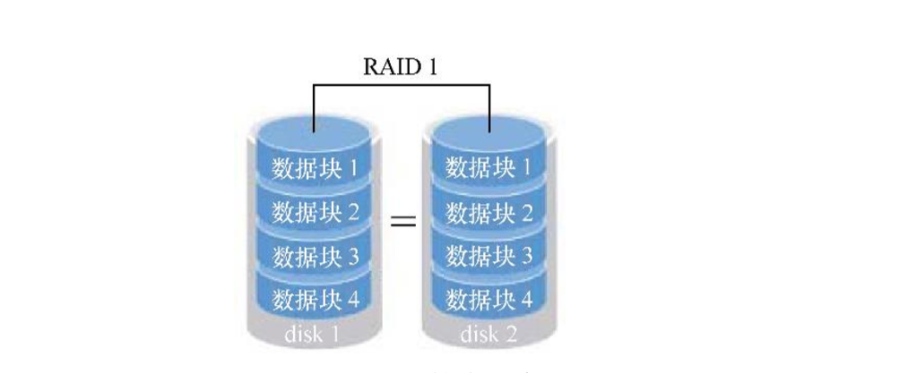

 ### RAID 5

 RAID5 技术是把硬盘设备的数据奇偶校验信息保存到其他硬盘设备中。 RAID 5 磁盘阵列组中数据的奇偶校验信息并不是单独保存到某一块硬盘设备中，而是存储到 除自身以外的其他每一块硬盘设备上，这样的好处是其中任何一设备损坏后不至于出现致命 缺陷；图中 parity 部分存放的就是数据的奇偶校验信息，换句话说，就是 RAID 5 技术实 际上没有备份硬盘中的真实数据信息，而是当硬盘设备出现问题后通过奇偶校验信息来尝试 重建损坏的数据。RAID 这样的技术特性“妥协”地兼顾了硬盘设备的读写速度、数据安全性 与存储成本问题。 
 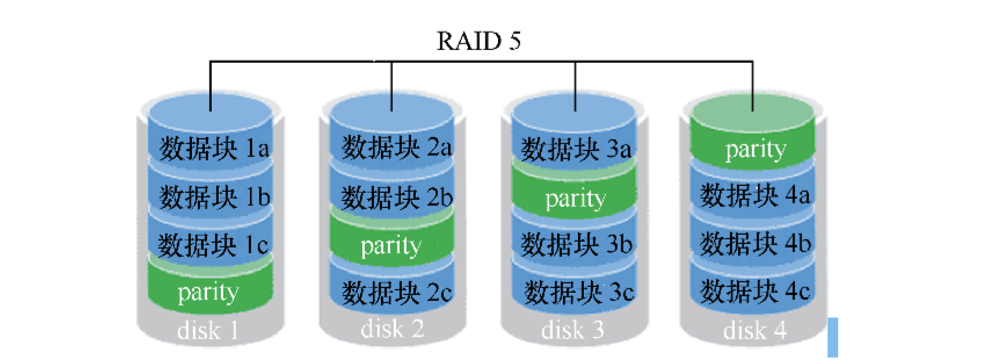

 ### RAID 10

 顾名思义，RAID 10 技术是 RAID 1+RAID 0 技术的一个“组合体”。如图所示， RAID 10 技术需要至少 4 块硬盘来组建，其中先分别两两制作成 RAID 1 磁盘阵列，以保 证数据的安全性；然后再对两个 RAID 1 磁盘阵列实施 RAID 0 技术，进一步提高硬盘设 备的读写速度。这样从理论上来讲，只要坏的不是同一组中的所有硬盘，那么最多可以损 坏 50%的硬盘设备而不丢失数据。由于 RAID 10 技术继承了 RAID 0 的高读写速度和 RAID 1 的数据安全性，在不考虑成本的情况下 RAID 10 的性能都超过了 RAID 5，因此当前成 为广泛使用的一种存储技术。
 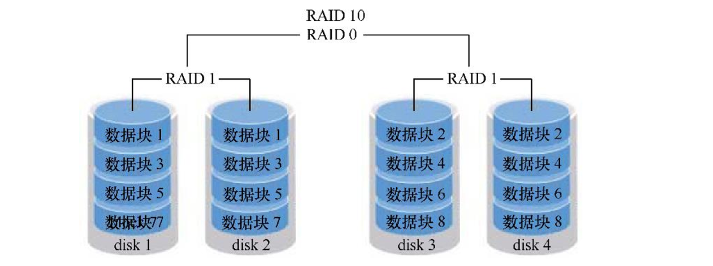

 ### 部署磁盘阵列

 首 先，需要在虚拟机中添加 4 块硬盘设备来制作一个 RAID 10 磁盘阵列
 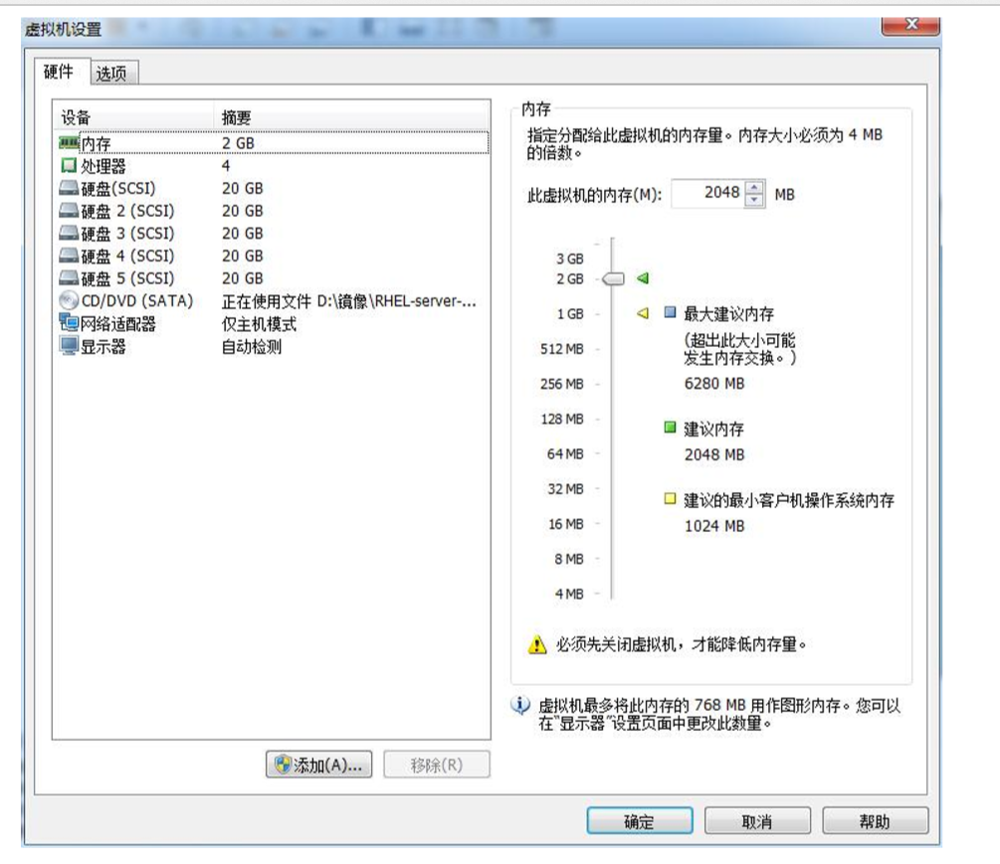

 mdadm 命令用于管理 Linux 系统中的软件 RAID 硬盘阵列，格式为“mdadm [模式] <RAID 设备名称> [选项] [成员设备名称]”。 
 mdadm 命令的常用参数以及作用如表所示。  
 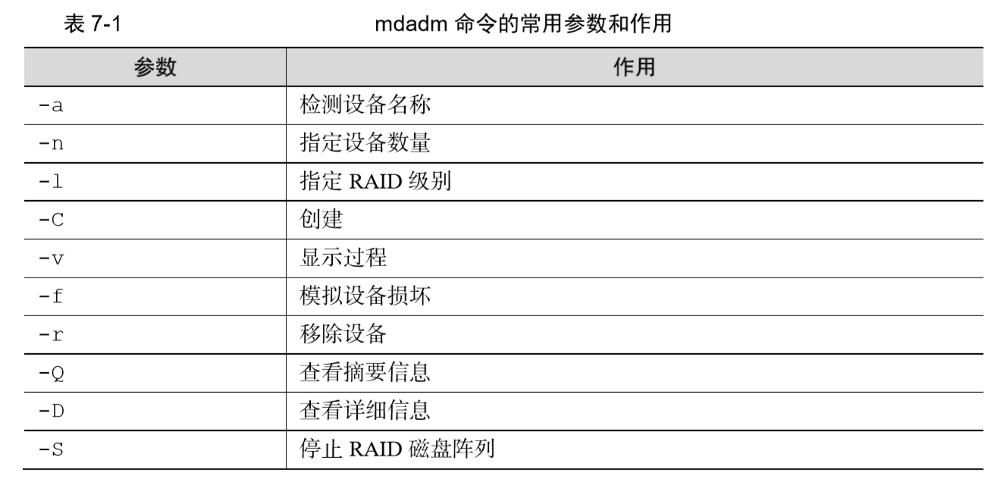

 接下来，使用 mdadm 命令创建 RAID 10，名称为“/dev/md0”。 

 -C 参数代表创建一个 RAID 阵列卡；-v 参 数显示创建的过程，同时在后面追加一个设备名称/dev/md0，这样/dev/md0就是创建后的RAID 磁盘阵列的名称；-a yes 参数代表自动创建设备文件；-n 4 参数代表使用 4 块硬盘来部署这个 RAID 磁盘阵列；而-l 10 参数则代表 RAID 10 方案；最后再加上 4 块硬盘设备的名称就搞定 了。 

 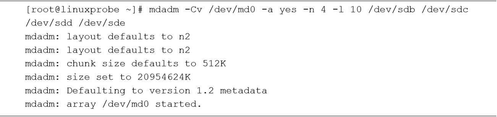

 其次，把制作好的 RAID 磁盘阵列格式化为 ext4 格式。 
 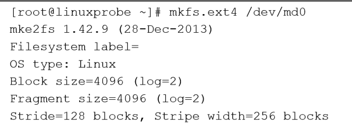
 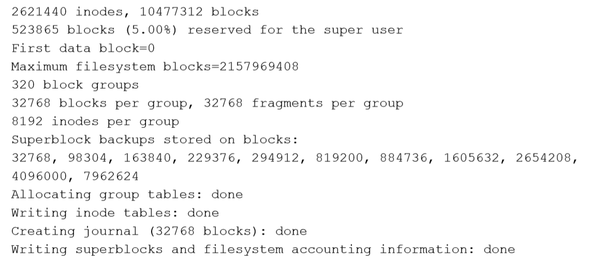

 再次，创建挂载点然后把硬盘设备进行挂载操作。挂载成功后可看到可用空间为 40GB。 
 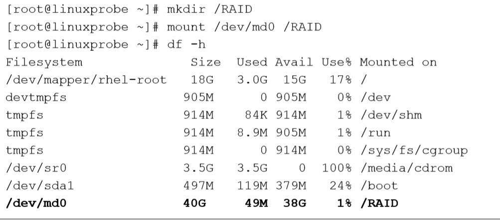

 最后，查看/dev/md0 磁盘阵列的详细信息，并把挂载信息写入到配置文件中，使其永久 生效。 

 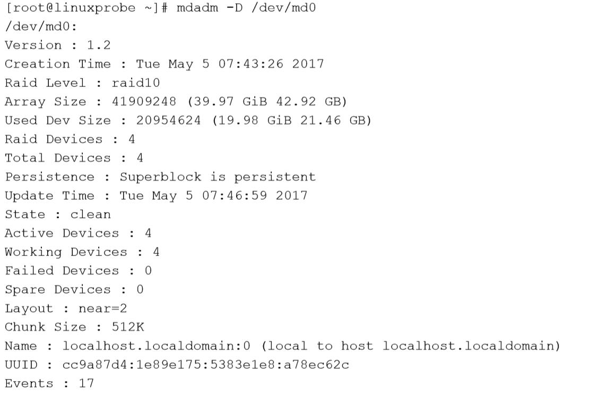

 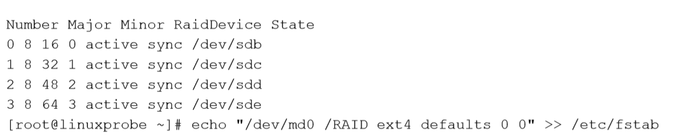

 ### 损坏磁盘阵列及其修复

 在确认有一块物理硬盘设备出现损坏而不能继续正常使用后，应该使用 mdadm 命令将其 移除，然后查看 RAID 磁盘阵列的状态，可以发现状态已经改变。
 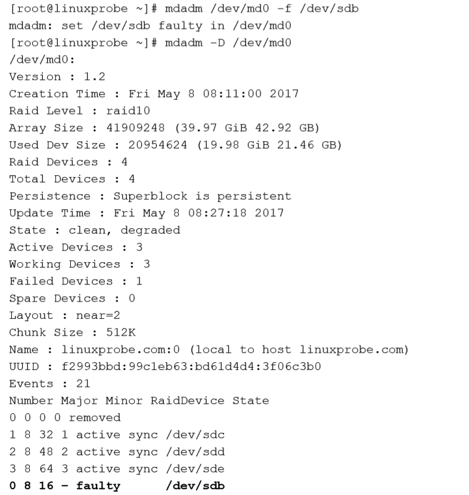

 在 RAID 10 级别的磁盘阵列中，当 RAID 1 磁盘阵列中存在一个故障盘时并不影响 RAID 10 磁盘阵列的使用。当购买了新的硬盘设备后再使用 mdadm 命令来予以替换即可，在此期间 我们可以在/RAID 目录中正常地创建或删除文件。由于我们是在虚拟机中模拟硬盘，所以先 重启系统，然后再把新的硬盘添加到 RAID 磁盘阵列中。 

 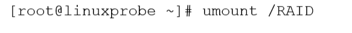
 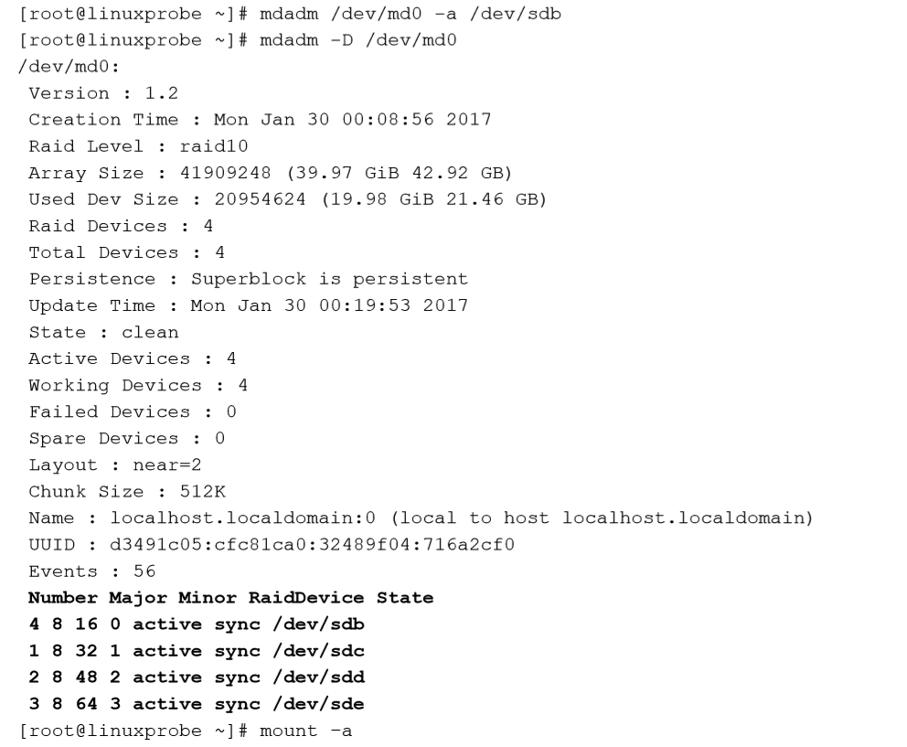

 ### 磁盘阵列+备份盘

 RAID 10 磁盘阵列中最多允许 50%的硬盘设备发生故障，但是存在这样一种极端情况， 即同一 RAID 1 磁盘阵列中的硬盘设备若全部损坏，也会导致数据丢失。换句话说，在 RAID 10 磁盘阵列中，如果 RAID 1 中的某一块硬盘出现了故障，而我们正在前往修复的路上， 恰巧该 RAID1 磁盘阵列中的另一块硬盘设备也出现故障，那么数据就被彻底丢失了。

 可以使用 RAID 备份盘技术来预防这类 事故。该技术的核心理念就是准备一块足够大的硬盘，这块硬盘平时处于闲置状态，一旦 RAID 磁盘阵列中有硬盘出现故障后则会马上自动顶替上去。

 -----------------------------------
 ## LVM（逻辑卷）

 逻辑卷管理器是 Linux 系统用于对硬盘分区进行管理的一种机制，理论性较强，其创建 初衷是为了解决硬盘设备在创建分区后不易修改分区大小的缺陷。尽管对传统的硬盘分区进 行强制扩容或缩容从理论上来讲是可行的，但是却可能造成数据的丢失。而 LVM 技术是在硬 盘分区和文件系统之间添加了一个逻辑层，它提供了一个抽象的卷组，可以把多块硬盘进行 卷组合并。这样一来，用户不必关心物理硬盘设备的底层架构和布局，就可以实现对硬盘分 区的动态调整。

 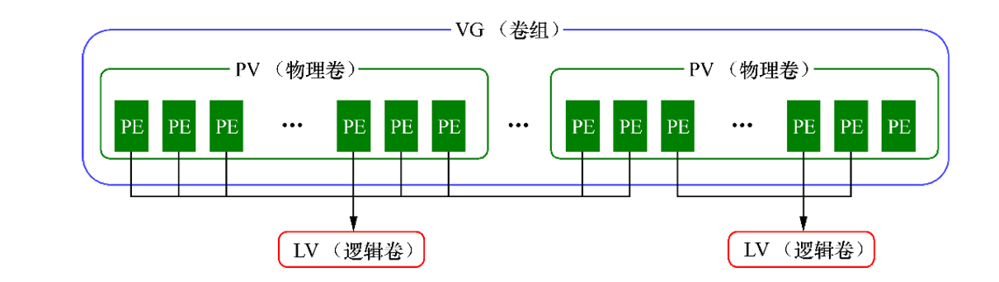

 物理卷处于 LVM 中的最底层，可以将其理解为物理硬盘、硬盘分区或者 RAID 磁盘阵 列，这都可以。卷组建立在物理卷之上，一个卷组可以包含多个物理卷，而且在卷组创建之后 也可以继续向其中添加新的物理卷。逻辑卷是用卷组中空闲的资源建立的，并且逻辑卷在建 立后可以动态地扩展或缩小空间。这就是 LVM 的核心理念。

 ### 部署逻辑卷

 部署 LVM 时，需要逐个配置物理卷、卷组和 逻辑卷。
 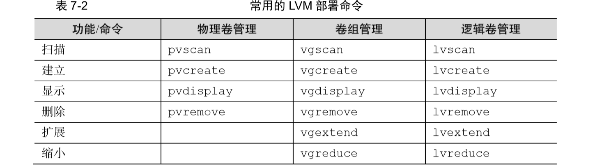
 先对这两块新硬盘进行创建物理卷的操作，可以将该操 作简单理解成让硬盘设备支持 LVM 技术，或者理解成是把硬盘设备加入到 LVM 技术可 用的硬件资源池中，然后对这两块硬盘进行卷组合并，卷组的名称可以由用户来自定义。 接下来，根据需求把合并后的卷组切割出一个约为 150MB 的逻辑卷设备，最后把这个逻 辑卷设备格式化成 EXT4 文件系统后挂载使用。

 让新添加的两块硬盘设备支持 LVM 技术。 
 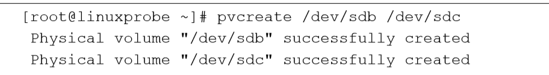
 把两块硬盘设备加入到 storage 卷组中，然后查看卷组的状态。 
 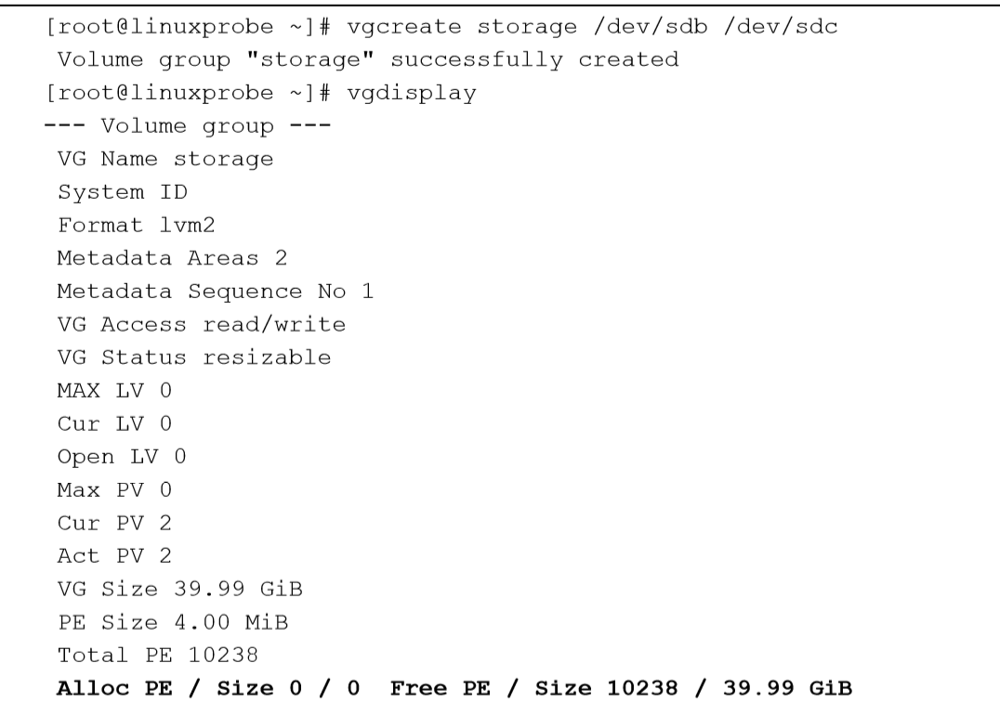
 切割出一个约为 150MB 的逻辑卷设备。

 这里需要注意切割单位的问题。在对逻辑卷进行切割时有两种计量单位。第一种是以容 量为单位，所使用的参数为-L。例如，使用-L 150M 生成一个大小为 150MB 的逻辑卷。另外 一种是以基本单元的个数为单位，所使用的参数为-l。每个基本单元的大小默认为 4MB。例 如，使用-l 37 可以生成一个大小为 37×4MB=148MB 的逻辑卷。 
 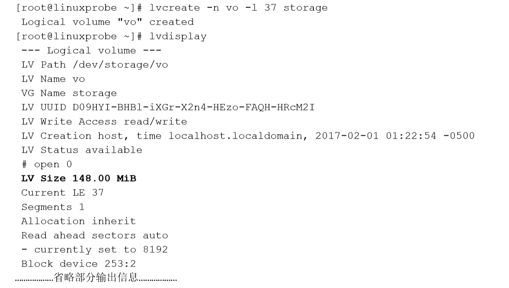

 把生成好的逻辑卷进行格式化，然后挂载使用。 

 Linux 系统会把 LVM 中的逻辑卷设备存放在/dev 设备目录中（实际上是做了一个符号链 接），同时会以卷组的名称来建立一个目录，其中保存了逻辑卷的设备映射文件（即/dev/卷组 名称/逻辑卷名称）。 

 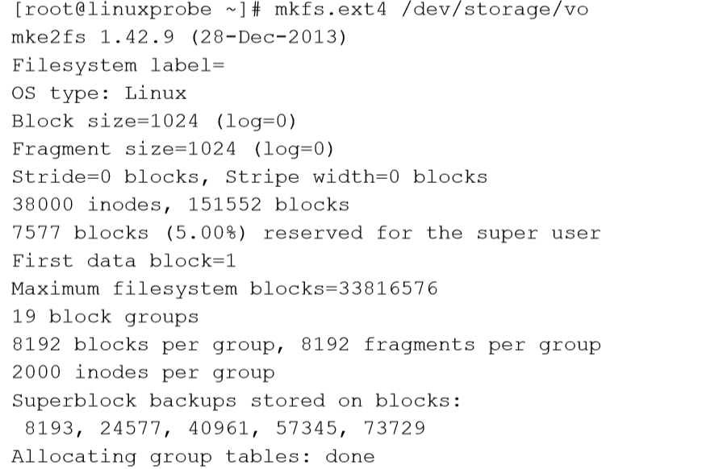
 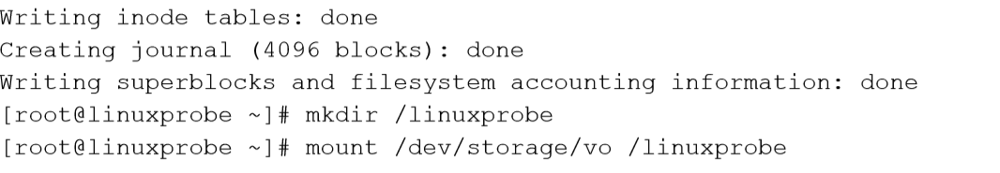

 查看挂载状态，并写入到配置文件，使其永久生效。 

 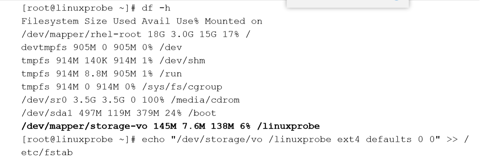

 ### 扩容逻辑卷

只要卷组中
有足够的资源，就可以一直为逻辑卷扩容。扩展前请一定要记得卸载设备和挂载点的
关联。 
 
 ```
 # umount /linuxprobe 
 ```

把上一个实验中的逻辑卷 vo 扩展至 290MB。 
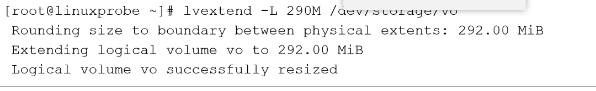

检查硬盘完整性，并重置硬盘容量。 
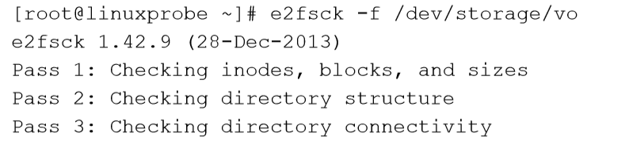
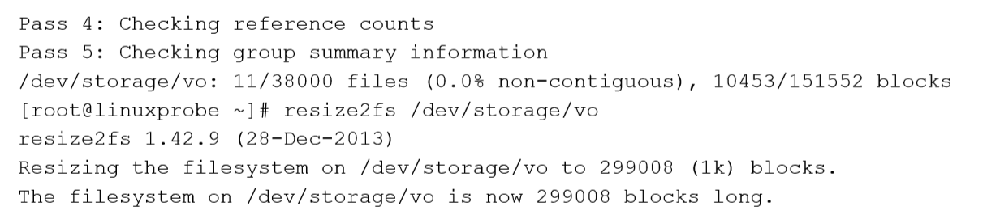
重新挂载硬盘设备并查看挂载状态。 
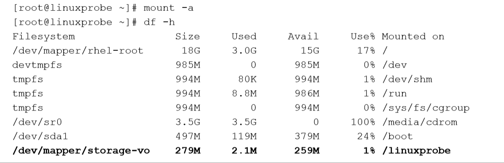

### 缩小逻辑卷

相较于扩容逻辑卷，在对逻辑卷进行缩容操作时，其丢失数据的风险更大。所以在生产 环境中执行相应操作时，一定要提前备份好数据。另外 Linux 系统规定，在对 LVM 逻辑卷进 行缩容操作之前，要先检查文件系统的完整性（当然这也是为了保证我们的数据安全）。在执 行缩容操作前记得先把文件系统卸载掉。 
 
  umount /linuxprobe 

检查文件系统的完整性。 
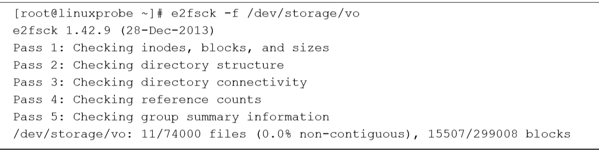

把逻辑卷 vo 的容量减小到 120MB。 
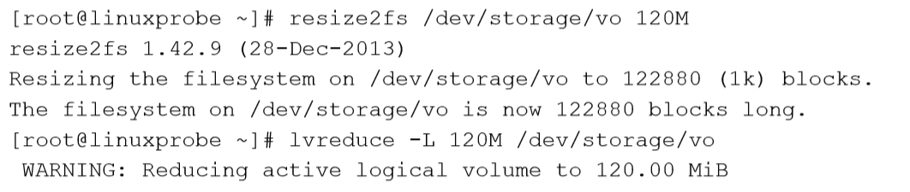
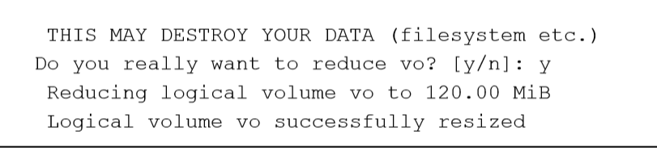

重新挂载文件系统并查看系统状态。 
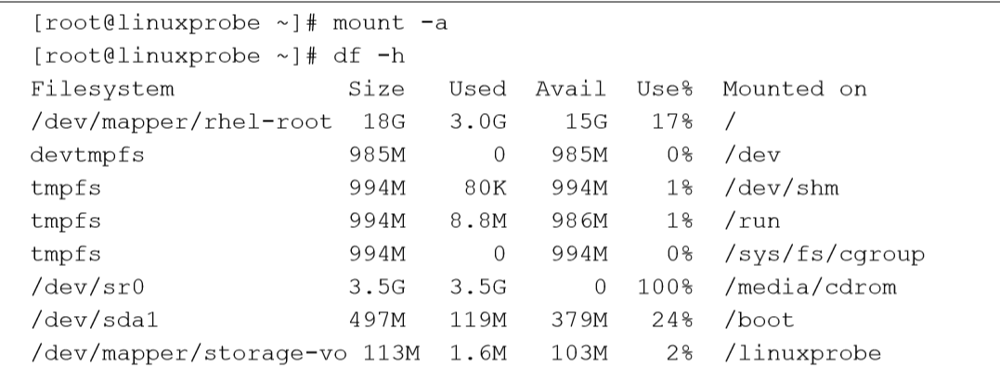

### 逻辑卷快照

LVM 还具备有“快照卷”功能，该功能类似于虚拟机软件的还原时间点功能。例如，可 以对某一个逻辑卷设备做一次快照，如果日后发现数据被改错了，就可以利用之前做好的快 照卷进行覆盖还原。LVM 的快照卷功能有两个特点： 

+ 快照卷的容量必须等同于逻辑卷的容量； 
+ 快照卷仅一次有效，一旦执行还原操作后则会被立即自动删除。 


首先查看卷组的信息
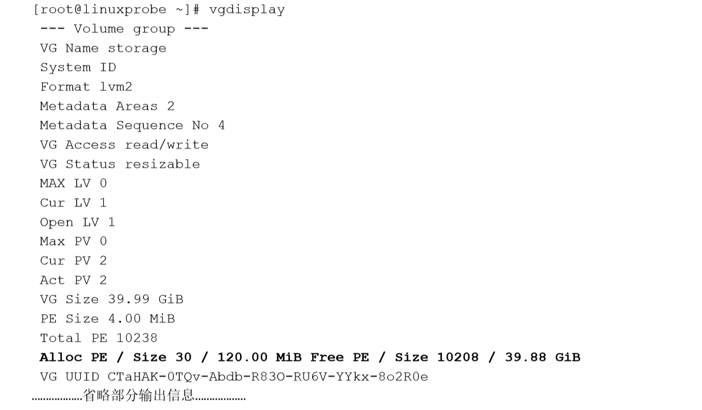

接下来用重定向往逻辑卷设备所挂载的目录中写入一个文件。 
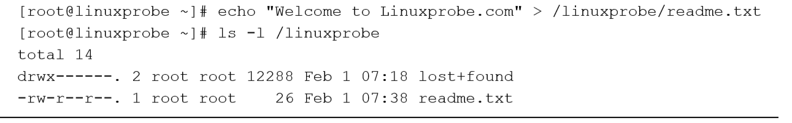

使用-s 参数生成一个快照卷，使用-L 参数指定切割的大小。另外，还需要在命
令后面写上是针对哪个逻辑卷执行的快照操作。 

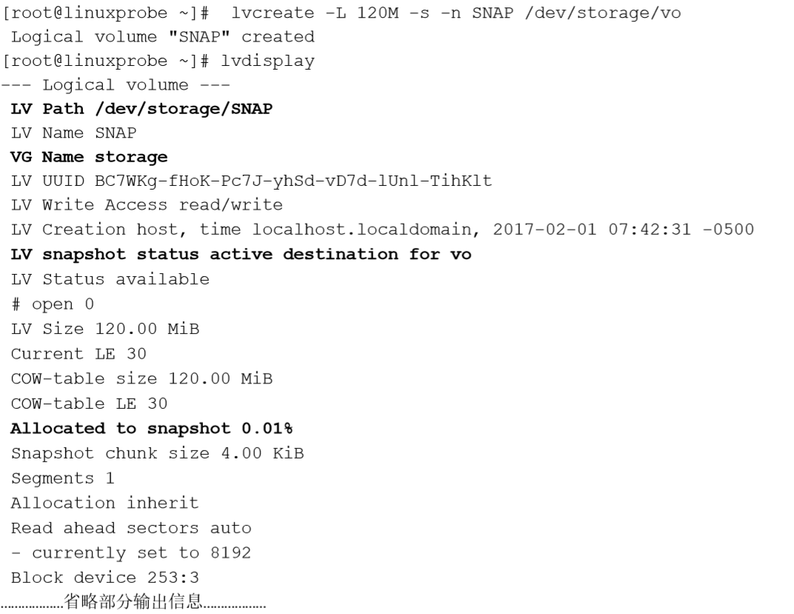

为了校验 SNAP 快照卷的效果，需要对逻辑卷进行快照还原操作。在此之前记
得先卸载掉逻辑卷设备与目录的挂载。 
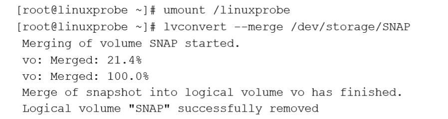

快照卷会被自动删除掉，并且刚刚在逻辑卷设备被执行快照操作后再创建出来
的 100MB 的垃圾文件也被清除了

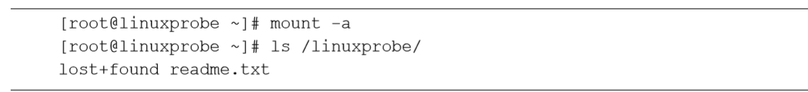

### 删除逻辑卷

当生产环境中想要重新部署 LVM 或者不再需要使用 LVM 时，则需要执行 LVM 的删除 操作。为此，需要提前备份好重要的数据信息，然后依次删除逻辑卷、卷组、物理卷设备，这 个顺序不可颠倒。 

取消逻辑卷与目录的挂载关联，删除配置文件中永久生效的设备参数。 
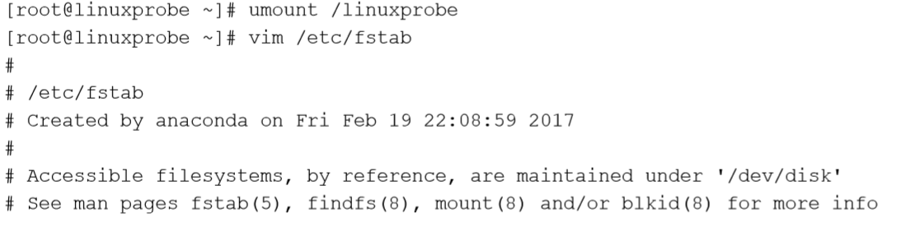
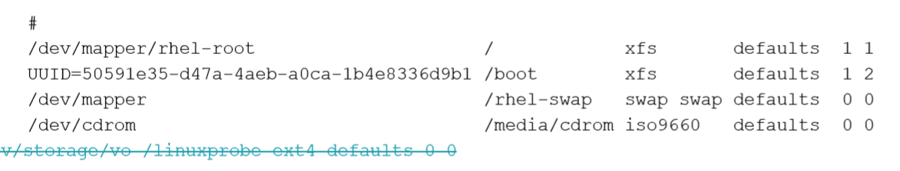

删除逻辑卷设备，需要输入 y 来确认操作。 
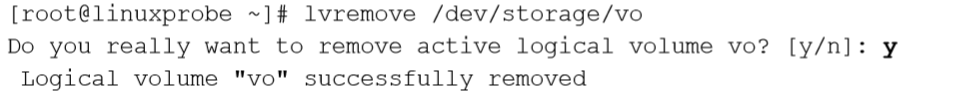

删除卷组，此处只写卷组名称即可，不需要设备的绝对路径
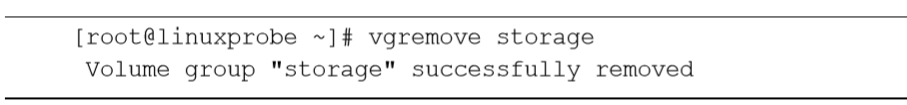
删除物理卷设备。 

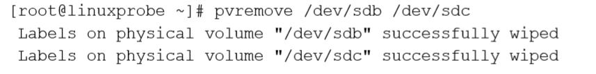


在上述操作执行完毕之后，再执行 lvdisplay、vgdisplay、pvdisplay 命令来查看 LVM 的信 息时就不会再看到信息了（前提是上述步骤的操作是正确的）


