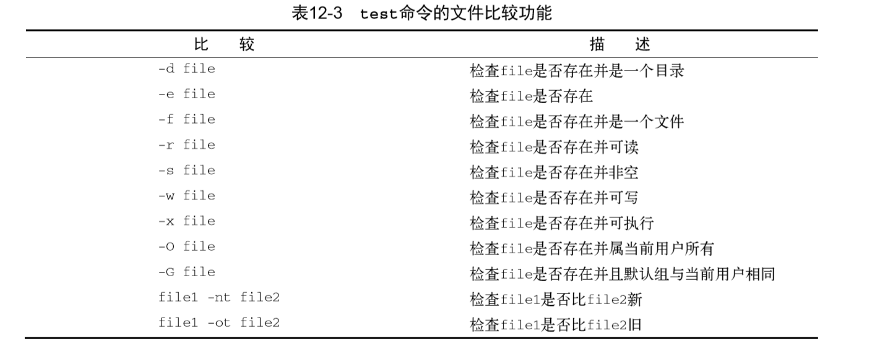

# 使用结构化命令

## 使用 if-then 语句

基本的结构化命令就是 if-then 语句。if-then 语句有如下格式。

```bash
if command
then
    commands
fi
```

在其他编程语言 中，if 语句之后的对象是一个等式，这个等式的求值结果为 TRUE 或 FALSE。但 bash shell 的 if 语 句并不是这么做的。

bash shell 的 if 语句会运行 if 后面的那个命令。如果该命令的退出状态码是 0 （该命令成功运行），位于 then 部分的命令就会被执行。如果该命令的退出状态码是其他值， then 部分的命令就不会被执行，bash shell 会继续执行脚本中的下一个命令。fi 语句用来表示 if-then 语句到此结束。

> 你可能在有些脚本中看到过 if-then 语句的另一种形式：
>
> if command; then
>
> commands
>
> fi
>
> 通过把分号放在待求值的命令尾部，就可以将 then 语句放在同一行上了，这样看起来更 像其他编程语言中的 if-then 语句。

在 then 部分，你可以使用不止一条命令。可以像在脚本中的其他地方一样在这里列出多条 命令。bash shell 会将这些命令当成一个块，如果 if 语句行的命令的退出状态值为 0，所有的命令 都会被执行；如果 if 语句行的命令的退出状态不为 0，所有的命令都会被跳过。

## if-then-else 语句

if-then-else 语句在语句中提供了另外一组命令。

```bash
if command
then
    commands
else
    commands
fi
```

当 if 语句中的命令返回退出状态码 0 时，then 部分中的命令会被执行，这跟普通的 if-then 语句一样。当 if 语句中的命令返回非零退出状态码时，bash shell 会执行 else 部分中的命令。

## 嵌套 if

在脚本中使用这种嵌套 if-then 语句的问题在于代码不易阅读，很难理清逻辑流程。
可以使用 else 部分的另一种形式：elif。这样就不用再书写多个 if-then 语句了。elif 使 用另一个 if-then 语句延续 else 部分。

```bash
if command1
then
    commands
elif command2
then
    more commands
fi
```

## test 命令

test 命令提供了在 if-then 语句中测试不同条件的途径。如果 test 命令中列出的条件成立， test 命令就会退出并返回退出状态码 0。这样 if-then 语句就与其他编程语言中的 if-then 语句 以类似的方式工作了。如果条件不成立，test 命令就会退出并返回非零的退出状态码，这使得 if-then 语句不会再被执行

test 命令的格式非常简单。

```bash
test condition
```

condition 是 test 命令要测试的一系列参数和值。

当你加入一个条件时，test 命令会测试该条件。例如，可以使用 test 命令确定变量中是否 有内容。

bash shell 提供了另一种条件测试方法，无需在 if-then 语句中声明 test 命令。

```bash
if [ condition ]
then
    commands
fi
```

方括号定义了测试条件。注意，第一个方括号之后和第二个方括号之前必须加上一个空格， 否则就会报错。

test 命令可以判断三类条件：

- 数值比较
- 字符串比较
- 文件比较

### 数值比较

使用 test 命令常见的情形是对两个数值进行比较。

数值条件测试可以用在数字和变量上。

```bash
#!/bin/bash

value1=10
value2=11

if [ $value1 -gt 5]
then
    echo "The test value $value1 is greater than 5"
fi

if [ $value1 -eq $value2]
then
    echo "The values are equal"
else
    echo "The values are different"
fi
```

记住，bash shell 只能处理整数。如果你只是要通过 echo 语句来显示这个结果，那没问题.但是，在基于数字的函数中就不行了.

## 字符串比较

条件测试还允许比较字符串值。

**字符串相等性**

字符串的相等和不等条件不言自明，很容易看出两个字符串值是否相同。

在比较字符串的相等性时，比较测试会将所有的标点和大小写情况都考虑在内。

**字符串顺序**

要测试一个字符串是否比另一个字符串大就是麻烦的开始。当要开始使用测试条件的大于或 小于功能时，就会出现两个经常困扰 shell 程序员的问题：

- 大于号和小于号必须转义，否则 shell 会把它们当作重定向符号，把字符串值当作文件 名
- 大于和小于顺序和 sort 命令所采用的不同。

```bash
if [ $val1 \> $val2 ]
```

sort 命令处理大写字 母的方法刚好跟 test 命令相反。

在比较测试中，大写字母被认为是小于小写字母的。但 sort 命令恰好相反。当你将同样的 字符串放进文件中并用 sort 命令排序时，小写字母会先出现。这是由各个命令使用的排序技术 不同造成的。

比较测试中使用的是标准的 ASCII 顺序，根据每个字符的 ASCII 数值来决定排序结果。sort 命令使用的是系统的本地化语言设置中定义的排序顺序。对于英语，本地化设置指定了在排序顺 序中小写字母出现在大写字母前

> test 命令和测试表达式使用标准的数学比较符号来表示字符串比较，而用文本代码来表 示数值比较。这个细微的特性被很多程序员理解反了。如果你对数值使用了数学运算符 号，shell 会将它们当成字符串值，可能无法得到正确的结果。

**字符串大小**

-n 和-z 可以检查一个变量是否含有数据。

```bash
if [ -n $value1 ]
```

> 空的和未初始化的变量会对 shell 脚本测试造成灾难性的影响。如果不是很确定一个变量的 内容，最好在将其用于数值或字符串比较之前先通过-n 或-z 来测试一下变量是否含有值。

### 文件比较

后一类比较测试很有可能是 shell 编程中为强大、也是用得多的比较形式。它允许你测 试 Linux 文件系统上文件和目录的状态。



这些测试条件使你能够在 shell 脚本中检查文件系统中的文件。它们经常出现在需要进行文件 访问的脚本中。
