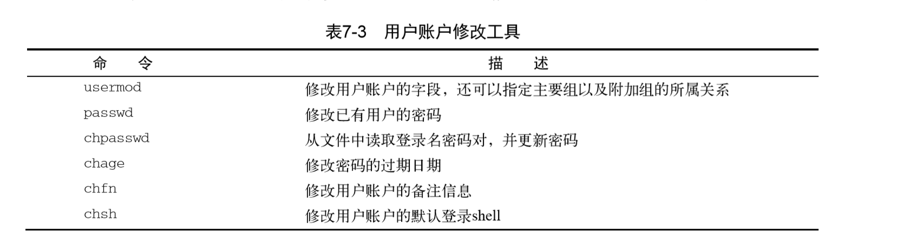
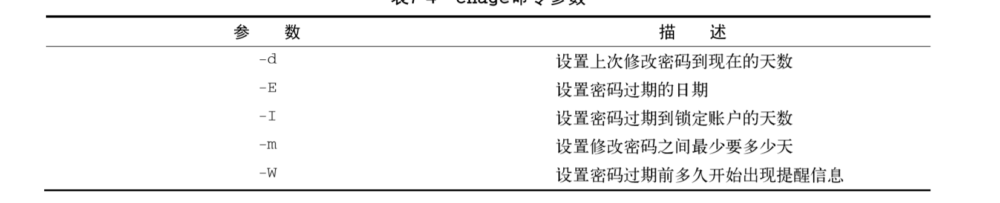

# 理解Linux文件权限

## Linux的安全性

Linux安全系统的核心是用户账户。每个能进入Linux系统的用户都会被分配唯一的用户账 户。用户对系统中各种对象的访问权限取决于他们登录系统时用的账户。 

用户权限是通过创建用户时分配的用户ID（User ID，通常缩写为UID）来跟踪的。UID是数 值，每个用户都有唯一的UID，但在登录系统时用的不是UID，而是登录名。

### /etc/passwd文件

Linux系统使用一个专门的文件来将用户的登录名匹配到对应的UID值。这个文件就是 /etc/passwd文件，它包含了一些与用户有关的信息。

root用户账户是Linux系统的管理员，固定分配给它的UID是0。

Linux系统会为各种各样的功能创建不同的用户账户，而这些账户并不是真的用户。这些账户叫作系统账 户，是系统上运行的各种服务进程访问资源用的特殊账户。所有运行在后台的服务都需要用一个 系统用户账户登录到Linux系统上。 

Linux为系统账户预留了500以下的UID值。有些服务甚至要用特定的UID才能正常工作。为普通用户创建账户时，，大多数Linux系统会从500开始，将第一个可用UID分配给这个账户（并非 所有的Linux发行版都是这样）。

/etc/passwd文件 的字段包含了如下信息： 

+ 登录用户名 
+ 用户密码 
+ 用户账户的UID（数字形式） 
+ 用户账户的组ID（GID）（数字形式） 
+ 用户账户的文本描述（称为备注字段） 
+ 用户HOME目录的位置 
+ 用户的默认shell 

现在，绝大多数Linux系统都将用户密码保存在另一个单独的文件中（叫作shadow文件，位置 在/etc/shadow）。只有特定的程序（比如登录程序）才能访问这个文件。 

### /etc/shadow文件

只有root用户才能访问/etc/shadow 文件，这让它比起/etc/passwd安全许多。 

/etc/shadow文件为系统上的每个用户账户都保存了一条记录。

如：
```
rich:$1$.FfcK0ns$f1UgiyHQ25wrB/hykCn020:11627:0:99999:7::: 
```
在/etc/shadow文件的每条记录中都有9个字段： 

+ 与/etc/passwd文件中的登录名字段对应的登录名 
+ 加密后的密码 
+ 自上次修改密码后过去的天数密码（自1970年1月1日开始计算） 
+ 多少天后才能更改密码 
+ 多少天后必须更改密码 
+ 密码过期前提前多少天提醒用户更改密码 
+ 密码过期后多少天禁用用户账户 
+ 用户账户被禁用的日期（用自1970年1月1日到当天的天数表示） 
+ 预留字段给将来使用 

使用shadow密码系统后，Linux系统可以更好地控制用户密码。它可以控制用户多久更改一 次密码，以及什么时候禁用该用户账户，如果密码未更新的话。 

### 添加新用户

用来向Linux系统添加新用户的主要工具是useradd。这个命令简单快捷，可以一次性创建 新用户账户及设置用户HOME目录结构。useradd命令使用系统的默认值以及命令行参数来设置 用户账户。

系统会将/etc/skel目录下的内容复制到用户的HOME目录下； 

默认情况下，useradd命令不会创建HOME目录，但是-m命令行选项会使其创建HOME目录。

> 运行本章中提到的用户账户管理命令，需要以root用户账户登录或者通过sudo命令以root 用户账户身份运行这些命令

### 删除用户

如果你想从系统中删除用户，userdel可以满足这个需求。默认情况下，userdel命令会只 删除/etc/passwd文件中的用户信息，而不会删除系统中属于该账户的任何文件。 

如果加上-r参数，userdel会删除用户的HOME目录以及邮件目录。然而，系统上仍可能存 有已删除用户的其他文件。这在有些环境中会造成问题。 

> 在有大量用户的环境中使用-r参数时要特别小心。你永远不知道用户是否在其HOME目 录下存放了其他用户或其他程序要使用的重要文件。记住，在删除用户的HOME目录之 前一定要检查清楚！ 

### 修改用户



**usermod**

usermod命令是用户账户修改工具中强大的一个。它能用来修改/etc/passwd文件中的大部 分字段，只需用与想修改的字段对应的命令行参数就可以了。参数大部分跟useradd命令的参数 一样（比如，-c修改备注字段，-e修改过期日期，-g修改默认的登录组）。除此之外，还有另外 一些可能派上用场的选项。

+ -l修改用户账户的登录名。 
+ -L锁定账户，使用户无法登录。 
+ -p修改账户的密码。 
+ -U解除锁定，使用户能够登录。 

-L选项尤其实用。它可以将账户锁定，使用户无法登录，同时无需删除账户和用户的数据。 要让账户恢复正常，只要用-U选项就行了。

**passwd和chpasswd**

系统上的任何用户都能改自己的密码，但只 有root用户才有权限改别人的密码

-e选项能强制用户下次登录时修改密码。你可以先给用户设置一个简单的密码，之后再强制 在下次登录时改成他们能记住的更复杂的密码。

chpasswd命令能从 标准输入自动读取登录名和密码对（由冒号分割）列表，给密码加密，然后为用户账户设置。你 也可以用重定向命令来将含有userid:passwd对的文件重定向给该命令。

**chsh、chfn和chage**

chsh、chfn和chage工具专门用来修改特定的账户信息。chsh命令用来快速修改默认的用 户登录shell。使用时必须用shell的全路径名作为参数，不能只用shell名。 

chfn命令提供了在/etc/passwd文件的备注字段中存储信息的标准方法。chfn命令会将用于 Unix的finger命令的信息存进备注字段，而不是简单地存入一些随机文本（比如名字或昵称之 类的），或是将备注字段留空。finger命令可以非常方便地查看Linux系统上的用户信息。 

> 出于安全性考虑，很多Linux系统管理员会在系统上禁用finger命令，不少Linux发行版 甚至都没有默认安装该命令。 

chage命令用来帮助管理用户账户的有效期。你需要对每个值设置多个参数


chage命令的日期值可以用下面两种方式中的任意一种： 

+ YYYY-MM-DD格式的日期 
+ 代表从1970年1月1日起到该日期天数的数值 