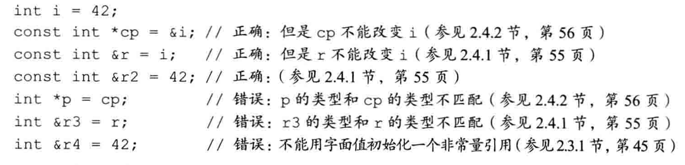
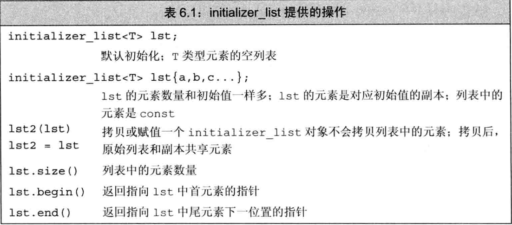
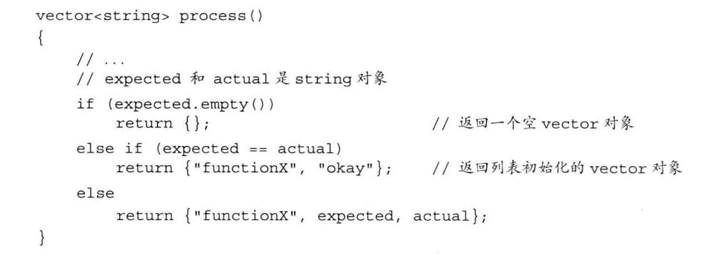
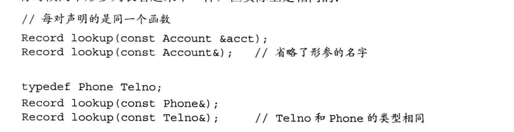
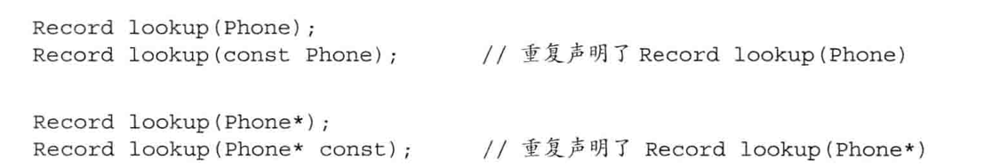
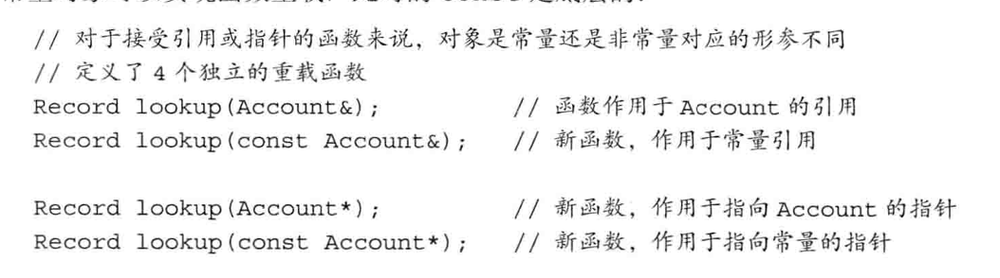
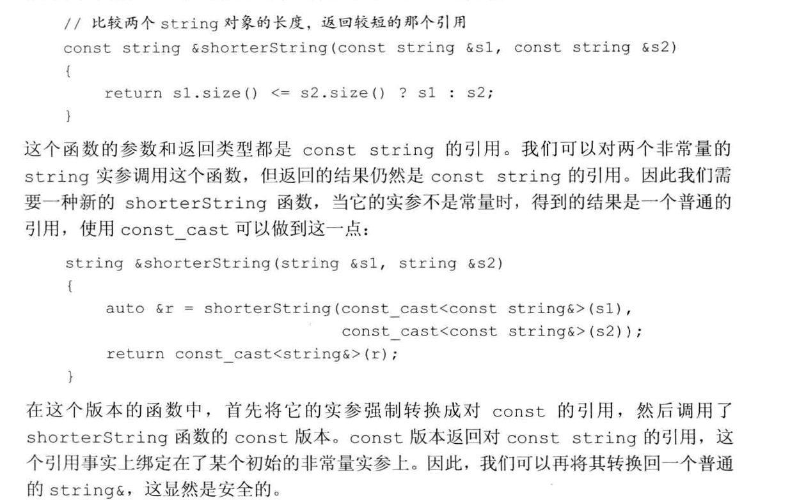

# 函数

## 函数基础

### 局部对象

在 C++语言中，名字有作用域，对象有生命周期(lifetime), 理解这两个概念非常重要。

+ 名字的作用域是程序文本的一部分，名字在其中可见。
+ 对象的生命周期是程序执行过程中该对象存在的一段时间。

**自动对象**

**局部静态对象**

### 函数声明

### 分离式编译

C++语言支持所谓的分离式编
译 （separate compilation）。分离式编译允许我们把程序分割到几个文件中去，每个文件独 立编译。

**编译和链接多个源文件**

------------------------------
## 参数传递

每次调用函数时都会重新创建它的形参，并用传入的实参对形参进行初始化

> 形参初始化的机理与变量初始化一样。

和其他变量一样，形参的类型决定了形参和实参交互的方式。如果形参是引用类型它将绑定到对应的实参上；否则，将实参的值拷贝后赋给形参。

当形参是引用类型时，我们说它对应的实参被引用传递(passed by reference) 或者函 数被传引用调用(called by reference)o 和其他引用一样，引用形参也是它绑定的对象的别 名；也就是说，引用形参是它对应的实参的别名。

当实参的值被拷贝给形参时，形参和实参是两个相互独立的对象。我们说这样的实参
被值 传 递 (passed by value) 或者函数被传值调用(called by value)。

### 传值参数

当初始化一个非引用类型的变量时，初始值被拷贝给变量。此时，对变量的改动不会影响初始值。
传值参数的机理完全一样，函数对形参做的所有操作都不会影响实参。

**指针形参**

指针的行为和其他非引用类型一样。当执行指针拷贝操作时，拷贝的是指针的值。拷
贝之后，两个指针是不同的指针。因为指针使我们可以间接地访问它所指的对象，所以通
过指针可以修改它所指对象的值。指针形参的行为与之类似

> 熟 悉 C 的程序员常常使用指针类型的形参访问函数外部的时象：在 C++语言中，建议使用引用类型的形参替代指针。

### 传引用参数

对于引用的操作实际上是作用在引用所引的对象上。引用形参的行为与之类似。

**使用引用避免拷贝**

拷贝大的类类型对象或者容器对象比较低效，甚至有的类类型(包括IO类型在内)
根本就不支持拷贝操作。当某种类型不支持拷贝操作时，函数只能通过引用形参访问该类
型的对象。

**使用引用形参返回额外信息**

一个函数只能返回一个值，然而有时函数需要同时返回多个值，引用形参为我们一次
返回多个结果提供了有效的途径。

一种方法是定义一个新的数据类型，让它包含两个成员。还有另一种更简单的方法，我们可以给函数传入一个额外的引用实参

### const形参和实参

和其他初始化过程一样，当用实参初始化形参时会忽略掉顶层const。换句话说，形参的 顶层const被忽略掉了。当形参有顶层const时，传给它常量对象或者非常量对象都是 可以的

在C++语言中，允许我们定义若干具有相同名字的函数，不过前提是不同函数的形参列表
应该有明显的区别。因为顶层const被忽略掉了，所以在上面的代码中传入两个fun 函 数的参数可以完全一样。因此第二个fun 是错误的，尽管形式上有差异，但实际上它的 形参和第一个fun 的形参没什么不同。
```cpp
void fun(const int i){/* fun 能够读取 i,但是不能向 i 写值 */}
void fun(int i){}//错误：重复定义了 fun（int）
```

在C++语言中，允许我们定义若干具有相同名字的函数，不过前提是不同函数的形参列表
应该有明显的区别。因为顶层const被忽略掉了，所以在上面的代码中传入两个fun 函 数的参数可以完全一样。因此第二个fun 是错误的，尽管形式上有差异，但实际上它的 形参和第一个fun 的形参没什么不同。

**指针或引用形参与const**

形参的初始化方式和变量的初始化方式是一样的,我们可以使用非常量初始化一个底层co n st对象，但是反过来不行；同 时一个普通的引用必须用同类型的对象初始化。


**尽量使用常量引用**

函数不会改变的形参定义成(普通的)引用是一种比较常见的错误，这么做带给函数的调用者一种误导，即函数可以修改它的实参的值。此外，使用引用而非常量引用也会
极大地限制函数所能接受的实参类型。就像刚刚看到的，我们不能把const对象、字面 值或者需要类型转换的对象传递给普通的引用形参。

### 数组形参

**数组引用形参**

C++语言允许将变量定义成数组的引用，基于同样的道理,
形参也可以是数组的引用。此时，引用形参绑定到对应的实参上，也就是绑定到数组上

```cpp
// 正确：形参是数组的引用，维度是类型的一部分
void print(int (&arr)[10]);
```

### 含有可变形参的函数

为了编写能处理不同数量实参的函数，C++11新标准提供了两种主要的方法：如果所
有的实参类型相同，可以传递一个名为initializer_list的标准库类型；如果实参的 类型不同，我们可以编写一种特殊的函数，也就是所谓的可变参数模板。

C++还有一种特殊的形参类型(即省略符)，可以用它传递可变数量的实参。

**initializer_ist 形参**

如果函数的实参数量未知但是全部实参的类型都相同,我们可以使用initializer_list类型的形参



定义initializer_list对象时，必须说明列表中所含元素的类型：
```cpp
initializer_list<string> ls;// initializer_list的元素类型是 string 
initializer_list<int> li； // initializer_list的元素类型是 int
```

和 vector不一样的是，initializer_list对象中的元素永远是常量值，我们无法改
变 initializer_list对象中元素的值。

如果想向initializer_list形参中传递一个值的序列，则必须把序列放在一对花 括号内
```cpp
// expected 和 actual 是 string 对象 
if (expected != actual) 
    error_msg(("functionX", expected, actual}); 
else 
    error_msg(("functionX", nokay"));
```
**省略符形参**

省略符形参是为了便于 C++程序访问某些特殊的c 代码而设置的，这些代码使用了名
为 varargs的C 标准库功能。通常，省略符形参不应用于其他目的

省略符形参只能出现在形参列表的最后一个位置

-------------------------------

## 返回类型和return语句

> 在含有return语句的循环后面应该也有一条return语句，如果没有的话该 程序就是错误的、很多编译器都无法发现此类错误。


**不要返回局部对象的引用或指针**

函数完成后，它所占用的存储空间也随之被释放掉。因此，函数终止意味着局部变量的引用将指向不再有效的内存区域

**引用返回左值**

函数的返类型决定函数调用是否是左值。调用一个返回引用的函数得到左值，其他返回类型得到右值。可以像使用其他左值那样来使用返回引用的函数的调用，特别是，我们能为返回类型是非常量引用的函数的结果赋值

**列表初始化返回值**

C++11新标准规定，函数可以返回花括号包围的值的列表。类似于其他返回结果，此处的列表也用来对表示函数返回的临时量进行初始化。如果列表为空，临时量执行值初始化，否则，返回的值由函数的返回类型决定。


如果函数返回的是内置类型，则花括号包围的列表最多包含一个值，而且该值所占空
间不应该大于目标类型的空间。如果函数返回的是类类型，由类本身定义初始值如何使用

**使用尾置返回类型**

任何函数的定义都能使用尾置返回，但是这种形式对于返回类型比 较复杂的函数最有效，比如返回类型是数组的指针或者数组的引用。尾置返回类型跟在形参列表后面并以一个->符号开头。为了表示函数真正的返回类型跟在形参列表之后，我们在本应该出现返回类型的地方放置一个auto：
```cpp
// func接受一个int类型的实参，返回一个指针，该指针指向含有10个整数的数组
auto func(int i) -> int (*)[10];
```

因为我们把函数的返回类型放在了形参列表之后，所以可以清楚地看到func函数返I可的 是一个指针，并且该指针指向了含有10个整数的数组。

**使用 decltype**

如果我们知道函数返回的指针将指向哪个数组，就可以使用decltype关键字声明返回类型。

```cpp
int odd[] = (1,3,5,7,9); 
int even[] = {0,2,4,6,8};
// 返回一个指针，该指针指向含有5 个整数的数组
decltype(odd) *arrPtr(int i)
{
    return (i % 2) ? &odd : Seven； //返回一个指向数组的指针
}
```
> 有一个地方需要注意：decltype并不负责把数组类型转换成对应的指针，所以 decltype的结果是个数组，要想表示arrPtr返I可指针还必须在函数声明时加一个* 符号

---------------------------------

## 函数重载

如果同一作用域内的几个函数名字相同但形参列表不同，我们称之为重载
(overloaded)函数。

这些函数接受的形参类型不一样，但是执行的操作非常类似。当调用这些函数时，编 译 器会根据传递的实参类型推断想要的是哪个函数

函数的名字仅仅是让编译器知道它调用的是哪个函数，而函数重载可以在一定程度上
减轻程序员起名字、记名字的负担。

> main函数不能重载.

对于重载的函数来说，它们应该在形参数量或形参类型上有所不同。

不允许两个函数除了返回类型外其他所有的要素都相同。假设有两个函数，它们的形
参列表一样但是返回类型不同，则第二个函数的声明是错误的.

**判断两个形参的类型是否相异**

有时候两个形参列表看起来不一样，但实际上是相同的。

**重载和const形参**

一个拥有顶层const的形参无法和另一个没有顶层const的形参区分开来

如果形参是某种类型的指针或引用，则通过区分其指向的是常量对象还是非常量对象可以实现函数重载，此时的const是底层的。


**const_cast 和重载**

const_cast在重载函数的情景中最有用。




### 重载与作用域

> 在C++语言中，名字查我发生在类型检查之前

-----------------------------

## 特殊用途语言特性

## 默认实参

某些函数有这样一种形参，在函数的很多次调用中它们都被赋予一个相同的值，此时，
我们把这个反复出现的值称为函数的默认实参(default argument).调用含有默认实参的函 数时，可以包含该实参，也可以省略该实参。

```cpp
typedef string:: size_type sz; // 关于 typedef 参见 2.5.1 节 (第 60 页) 
string screen (sz ht = 24, sz wid = 80, char backgrnd = ' ' ) 
```

默认实参作为形参的初始值出现在形参列表
中。我们可以为一个或多个形参定义默认值，不过需要注意的是，**一旦某个形参被赋予了
默认值，它后面的所有形参都必须有默认值**

当设计含有默认实参的函数时，其中一项任务是合理设置形参的顺序，尽量让不怎么
使用默认值的形参出现在前面，而让那些经常使用默认值的形参出现在后面。

局部变量不能作为默认实参。除此之外，只要表达式的类型能转换成形参所需的类型,
该表达式就能作为默认实参

用作默认实参的名字在函数声明所在的作用域内解析，而这些名字的求值过程发生在函数
调用时

### 内联函数和constexpr

在大多数机器上，一次函数调用其实包含着一系列工作：调用前要
先保存寄存器，并在返回时恢复；可能需要拷贝实参；程序转向一个新的位置继续执行。

**内联函数可避免函数调用的开销**

将函数指定为内联函数(inline),通常就是将它在每个调用点上“内联地”展开。

在函数的返回类型前面加上关键字inline ,这样就可以将它声明 成内联函数了

> 内联说明只是向编译器发出的一个请求，编译器可以选择忽略这个请求

—般来说，内联机制用于优化规模较小、流程直接、频繁调用的函数。很多编译器都不支
持内联递归函数

**constexpr函数**

constexpr函 数 (constexpr function) 是指能用于常量表达式的函数。定义 constexpr函数的方法与其他函数类似，不过要遵循几项约定：函数的返回 类型及所有形参的类型都得是字面值类型，而且函数体中必须有且只有一条return语句。
```cpp
constexpr int new_sz() { return 42; } 
constexpr int foo = new_sz () ; // 正确：foo 是一个常量表达式
```
 把 new _sz定义成无参数的constexpr函数。因为编译器能在程序编译时验证 new _sz函数返回的是常量表达式，所以可以用new _sz函数初始化constexpr类型的 变量foo。

 执行该初始化任务时，编译器把对constexpr函数的调用替换成其结果值。为了能 在编译过程中随时展开，constexpr函数被隐式地指定为内联函数。 

 constexpr函数体内也可以包含其他语句，只要这些语句在运行时不执行任何操作 就行。

 > constexpr函数不一定返回常量表达式。

 过，对于某个给定的内
联函数或者constexpr函数来说，它的多个定义必须完全一致。基于这个原因，内联函 数和constexpr函数通常定义在头文件中。

-------------------------------------
## 函数匹配

函数匹配的第一步是选定本次调用对应的重载函数集，集合中的函数称为候选函数
(candidate function)。候选函数具备两个特征：一是与被调用的函数同名，二是其声明在
调用点可见。

第二步考察本次调用提供的实参，然后从候选函数中选出能被这组实参调用的函数，
这些新选出的函数称为可行函数(viable ftinction)。可行函数也有两个特征：一是其形参
数量与本次调用提供的实参数量相等，二是每个实参的类型与对应的形参类型相同，或者
能转换成形参的类型。

在使用实参数量初步判别了候选函数后，接下来考察实参的类型是否与形参匹配。和
―般的函数调用类似，实参与形参匹配的含义可能是它们具有相同的类型，也可能是实参
类型和形参类型满足转换规则。

> 如果没找到可行函数，编译器将报告无匹配函数的错

函数匹配的第三步是从可行函数中选择与本次调用最匹配的函数。在这一过程中，逐
一检查函数调用提供的实参，寻找形参类型与实参类型最匹配的那个可行函数。它的基本思想是，实参类型与形参类型越接近，它们匹配得越好。


编译器依次检查每个实参以确定哪个函数是最佳匹配。如果有且只有 一个函数满足下列条件，则匹配成功：
+ 该函数每个实参的匹配都不劣于其他可行函数需要的匹配。
+ 至少有一个实参的匹配优于其他可行函数提供的匹配。

如果在检查了所有实参之后没有任何一个函数脱颖而出，则该调用是错误的。编译器将报
告二义性调用的信息。

> 用重载函数时应尽量避免强制类型转换 如果在实际应用中确实需要强制类型转换，则说明我们设计的形参集合不合理。

### 实参类型转换

为了确定最佳匹配，编译器将实参类型到形参类型的转换划分成儿个等级，具体排序
如下所示：

1. 精确匹配，包括以下情况：
  
    + 实参类型和形参类型相同。
    + 实参从数组类型或函数类型转换成对应的指针类型
    + 向实参添加顶层const或者从实参中删除顶层const
2. 通过const转换实现的匹配
3. 通过类型提升实现的匹配
4. 通过算术类型转换或指针转换实现的匹配。
5. 通过类类型转换实现的匹配

-----------------------------------

## 函数指针

函数指针指向的是函数而非对象。和其他指针一样，函数指针指向某种特定类型。函
数的类型由它的返回类型和形参类型共同决定，与函数名无关。

