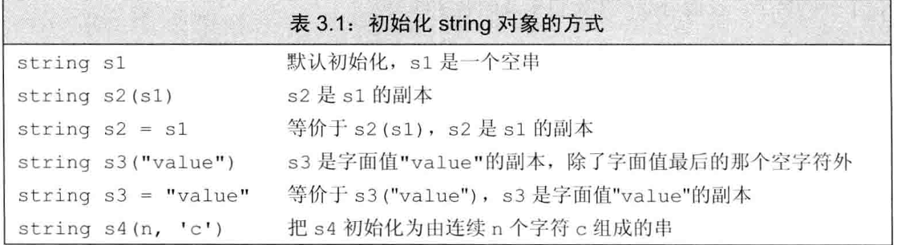
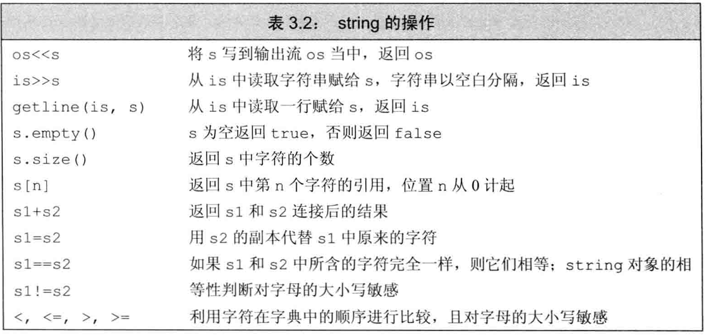
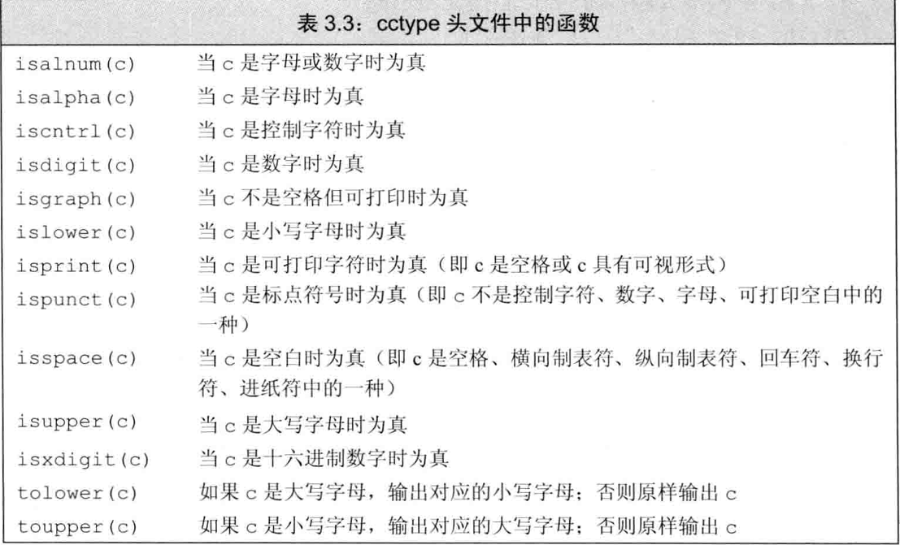
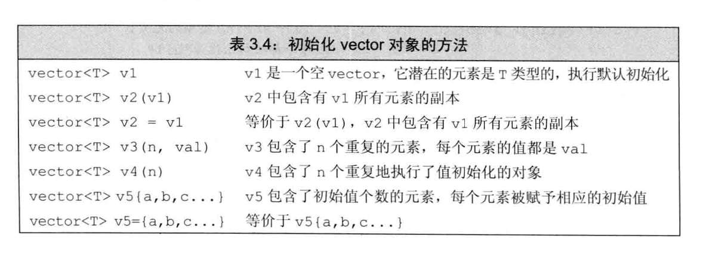
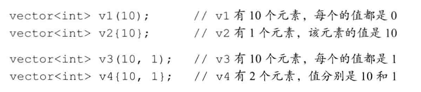

# 字符串、向量和数组

string和 vector是两种最重耍的标准库类型，前者支持可变长字符串，后者则 表示可变长的集合。还有一种标准库类型是迭代器，它是string和vector的配套类型，
常被用于访问string中的字符或vector中的元素。

-----------------------------
## 命名空间的using声明

std::cin 表示从标准输入中读取内容。此处使用作用域操作符(::)的含义是：编译器应从操作符左侧名字所示的作用域中寻找右侧那个名字。因此，std::cin 的意思就是要使用命名空间std中的名字cin。

有了using声明就无须专门的前缀(形如命名空间::)也能使用所需的名字了。using声明具有如下的形式：
```c++
using namespace ::name
```
一旦声明了上述语句，就可以直接访问命名空间中的名字：
```cpp
#include <iostream>
// using声明，当我们使用名字cin时，从命名空间std中获取它
using std::cin;
int main()
{
int i;
cin » i; // 正确：cin和 std::cin含义相同
cout « i; // 错误：没有对应的using 声明，必须使用完整的名字
std: :cout « i; // 正确：显式地从std中使用cout return 0;
}
```
**每个名字都需要独立的using声明**
按照规定，每个using 声明引入命名空间中的一个成员。例如，可以把要用到的标 准库中的名字都以using声明的形式表示出来

**头文件不应包含using声明**

位于头文件的代码一般来说不应该使用using声明。这 是因为头文件的内容会拷贝到所有引用它的文件中去，如果头文件里有某个using声明， 那么每个使用了该头文件的文件就都会有这个声明。对于某些程序来说，由于不经意间包
含了一些名字，反而可能产生始料未及的名字冲突。

----------------------
## 标准库类型string

标准库类型string表示可变长的字符序列，使 用 string类型必须首先包含string头文件。作为标准库的一部分，string定义在命名空间std中。
```c++
#include<string>
using std::string;
```
> C++标准一方面对库类型所提供的操作做了详细规定，另一方面也对库的实现做出一些性能上的需求。因此，标准库类型对于一般应用场合来说有足够的效率。

### 定义和初始化string对象

如何初始化类的对象是由类本身决定的。一个类可以定义很多种初始化对象的方式，
只不过这些方式之间必须有所区别：或者是初始值的数量不同，或者是初始值的类型不同。
初始化string对象最常用的一些方式：
```c++
string s1; // 默认初始化，si是一个空字符串
string s2=s1; // s2是 s1的副本
string s3="hiya"; // s3是该字符串字面值的副本
string s4=(10, 'c'); //s4 的内容是 cccccccccc
```
> 如果提供了一个字符串 字面值,则该字面值中除了最后那个空字符外其他所有的字符都被拷贝到新创建的string 对象中去。



**直接初始化和拷贝初始化**

C++语言有几种不同的初始化方式，通过string 我们可以清楚地看到在这些初始化方式之间到底有什么区别和联系。如果使用等号(=)
初始化一个变量，实际上执行的是拷贝初始化(copy initialization),编译器把等号右侧的
初始值拷贝到新创建的对象中去。与之相反，如果不使用等号，则执行的是直接初始化( direct initialization ) 。

### string对象上的操作

—个类除了要规定初始化其对象的方式外，还要定义对象上所能执行的操作。其中，
类既能定义通过函数名调用的操作也能定义<<、+等各种运算符在该类对象上的新含义。


**读写string对象**

可以使用IO操作符读写string对象：
> 在执行读取操作时，string对象会自动忽略开头的空白（即空格符、换行符、制表符等）并从 第一个真正的字符开始读起，直到遇见下一处空白为止。

**读取未知数量的string对象**

```c++
int main()
{
string word; while (cin >> word) // 反复读取，直至到达文件末尾
cout « word << endl; // 逐个输出单词，每个单词后面紧跟一个换行
return 0;
}
```
该条件负责在读取时检测流的情况，如果流有效，也就是说没遇到文件结束标记或非法输入，那么执行while语句内部的操作。此时，循环体将输出刚刚从标 准输入读取的内容。重复若干次之后，一旦遇到文件结束标记或非法输入循环也就结束了。

**使用getline读取一整行**

有时我们希望能在最终得到的字符串中保留输入时的空白符，这时应该用getline 函数代替原来的>>运算符。getline函数的参数是一个输入流和一个string对象，函 数从给定的输入流中读入内容，直到遇到换行符为止(注意换行符也被读进来了)，然后
把所读的内容存入到那个string对象中去(注意不存换行符)。getline只要一遇到换 行符就结束读取操作并返回结果，哪怕输入的一开始就是换行符也是如此。如果输入真的—开始就是换行符，那么所得的结果是个空string。 

和输入运算符一样，getline也会返回它的流参数。因此既然输入运算符能作为判断的条件，我们也能用getline的结果作为条件。例如，可以 通过改写之前的程序让它一次输出一整行，而不再是每行输出一个词了：
```c++
int main()
{
string line;
// 每次读入一整行，直至到达文件末尾
while (getline(cin, line))
cout << line << endl; 
return 0;
}
```
因为line中不包含换行符，所以我们手动地加上换行操作符。和往常一样，使用endl 结束当前行并刷新显示缓冲区。

> 触发getline函数返回的那个换行符实际上被丢弃掉了，得到的string对象中并不包含该换行符

**string 的 empty 和 size 操作**

empty函数根据string对象是否为空返回一个对应的布尔值

size函数返回string对象的长度(即string对象中字符的个数)

**string::size_type 类型**

对于size函数来说，返回一个int或者如前面所述的那样返回—个unsigned似乎都是合情合理的。但其实size函数返回的是一个 string::size_type 类型的值.

string类及其他大多数标准库类型都定义了几种配套的类型。这些配套类型体现了 标准库类型与机器无关的特性，类型size_type即是其中的一种。在具体使用的时候， 通过作用域操作符来表明名字size_type是在类s tring中定义的。 

过去，string::size_type这种类型有点儿神秘，不太容易理解和使用。在 C++11新 标准中，允许编译器通过auto或者decltype来推断变量的类型：
```c++
auto len = line.size(); //len的类型是string::size_type
```
由于size函数返回的是一个无符号整型数，因此切记，如果在表达式中混用了带符 号数和无符号数将可能产生意想不到的结果。例如，假设n 是 一个具有负值的int, 则表达式s.size()< n的判断结果几乎肯定是true。这是因为负值n会自动地转换成一个比较大的无符号值。

> 如果一条表达式中已经有了size()函数就不要再使用int了，这样可以避免混用int和unsigned 可能带来的问题。

**比较string对象**

相等性运算符（==和!=）分别检验两个string对象相等或不相等，string对象相 等意味着它们的长度相同而且所包含的字符也全都相同。关系运算符＜、＜=、＞、＞=分别
检验一个string对象是否小于、小于等于、大于、大于等于另外一个string对象。上 述这些运算符都依照（大小写敏感的）字典顺序:
+ 如果两个string对象的长度不同，而且较短string对象的每个字符都与较长 string对象对应位置上的字符相同，就说较短string对象小于较长string 对象。
+ 如果两个string对象在某些对应的位置上不一致，则 string对象比较的结果 其实是string对象中第一对相异字符比较的结果

**为 string对象赋值**

一般来说，在设计标准库类型时都力求在易用性上向内置类型看齐，因此大多数库类
型都支持赋值操作。对于string类而言，允许把一个对象的值赋给另外一个对象

**两个string对象相加**

两个string对象相加得到一个新的string对象，其内容是把左侧的运算对象与右 侧的运算对象串接而成。也就是说，对 string对象使用加法运算符（+ ）的结果是一个 新的string对象，它所包含的字符由两部分组成：前半部分是加号左侧string对象所 含的字符、后半部分是加号右侧string对象所含的字符。另外，复合赋值运算符（+=）负责把右侧string对象的内容追加到左侧string对象的 后面：

**字面值和string对象相加**

当把string对象和字符字面值及字符串字面值混在一条语句中使用时，必须确保每个加 法运算符( + ) 的两侧的运算对象至少有一个是string：
```c++
string s4 = si + ","; // 正确：把 一 个 string对象和一个字面值相加 
string s5 = "hello" + ","; // 错误：两个运算对象都不是string

// 正确：每个加法运算符都有一个运算对象是string
string s6 = sl + ", " + world'; 
string s7 = "hello" + "," + s2; // 错误：不能把字面值直接相加
```
> 因为某些历史原因，也为了与C 兼容，所以C++语言中的字符串字面值并不是
标准库类型string的对象 切记，字符串字面值与string是不同的类型。

### 处理string对象中的字符 

在cctype头文件中定义了一组标 准库函数处理这部分工作:


**处理每个字符？使用基于范围的for语句**

如果想对string 对象中的每个字符做点儿什么操作，目前最好的办法是使用C++11 新标准提供的一种语句：范围for（range for） 语句。这种语句遍历给定序列中的每个元 素并对序列中的每个值执行某种操作，其语法形式是：
```
for （declaration : expression）
statement
```
其中，expression部分是一个对象，用于表示一个序列。declaration部分负责定义一个变 量，该变量将被用于访问序列中的基础元素。每次迭代，declaration部分的变量会被初始 化为expression部分的下一个元素值。 

```c++
string str("some string");
// 每行输出str中的一个字符
for (auto c :str)
    cout<<c<<endl;
```

for循环把变量c 和 str联系了起来，其中我们定义循环控制变量的方式与定义任意一 个普通变量是一样的。此例中，通过使用auto关键字让编译 器来决定变量c 的类型，这里c 的类型是char。每次迭代，str的下一个字符被拷贝给 c,因此该循环可以读作“对于字符串str中的每个字符c,”执行某某操作。此例中的“某某操作”即输出一个字符，然后换行。

**使用范围for语句改变字符串中的字符**

如果想要改变string对象中字符的值，必须把循环变量定义成引用类型。记住，所谓引用只是给定对象的一个别名，因此当使用引用作为循环控制变量时，这个变量实际上被依次绑定到了序列的每个元素上。使用这个引用，我们就能改变它绑定的字符。

**只处理一部分字符**

要想访问string对象中的单个字符有两种方式：一种是使用下标，另外一种是使用迭代器

下标运算符( [ ] ) 接收的输入参数是string::size_type类型的值，这个参数表示要访问的字符的位置；返回值草该位置上字符的引用。

> 下标的值称作“下标”或 “索引”，任何表达式只要它的值是一个整型值就能作为索
弓I。不过，如果某个索引是带符号类型的值将自动转换成由string::size_type表达的无符号类型

**使用下标执行迭代**

```c++
// 依次处理S 中的字符直至我们处理完全部字符或者遇到一个空白
for (decltype(s.size()) index = 0; 
    index != s.size () && !isspace(s[index]); ++index) 
        s [index] = toupper (s [index] ) ; //将当前字符改成大写形式
```

在上述程序中，for 循环使用变量index 作为s 的下标，index 的类型是由decltype 关键字决定的。首先把index初始化为0 , 这样第一次迭代就会从s 的首字符开始；之 后每次迭代将index加 1 以得到s 的下一个字符。循环体负责将当前的字母改写为大写 形式。

> 使用下标时必须确保其在合理范围之内，也就是说，下标必须大于等于0 而小于字
符串的size()的值。一种简便易行的方法是，总是设下标的类型为 string::size_type ,因为此类型是无符号数，可以确保下标不会小于0。此时，代码只需保证下标木于size()的值就可以了。

-----------------------
## 标准库类型vector

标准库类型vector表示对象的集合，其中所有对象的类型都相同。集合中的每个对 象都有一个与之对应的索引，索引用于访问对象。因为vector"容纳着”其他对象，所 以它也常被称作容器(container).

C++语言既有类 模 板 (class template),也有函数模板，其中vector是一个类模板。
只有对C++有了相当深入的理解才能写出模板

模板本身不是类或函数，相反可以将模板看作为编译器生成类或函数编写的一份说
明。编译器根据模板创建类或函数的过程称为实 例 化 (instantiation),当使用模板时，需 要指出编译器应把类或函数实例化成何种类型。

对于类模板来说，我们通过提供一些额外信息来指定模板到底实例化成什么样的类，
需要提供哪些信息由模板决定。提供信息的方式总是这样：即在模板名字后面跟一对尖括
号，在括号内放上信息。

```c++
vector<int> ivec;   // ivec 保存 int 类型的对象 
vector<vector<string>> file; // 该向量的元素是 vector 对象
```

vector能容纳绝大多数类型的对象作为其元素，但是因为引用不是对象所以不存在包含引用的vector除此之外，其他大多数(非引用)内置 类型和类类型都可以构成vector对象，甚至组成vector的元素也可以是vector。 

### 定义和初始化vector对象



最常见的方式就是先定义一个空vector,然后当运 行时获取到元素的值后再逐一添加。

**列表初始化vector对象**

```c++
vector<string> articles = ("au" , "an", "the"};
```

**值初始化**

通常情况下，可以只提供Vector对象容纳的元素数量而不用略去初始值。此时库会 创建一个值初始化的(value-initialized)元素初值，并把它赋给容器中的所有元素。这个 初值由vector对象中元素的类型决定。

如果vector对象的元素是内置类型，比如int,则元素初始值自动设为0。如果元 素是某种类类型，比如string,则元素由类默认初始化：
```c++
vector<int> ivec(10); // 10个元素，每个都初始化为0
vector<string> svec(10);// 10个元素，每个都是空string对象
```

如果只提供了元素的数量而没有设定初始值，只能使用直接初始化：
```cpp
vector<int> vi = 10;    // 错误：必须使用直接初始化的形式指定向量大小
```

**列表初始值还是元素数量**

在某些情况下，初始化的真实含义依赖于传递初始值时用的是花括号还是圆括号。例
如，用一个整数来初始化vector<int>时，整数的含义可能是vector对象的容量也可 能是元素的值。类似的，用两个整数来初始化vector<int>时，这两个整数可能一个是 vector对象的容量，另一个是元素的初值，也可能它们是容量为2 的vector对象中两 个元素的初值。通过使用花括号或圆括号可以区分上述这些含义：


如果初始化时使用了花括号的形式但是提供的值又不能用来列表初始化，
就要考虑用这样的值来构造vector对象了。例如，要想列表初始化一个含有string对象的vector对象，应该提供能赋给string对象的初值。此时不难区分到底是要列表初 始化vector对象的元素还是用给定的容量值来构造vector对象：


### 向 vector对象中添加元素

