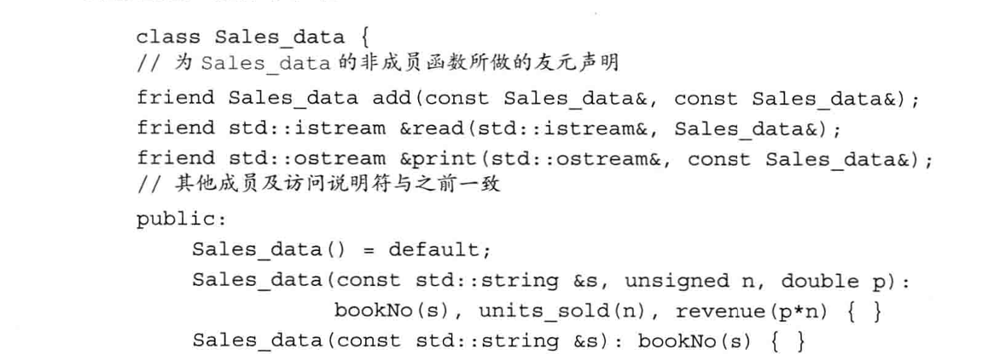

# 类

类的基本思想是数据 抽 象 （data abstraction） 和 封 装 （ encapsulation） - 数据抽象是一
种依赖于接口（interface） 和 实 现 （implementation） 分离的编程（以及设计）技术。类的 接口包括用户所能执行的操作：类的实现则包括类的数据成员、负责接口实现的函数体以
及定义类所需的各种私有函数。

封装实现了类的接口和实现的分离。封装后的类隐藏了它的实现细节，也就是说，类
的用户只能使用接口而无法访问实现部分。


类要想实现数据抽象和封装，需要首先定义一个抽象数据类型（abstract data type）□ 在抽象数据类型中，由类的设计者负责考虑类的实现过程：使用该类的程序员则只需要抽
象地思考类型做了什么，而无须了解类型的工作细节。

## 定义抽象数据类型

### 设计Sale_data类

 sales_data的接口应该包含以下操作：

 + —个isbn成员函数，用于返回对象的ISBN编号  
 + —个 combine成员函数，用于将一个Sales_data对象加到另一个对象上 
 + —个名为add 的函数，执行两个Sales_data对象的加法
 + 一 个 read 函数，将数据从istream读入到Sales_data 对象中 
 + —个print函数，将 Sales_data 对象的值输出到ostream

### 定义改进的Sale_data类

**定义成员函数**

尽管所有成员都必须在类的内部声明，但是成员函数体可以定义在类内也可以定义在类外。

**引入this**

成员函数通过一个名为this 的额外的隐式参数来访问调用它的那个对象。当我们调 用一个成员函数时，用请求该函数的对象地址初始化this,

在成员函数内部，我们可以直接使用调用该函数的对象的成员，而无须通过成员访问
运算符来做到这一点，因为this所指的正是这个对象。任何对类成员的直接访问都被看 作 this的隐式引用，也就是说，当 isbn使用bookNo时，它隐式地使用this指向的成员，就像我们书写了 this->bookNo —样。

this形参是隐式定义的。实际上，任何自定义名为this的参数或变量的行为都是非法的。

this的目的总是指向"这个"对象，所以 this是一个常量指针，我们不允许改变this中保存的地址。

**引入const成员函数**

默认情况下,this的类型是指向类类型非常量版本的常量指针。

(在默认蓿况下)我们不能把this绑定到一个常量对象上

把this设置为指向常量的指针有助于提高函数的灵活性。 然而，this是隐式的并且不会出现在参数列表中，所以在哪儿将this声明成指向 常量的指针就成为我们必须面对的问题。C++语言的做法是允许把const关键字放在成员 函数的参数列表之后，此时，紧跟在参数列表后面的const表示this是一个指向常量 的指针。像这样使用const的成员函数被称作常量成员函数(const member function)。 

> 常量对象，以及常量对象的引用或指针都只能调用常量成员函数。

**类作用域和成员函数函数**

类本身就是一个作用域 类的成员函数的定义嵌套在类的作用域之内

编译器分两步处理类：首先编译成员
的声明，然后才轮到成员函数体(如果有的话)。因此，成员函数体可以随意使用类中的
其他成员而无须在意这些成员出现的次序。


**在类外部定义的成员函数**

像其他函数一样，当我们在类的外部定义成员函数时，成员函数的定义必须与它的声
明匹配。也就是说，返回类型、参数列表和函数名都得与类内部的声明保持一致。如果成
员被声明成常量成员函数，那么它的定义也必须在参数列表后明确指定const属性。同 时，类外部定义的成员的名字必须包含它所属的类名：
```cpp
double Sales_data::avg_price() const
{
    if (units_sold)
        return revenue/units_sold;
    else
        return 0;
}
```

**定义一个返回this对象的函数**

一般来说，当我们定义的函
数类似于某个内置运算符时，应该令该函数的行为尽量模仿这个运算符。

### 定义类相关的非成员函数

类的作者常常需要定义一些辅助函数，比如add、read和print等。尽管这些函数 定义的操作从概念上来说属于类的接口的组成部分，但它们实际上并不属于类本身。

我们定义非成员函数的方式与定义其他函数一样，通常把函数的声明和定义分离开来。如果函数在概念上属于类但是不定义在类中，则它一般应与
类声明(而非定义)在同一个头文件内。在这种方式下，用户使用接口的任何部分都只需
要引入一个文件。

> 一般来说，如果非成员函数是类接口的组成部分，则这些函数的声明应该与类在同一个头文件内


### 构造函数

每个类都分别定义了它的对象被初始化的方式，类通过一个或几个特殊的成员函数来
控制其对象的初始化过程，这些函数叫做构造函数（constructor）。构造函数的任务是初始 化类对象的数据成员，无论何时只要类的对象被创建，就会执行构造函数。

构造函数的名字和类名相同。和其他函数不一样的是，构造函数没有返回类型；除此
之外类似于其他的函数，构造函数也有一个（可能为空的）参数列表和一个（可能为空的）
函数体。类可以包含多个构造函数，和其他重载函数差不多，不
同的构造函数之间必须在参数数量或参数类型上有所区别。

不同于其他成员函数，构造函数不能被声明成const的。 当我们创建类的一个const对象时，直到构造函数完成初始化过程，对象才能真正取得 其 “常量”属性。因此，构造函数在const对象的构造过程中可以向其写值。


**合成的默认构造函数**

类通过一个特殊的构造函数来控制默认初始化过程，这个函数叫做默认构
造 函 数 （ default constructor）- 默认构造函数无须任何实参。

默认构造函数在很多方面都有其特殊性。其中之一是，如果我们的类没
有显式地定义构造函数，那么编译器就会为我们隐式地定义一个默认构造函数。

编 译 器 创 建 的 构 造 函 数 又 被 称 为 合 成 的 默 认 构 造 函 数 （synthesized default constructor）o 对于大多数类来说，这个合成的默认构造函数将按照如下规则初始化类的数 据成员：

+ 如果存在类内的初始值，用它来初始化成员。
+ 否则，默认初始化该成员。

**某些类不能依赖于合成的默认构造函数**

合成的默认构造函数只适合非常简单的类， 对于一个普通的类来说，必须定义它自己的默认构造函数，原因有三：第一个原因也是最
容易理解的一个原因就是编译器只有在发现类不包含任何构造函数的情况下才会替我们
生成一个默认的构造函数。一旦我们定义了一些其他的构造函数，那么除非我们再定义一
个默认的构造函数，否则类将没有默认构造函数。这条规则的依据是，如果一个类在某种
情况下需要控制对象初始化，那么该类很可能在所有情况下都需要控制。

> 只有当类没有声明任何构造函数时，编译器才会自动地生成默认构造函数。

第二个原因是对于某些类来说，合成的默认构造函数可能执行错误的操作。如果定义在块中的内置类型或复合类型（比如数组和指针）的对象被默认
初始化，则它们的值将是未定义的。该准则同样适用于默认初
始化的内置类型成员。因此，含有内置类型或复合类型成员的类应该在类的内部初始化这
些成员，或者定义一个自己的默认构造函数。否则，用户在创建类的对象时就可能得到未
定义的值。

> 如果类包含有内置类型或者复合类型的成员，则只有当这些成员全都被赋予了
类内的初始值时，这个类才适合于使用合成的默认构造函数.

第三个原因是有的时候编译器不能为某些类合成默认的构造函数。例如，如果类中包
含一个其他类类型的成员且这个成员的类型没有默认构造函数，那么编译器将无法初始化
该成员。对于这样的类来说，我们必须自定义默认构造函数，否则该类将没有可用的默认
构造函数。

**= default的含义**

在 C++11新标准中，如果我们需要默认的行为，那么可以通过在参数列表后面写上 = default来要求编译器生成构造函数。其中，= default既可以和声明一起出现在 类的内部，也可以作为定义出现在类的外部。和其他函数一样，如果= default在类的仲子 内部，则默认构造函数是内联的；如果它在类的外部，则该成员默认情况下不是内联的。

> 如果编译器不支持类内初始值，那么你的默认构造函教就应该使用构造函数初始值列表来初始化类的每个成员

**构造函数初始值列表**

构造函数初始值列表(constructor initialize list),
它负责为新创建的对象的一个或几个数据成员赋初值。构造函数初始值是成员名字的一个
列表，每个名字后面紧跟括号括起来的(或者在花括号内的)成员初始值。不同成员的初
始化通过逗号分隔开来。

当某个数据成员被构造函数初始值列表 忽略时：它将以与合成默认构造函数相同的方式隐式初始化。

通常情况下，构造函数使用类内初始值不失为一种好的选择，因为只要这样的初始值存在
我们就能确保为成员赋予了一个正确的值。不过，如果你的编译器不支持类内初始值，则
所有构造函数都应该显式地初始化每个内置类型的成员。

> 构造函数不应该轻易覆盖掉类内的初始值，除非新赋的值与原值不同：如果你不能使用类内初始值，则所有构造函数都应该显式地初始化每个内置类型的
成员

**在类的外部定义构造函数**

和其他成员函数一样，当我们在类的外部定义构造函数时，必须指明该构造函数是哪个类的成员。

没有出现在构造函数初始值列表中的成员将通过相应的类内初始值(如果存在的话)
初始化，或者执行默认初始化。


### 拷贝、赋值和析构

除了定义类的对象如何初始化之外，类还需要控制拷贝、赋值和销毁对象时发生的行
为。对象在几种情况下会被拷贝，如我们初始化变量以及以值的方式传递或返回一个对象
等。当我们使用了赋值运算符时会发生对象的赋值操作。当对象不再存在时执行销毁的操作，比如一个
局部对象会在创建它的块结束时被销毁，当vector对 象 （或 者数组）销毁时存储在其中的对象也会被销毁。

如果我们不主动定义这些操作，则编译器将替我们合成它们。一般来说，编译器生成
的版本将对对象的每个成员执行拷贝、赋值和销毁操作。


## 访问控制与封装

在 C++语言中，我们使用访问说明符(access specifiers)加强类的封装性： 

+ 定义在public说明符之后的成员在整个程序内可被访问，public 成员定义类的接口
+ 定义在private说明符之后的成员可以被类的成员函数访问，但是不能被使用该 类的代码访问，private 部分封装了(即隐藏了)类的实现细节。

一个类可以包含0 个或多个访问说明符，而且对于某个访问说明符能出现多少次也没
有严格限定。每个访问说明符指定了接下来的成员的访问级别，其有效范围直到出现下一
个访问说明符或者到达类的结尾处为止。

**使用 class或 struct关键字**

struct和 class 的默认访问权限不太一样。 

> 使用class和 struct定义类唯一的区别就是默认的访问权限

### 友元

类可以允许其他类或者函数访问它的非公有成员，方法是令其他类或者函数成为它的
友 元 (friend)。如果类想把一个函数作为它的友元，只需要增加一条以friend关键字开 始的函数声明语句即可：


友元声明只能出现在类定义的内部，但是在类内出现的具体位置不限。友元不是类的成员
也不受它所在区域访问控制级别的约束。

> 一般来说，最好在类定义开始或结束前的位置集中声明友元，

**友元的声明**

友元的声明仅仅指定了访问的权限，而非一个通常意义上的函数声明。如果我们希望
类的用户能够调用某个友元函数，那么我们就必须在友元声明之外再专门对函数进行一次
声明。

为了使友元对类的用户可见，我们通常把友元的声明与类本身放置在同一个头文件中
（类的外部）。

---------------------------
## 类的其他特性

类型成员、类的成员的类内初始亶、可变数据成员、内联成员函数、从成员
函数返回*this、关于如何定义并使用类类型及友元类的更多知识。

### 类成员再探

定义一对相互关联的类，它们分别是Screen和
Window_mgr。

除了定义数据和函数成员之外，类还可以自定义某种类型在类中的别名。由类定义的
类型名字和其他成员一样存在访问限制，可以是public或者private中的一种

**令成员作为内联函数**

在类中，常有一些规模较小的函数适合于被声明成内联函数。定义在类内部的成员函数是自动inline的 

我们可以在类的内部把inline作为声明的一部分显式地声明成员函数，同样的，也 能在类的外部用inline关键字修饰函数的定义

虽然我们无须在声明和定义的地方同时说明inline,但这么做其实是合法的。不过，最 好只在类外部定义的地方说明inline,这样可以使类更容易理解。 

**重载成员函数**

和非成员函数一样，成员函数也可以被重载，只要函数之间在参数的数量和/或类型上有所区别就行。

**可变数据成员**

有 时 （但并不频繁）会发生这样一种情况，我们希望能修改类的某个数据成员，即
使是在一个const成员函数内。可以通过在变量的声明中加入mutable关键字做到这 —*点。


一个可变数据成员（mutable data member）永远不会是const,即使它是const对象的成员。因此，一个 const成员函数可以改变一个可变成员的值。

**类数据成员的初始值**

> 当我们提供一个类内初始值时，必须以符号=或者花括号表示.

### 返回*this的成员函数

返回引用的函数是左值，意味着这些函数返回
的是对象本身而非对象的副本

**从const成员函数返回\*this**

> 一 个 const成员函数如果以引用的形式返回*this,那么它的返回类型将是 常量引用。

**基于const的重载**

因为非常量版本的函数对于常量对象是不可用的，所以我们只能在一个常量对象上调
用 const成员函数。另一方面，虽然可以在非常量对象上调用常量版本或非常量版本， 但显然此时非常量版本是一个更好的匹配。