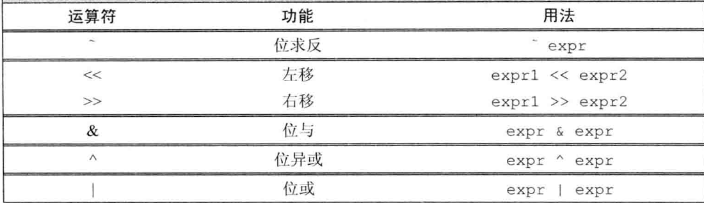

# 表达式

表达式由一个或多个运算对象(operand)组成，对表达式求值将得到一个结果(result)字面值和变量是最简单的表达式(expression),其结果就是字面值和变量的值。把一个运 算 符 (operator)和一个或多个运算对象组合起来可以生成较复杂的表达式。

## 基础

### 基本概念

C++定义了一元运算符(unary operator)和二元运算符(binary operator) » 作用于一
个运算对象的运算符是一元运算符，如取地址符( & ) 和解引用符(*);作用于两个运算
对象的运算符是二元运算符，如相等运算符( = ) 和乘法运算符(*)。除此之外，还有一
个作用于三个运算对象的三元运算符。函数调用也是一种特殊的运算符，它对运算对象的
数量没有限制。

**重载运算符**

C++语言定义了运算符作用于内置类型和复合类型的运算对象时所执行的操作。当运
算符作用于类类型的运算对象时，用户可以自行定义其含义。因为这种自定义的过程事实
上是为已存在的运算符赋予了另外一层含义，所以称之为重载运算符(overloaded operator)。

**左值和右值**

一个左值表达式的求值结果是一个对象
或者一个函数，然而以常量对象为代表的某些左值实际上不能作为赋值语句的左侧运算对
象。此外，虽然某些表达式的求值结果是对象，但它们是右值而非左值。可以做一个简单
的归纳：当一个对象被用作右值的时候，用的是对象的值（内容）；当对象被用作左值的
时候，用的是对象的身份（在内存中的位置）。

不同的运算符对运算对象的要求各不相同，有的需要左值运算对象、有的需要右值运
算对象；返回值也有差异，有的得到左值结果、有的得到右值结果。一个重要的原则是在需要右值的地方可以用左值来代替，但
是不能把右值当成左值（也就是位置）使用。当一个左值被当成右值使用时，实际使用的
是它的内容（值）。

+ 赋值运算符需要一个（非常量）左值作为其左侧运算对象，得到的结果也仍然是一
个左值。
+ 取地址符作用于一个左值运算对象，返回一个指向该运算对象的指针，这个指针是一个右值。
+ 内置解引用运算符、下标运算符、迭代器解引用运算符、string 和 vector的下标运算符的求值结果都是左值。
+ 内置类型和迭代器的递增递减运算符作用于左值运算对象，其前置版本所得的结果也是左值。

使用关键字decltype的时候，左值和右值也有所不同。 如果表达式的求值结果是左值，decltype作用于该表达式（不是变量）得到一个引用类型。举个例子，假定p 的类型是int\* ,因为解引用运算符生成左值，所以decltype （\*p） 的结果是int& 。另一方面，因为取地址运算符生成右值，所以decltype （&p） 的结果是 int\*\* ,也就是说，结果是一个指向整型指针的指针。

### 优先级与结合律

### 求值顺序

有 4 种运算符明确规定了运算对象的求值顺序：
一种是逻辑与(&&)运算符，它规定先求左侧运算对象的值，只有当左侧运算对象的值为真时才继续求右侧运算对象的值。另外三种分别是逻辑或(||)运算符、
条件(？：) 运算符和逗号(,) 运算符

---------------------
## 算术运算符

在表达式求值之前，小整数类型的运算对象被提升成较大的
整数类型，所有运算对象最终会转换成同一类型。

当一元正号运算符作用于一个指针或
者算术值时，返回运算对象值的一个（提升后的）副本。

一元负号运算符对运算对象值取负后，返回其（提升后的）副本:
```cpp
bool b = true;
bool b2 = -b;// b2 是 true!
```

对大多数运算符来说，布尔类型的运算对象将被提升为int类型。如上所示，布尔 变量b 的值为真，参与运算时将被提升成整数值1，对它求负 后的结果是-1。将-1再转换回布尔值并将其作为b2 的初始值，显然这个初始值不等于0, 转换成布尔值后应该为1。所以，b2 的值是真！

----------------------
## 逻辑和关系运算符

逻辑与运算符和逻辑或运算符都是先求左侧运算对象的值再求右侧运算对象的值，当
且仅当左侧运算对象无法确定表达式的结果时才会计算右侧运算对象的值。这种策略称为
短 路 求 值 (short-circuitevaluation) 。

-------------------------------------
## 赋值运算符

赋值运算符的左侧运算对象必须是一个可修改的左值

赋值运算的结果是它的左侧运算对象，并且是一个左值。相应的，结果的类型就是左
侧运算对象的类型。如果赋值运算符的左右两个运算对象类型不同，则右侧运算对象将转
换成左侧运算对象的类型

C++11新标准允许使用花括号括起来的初始值列表作为赋值语句的右侧运算对象：
```c++
k = {3.14};
vector<int> vi;
vi = {0,1,2};
```
如果左侧运算对象是内置类型，那么初始值列表最多只能包含一个值，而且该值即使转换
的话其所占空间也不应该大于目标类型的空间


> 因为赋值运算符的优先级低于关系运算符的优先级，所以在条件语句中，赋值部分通常应该加上括号。

任意一种复合运算符都完全等价于
```cpp
a = a op b;
```

唯一的区别是左侧运算对象的求值次数：使用复合运算符只求值一次，使用普通的运算符
则求值两次。这两次包括：一次是作为右边子表达式的一部分求值，另一次是作为赋值运
算的左侧运算对象求值。其实在很多地方，这种区别除了对程序性能有些许影响外几乎可
以忽略不计。

-------------------------------
## 递增与递减运算符

前置版本将对象本身作为左值返回，后置版本则
将对象原始值的副本作为右值返回。

-----------------------------------
## 成员访问运算符

点运算符和箭头运算符都可用于访问成员，其中，点运算符获取类对象的一个成员；箭头运算符与点运算符有关，表达式 ptr->mem 等价于(*ptr).mem

箭头运算符作用于一个指针类型的运算对象，结果是一个左值。点运算符分成两种情
况：如果成员所属的对象是左值，那么结果是左值；反之，如果成员所属的对象是右值，
那么结果是右值。

-------------------
## 条件运算符

--------------------
## 位运算符



一般来说，如果运算对象是''小整型”，**则它的值会被自动提升成较大的整数类型**。运算对象可以是带符号的，也可以是无符号的。如果运算对象是
带符号的且它的值为负，那么位运算符如何处理运算对象的“符号位”依赖于机器。而且,
此时的左移操作可能会改变符号位的值，因此是一种未定义的行为。

**移位运算符(又叫IO运算符)满足左结合律**

移位运算符的优先级不高不低，介于中间：比算术运算符的优先级低，但比关系运算
符、赋值运算符和条件运算符的优先级高。因此在一次使用多个运算符时，有必要在适当
的地方加上括号使其满足我们的要求。

------------------------
## sizeof 运算符

sizeof运算符返回一条表达式或一个类型名字所占的字节数。sizeof运算符满足 右结合律，其所得的值是一个size_t类型的常量表达式。运算符的运算对象有两种形式：
```cpp
sizeof (type); 
sizeof expr;
```

在第二种形式中，sizeof返回的是表达式结果类型的大小。与众不同的一点是，sizeof 并不实际计算其运算对象的值

C++ll新标准允许我们使用作用域运算符来获取类成员的大小。通常情况下只有通过类的对象才能访问到类的成员，但是sizeof运算符无须我们提供一个具体的对象，因为 要想知道类成员的大小无须真的获取该成员。

sizeof运算符的结果部分地依赖于其作用的类型： 
+ 对 char或者类型为char的表达式执行sizeof运算，结果得1。 
+ 对引用类型执行sizeof运算得到被引用对象所占空间的大小。 
+ 对指针执行sizeof运算得到指针本身所占空间的大小
+ 对解引用指针执行sizeof运算得到指针指向的对象所占空间的大小，指针不需有 效。
+ 对数组执行sizeof运算得到整个数组所占空间的大小，等价于对数组中所有的元 素各执行一次sizeof运算并将所得结果求和。注意，sizeof运算不会把数组转 换成指针来处理。
+ 对 string对象或vector对象执行sizeof运算只返回该类型固定部分的大小， 不会计算对象中的元素占用了多少空间。

因为sizeof的返回值是一个常量表达式，所以我们可以用sizeof的结果声明数组的维 度

------------------------------
## 逗号运算符

逗号运算符(comma operator)含有两个运算对象，按照从左向右的顺序依次求值。 和逻辑与、逻辑或以及条件运算符一样，逗号运算符也规定了运算对象求值的顺序。

对于逗号运算符来说，首先对左侧的表达式求值，然后将求值结果丢弃掉。逗号运算
符真正的结果是右侧表达式的值。如果右侧运算对象是左值，那么最终的求值结果也是左值。

--------------------------
## 类型转换

在C++语言中，某些类型之间有关联。如果两种类型有关联，那么当程序需要其中一种类型的运算对象时，可以用另一种关联类型的对象或值来替代。换句话说，如果两种类型可以相互转换(conversion),那么它们就是关联的。 

**何时发生隐式类型转换**

在下面这些情况下，编译器会自动地转换运算对象的类型：

+ 在大多数表达式中，比int类型小的整型值首先提升为较大的整数类型。
+ 在条件中，非布尔值转换成布尔类型。
+ 初始化过程中，初始值转换成变量的类型；在赋值语句中，右侧运算对象转换成左侧运算对象的类型。
+ 如果算术运算或关系运算的运算对象有多种类型，需要转换成同一种类型。
+ 函数调用时也会发生类型转换。

### 其他隐式转换

数组转换成指针：在大多数用到数组的表达式中，数组自动转换成指向数组首元素的指针

当数组被用作decltype关键字的参数，或者作为取地址符(&)、sizeof及 typeid等运算符的运算对象时，上述转换不会发生。同样的，如果
用一个引用来初始化数组上述转换也不会发生。

指针的转换：C++还规定了几种其他的指针转换方式，包括常量整数值0 或者字面值
nullptr能转换成任意指针类型；指向任意非常量的指针能转换成void\*；指向任意对
象的指针能转换成const void*.

转换成布尔类型：存在一种从算术类型或指针类型向布尔类型自动转换的机制。如果指针
或算术类型的值为0 , 转换结果是false；否则转换结果是true

转换成常量：允许将指向非常量类型的指针转换成指向相应的常量类型的指针，对于引用
也是这样。也就是说，如果T 是一种类型，我们就能将指向T 的指针或引用分别转换成指
向 const T 的指针或引用

### 显示转换

**命名的强制类型转换**
```
cast-name<tyfpe> (expression); 
```
其中，(type是转换的目标类型而expression是要转换的值。如 果 是 引 用 类 型 ，则结果是左值 。 cast-name 是 static_cast 、 dynamic_cast 、 const_cast 和reinterpret_cast中的一种。dynamic_cast支持运行时类型识别cast-name指定了执行的是哪种转换。

**static_cast**

任何具有明确定义的类型转换，只要不包含底层const,都可以使用static_cast.
```cpp
// 进行强制类型转换以便执行浮点数除法
double slope = static_cast<double>(j) / i;
```
当需要把一个较大的算术类型赋值给较小的类型时，static_cast非常有用。此时，
强制类型转换告诉程序的读者和编译器：我们知道并且不在乎潜在的精度损失。一般来说，
如果编译器发现一个较大的算术类型试图赋值给较小的类型，就会给出警告信息；但是当
我们执行了显式的类型转换后，警告信息就会被关闭了。

static_cast对于编译器无法自动执行的类型转换也非常有用。例如，我们可以使
用 static_cast找回存在于void*指 针中的值：
```cpp
void* p = &d; // 正确：任何非常量对象的地址都能存入void*
//正确：将 void*转换回初始的指针类型
double *dp = static_cast<double*>(p);
```
当我们把指针存放在void*中，并且使用static_cast将其强制转换回原来的类型时，
应该确保指针的值保持不变。也就是说，强制转见的结果将与原始的地址值相等，因此
我们必须确保转换后所得的类型就是指针所指的类型。类型一旦不符，将产生未定义的
后果。

**const_cast**

const_cast 只能改变运算对象的底层const

```cpp
const char *pc; 
char *p = const_cast<char*> (pc) ; // 正确：但是通过p 写值是未定义的
```

对于将常量对象转换成非常量对象的行为，我们一般称其为"去掉const性质(cast away
the const)”。一旦我们去掉了某个对象的const性质，编译器就不再阻止我们对该对象进 行写操作了。如果对象本身不是一个常量，使用强制类型转换获得写权限是合法的行为。
然而如果对象是个常量，再使用const_cast执行写操作就会产生未定义的后果。


只 有 const_cast能改变表达式的常量属性，使用其他形式的命名强制类型转换改变表达式的常量葛性都将引发编译器错误。同样的，也不能用const_cast改变表达式的类型

**reinterpret__cast**

reinterpret_cast通常为运算对象的位模式提供较低层次上的重新解释。

> reinterpret_cast本质上依赖于机器。要想安全地使用reinterpret_cast
必须对涉及的类型和编译器实现转换的过程都非常了解

