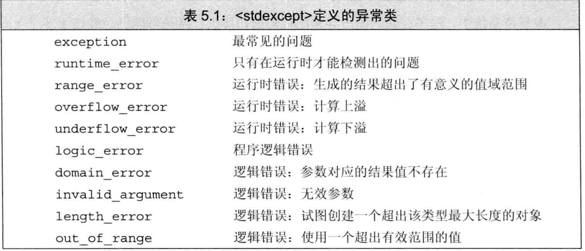

# 语句


## 简单语句

C++语言规定，不允许跨过变
量的初始化语句直接跳转到该变量作用域内的另一个位置。

如果需要为某个case分支定义并初始化一个变量，我们应该把变量定义在块内，从 而确保后面的所有case标签都在变量的作用域之外。

### 范围for语句

C++11新标准引入了一种更简单的for语句，这种语句可以遍历容器或其他序列的所有元素。范围for语句 (range for statement) 的语法形式是：
```cpp
for (declaration : experssion)
    statement;
```

expression表示的必须是一个序列，比如用花括号括起来的初始值列、数组、 者 vector或 string等类型的对象，这些类 型的共同特点是拥有能返回迭代器的begin和 end成员

declaration定义一个变量，序列中的每个元素都得能转换成该变量的类型。确保类型相容最简单的办法是使用aut。类型说明符，这个关键字可以令编译器帮助我们指定合适的类型。如果需要对序列中的元素执行写操作，循环变量必须声明成引用类型。

每次迭代都会重新定义循环控制变量，并将其初始化成序列中的下一个值，之后才会
执行statement.,像往常一样，statement可以是一条单独的语句也可以是一个块。所有元素 都处理完毕后循环终止。

在范围for 语句中，预存了 end（） 的值。 一旦在序列中添加（删除）元素，end函数的值就可能变得无效了 

### break

break 语 句 (break statement)负责终止离它最近的 while、 do while、 for 或 switch 语句，并从这些语句之后的第一条语句开始继续执行。

break 语句只能出现在迭代语句或者sw itch 语句内部(包括嵌套在此类循环里的 语句或块的内部)。b reak语句的作用范围仅限于最近的循环或者switch：

### continue

continue语 句 (continue statement) 终止最近的循环中的当前迭代并立即开始下-次 迭代。continue语句只能出现在fbr、while和 do while循环的内部，或者嵌套在此类循环 里的语句或块的内部。和 break语句类似的是，出现在嵌套循环中的continue语句也仅作 用于离它最近的循环。和 break语句不同的是，只有当switch语句嵌套在迭代语句内部时，
才能在switch里使用continue。

---------------------------------

## try语句块和异常处理

异常是指存在于运行时的反常行为，这些行为超出了函数正常功能的范围。

当程序的某部分检测到一个它无法处理的问题时，需要用到异常处理。此时，检测出
问题的部分应该发出某种信号以表明程序遇到了故障，无法继续下去了，而且信号的发出
方无须知道故障将在何处得到解决。一旦发出异常信号，检测出问题的部分也就完成了任
务。

异常处理机制为程序中异常检测和异常处理这两部分的协作提供支持。在 C++语言
中，异常处理包括：

+ throw表达式（throw expression），异常检测部分使用throw 表达式来表示它遇到了无法处理的问题。我们说throw 引发 (raise) 了异常。

+ try 语句块 (try block),异常处理部分使用try 语句块处理异常。try 语句块以
关键字try 开始，并以一个或多个catch 子 句 (catch clause)结束。try 语句块
中代码抛出的异常通常会被某个catch 子句处理。因为catch 子句“处理”异常，所以它们也被称作异常处理代码(exception handler)。
+ 一套异常类 (exception class),用于在throw 表达式和相关的catch 子句之间传
递异常的具体信息

### throw表达式

程序的异常检测部分使用throw 表达式引发一个异常。throw 表达式包含关键字 throw 和紧随其后的一个表达式，其中表达式的类型就是抛出的异常类型。throw 表达 式后面通常紧跟一个分号，从而构成一条表达式语句。

### try语句块

try 语句块的通用语法形式是
```cpp
try {
program-statements 
} catch (exception-declaration) { handler-statements 
} catch (exception-declaration) { handler-statements
}//...
```
跟 在 try 块之后的是一个或多个catch 子句。catch 子句包括三部分：关键字 catch 、括号内一个(可能未命名的)对象的声明(称作异常声明，exception declaration) 以及一个块。当选中了某个catch 子句处理异常之后，执行与之对应的块。catch - 旦 完成，程序跳转到try 语句块最后一个catch 子句之后的那条语句继续执行。 

try 语句块中的program-statements组成程序的正常逻辑，像其他任何块一样， program-statements可以有包括声明在内的任意C++语句。一如往常，try 语句块内声明 的变量在块外部无法访问，特别是在catch 子句内也无法访问。

每个标准库异常类都定义了名为what的成员函数，这些函数没有参数，
返回值是C 风 格 字 符 串 (即 const char* ),其中，ru n time_error的 what成 员 返回的是初始化一个具体对象时所用的string 对象的副本。

### 标准异常

C++标准库定义了一组类，用于报告标准库函数遇到的问题。这些异常类也可以在用
户编写的程序中使用，它们分别定义在4个头文件中：

+ exception头文件定义了最通用的异常类exception。它只报告异常的发生， 不提供任何额外信息。
+ stdexcept头文件定义了几种常用的异常类
+ new头文件定义了 bad_alloc异常类型
+ type_info头文件定义了 bad_cast异常类型



异常类型只定义了一个名为what的成员函数，该函数没有任何参数，返回值是一个 指向C 风格字符串的 const char*.该字符串的目的是提 供关于异常的一些文本信息。

